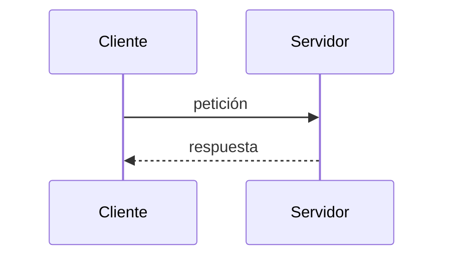

# Plan de implementación: esqueleto de la web y lección piloto

> **Para agentes:** SUB-SKILL OBLIGATORIA: usa superpowers:subagent-driven-development o superpowers:executing-plans para ejecutar este plan tarea a tarea. Los pasos usan casillas (`- [ ]`) para seguir el progreso.

**Objetivo:** dejar funcionando la web bilingüe (portada, roadmap, glosario y componentes de lección), con la introducción de la Fase 0 y la lección piloto «Modelo cliente-servidor» en español y en inglés.

**Arquitectura:** monorepo pnpm con un único paquete `web/` (Astro 7 + Starlight 0.42). Es un sitio estático en dos idiomas con prefijo (`/es/`, `/en/`). Las fases se definen en un único fichero de datos, y de él salen el menú lateral y el roadmap. Los componentes de lección validan su contenido en el build: un término inexistente o una lección sin cabecera rompen el build.

**Stack:** Node ≥ 22.12, pnpm 10.31, Astro ^7.3.5, @astrojs/starlight ^0.42.5, TypeScript ^6, Vitest ^5, astro-mermaid ^2.1 + mermaid ^11, starlight-links-validator ^0.26, Prettier ^3.9 + prettier-plugin-astro, Wrangler ^4 (solo en la tarea de despliegue).

**Spec:** `docs/specs/2026-10-02-web-fase-0-design.md`

## Restricciones globales

- **Git:** `git init` sí; **ningún commit, push ni repositorio remoto sin petición explícita del autor.** Los pasos de «Punto de control» sustituyen a los commits.
- **Versiones:** Node ≥ 22.12.0 (instalado: 22.21.1) y pnpm 10.31.0.
  - TypeScript **^6**, no 7, porque `@astrojs/check` 0.9.10 exige `^5 || ^6`.
  - mermaid **^11**, no 12, porque `astro-mermaid` 2.1.0 exige `^10 || ^11`.
- **Idiomas:** `es` (por defecto) y `en`, ambos con prefijo y sin _root locale_. Los slugs van en inglés en los dos idiomas.
- **Nombres:** carpetas, ficheros y código en inglés. Los textos de interfaz propios van en `web/src/content/i18n/{es,en}.json`, nunca escritos directamente en los componentes.
- **MDX y slots:** el contenido de un slot con nombre (`<div slot="limits">`) y el de los componentes que contienen Markdown va separado por **líneas en blanco**. Sin ellas, MDX lo trata como texto en línea y el slot no se rellena (comprobado).
- **Prettier no formatea MDX** (`.prettierignore`), porque puede romper el JSX dentro del Markdown.
- **Imports en MDX y componentes:** usar el alias `~/` (`~/components/Term.astro`), configurado en `tsconfig.json`.
- **Avisos esperados en el build, que no son errores:**
  - `MODULE_LEVEL_DIRECTIVE "use astro:head-inject"`;
  - «Some chunks are larger than 500 kB» (es mermaid);
  - `Entry docs → 404 was not found`;
  - `[@astrojs/sitemap] … requires the site option`, hasta la tarea de despliegue.
- **Servidor de desarrollo:** `pnpm --filter web exec astro dev --background` para arrancarlo y `pnpm --filter web exec astro dev stop` para pararlo. En desarrollo, `/` da 404 porque la redirección a `/es/` solo la hace Cloudflare. Abre directamente `http://localhost:4321/es/`.
- **React (`@astrojs/react`) no se instala en este plan:** ninguna página lo necesita todavía. Llega con el plan de la primera lección con playground (`tcp-vs-udp`).
- **Aprendizaje:** cada tarea incluye un apartado «Concepto de backend para explicar». Antes de cerrar la tarea, explícaselo al autor en el chat.

## Puntos de revisión

Son condiciones que ningún test unitario cubre y que más fácilmente fallarían a un lector real. Cada una tiene su comprobación en la tarea indicada.

1. **Páginas sin traducir** (`/en/…` mostrando español): definiciones, cabecera de lección y requisitos previos deben salir en el idioma del contenido, sin romper el build. → Tarea 3, paso 8.
2. **`<Term>` sin ratón:** debe abrirse con un toque o con Tab + Enter y cerrarse con Esc. El hover solo es un extra. → Tarea 3, paso 10.
3. **El mismo término dos veces en una página:** cada aparición abre su propia definición (ids únicos). → Tarea 3, pasos 8 y 10.
4. **Modo claro y oscuro:** los diagramas Mermaid y los componentes propios se leen bien en los dos. → Tarea 3, paso 10.
5. **Móvil (375 px):** las definiciones no se salen de la pantalla, los bloques de código hacen scroll y la página no tiene scroll horizontal. → Tarea 3, paso 10.

---

### Tarea 1: Esqueleto bilingüe, fases, portada y roadmap

**Ficheros:**

- Crear: `package.json`, `pnpm-workspace.yaml`, `.gitignore`, `.nvmrc`, `.prettierrc.json`, `.prettierignore`
- Crear: `web/package.json`, `web/tsconfig.json`, `web/astro.config.ts`, `web/src/content.config.ts`
- Crear: `web/src/lib/locales.ts`, `web/src/lib/links.ts`, `web/src/lib/sidebar.ts`, `web/src/data/phases.ts`
- Crear: `web/src/components/PhaseList.astro`, `web/src/styles/theme.css`
- Crear: `web/src/content/i18n/es.json`, `web/src/content/i18n/en.json`
- Crear: `web/src/content/docs/{es,en}/index.mdx`, `web/src/content/docs/{es,en}/roadmap.mdx`
- Crear: `web/public/_redirects`
- Tests: `web/src/lib/locales.test.ts`, `web/src/lib/links.test.ts`, `web/src/lib/sidebar.test.ts`

**Interfaces:**

- Produce:
  - `locales: readonly ['es', 'en']`, `type Locale = 'es' | 'en'`, `defaultLocale: Locale`, `isLocale(value: unknown): value is Locale` y `toLocale(value: string | undefined): Locale` (lanza un error si el idioma es desconocido).
  - `localizedHref(locale: Locale, slug?: string): string`, que devuelve `/es/phase-0/dns/` o, sin slug, `/es/`.
  - `interface Phase { number; slug; status: PhaseStatus; title: Record<Locale,string>; summary: Record<Locale,string> }`, `type PhaseStatus = 'available' | 'coming-soon'` y `phases: Phase[]`.
  - `buildPhaseSidebar(phases: readonly Phase[]): PhaseSidebarGroup[]`.
  - Las claves i18n `phase.label`, `phase.available` y `phase.comingSoon`.

**Concepto de backend para explicar:**

- **Qué es `_redirects` y qué es un 302.** Es una instrucción para el servidor de Cloudflare: «a quien pida `/`, respóndele con el código 302 y la cabecera `Location: /es/`». Elegimos 302 (temporal) y no 301 (permanente) porque el navegador guarda los 301 en caché para siempre.
- **Por qué en desarrollo `/` da 404.** El servidor de desarrollo de Astro no lee ese fichero: es configuración del hosting, no de la web.

- [ ] **Paso 1: Inicializar el repositorio y los ficheros raíz**

```bash
cd /Users/gianmarco/backend-desde-cero && git init
```

`package.json`:

```json
{
  "name": "backend-desde-cero",
  "private": true,
  "packageManager": "pnpm@10.31.0",
  "engines": { "node": ">=22.12.0" },
  "scripts": {
    "dev": "pnpm --filter web dev",
    "build": "pnpm --filter web build",
    "check": "pnpm --filter web check",
    "test": "pnpm --filter web test",
    "format": "prettier --write .",
    "format:check": "prettier --check ."
  },
  "devDependencies": {
    "prettier": "^3.9.9",
    "prettier-plugin-astro": "^1.1.0"
  }
}
```

`pnpm-workspace.yaml` (pnpm 10 no ejecuta scripts de instalación salvo que se permitan; `esbuild` y `sharp` los necesitan):

```yaml
packages:
  - web
onlyBuiltDependencies:
  - esbuild
  - sharp
```

`.gitignore`:

```
node_modules/
dist/
.astro/
.wrangler/
.DS_Store
```

`.nvmrc`:

```
22
```

`.prettierrc.json`:

```json
{
  "singleQuote": true,
  "printWidth": 100,
  "plugins": ["prettier-plugin-astro"],
  "overrides": [{ "files": "*.astro", "options": { "parser": "astro" } }]
}
```

`.prettierignore`:

```
**/*.mdx
pnpm-lock.yaml
dist
.astro
```

- [ ] **Paso 2: Crear el paquete `web` e instalar**

`web/package.json`:

```json
{
  "name": "web",
  "private": true,
  "type": "module",
  "scripts": {
    "dev": "astro dev",
    "build": "astro build",
    "preview": "astro preview",
    "check": "astro check",
    "test": "vitest run"
  },
  "dependencies": {
    "@astrojs/starlight": "^0.42.5",
    "astro": "^7.3.5",
    "sharp": "^0.35.5"
  },
  "devDependencies": {
    "@astrojs/check": "^0.9.10",
    "typescript": "^6.0.3",
    "vitest": "^5.0.3"
  }
}
```

`web/tsconfig.json`:

```json
{
  "extends": "astro/tsconfigs/strict",
  "include": [".astro/types.d.ts", "**/*"],
  "exclude": ["dist"],
  "compilerOptions": {
    "paths": { "~/*": ["./src/*"] }
  }
}
```

Run: `pnpm install`
Expected: termina con «Done», sin el aviso «Ignored build scripts».

- [ ] **Paso 3: Escribir los tests que fallan**

`web/src/lib/locales.test.ts`:

```ts
import { describe, expect, it } from 'vitest';
import { isLocale, toLocale } from './locales';

describe('isLocale', () => {
  it('acepta los idiomas del curso', () => {
    expect(isLocale('es')).toBe(true);
    expect(isLocale('en')).toBe(true);
  });

  it('rechaza cualquier otro valor', () => {
    expect(isLocale('fr')).toBe(false);
    expect(isLocale(undefined)).toBe(false);
    expect(isLocale('')).toBe(false);
  });
});

describe('toLocale', () => {
  it('devuelve el idioma si es válido', () => {
    expect(toLocale('en')).toBe('en');
  });

  it('lanza un error si el idioma no existe, porque indica un error de configuración', () => {
    expect(() => toLocale(undefined)).toThrow(/Idioma desconocido/);
    expect(() => toLocale('fr')).toThrow(/Idioma desconocido/);
  });
});
```

`web/src/lib/links.test.ts`:

```ts
import { describe, expect, it } from 'vitest';
import { localizedHref } from './links';

describe('localizedHref', () => {
  it('antepone el idioma y termina en barra', () => {
    expect(localizedHref('es', 'phase-0/dns')).toBe('/es/phase-0/dns/');
  });

  it('sin slug devuelve la portada del idioma', () => {
    expect(localizedHref('en')).toBe('/en/');
    expect(localizedHref('en', '')).toBe('/en/');
  });

  it('tolera barras sobrantes al principio o al final', () => {
    expect(localizedHref('es', '/roadmap/')).toBe('/es/roadmap/');
  });
});
```

`web/src/lib/sidebar.test.ts`:

```ts
import { describe, expect, it } from 'vitest';
import type { Phase } from '../data/phases';
import { buildPhaseSidebar } from './sidebar';

const phase = (number: number, status: Phase['status']): Phase => ({
  number,
  slug: `phase-${number}`,
  status,
  title: { es: `Título ${number}`, en: `Title ${number}` },
  summary: { es: '', en: '' },
});

describe('buildPhaseSidebar', () => {
  it('solo incluye las fases disponibles, en orden', () => {
    const groups = buildPhaseSidebar([
      phase(0, 'available'),
      phase(1, 'coming-soon'),
      phase(2, 'available'),
    ]);
    expect(groups.map((group) => group.items[0].autogenerate.directory)).toEqual([
      'phase-0',
      'phase-2',
    ]);
  });

  it('etiqueta cada grupo en los dos idiomas', () => {
    const [group] = buildPhaseSidebar([phase(0, 'available')]);
    expect(group.label).toBe('Fase 0 · Título 0');
    expect(group.translations).toEqual({ en: 'Phase 0 · Title 0' });
  });

  it('devuelve una lista vacía si no hay fases disponibles', () => {
    expect(buildPhaseSidebar([phase(0, 'coming-soon')])).toEqual([]);
  });
});
```

- [ ] **Paso 4: Comprobar que fallan**

Run: `pnpm test`
Expected: FAIL, porque no se pueden resolver `./locales`, `./links`, `./sidebar` ni `../data/phases`.

- [ ] **Paso 5: Implementar**

`web/src/lib/locales.ts`:

```ts
export const locales = ['es', 'en'] as const;
export type Locale = (typeof locales)[number];
export const defaultLocale: Locale = 'es';

export function isLocale(value: unknown): value is Locale {
  return typeof value === 'string' && (locales as readonly string[]).includes(value);
}

/** Convierte el locale de Starlight (string | undefined) en un Locale del curso. */
export function toLocale(value: string | undefined): Locale {
  if (!isLocale(value)) {
    throw new Error(
      `[locales] Idioma desconocido: "${value}". Los idiomas válidos son: ${locales.join(', ')}`,
    );
  }
  return value;
}
```

`web/src/lib/links.ts`:

```ts
import type { Locale } from './locales';

/** URL interna con prefijo de idioma: localizedHref('es', 'phase-0/dns') → '/es/phase-0/dns/'. */
export function localizedHref(locale: Locale, slug = ''): string {
  const cleanSlug = slug.replace(/^\/+|\/+$/g, '');
  return cleanSlug ? `/${locale}/${cleanSlug}/` : `/${locale}/`;
}
```

`web/src/data/phases.ts`:

```ts
import type { Locale } from '../lib/locales';

export type PhaseStatus = 'available' | 'coming-soon';

export interface Phase {
  number: number;
  /** Carpeta dentro de src/content/docs/<idioma>/ y parte de la URL. */
  slug: string;
  /** 'available' solo cuando la fase tiene contenido publicado. */
  status: PhaseStatus;
  title: Record<Locale, string>;
  summary: Record<Locale, string>;
}

export const phases: Phase[] = [
  {
    number: 0,
    slug: 'phase-0',
    status: 'coming-soon',
    title: { es: 'Cómo funciona internet', en: 'How the internet works' },
    summary: {
      es: 'Cliente-servidor, protocolos, capas de red, IP, TCP, DNS y TLS: por dónde viajan los datos antes de que escribas una línea de backend.',
      en: 'Client-server, protocols, network layers, IP, TCP, DNS and TLS: how data travels before you write a single line of backend code.',
    },
  },
  {
    number: 1,
    slug: 'phase-1',
    status: 'coming-soon',
    title: { es: 'Terminal, Linux y SSH', en: 'Terminal, Linux and SSH' },
    summary: {
      es: 'Donde vive casi todo backend: la shell, los permisos, los procesos, las variables de entorno y cómo entrar en un servidor remoto.',
      en: 'Where almost every backend lives: the shell, permissions, processes, environment variables and how to log into a remote server.',
    },
  },
  {
    number: 2,
    slug: 'phase-2',
    status: 'coming-soon',
    title: { es: 'HTTP a fondo', en: 'HTTP in depth' },
    summary: {
      es: 'El protocolo de la web visto desde quien responde: métodos, códigos de estado, cabeceras, cookies, CORS y caché.',
      en: "The web's protocol from the side that answers: methods, status codes, headers, cookies, CORS and caching.",
    },
  },
  {
    number: 3,
    slug: 'phase-3',
    status: 'coming-soon',
    title: { es: 'Tu primer servidor', en: 'Your first server' },
    summary: {
      es: 'Node.js y TypeScript: un servidor HTTP sin framework, después con uno, validación de entrada, errores, logs y el event loop.',
      en: 'Node.js and TypeScript: an HTTP server without a framework, then with one, input validation, errors, logs and the event loop.',
    },
  },
  {
    number: 4,
    slug: 'phase-4',
    status: 'coming-soon',
    title: { es: 'Diseño de APIs', en: 'API design' },
    summary: {
      es: 'REST bien hecho, OpenAPI y cuándo usar GraphQL, gRPC, WebSockets, Server-Sent Events o webhooks.',
      en: 'REST done right, OpenAPI, and when to use GraphQL, gRPC, WebSockets, Server-Sent Events or webhooks.',
    },
  },
  {
    number: 5,
    slug: 'phase-5',
    status: 'coming-soon',
    title: { es: 'Bases de datos', en: 'Databases' },
    summary: {
      es: 'SQL con PostgreSQL, modelado, índices, transacciones, migraciones, ORMs y cuándo tiene sentido NoSQL.',
      en: 'SQL with PostgreSQL, modeling, indexes, transactions, migrations, ORMs and when NoSQL makes sense.',
    },
  },
  {
    number: 6,
    slug: 'phase-6',
    status: 'coming-soon',
    title: {
      es: 'Autenticación, autorización y seguridad',
      en: 'Authentication, authorization and security',
    },
    summary: {
      es: 'Contraseñas, sesiones y JWT, OAuth y OpenID Connect, roles y permisos, y el OWASP Top 10.',
      en: 'Passwords, sessions and JWT, OAuth and OpenID Connect, roles and permissions, and the OWASP Top 10.',
    },
  },
  {
    number: 7,
    slug: 'phase-7',
    status: 'coming-soon',
    title: { es: 'Docker y contenedores', en: 'Docker and containers' },
    summary: {
      es: 'El fin del «en mi máquina funciona»: imágenes, contenedores, Dockerfile, volúmenes, redes y Docker Compose.',
      en: 'The end of “works on my machine”: images, containers, Dockerfiles, volumes, networks and Docker Compose.',
    },
  },
  {
    number: 8,
    slug: 'phase-8',
    status: 'coming-soon',
    title: { es: 'Despliegue e infraestructura', en: 'Deployment and infrastructure' },
    summary: {
      es: 'Tu propio servidor: VPS, reverse proxy, dominio y HTTPS, CI/CD, modelos de cloud e infraestructura como código.',
      en: 'Your own server: VPS, reverse proxy, domain and HTTPS, CI/CD, cloud models and infrastructure as code.',
    },
  },
  {
    number: 9,
    slug: 'phase-9',
    status: 'coming-soon',
    title: { es: 'Arquitectura y escalado', en: 'Architecture and scaling' },
    summary: {
      es: 'Colas y trabajos en segundo plano, caché, escalado horizontal, monolito frente a microservicios y sistemas distribuidos.',
      en: 'Queues and background jobs, caching, horizontal scaling, monoliths vs microservices and distributed systems.',
    },
  },
  {
    number: 10,
    slug: 'phase-10',
    status: 'coming-soon',
    title: { es: 'Calidad y observabilidad', en: 'Quality and observability' },
    summary: {
      es: 'Tests unitarios, de integración y end-to-end; logs, métricas y trazas; health checks y gestión de incidentes.',
      en: 'Unit, integration and end-to-end tests; logs, metrics and traces; health checks and incident management.',
    },
  },
  {
    number: 11,
    slug: 'phase-11',
    status: 'coming-soon',
    title: { es: 'Backend para IA y agentes', en: 'Backend for AI and agents' },
    summary: {
      es: 'APIs de modelos desde el servidor, streaming, tool use, MCP, búsqueda semántica con embeddings y RAG, e IA en producción.',
      en: 'Model APIs from the server, streaming, tool use, MCP, semantic search with embeddings and RAG, and AI in production.',
    },
  },
];
```

`web/src/lib/sidebar.ts`. Desde Starlight 0.39 un grupo autogenerado es `{ label, items: [{ autogenerate }] }`; poner `autogenerate` directamente en el grupo da un error de configuración (comprobado):

```ts
import type { Phase } from '../data/phases';

export interface PhaseSidebarGroup {
  label: string;
  translations: { en: string };
  items: [{ autogenerate: { directory: string } }];
}

/** Un grupo del menú lateral por cada fase publicada, con sus lecciones autogeneradas desde su carpeta. */
export function buildPhaseSidebar(phases: readonly Phase[]): PhaseSidebarGroup[] {
  return phases
    .filter((phase) => phase.status === 'available')
    .map((phase) => ({
      label: `Fase ${phase.number} · ${phase.title.es}`,
      translations: { en: `Phase ${phase.number} · ${phase.title.en}` },
      items: [{ autogenerate: { directory: phase.slug } }],
    }));
}
```

- [ ] **Paso 6: Comprobar que pasan**

Run: `pnpm test`
Expected: PASS, con 3 ficheros y 10 tests.

- [ ] **Paso 7: Configurar Astro, Starlight y las colecciones**

`web/astro.config.ts`:

```ts
import { defineConfig } from 'astro/config';
import starlight from '@astrojs/starlight';
import { phases } from './src/data/phases';
import { buildPhaseSidebar } from './src/lib/sidebar';

export default defineConfig({
  integrations: [
    starlight({
      title: { es: 'Backend desde cero', en: 'Backend from Scratch' },
      defaultLocale: 'es',
      locales: {
        es: { label: 'Español', lang: 'es' },
        en: { label: 'English', lang: 'en' },
      },
      customCss: ['./src/styles/theme.css'],
      sidebar: [{ label: 'Roadmap', slug: 'roadmap' }, ...buildPhaseSidebar(phases)],
    }),
  ],
});
```

`web/src/content.config.ts`:

```ts
import { defineCollection } from 'astro:content';
import { z } from 'astro/zod';
import { docsLoader, i18nLoader } from '@astrojs/starlight/loaders';
import { docsSchema, i18nSchema } from '@astrojs/starlight/schema';

export const collections = {
  docs: defineCollection({ loader: docsLoader(), schema: docsSchema() }),
  i18n: defineCollection({
    loader: i18nLoader(),
    schema: i18nSchema({
      // Textos de interfaz propios. Son obligatorios: si falta uno en algún idioma, el build falla.
      extend: z.object({
        'phase.label': z.string(),
        'phase.available': z.string(),
        'phase.comingSoon': z.string(),
      }),
    }),
  }),
};
```

`web/src/content/i18n/es.json`:

```json
{
  "phase.label": "Fase {{number}}",
  "phase.available": "Disponible",
  "phase.comingSoon": "Próximamente"
}
```

`web/src/content/i18n/en.json`:

```json
{
  "phase.label": "Phase {{number}}",
  "phase.available": "Available",
  "phase.comingSoon": "Coming soon"
}
```

`web/src/styles/theme.css`:

```css
/* Paleta del curso sobre el tema de Starlight. Modo oscuro por defecto; el claro usa data-theme="light". */
:root {
  --sl-color-accent-low: #0b3b36;
  --sl-color-accent: #14b8a6;
  --sl-color-accent-high: #ccfbf1;
}

:root[data-theme='light'] {
  --sl-color-accent-low: #ccfbf1;
  --sl-color-accent: #0f766e;
  --sl-color-accent-high: #134e4a;
}
```

`web/public/_redirects`:

```
/  /es/  302
```

- [ ] **Paso 8: Crear `PhaseList` y las páginas**

`web/src/components/PhaseList.astro`:

```astro
---
import { Badge } from '@astrojs/starlight/components';
import { phases } from '~/data/phases';
import { localizedHref } from '~/lib/links';
import { toLocale } from '~/lib/locales';

const locale = toLocale(Astro.locals.starlightRoute.locale);
const t = Astro.locals.t;
---

<ol class="phase-list not-content" role="list">
  {phases.map((phase) => {
    const available = phase.status === 'available';
    return (
      <li class:list={['phase', { 'phase--soon': !available }]}>
        <p class="phase__number">{t('phase.label', { number: phase.number })}</p>
        <p class="phase__title">
          {available ? (
            <a href={localizedHref(locale, phase.slug)}>{phase.title[locale]}</a>
          ) : (
            <span>{phase.title[locale]}</span>
          )}
          <Badge
            text={available ? t('phase.available') : t('phase.comingSoon')}
            variant={available ? 'success' : 'default'}
          />
        </p>
        <p class="phase__summary">{phase.summary[locale]}</p>
      </li>
    );
  })}
</ol>

<style>
  .phase-list {
    list-style: none;
    padding: 0;
    margin-top: 1.5rem;
    display: grid;
    gap: 1rem;
  }
  .phase {
    border: 1px solid var(--sl-color-gray-5);
    border-radius: 0.5rem;
    padding: 1rem 1.25rem;
  }
  .phase__number {
    margin: 0;
    font-size: var(--sl-text-xs);
    letter-spacing: 0.05em;
    text-transform: uppercase;
    color: var(--sl-color-gray-3);
  }
  .phase__title {
    margin: 0.25rem 0;
    display: flex;
    flex-wrap: wrap;
    align-items: center;
    gap: 0.5rem;
    font-size: var(--sl-text-lg);
    font-weight: 600;
    color: var(--sl-color-white);
  }
  .phase__title a {
    color: var(--sl-color-text-accent);
  }
  .phase--soon .phase__title {
    color: var(--sl-color-gray-2);
  }
  .phase__summary {
    margin: 0;
    color: var(--sl-color-gray-2);
  }
</style>
```

`web/src/content/docs/es/index.mdx`:

```mdx
---
title: Backend desde cero
description: Un curso gratuito para aprender backend desde los cimientos, pensado para quien ya programa pero nunca ha estado al otro lado del servidor.
template: splash
hero:
  tagline: Aprende cómo funciona de verdad lo que hay detrás de cada petición. Desde los cables de internet hasta los agentes de IA, explicado para quien nunca ha estado al otro lado del servidor.
  actions:
    - text: Ver el roadmap
      link: /es/roadmap/
      icon: right-arrow
---

import { Card, CardGrid } from '@astrojs/starlight/components';
import PhaseList from '~/components/PhaseList.astro';

## Para quién es

Para personas que ya programan (por ejemplo, en frontend) pero no saben qué pasa cuando una petición sale del navegador. No hace falta saber nada de backend. Sí hace falta saber programar: no explicamos qué es una variable, pero sí qué es un puerto.

## Cómo está organizado

El curso tiene 12 fases, de los cimientos de internet a los backends para IA. Cada fase se divide en lecciones cortas, de 10 a 15 minutos, y cada lección tiene algo práctico:

<CardGrid>
  <Card title="Pruébalo en tu terminal" icon="seti:shell">
    Ejercicios guiados con herramientas reales como `curl`, `dig` o `nc`. Ves con tus propios ojos
    lo que explica la lección.
  </Card>
  <Card title="Playgrounds" icon="puzzle">
    Herramientas reales dentro de la web, como una consola SQL o criptografía en tu navegador.
  </Card>
  <Card title="Laboratorios" icon="rocket">
    Simulaciones visuales paso a paso para los conceptos más difíciles: HTTP, DNS, TCP y Docker.
  </Card>
</CardGrid>

## Se construye fase a fase

Este curso se escribe mientras se aprende. Las fases se publican una a una; aquí ves cuáles están disponibles y cuáles llegan pronto. El [roadmap](/es/roadmap/) explica cómo se encadenan.

<PhaseList />
```

`web/src/content/docs/en/index.mdx`:

```mdx
---
title: Backend from Scratch
description: A free course to learn backend from the foundations, for people who already code but have never been on the other side of the server.
template: splash
hero:
  tagline: Learn how everything behind each request really works. From the wires of the internet to AI agents, explained for people who have never been on the other side of the server.
  actions:
    - text: See the roadmap
      link: /en/roadmap/
      icon: right-arrow
---

import { Card, CardGrid } from '@astrojs/starlight/components';
import PhaseList from '~/components/PhaseList.astro';

## Who it is for

For people who already code (for example, on the frontend) but don't know what happens once a request leaves the browser. You don't need to know any backend. You do need to know how to program: we won't explain what a variable is, but we will explain what a port is.

## How it is organized

The course has 12 phases, from the foundations of the internet to backends for AI. Each phase is split into short lessons, 10 to 15 minutes each, and every lesson has something hands-on:

<CardGrid>
  <Card title="Try it in your terminal" icon="seti:shell">
    Guided exercises with real tools like `curl`, `dig` or `nc`. You see with your own eyes what the
    lesson explains.
  </Card>
  <Card title="Playgrounds" icon="puzzle">
    Real tools inside the site, like a SQL console or cryptography in your browser.
  </Card>
  <Card title="Labs" icon="rocket">
    Step-by-step visual simulations for the hardest concepts: HTTP, DNS, TCP and Docker.
  </Card>
</CardGrid>

## Built phase by phase

This course is written while it is being learned. Phases are published one at a time; here you can see which ones are available and which are coming soon. The [roadmap](/en/roadmap/) explains how they fit together.

<PhaseList />
```

`web/src/content/docs/es/roadmap.mdx`:

```mdx
---
title: Roadmap
description: Las 12 fases del curso, de los cimientos de internet a los backends para IA.
---

import PhaseList from '~/components/PhaseList.astro';

El curso avanza de abajo arriba: primero, cómo viajan los datos por internet; al final, cómo se construye un backend para agentes de IA. Cada fase se apoya en las anteriores, así que te recomendamos seguirlas en orden.

<PhaseList />
```

`web/src/content/docs/en/roadmap.mdx`:

```mdx
---
title: Roadmap
description: The 12 phases of the course, from the foundations of the internet to backends for AI.
---

import PhaseList from '~/components/PhaseList.astro';

The course goes from the bottom up: first, how data travels across the internet; at the end, how to build a backend for AI agents. Each phase builds on the previous ones, so we recommend following them in order.

<PhaseList />
```

- [ ] **Paso 9: Verificar el build**

Run: `pnpm check && pnpm build`
Expected:

- `astro check` muestra 0 errores.
- El build termina con «Complete!» y genera `/es/index.html`, `/en/index.html`, `/es/roadmap/index.html` y `/en/roadmap/index.html`.

Run: `ls web/dist/_redirects && grep -c 'class="phase' web/dist/es/roadmap/index.html && grep -o 'Próximamente' web/dist/es/roadmap/index.html | wc -l`
Expected:

- existe `web/dist/_redirects`;
- el primer recuento es mayor que 0;
- el segundo es `12` (todas las fases siguen como `coming-soon`).

- [ ] **Paso 10: Revisión visual**

1. Arranca el servidor de desarrollo: `pnpm --filter web exec astro dev --background`.
2. Con Playwright, abre `http://localhost:4321/es/` y `http://localhost:4321/en/` y comprueba que el selector de idioma cambia entre ambas.
3. Abre `http://localhost:4321/es/roadmap/` y comprueba que aparecen 12 tarjetas con «Próximamente».
4. Haz una captura en modo claro y otra en modo oscuro.
5. Para el servidor: `pnpm --filter web exec astro dev stop`.

- [ ] **Paso 11: Punto de control**

Run: `pnpm format && pnpm format:check && pnpm test && pnpm build`
Expected: todo pasa.

Enseña al autor la portada y el roadmap (capturas y textos) y explícale el concepto de backend de esta tarea. Si quiere commitear, pregunta antes.

---

### Tarea 2: Glosario y `<Term>`

**Ficheros:**

- Crear: `web/src/lib/glossary.ts`, `web/src/lib/glossary.test.ts`
- Crear: `web/src/components/Term.astro`, `web/src/components/GlossaryList.astro`
- Crear: `web/src/content/glossary/{es,en}/client.yaml`, `web/src/content/glossary/{es,en}/server.yaml`
- Crear: `web/src/content/docs/{es,en}/glossary.mdx`
- Modificar: `web/src/content.config.ts` (colección `glossary` y claves i18n), `web/src/content/i18n/{es,en}.json`, `web/astro.config.ts` (entrada del menú lateral)

**Interfaces:**

- Consume: `Locale`, `toLocale` y `localizedHref` (Tarea 1).
- Produce:
  - `glossaryEntryId(locale: Locale, termId: string): string`, que devuelve `"es/port"`;
  - `termIdFromEntryId(entryId: string): string`, que devuelve `"port"`;
  - `sortGlossary<T extends { data: { term: string } }>(entries: readonly T[], locale: Locale): T[]`;
  - el componente `<Term id="…">texto</Term>`;
  - la colección `glossary`, con un fichero por término: `{ term: string; short: string; related: string[] }`;
  - las claves i18n `term.seeGlossary` y `glossary.related`.

**Concepto de backend para explicar:** ninguno nuevo. Explica, eso sí, la decisión de que el build falle si falta un término. Es la idea de «fallar pronto» que verás en la Fase 3 con la validación: un error en el build, que solo ves tú, es mejor que un error en producción, que ve el lector.

- [ ] **Paso 1: Escribir el test que falla**

`web/src/lib/glossary.test.ts`:

```ts
import { describe, expect, it } from 'vitest';
import { glossaryEntryId, sortGlossary, termIdFromEntryId } from './glossary';

describe('glossaryEntryId / termIdFromEntryId', () => {
  it('construye el id de la colección a partir del idioma y el término', () => {
    expect(glossaryEntryId('es', 'port')).toBe('es/port');
  });

  it('extrae el id del término de un id de la colección', () => {
    expect(termIdFromEntryId('en/port')).toBe('port');
  });

  it('lanza un error si el id no lleva idioma', () => {
    expect(() => termIdFromEntryId('port')).toThrow(/sin idioma/);
  });
});

describe('sortGlossary', () => {
  const entry = (term: string) => ({ data: { term } });

  it('ordena según las reglas del idioma: en español, «árbol» va antes que «Base»', () => {
    const sorted = sortGlossary([entry('Servidor'), entry('árbol'), entry('Base')], 'es');
    expect(sorted.map((e) => e.data.term)).toEqual(['árbol', 'Base', 'Servidor']);
  });

  it('no modifica la lista original', () => {
    const original = [entry('b'), entry('a')];
    sortGlossary(original, 'en');
    expect(original.map((e) => e.data.term)).toEqual(['b', 'a']);
  });
});
```

- [ ] **Paso 2: Comprobar que falla**

Run: `pnpm test`
Expected: FAIL, porque no se puede resolver `./glossary`.

- [ ] **Paso 3: Implementar**

`web/src/lib/glossary.ts`:

```ts
import type { Locale } from './locales';

/** Id de una entrada en la colección: "<idioma>/<id-del-término>", p. ej. "es/port". */
export function glossaryEntryId(locale: Locale, termId: string): string {
  return `${locale}/${termId}`;
}

/** Inverso de glossaryEntryId: "es/port" → "port". */
export function termIdFromEntryId(entryId: string): string {
  const separator = entryId.indexOf('/');
  if (separator === -1) throw new Error(`[glossary] Id sin idioma: "${entryId}"`);
  return entryId.slice(separator + 1);
}

/** Ordena alfabéticamente con las reglas del idioma (Intl.Collator), sin modificar la lista original. */
export function sortGlossary<T extends { data: { term: string } }>(
  entries: readonly T[],
  locale: Locale,
): T[] {
  const collator = new Intl.Collator(locale, { sensitivity: 'base' });
  return [...entries].sort((a, b) => collator.compare(a.data.term, b.data.term));
}
```

- [ ] **Paso 4: Comprobar que pasa**

Run: `pnpm test`
Expected: PASS, con 4 ficheros y 15 tests.

- [ ] **Paso 5: Colección, textos y primeras entradas**

En `web/src/content.config.ts`, añade el import `import { glob } from 'astro/loaders';`, añade las claves al `extend` de `i18nSchema` y añade la colección:

```ts
// dentro de i18nSchema({ extend: z.object({ … }) }), junto a las claves de la Tarea 1:
        'term.seeGlossary': z.string(),
        'glossary.related': z.string(),
```

```ts
// nueva colección, junto a docs e i18n:
  glossary: defineCollection({
    // Un fichero YAML por término e idioma: src/content/glossary/es/port.yaml → id "es/port".
    loader: glob({ pattern: '**/*.yaml', base: './src/content/glossary' }),
    schema: z.object({
      term: z.string(),
      short: z.string(),
      related: z.array(z.string()).default([]),
    }),
  }),
```

En `es.json` añade `"term.seeGlossary": "Ver en el glosario"` y `"glossary.related": "Relacionado:"`.
En `en.json` añade `"term.seeGlossary": "See in the glossary"` y `"glossary.related": "Related:"`.

`web/src/content/glossary/es/client.yaml`:

```yaml
term: Cliente
short: El programa que inicia la comunicación pidiéndole algo a otro programa, el servidor. Tu navegador es un cliente.
related: [server]
```

`web/src/content/glossary/es/server.yaml`:

```yaml
term: Servidor
short: Un programa que espera peticiones y las responde. Por extensión, también se llama así al ordenador donde se ejecuta.
related: [client]
```

`web/src/content/glossary/en/client.yaml`:

```yaml
term: Client
short: The program that starts the conversation by asking another program, the server, for something. Your browser is a client.
related: [server]
```

`web/src/content/glossary/en/server.yaml`:

```yaml
term: Server
short: A program that waits for requests and answers them. By extension, the computer it runs on is also called a server.
related: [client]
```

- [ ] **Paso 6: Componentes `Term` y `GlossaryList`**

`web/src/components/Term.astro`:

- Usa un `<button>` con `popovertarget`, de modo que funciona con toque, clic y teclado sin JavaScript. El script solo añade el hover para quien usa ratón.
- Se posiciona con _anchor positioning_. En los navegadores que no lo soportan, el popover aparece centrado, que es el comportamiento por defecto.

```astro
---
import { getEntry } from 'astro:content';
import { glossaryEntryId } from '~/lib/glossary';
import { localizedHref } from '~/lib/links';
import { toLocale } from '~/lib/locales';

interface Props {
  /** Nombre del fichero del término sin extensión, p. ej. "port". */
  id: string;
}

const { id } = Astro.props;
// Idioma del CONTENIDO, no de la URL: en una página sin traducir (/en/… mostrando español),
// las definiciones deben salir en español.
const locale = toLocale(Astro.locals.starlightRoute.entryMeta.locale);
const entry = await getEntry('glossary', glossaryEntryId(locale, id));
if (!entry) {
  throw new Error(
    `[Term] No existe el término "${id}" en "${locale}". Créalo en src/content/glossary/${locale}/${id}.yaml`,
  );
}
const popoverId = `term-${id}-${crypto.randomUUID().slice(0, 8)}`;
const anchorName = `--${popoverId}`;
const href = `${localizedHref(locale, 'glossary')}#${id}`;
// El marcado va pegado (los «><») a propósito: cualquier espacio entre etiquetas se vería
// como un espacio antes de la puntuación que sigue al término («puerto .»).
---

<span class="term">
  <button
    type="button"
    class="term__trigger"
    popovertarget={popoverId}
    popovertargetaction="show"
    style={`anchor-name: ${anchorName}`}
  >
    <slot />
  </button>
  <span id={popoverId} popover class="term__popover" style={`position-anchor: ${anchorName}`}>
    <strong class="term__name">{entry.data.term}</strong>
    <span>{entry.data.short}</span>
    <a class="term__link" href={href}>
      {Astro.locals.t('term.seeGlossary')}
    </a>
  </span>
</span>

<script>
  // Con ratón: abrir al pasar por encima. Con teclado o pantalla táctil, el botón ya abre
  // el popover, y Esc o tocar fuera lo cierran.
  if (window.matchMedia('(hover: hover)').matches) {
    for (const term of document.querySelectorAll<HTMLElement>('.term')) {
      const popover = term.querySelector<HTMLElement>('[popover]');
      if (!popover) continue;
      let closeTimer: number | undefined;
      term.addEventListener('mouseenter', () => {
        window.clearTimeout(closeTimer);
        if (!popover.matches(':popover-open')) popover.showPopover();
      });
      term.addEventListener('mouseleave', () => {
        // Margen para poder mover el ratón del término a la definición sin que se cierre.
        closeTimer = window.setTimeout(() => popover.hidePopover(), 200);
      });
    }
  }
</script>

<style>
  .term__trigger {
    font: inherit;
    color: inherit;
    background: none;
    border: 0;
    padding: 0;
    cursor: help;
    text-decoration: underline dotted;
    text-underline-offset: 0.2em;
  }
  .term__trigger:focus-visible {
    outline: 2px solid var(--sl-color-accent);
    outline-offset: 2px;
    border-radius: 2px;
  }
  .term__popover {
    max-width: min(22rem, calc(100vw - 2rem));
    padding: 0.75rem 1rem;
    border: 1px solid var(--sl-color-gray-5);
    border-radius: 0.5rem;
    background: var(--sl-color-bg-nav);
    color: var(--sl-color-text);
    box-shadow: var(--sl-shadow-md);
    font-size: var(--sl-text-sm);
    line-height: 1.5;
  }
  .term__popover:popover-open {
    display: flex;
    flex-direction: column;
    gap: 0.25rem;
  }
  .term__name {
    color: var(--sl-color-white);
  }
  .term__link {
    color: var(--sl-color-text-accent);
  }
  @supports (position-area: block-end) {
    .term__popover {
      inset: auto;
      margin: 0.375rem 0;
      position-area: block-end span-inline-end;
      position-try-fallbacks: flip-block, flip-inline;
    }
  }
</style>
```

`web/src/components/GlossaryList.astro`:

```astro
---
import { getCollection } from 'astro:content';
import { sortGlossary, termIdFromEntryId } from '~/lib/glossary';
import { toLocale } from '~/lib/locales';

const locale = toLocale(Astro.locals.starlightRoute.entryMeta.locale);
const entries = sortGlossary(
  await getCollection('glossary', (entry) => entry.id.startsWith(`${locale}/`)),
  locale,
);
const termsById = new Map(entries.map((entry) => [termIdFromEntryId(entry.id), entry.data.term]));
---

<dl class="glossary">
  {entries.map((entry) => {
    const id = termIdFromEntryId(entry.id);
    return (
      <>
        <dt id={id}>{entry.data.term}</dt>
        <dd>
          <p>{entry.data.short}</p>
          {entry.data.related.length > 0 && (
            <p class="glossary__related">
              {Astro.locals.t('glossary.related')}{' '}
              {entry.data.related.map((relatedId, index) => {
                const relatedTerm = termsById.get(relatedId);
                if (!relatedTerm) {
                  throw new Error(
                    `[GlossaryList] "${id}" se relaciona con "${relatedId}", que no existe en "${locale}"`,
                  );
                }
                return (
                  <>
                    {index > 0 && ', '}
                    <a href={`#${relatedId}`}>{relatedTerm}</a>
                  </>
                );
              })}
            </p>
          )}
        </dd>
      </>
    );
  })}
</dl>

<style>
  .glossary dt {
    font-weight: 600;
    color: var(--sl-color-white);
    scroll-margin-top: calc(var(--sl-nav-height) + 1rem);
  }
  .glossary dd {
    margin: 0.25rem 0 1.25rem;
  }
  .glossary__related {
    font-size: var(--sl-text-sm);
    color: var(--sl-color-gray-2);
  }
</style>
```

- [ ] **Paso 7: Páginas del glosario y menú lateral**

`web/src/content/docs/es/glossary.mdx`:

```mdx
---
title: Glosario
description: Todos los términos técnicos del curso, explicados en una o dos frases.
tableOfContents: false
---

import GlossaryList from '~/components/GlossaryList.astro';

Cada término técnico que aparece subrayado con puntos en una lección tiene aquí su definición corta. Si te sabe a poco, la lección donde aparece lo explica a fondo.

<GlossaryList />
```

`web/src/content/docs/en/glossary.mdx`:

```mdx
---
title: Glossary
description: Every technical term in the course, explained in one or two sentences.
tableOfContents: false
---

import GlossaryList from '~/components/GlossaryList.astro';

Every technical term underlined with dots in a lesson has its short definition here. If you want more, the lesson where it appears explains it in depth.

<GlossaryList />
```

En `web/astro.config.ts`, cambia `sidebar` por:

```ts
      sidebar: [
        { label: 'Roadmap', slug: 'roadmap' },
        { label: 'Glosario', translations: { en: 'Glossary' }, slug: 'glossary' },
        ...buildPhaseSidebar(phases),
      ],
```

- [ ] **Paso 8: Verificar**

Run: `pnpm check && pnpm build`
Expected: 0 errores y el build termina con «Complete!».

Run: `grep -o '<dt id="[a-z-]*">[^<]*' web/dist/es/glossary/index.html; grep -o '<dt id="[a-z-]*">[^<]*' web/dist/en/glossary/index.html`
Expected: `<dt id="client">Cliente`, después `<dt id="server">Servidor`; y `<dt id="client">Client`, después `<dt id="server">Server`.

- [ ] **Paso 9: Punto de control**

Run: `pnpm format && pnpm test && pnpm build`
Expected: todo pasa.

El componente `<Term>` se prueba de verdad en la Tarea 3, con la lección de prueba. Si el autor quiere commitear, pregunta antes.

---

### Tarea 3: Plantilla de lección (componentes, Mermaid, validador de enlaces y guía de estilo)

**Ficheros:**

- Crear: `web/src/lib/lessons.ts`, `web/src/lib/lessons.test.ts`
- Crear: `web/src/components/LessonIntro.astro`, `web/src/components/overrides/PageTitle.astro`, `web/src/components/TryIt.astro`, `web/src/components/Analogy.astro`, `web/src/components/SelfCheck.astro`
- Crear: `docs/style-guide.md`
- Modificar: `web/package.json` (dependencias), `web/src/content.config.ts` (esquema `lesson` y claves i18n), `web/src/content/i18n/{es,en}.json`, `web/astro.config.ts`
- Temporal: `web/src/content/docs/es/phase-0/fixture-lesson.mdx`, creada y borrada en esta tarea

**Interfaces:**

- Consume: `toLocale`, `defaultLocale` y `localizedHref` (Tarea 1); `<Term>` (Tarea 2).
- Produce:
  - `isLessonId(entryId: string): boolean`.
  - El frontmatter `lesson: { oneLiner: string; objectives: string[] (2–4); prerequisites: string[] }`, donde `prerequisites` son slugs sin idioma, como `"phase-0/client-server"`.
  - Los componentes:
    - `<TryIt cmd windows? output? title?>`, cuyo slot es la explicación;
    - `<Analogy title?>`, con slot por defecto y el slot obligatorio `limits`;
    - `<SelfCheck question>`, cuyo slot es la respuesta.
  - Los bloques ` ```mermaid ` en MDX.

**Concepto de backend para explicar:**

- **Mermaid se dibuja en el navegador del lector y no en el build.** Es la diferencia entre renderizar en el servidor y en el cliente, que en backend aparece a menudo (SSR frente a CSR). Aquí elegimos el cliente para que el diagrama cambie con el tema claro u oscuro sin generar dos imágenes.
- **Coste:** unos cientos de KB de JavaScript, pero solo en las páginas que tienen diagramas.

- [ ] **Paso 1: Escribir el test que falla**

`web/src/lib/lessons.test.ts`:

```ts
import { describe, expect, it } from 'vitest';
import { isLessonId } from './lessons';

describe('isLessonId', () => {
  it('reconoce una lección: una página dentro de una fase', () => {
    expect(isLessonId('es/phase-0/dns')).toBe(true);
    expect(isLessonId('en/phase-11/mcp')).toBe(true);
  });

  it('la introducción de una fase no es una lección', () => {
    expect(isLessonId('es/phase-0')).toBe(false);
  });

  it('las páginas generales no son lecciones', () => {
    expect(isLessonId('es/roadmap')).toBe(false);
    expect(isLessonId('en/glossary')).toBe(false);
    expect(isLessonId('es')).toBe(false);
  });
});
```

- [ ] **Paso 2: Comprobar que falla**

Run: `pnpm test`
Expected: FAIL, porque no se puede resolver `./lessons`.

- [ ] **Paso 3: Implementar**

`web/src/lib/lessons.ts`:

```ts
/**
 * Una lección es cualquier página dentro de una fase que no sea su introducción:
 * "es/phase-0/dns" sí; "es/phase-0" (la introducción) y "es/roadmap" no.
 */
export function isLessonId(entryId: string): boolean {
  return /^[a-z]{2}\/phase-\d+\/[^/]+$/.test(entryId);
}
```

- [ ] **Paso 4: Comprobar que pasa**

Run: `pnpm test`
Expected: PASS, con 5 ficheros y 18 tests.

- [ ] **Paso 5: Dependencias, esquema y textos**

Run: `pnpm --filter web add astro-mermaid@^2.1.0 mermaid@^11.17.2 starlight-links-validator@^0.26.0`
Expected: se instalan sin errores de _peer dependencies_. Si pnpm propone mermaid 12, el `@^11` lo impide.

En `web/src/content.config.ts`, sustituye la colección `docs` por:

```ts
  docs: defineCollection({
    loader: docsLoader(),
    schema: docsSchema({
      extend: z.object({
        // Cabecera obligatoria de cada lección (ver isLessonId y overrides/PageTitle.astro).
        lesson: z
          .object({
            oneLiner: z.string().min(1),
            objectives: z.array(z.string().min(1)).min(2).max(4),
            prerequisites: z.array(z.string()).default([]),
          })
          .optional(),
      }),
    }),
  }),
```

y añade al `extend` de `i18nSchema`:

```ts
        'lesson.oneLiner': z.string(),
        'lesson.objectives': z.string(),
        'lesson.prerequisites': z.string(),
        'tryIt.title': z.string(),
        'tryIt.output': z.string(),
        'analogy.title': z.string(),
        'analogy.limits': z.string(),
        'selfCheck.show': z.string(),
```

Añade a `es.json`:

```json
  "lesson.oneLiner": "En una frase:",
  "lesson.objectives": "Lo que vas a aprender",
  "lesson.prerequisites": "Antes de empezar, lee:",
  "tryIt.title": "Pruébalo en tu terminal",
  "tryIt.output": "Lo que verás:",
  "analogy.title": "La analogía",
  "analogy.limits": "Dónde falla la analogía",
  "selfCheck.show": "Ver respuesta"
```

Añade a `en.json`:

```json
  "lesson.oneLiner": "In one sentence:",
  "lesson.objectives": "What you will learn",
  "lesson.prerequisites": "Before you start, read:",
  "tryIt.title": "Try it in your terminal",
  "tryIt.output": "What you will see:",
  "analogy.title": "The analogy",
  "analogy.limits": "Where the analogy breaks down",
  "selfCheck.show": "Show answer"
```

- [ ] **Paso 6: Componentes de lección**

`web/src/components/LessonIntro.astro`:

```astro
---
import { getEntry, type CollectionEntry } from 'astro:content';
import { localizedHref } from '~/lib/links';
import { defaultLocale, toLocale } from '~/lib/locales';

interface Props {
  lesson: NonNullable<CollectionEntry<'docs'>['data']['lesson']>;
}

const { lesson } = Astro.props;
const t = Astro.locals.t;
const locale = toLocale(Astro.locals.starlightRoute.locale);

const prerequisites = await Promise.all(
  lesson.prerequisites.map(async (slug) => {
    // Si el requisito aún no está traducido, usamos su título en el idioma por defecto.
    const entry =
      (await getEntry('docs', `${locale}/${slug}`)) ??
      (await getEntry('docs', `${defaultLocale}/${slug}`));
    if (!entry) throw new Error(`[LessonIntro] El requisito previo "${slug}" no existe`);
    return { href: localizedHref(locale, slug), title: entry.data.title };
  }),
);
---

<div class="lesson-intro">
  <p class="lesson-intro__one-liner">
    <span class="lesson-intro__label">{t('lesson.oneLiner')}</span>
    {lesson.oneLiner}
  </p>
  <p class="lesson-intro__label">{t('lesson.objectives')}</p>
  <ul>
    {lesson.objectives.map((objective) => (
      <li>{objective}</li>
    ))}
  </ul>
  {prerequisites.length > 0 && (
    <p class="lesson-intro__prerequisites">
      <span class="lesson-intro__label">{t('lesson.prerequisites')}</span>{' '}
      {prerequisites.map((prerequisite, index) => (
        <>
          {index > 0 && ', '}
          <a href={prerequisite.href}>{prerequisite.title}</a>
        </>
      ))}
    </p>
  )}
</div>

<style>
  .lesson-intro {
    margin-top: 1rem;
    padding: 1rem 1.25rem;
    border-inline-start: 4px solid var(--sl-color-accent);
    background: var(--sl-color-accent-low);
    border-radius: 0 0.5rem 0.5rem 0;
  }
  .lesson-intro p,
  .lesson-intro ul {
    margin: 0;
  }
  .lesson-intro ul {
    margin-block: 0.25rem 0.75rem;
  }
  .lesson-intro__one-liner {
    font-size: var(--sl-text-lg);
    margin-bottom: 0.75rem !important;
  }
  .lesson-intro__label {
    font-weight: 600;
    color: var(--sl-color-white);
  }
</style>
```

`web/src/components/overrides/PageTitle.astro`:

```astro
---
import Default from '@astrojs/starlight/components/PageTitle.astro';
import LessonIntro from '~/components/LessonIntro.astro';
import { isLessonId } from '~/lib/lessons';

const { entry } = Astro.locals.starlightRoute;
const { lesson } = entry.data;

if (isLessonId(entry.id) && !lesson) {
  throw new Error(
    `[lesson] "${entry.id}" es una lección y le falta el bloque "lesson" (oneLiner, objectives) en el frontmatter`,
  );
}
---

<Default />
{lesson && <LessonIntro lesson={lesson} />}
```

`web/src/components/TryIt.astro`:

```astro
---
import { Code, TabItem, Tabs } from '@astrojs/starlight/components';

interface Props {
  /** Comando o comandos para macOS y Linux (y WSL). */
  cmd: string;
  /** Alternativa para Windows. Si se indica, aparecen pestañas por sistema, sincronizadas en toda la página. */
  windows?: string;
  /** Salida esperada, copiada de una ejecución real. */
  output?: string;
  /** Título del bloque. Por defecto, «Pruébalo en tu terminal». */
  title?: string;
}

const { cmd, windows, output, title } = Astro.props;
const t = Astro.locals.t;
const heading = title ?? t('tryIt.title');
---

<aside class="try-it" aria-label={heading}>
  <p class="try-it__title">{heading}</p>
  {windows ? (
    <Tabs syncKey="os">
      <TabItem label="macOS / Linux">
        <Code code={cmd} lang="sh" frame="terminal" />
      </TabItem>
      <TabItem label="Windows">
        <Code code={windows} lang="powershell" frame="terminal" />
      </TabItem>
    </Tabs>
  ) : (
    <Code code={cmd} lang="sh" frame="terminal" />
  )}
  {output && (
    <>
      <p class="try-it__label">{t('tryIt.output')}</p>
      <Code code={output} lang="text" />
    </>
  )}
  <div class="try-it__explanation">
    <slot />
  </div>
</aside>

<style>
  .try-it {
    margin-block: 1.5rem;
    padding: 1rem 1.25rem;
    border: 1px solid var(--sl-color-gray-5);
    border-radius: 0.5rem;
  }
  .try-it__title {
    margin: 0 0 0.75rem;
    font-weight: 600;
    color: var(--sl-color-white);
  }
  .try-it__label {
    margin-block: 1rem 0.5rem;
    font-weight: 600;
  }
</style>
```

`web/src/components/Analogy.astro`:

```astro
---
interface Props {
  title?: string;
}

const { title } = Astro.props;
const t = Astro.locals.t;

if (!Astro.slots.has('limits')) {
  throw new Error(
    '[Analogy] Falta el apartado «dónde falla la analogía» (<div slot="limits">…</div>, con líneas en blanco alrededor del contenido). Una analogía sin límites enseña cosas falsas.',
  );
}
---

<aside class="analogy">
  <p class="analogy__title">{title ?? t('analogy.title')}</p>
  <slot />
  <div class="analogy__limits">
    <p class="analogy__label">{t('analogy.limits')}</p>
    <slot name="limits" />
  </div>
</aside>

<style>
  .analogy {
    margin-block: 1.5rem;
    padding: 1rem 1.25rem;
    border-radius: 0.5rem;
    background: var(--sl-color-gray-6);
  }
  .analogy__title,
  .analogy__label {
    margin: 0 0 0.5rem;
    font-weight: 600;
    color: var(--sl-color-white);
  }
  .analogy__limits {
    margin-top: 1rem;
    padding-top: 1rem;
    border-top: 1px dashed var(--sl-color-gray-4);
  }
</style>
```

`web/src/components/SelfCheck.astro`:

```astro
---
interface Props {
  question: string;
}

const { question } = Astro.props;
---

<details class="self-check">
  <summary>
    <span class="self-check__question">{question}</span>
    <span class="self-check__hint">{Astro.locals.t('selfCheck.show')}</span>
  </summary>
  <div class="self-check__answer">
    <slot />
  </div>
</details>

<style>
  .self-check {
    margin-block: 0.75rem;
    padding: 0.75rem 1rem;
    border: 1px solid var(--sl-color-gray-5);
    border-radius: 0.5rem;
  }
  .self-check summary {
    cursor: pointer;
  }
  .self-check__question {
    font-weight: 600;
  }
  .self-check__hint {
    margin-inline-start: 0.5rem;
    font-size: var(--sl-text-sm);
    color: var(--sl-color-text-accent);
  }
  .self-check[open] .self-check__hint {
    display: none;
  }
  .self-check__answer {
    margin-top: 0.75rem;
  }
</style>
```

- [ ] **Paso 7: Configuración de Astro**

`web/astro.config.ts` (completo). `mermaid()` tiene que ir **antes** que `starlight()`:

````ts
import { defineConfig } from 'astro/config';
import starlight from '@astrojs/starlight';
import mermaid from 'astro-mermaid';
import starlightLinksValidator from 'starlight-links-validator';
import { phases } from './src/data/phases';
import { buildPhaseSidebar } from './src/lib/sidebar';

export default defineConfig({
  integrations: [
    // Antes que Starlight: astro-mermaid tiene que transformar los bloques ```mermaid primero.
    mermaid({ autoTheme: true, enableLog: false }),
    starlight({
      title: { es: 'Backend desde cero', en: 'Backend from Scratch' },
      defaultLocale: 'es',
      locales: {
        es: { label: 'Español', lang: 'es' },
        en: { label: 'English', lang: 'en' },
      },
      customCss: ['./src/styles/theme.css'],
      components: {
        PageTitle: './src/components/overrides/PageTitle.astro',
      },
      sidebar: [
        { label: 'Roadmap', slug: 'roadmap' },
        { label: 'Glosario', translations: { en: 'Glossary' }, slug: 'glossary' },
        ...buildPhaseSidebar(phases),
      ],
      plugins: [
        starlightLinksValidator({
          // Enlazar a /en/… sin traducir es correcto: Starlight muestra el contenido en español.
          errorOnFallbackPages: false,
          // Una página en español no debe enlazar a /en/… ni al revés.
          errorOnInconsistentLocale: true,
        }),
      ],
    }),
  ],
});
````

- [ ] **Paso 8: Lección de prueba y comprobación del HTML**

Crea `web/src/content/docs/es/phase-0/fixture-lesson.mdx`. Es temporal y se borra en el paso 12:

````mdx
---
title: Lección de prueba
sidebar:
  order: 99
lesson:
  oneLiner: Esta página solo existe para comprobar los componentes.
  objectives:
    - Ver que la cabecera de lección se pinta.
    - Ver que los componentes funcionan.
  prerequisites: []
---

import Term from '~/components/Term.astro';
import TryIt from '~/components/TryIt.astro';
import Analogy from '~/components/Analogy.astro';
import SelfCheck from '~/components/SelfCheck.astro';

Un <Term id="server">servidor</Term> responde a un <Term id="client">cliente</Term>. Repetimos <Term id="server">servidor</Term> para comprobar que cada definición se abre por separado.

<Analogy>

Como un **restaurante**.

<div slot="limits">

Un camarero no es un _servidor_.

</div>

</Analogy>

<TryIt cmd="echo hola" windows="echo hola" output="hola">

`echo` repite lo que le pasas.

</TryIt>

<SelfCheck question="¿Quién inicia la comunicación?">

El cliente.

</SelfCheck>



[Volver al roadmap](/es/roadmap/)
````

Run: `pnpm check && pnpm build`
Expected: 0 errores, «All internal links are valid.» y «Complete!».

Run:

```bash
F=web/dist/es/phase-0/fixture-lesson/index.html
for c in lesson-intro try-it analogy__limits self-check 'class="mermaid'; do printf '%s: ' "$c"; grep -o "$c" $F | wc -l; done
grep -o 'id="term-[a-z0-9-]*"' $F | wc -l
grep -o 'id="term-server-[a-z0-9-]*"' $F | sort -u | wc -l
grep -o 'term__name">[^<]*' web/dist/en/phase-0/fixture-lesson/index.html
```

Expected:

- cada clase aparece al menos una vez (puede salir más veces si Astro incrusta el CSS en la página);
- hay **3** popovers (`id="term-…"`), uno por cada `<Term>`;
- hay **2** ids distintos de `term-server-…` (Punto de revisión 3);
- en la página `/en/` sin traducir, las definiciones salen en español: `term__name">Servidor` y `term__name">Cliente` (Punto de revisión 1).

- [ ] **Paso 9: Comprobar que los errores rompen el build**

Para cada caso:

1. Guarda una copia: `cp web/src/content/docs/es/phase-0/fixture-lesson.mdx "$SCRATCH/fixture.bak"`, donde `$SCRATCH` es el directorio scratchpad de la sesión.
2. Aplica el cambio.
3. Ejecuta `pnpm build` y comprueba que **falla** con el mensaje indicado.
4. Restaura: `cp "$SCRATCH/fixture.bak" web/src/content/docs/es/phase-0/fixture-lesson.mdx`.

| Cambio                                                                                     | Mensaje esperado                                                                    |
| ------------------------------------------------------------------------------------------ | ----------------------------------------------------------------------------------- |
| Borrar el bloque `lesson:` del frontmatter (las líneas de `lesson:` a `prerequisites: []`) | `[lesson] "es/phase-0/fixture-lesson" es una lección y le falta el bloque "lesson"` |
| `<Term id="server">` → `<Term id="nope">` (la primera aparición)                           | `[Term] No existe el término "nope" en "es"`                                        |
| Borrar el `<div slot="limits">…</div>` completo                                            | `[Analogy] Falta el apartado «dónde falla la analogía»`                             |
| `prerequisites: []` → `prerequisites: [phase-0/nope]`                                      | `[LessonIntro] El requisito previo "phase-0/nope" no existe`                        |
| `(/es/roadmap/)` → `(/es/nope/)`                                                           | El validador de enlaces informa de un enlace inválido a `/es/nope/`                 |

Después del último caso, `pnpm build` vuelve a pasar.

- [ ] **Paso 10: Revisión en el navegador**

Cubre los Puntos de revisión 2, 3, 4 y 5. Arranca el servidor con `pnpm --filter web exec astro dev --background` y, con Playwright, abre `http://localhost:4321/es/phase-0/fixture-lesson/`:

1. **Ratón:** al pasar sobre «servidor», se abre su definición con el enlace «Ver en el glosario». Al pasar a la definición no se cierra; al salir, se cierra.
2. **Teclado:** con Tab llegas a «servidor» y se ve el foco; con Enter se abre; con Esc se cierra. Con Tab hasta el segundo «servidor» y Enter se abre **solo** el segundo.
3. **Toque:** en el viewport 375×812, un clic en «cliente» abre la definición, que cabe entera en pantalla. Un clic fuera la cierra. `document.documentElement.scrollWidth <= 375`, es decir, no hay scroll horizontal.
4. **Pestañas:** en el bloque «Pruébalo», cambiar a «Windows» muestra el comando de Windows.
5. **Tema:** con el selector de tema en oscuro y en claro, el diagrama Mermaid se redibuja y se lee bien, y la analogía, la cabecera de lección y el «Pruébalo» tienen contraste suficiente. Haz una captura de cada tema.
6. **Respuesta:** «Ver respuesta» despliega «El cliente».

Si algo falla, corrígelo en el componente correspondiente y repite el punto. Para el servidor con `pnpm --filter web exec astro dev stop`.

- [ ] **Paso 11: Guía de estilo**

`docs/style-guide.md`:

`````markdown
# Guía de estilo de las lecciones

## Voz

- Tutea al lector y escribe como le explicarías algo a un compañero, sin condescendencia.
- Frases cortas. Una idea por párrafo.
- Prohibido: «simplemente», «obviamente», «es fácil», «como todo el mundo sabe». Hacen sentir torpe a quien no lo entiende.
- Muestra antes de contar: un ejemplo, un comando o un diagrama antes de la definición formal.
- Cada término técnico se define la primera vez que aparece en la lección, o se marca con `<Term>`.
- Términos en inglés: se usa el término en español si existe y es habitual (_petición_, _respuesta_), con el inglés entre paréntesis la primera vez («petición (_request_)»). Si en la práctica se usa en inglés (_socket_, _handshake_), se deja en inglés en cursiva.
- Entre 10 y 15 minutos de lectura por lección. Si pasa de ahí, se divide.

## Estructura de una lección

El orden es fijo. Cada sección es un `##`, salvo la cabecera, que sale del frontmatter.

1. **Cabecera** (frontmatter `lesson`): `oneLiner`, de 2 a 4 `objectives` y `prerequisites`.
2. `## El problema`: por qué existe esto.
3. `## La analogía`: con `<Analogy>`, siempre con su slot `limits`.
4. `## Cómo funciona de verdad`: el mecanismo, con diagramas.
5. `## Pruébalo`: con `<TryIt>` o un playground.
6. `## Ya lo has visto`: la conexión con la experiencia de un dev frontend.
7. `## Errores comunes`
8. `## Resumen`: de 3 a 5 puntos.
9. `## ¿Lo has entendido?`: de 2 a 4 `<SelfCheck>`.
10. `## Para profundizar`: enlaces externos (MDN, RFC…).

En inglés, los títulos son: The problem, The analogy, How it really works, Try it, You have already seen it, Common mistakes, Summary, Did you get it?, Further reading.

## Frontmatter de una lección

```yaml
---
title: Modelo cliente-servidor
description: Una frase para buscadores y redes sociales.
sidebar:
  order: 1 # posición dentro de la fase; la introducción es 0
lesson:
  oneLiner: Un servidor no es una máquina especial, sino un programa que espera peticiones y las responde.
  objectives:
    - Primer objetivo, empezando por un verbo.
    - Segundo objetivo.
  prerequisites: [] # slugs sin idioma, p. ej. [phase-0/client-server]
---
```

## Componentes

Se importan con el alias `~/`:

```mdx
import Term from '~/components/Term.astro';
import TryIt from '~/components/TryIt.astro';
import Analogy from '~/components/Analogy.astro';
import SelfCheck from '~/components/SelfCheck.astro';
```

**Regla de MDX:** deja una línea en blanco después de abrir y antes de cerrar cualquier componente que contenga Markdown, y alrededor del contenido de `<div slot="limits">`. Sin esas líneas, MDX lo trata como texto en línea y el contenido acaba en el sitio equivocado.

- `<Term id="port">puerto</Term>`: el `id` es el nombre del fichero en `src/content/glossary/<idioma>/`. Si no existe, el build falla.
- `<TryIt cmd="…" windows="…" output={`…`}>explicación</TryIt>`:
  - `output` se copia de una ejecución real, nunca se inventa;
  - `windows` es opcional y solo se usa si hay una alternativa nativa (si no, la mini-guía de la Fase 0 recomienda WSL);
  - para varias líneas, usa una plantilla literal: ``cmd={`línea 1\nlínea 2`}``.
- `<Analogy>…<div slot="limits">…</div></Analogy>`: sin `limits`, el build falla.
- `<SelfCheck question="¿…?">respuesta</SelfCheck>`
- De Starlight (`@astrojs/starlight/components`): `Aside`, `Tabs`/`TabItem`, `Steps`, `FileTree`, `Code`, `Badge`, `Card`/`CardGrid`, `LinkCard`.

## Diagramas

- **Secuencias y flujos:** un bloque ` ```mermaid `. Los textos del diagrama van en el idioma de la lección.
- **Lo que Mermaid no dibuja bien** (capas, encapsulación, NAT): un componente Astro con SVG, textos por props y colores de las variables `--sl-color-*`.
- Nunca imágenes con texto incrustado, porque habría que duplicarlas por idioma.

## Glosario

Cada término es un fichero `src/content/glossary/<idioma>/<id>.yaml`:

```yaml
term: Puerto
short: Una o dos frases. Sin jerga que no esté a su vez en el glosario.
related: [server, localhost] # ids de otros términos; deben existir en el mismo idioma
```

## Ejercicios de terminal

- Antes de publicar, ejecuta el comando de verdad (en macOS) y copia la salida en `output`.
- Si la salida cambia de un ordenador a otro (IPs, fechas, versiones), dilo en la explicación: «tus números serán distintos».
- Si el comando se queda esperando a propósito (`nc -l`), explica que se para con <kbd>Ctrl</kbd> + <kbd>C</kbd>.

## Traducción

- El español es el original. La traducción al inglés se hace cuando el autor aprueba la versión en español.
- Se traducen a la vez la lección, sus términos de glosario nuevos y los textos de sus diagramas.
- Una lección en inglés que usa `<Term>` necesita sus términos en `glossary/en/`. Si faltan, el build falla, y así es como queremos que funcione.
`````

- [ ] **Paso 12: Borrar la lección de prueba y verificar**

Run: `rm /Users/gianmarco/backend-desde-cero/web/src/content/docs/es/phase-0/fixture-lesson.mdx && pnpm format && pnpm test && pnpm check && pnpm build`
Expected: todo pasa y no se genera ninguna página bajo `/es/phase-0/`, porque la carpeta queda vacía.

- [ ] **Paso 13: Punto de control**

Enseña al autor las capturas del paso 10 y la guía de estilo, y explícale el concepto de backend de esta tarea. Si quiere commitear, pregunta antes.

---

### Tarea 4: Despliegue en Cloudflare

> **Solo si el autor lo pide.** Esta tarea crea recursos en su cuenta de Cloudflare. Si todavía no quiere, se salta y se sigue con la Tarea 5. Se puede hacer en cualquier momento posterior.

**Ficheros:**

- Crear: `web/wrangler.jsonc`
- Modificar: `web/package.json` (añadir `wrangler` y el script `deploy`), `web/astro.config.ts` (`site`)

**Interfaces:**

- Consume: el build estático de `web/dist`, con `_redirects` y `404.html`.
- Produce: una URL pública `https://backend-desde-cero.<subdominio>.workers.dev` y el script `pnpm --filter web deploy`.

**Concepto de backend para explicar:**

- **CDN:** los ficheros se copian a cientos de servidores repartidos por el mundo, y cada lector recibe la respuesta del más cercano.
- **Códigos de estado:** con `curl -I` verás las respuestas reales: un 302 con `Location` (la redirección), un 200 (todo bien) y un 404 (no existe). Es tu primer contacto con la Fase 2.
- **Por qué `wrangler login` abre el navegador:** es un flujo OAuth, el mismo mecanismo que «Login con Google», que se explica en la Fase 6.

- [ ] **Paso 1: Configuración de Wrangler**

Run: `pnpm --filter web add -D wrangler@^4.147.0`

`web/wrangler.jsonc`. Sin `main`, Cloudflare sirve solo ficheros estáticos; `_redirects` se aplica de forma nativa:

```jsonc
{
  "$schema": "./node_modules/wrangler/config-schema.json",
  "name": "backend-desde-cero",
  "compatibility_date": "2026-10-02",
  "assets": {
    "directory": "./dist",
    // Las rutas que no existen devuelven dist/404.html (la página 404 de Starlight) con estado 404.
    "not_found_handling": "404-page",
  },
}
```

En `web/package.json`, añade a `scripts`: `"deploy": "astro build && wrangler deploy"`.

- [ ] **Paso 2: Iniciar sesión (lo hace el autor)**

Pide al autor que ejecute en el prompt: `! pnpm --filter web exec wrangler login`.
Expected: se abre el navegador, autoriza y la terminal muestra «Successfully logged in».

- [ ] **Paso 3: Primer despliegue**

Run: `pnpm --filter web deploy`
Expected: termina mostrando la URL `https://backend-desde-cero.<subdominio>.workers.dev`. Apúntala.

- [ ] **Paso 4: Configurar `site` y volver a desplegar**

En `web/astro.config.ts`, añade dentro de `defineConfig({ … })`, antes de `integrations`:

```ts
  // URL pública: la usan el sitemap y las URLs canónicas.
  site: 'https://backend-desde-cero.<subdominio>.workers.dev',
```

Sustituye `<subdominio>` por el valor real del paso 3.

Run: `pnpm --filter web deploy`
Expected: el build ya no muestra el aviso del sitemap.

- [ ] **Paso 5: Verificar las respuestas HTTP reales**

Run:

```bash
URL=https://backend-desde-cero.<subdominio>.workers.dev
curl -sI "$URL/" | grep -iE '^(HTTP|location)'
curl -sI "$URL/es/" | grep -iE '^HTTP'
curl -sI "$URL/esto-no-existe/" | grep -iE '^HTTP'
```

Expected:

- `HTTP/2 302` y `location: /es/`;
- `HTTP/2 200`;
- `HTTP/2 404`.

Recorre la salida con el autor línea a línea: es la primera vez que ve un servidor real respondiendo con códigos de estado.

- [ ] **Paso 6: Punto de control**

La integración con Git (que se despliegue solo al hacer push) se configura cuando exista el repositorio en GitHub y el autor lo pida. Se hace desde el panel de Cloudflare: Workers → el proyecto → Settings → Builds, con directorio raíz `web`, comando de build `pnpm build` y comando de despliegue `npx wrangler deploy`.

---

### Tarea 5: Introducción de la Fase 0

**Ficheros:**

- Crear: `web/src/content/docs/es/phase-0/index.mdx`, `web/src/content/glossary/es/terminal.yaml`
- Modificar: `web/src/data/phases.ts` (Fase 0 → `available`), `web/src/content/docs/{es,en}/index.mdx` (botón «Empezar por la Fase 0»)

**Interfaces:**

- Consume: `<Term>` y `<TryIt>` (Tareas 2 y 3).
- Produce: la página `/es/phase-0/` y el grupo «Fase 0 · Cómo funciona internet» en el menú lateral.

**Concepto de backend para explicar:** por qué casi todos los servidores se manejan desde la terminal. No tienen pantalla ni ratón, y la única forma de hablar con ellos es enviarles texto. Es el adelanto de la Fase 1.

- [ ] **Paso 1: Término del glosario**

`web/src/content/glossary/es/terminal.yaml`:

```yaml
term: Terminal
short: Una aplicación en la que le das órdenes al ordenador escribiendo texto en lugar de hacer clic. Casi todos los servidores se manejan así.
```

- [ ] **Paso 2: Verificar el comando del ejercicio**

Run: `echo "Hola, terminal"`
Expected: `Hola, terminal`. Es la salida que va en `output`.

- [ ] **Paso 3: Escribir la introducción**

`web/src/content/docs/es/phase-0/index.mdx`:

```mdx
---
title: 'Fase 0 · Cómo funciona internet'
description: Antes de escribir una línea de backend, entiende por dónde viajan los datos. Cliente-servidor, protocolos, capas de red, IP, TCP, DNS y TLS.
sidebar:
  label: Introducción
  order: 0
---

import Term from '~/components/Term.astro';
import TryIt from '~/components/TryIt.astro';

Cada vez que tu frontend hace un `fetch`, pasan muchas cosas antes de que llegue la respuesta. Tu ordenador averigua dónde está el servidor, abre una conexión, la cifra, envía la petición y espera. Esta fase va de todo eso. Todavía no vas a escribir código de servidor: vas a entender el terreno sobre el que se construye todo lo demás.

## Lo que vas a aprender

Al terminar esta fase sabrás explicar, paso a paso, qué ocurre desde que escribes una URL en el navegador hasta que aparece la página. Por el camino verás:

- Qué es un cliente, qué es un servidor y por qué un servidor no es más que un programa esperando.
- Qué es un protocolo y por qué internet funciona por capas.
- Cómo se encuentran dos ordenadores: direcciones IP, puertos, NAT y routing.
- Por qué TCP es fiable y UDP es rápido.
- Cómo `google.com` se convierte en una dirección IP.
- Qué protege de verdad el candado de HTTPS.

## Las lecciones

1. Modelo cliente-servidor _(próximamente)_
2. Qué es un protocolo _(próximamente)_
3. El modelo TCP/IP _(próximamente)_
4. IP, puertos y sockets _(próximamente)_
5. TCP frente a UDP _(próximamente)_
6. DNS _(próximamente)_
7. TLS y HTTPS _(próximamente)_
8. De la URL a la página _(próximamente)_

## Antes de empezar: la terminal

Muchas lecciones tienen un bloque **Pruébalo en tu terminal** con comandos que puedes ejecutar en tu ordenador. Ver las cosas con tus propios ojos es la mejor forma de que se te queden. No necesitas saber usar la <Term id="terminal">terminal</Term>, porque en la Fase 1 la veremos a fondo. Por ahora basta con saber abrirla, pegar un comando y pulsar Enter.

### 1. Abre la terminal

- **macOS:** pulsa <kbd>Cmd</kbd> + <kbd>Espacio</kbd>, escribe «Terminal» y pulsa Enter.
- **Linux:** busca «Terminal» entre tus aplicaciones. En muchas distribuciones también se abre con <kbd>Ctrl</kbd> + <kbd>Alt</kbd> + <kbd>T</kbd>.
- **Windows:** te recomendamos instalar WSL, que te da una terminal Linux dentro de Windows. Abre PowerShell, ejecuta `wsl --install`, reinicia y abre «Ubuntu» desde el menú Inicio. Cuando un ejercicio tenga una alternativa nativa de Windows, la verás en una pestaña aparte.

### 2. Ejecuta tu primer comando

Copia este comando, pégalo en la terminal y pulsa Enter:

<TryIt cmd={`echo "Hola, terminal"`} output="Hola, terminal">

`echo` repite en pantalla lo que le escribas. No hace nada más, pero ya has dado tu primera orden por texto.

</TryIt>

### 3. Si algo se queda esperando

Algunos comandos se quedan esperando a propósito, como los servidores que montaremos en la primera lección. Para pararlos, pulsa <kbd>Ctrl</kbd> + <kbd>C</kbd>. Funciona igual en macOS, Linux y WSL.
```

- [ ] **Paso 4: Publicar la fase y añadir el botón en la portada**

En `web/src/data/phases.ts`, cambia `status: 'coming-soon'` por `status: 'available'` **solo en la Fase 0** (`number: 0`).

En `web/src/content/docs/es/index.mdx`, sustituye `actions:` por:

```yaml
actions:
  - text: Empezar por la Fase 0
    link: /es/phase-0/
    icon: right-arrow
  - text: Ver el roadmap
    link: /es/roadmap/
    variant: minimal
```

En `web/src/content/docs/en/index.mdx`, sustituye `actions:` por:

```yaml
actions:
  - text: Start with Phase 0
    link: /en/phase-0/
    icon: right-arrow
  - text: See the roadmap
    link: /en/roadmap/
    variant: minimal
```

- [ ] **Paso 5: Verificar**

Run: `pnpm check && pnpm build`
Expected: 0 errores y «All internal links are valid.». Se genera `/es/phase-0/index.html` y `/en/phase-0/index.html`, esta última sin traducir.

Run: `grep -c 'Fase 0 · Cómo funciona internet' web/dist/es/roadmap/index.html && grep -o 'Disponible' web/dist/es/roadmap/index.html | wc -l`
Expected: el primer recuento es mayor que 0 (el grupo está en el menú lateral; la portada no tiene menú lateral, por eso se mira el roadmap) y el segundo es `1`.

- [ ] **Paso 6: Revisión del autor**

Enseña al autor la página `/es/phase-0/` (captura y texto) y pídele que la revise y la reescriba con su voz. Aplica sus cambios y repite el paso 5. Si quiere commitear, pregunta antes.

---

### Tarea 6: Lección piloto «Modelo cliente-servidor» (español)

**Ficheros:**

- Crear: `web/src/content/docs/es/phase-0/client-server.mdx`
- Crear: `web/src/content/glossary/es/{request,response,port,localhost,process}.yaml`
- Modificar: `web/src/content/glossary/es/client.yaml` (campo `related`), `web/src/content/docs/es/phase-0/index.mdx` (enlace a la lección)
- Modificar, si la revisión lo pide: `docs/style-guide.md` y los componentes de la Tarea 3

**Interfaces:**

- Consume: todo lo anterior.
- Produce: la primera lección completa, que es la referencia de tono y estructura para el resto.

**Concepto de backend para explicar:** el núcleo de esta lección. Un servidor es un **proceso** que ha pedido al sistema operativo recibir lo que llegue a un **puerto**. `nc -l 8080` hace exactamente eso, sin framework. Y `npm run dev` lleva años haciéndolo en tu máquina: Vite es un servidor en `localhost:5173`.

- [ ] **Paso 1: Términos del glosario**

`web/src/content/glossary/es/request.yaml`:

```yaml
term: Petición
short: El mensaje que un cliente envía a un servidor para pedirle algo, por ejemplo «dame la página principal». En inglés, request.
related: [response, client]
```

`web/src/content/glossary/es/response.yaml`:

```yaml
term: Respuesta
short: El mensaje que el servidor devuelve al cliente después de procesar su petición. En inglés, response.
related: [request, server]
```

`web/src/content/glossary/es/port.yaml`:

```yaml
term: Puerto
short: Un número, del 0 al 65535, que indica a qué programa de un ordenador va dirigida una conexión. El ordenador tiene una dirección; cada programa que escucha, su puerto.
related: [server, localhost]
```

`web/src/content/glossary/es/localhost.yaml`:

```yaml
term: localhost
short: Un nombre que siempre significa «este mismo ordenador». Cuando abres localhost:8080, el cliente y el servidor están en tu máquina.
related: [port]
```

`web/src/content/glossary/es/process.yaml`:

```yaml
term: Proceso
short: Un programa en ejecución. Cuando arrancas un servidor, el sistema operativo crea un proceso que se queda vivo esperando peticiones.
related: [server]
```

En `web/src/content/glossary/es/client.yaml`, cambia `related: [server]` por `related: [server, request]`.

- [ ] **Paso 2: Capturar la petición real del navegador**

1. Run: `nc -l 8080 > "$SCRATCH/browser-request.txt" &`, con ejecución en segundo plano.
2. Con Playwright, navega a `http://localhost:8080`. Se quedará cargando, y es lo esperado.
3. Run: `sleep 1; kill %1 2>/dev/null; cat "$SCRATCH/browser-request.txt"`. Si el job no está en la misma shell, usa `pkill -f "nc -l 8080"`.

Expected: un texto que empieza por `GET / HTTP/1.1` seguido de cabeceras (`Host: localhost:8080`, `User-Agent: …`, `Accept: …`). Es el `output` del primer `TryIt`. Quita las cabeceras muy largas o específicas del navegador de pruebas si confunden, pero mantén al menos `GET`, `Host`, `User-Agent` y `Accept`. La lección dirá que su navegador enviará cabeceras parecidas, pero no idénticas.

- [ ] **Paso 3: Capturar la petición de `curl`**

1. Run: `nc -l 8080 > "$SCRATCH/curl-request.txt" &`
2. Run: `curl -sv --max-time 2 http://localhost:8080 2>&1 | grep '^>'; pkill -f "nc -l 8080"; cat "$SCRATCH/curl-request.txt"`

Expected: las líneas `> GET / HTTP/1.1`, `> Host: localhost:8080`, `> User-Agent: curl/…` y `> Accept: */*`, y lo mismo, sin `>`, en el fichero. Es el `output` del segundo `TryIt`.

- [ ] **Paso 4: Comprobar la respuesta escrita a mano**

Queremos que el lector escriba la respuesta en `nc` y la vea en el navegador. Simúlalo así:

1. Run: `( sleep 2; printf 'HTTP/1.1 200 OK\nContent-Type: text/plain; charset=utf-8\n\nHola desde mi servidor\n'; sleep 1 ) | nc -l 8080 &`
   Usa saltos de línea `\n`, como al teclear, no `\r\n`.
2. Con Playwright, navega a `http://localhost:8080` y espera a que termine. Si sigue cargando a los 5 s, ejecuta `pkill -f "nc -l 8080"`: es el equivalente a que el lector pulse Ctrl+C, que cierra la conexión.
3. Lee el texto de la página.

Expected: la página muestra `Hola desde mi servidor`.

- **Si funciona:** la lección incluye este ejercicio, en el que el lector escribe las tres líneas y pulsa Ctrl+C.
- **Si no funciona con el cierre de `nc`:** prueba a añadir la cabecera `Content-Length: 23` (la longitud en bytes de `Hola desde mi servidor\n`). Si así funciona, ese es el ejercicio, y la lección explica para qué sirve `Content-Length`.
- **Si tampoco funciona:** se quita el ejercicio de la respuesta y se deja solo el de ver la petición. Avisa al autor.

- [ ] **Paso 5: Verificar los enlaces externos**

Con WebFetch, comprueba que existen y que tratan de lo que dice el texto del enlace:

- la página de MDN sobre el modelo cliente-servidor: busca «Client-Server overview» en developer.mozilla.org;
- la página de MDN «An overview of HTTP».

Expected: dos URLs que responden 200. Se usan en «Para profundizar».

- [ ] **Paso 6: Escribir la lección**

Escribe `web/src/content/docs/es/phase-0/client-server.mdx` siguiendo `docs/style-guide.md`. Los elementos fijos van tal cual; la prosa la redactas siguiendo los puntos de cada sección.

Frontmatter:

```yaml
---
title: Modelo cliente-servidor
description: Qué es un cliente, qué es un servidor y por qué un servidor no es más que un programa esperando. Monta uno en tu terminal con un solo comando.
sidebar:
  order: 1
lesson:
  oneLiner: Un servidor no es una máquina especial, sino un programa que espera peticiones y las responde.
  objectives:
    - Distinguir cliente y servidor por su papel en la conversación, no por el aparato.
    - Entender qué significa que un programa «escucha» en un puerto.
    - Montar un servidor en tu terminal con un solo comando y ver la petición real que envía tu navegador.
  prerequisites: []
---
```

Secciones y contenido:

1. **`## El problema`:** dos programas, normalmente en ordenadores distintos, necesitan intercambiar información. Para que haya conversación, uno tiene que empezar y el otro tiene que estar esperando. Esa asimetría es el modelo cliente-servidor. Marca con `<Term>` `client` y `server` la primera vez que aparezcan.
2. **`## La analogía`**, con `<Analogy>`:
   - La analogía es una tienda con mostrador. La tienda abre en una dirección y espera; los clientes llegan, piden y reciben. La tienda no va a buscar a nadie.
   - Slot `limits`:
     - un servidor atiende a miles de clientes a la vez;
     - entre una petición y la siguiente no se acuerda de quién eres, salvo que se lo recuerdes (adelanto de las cookies de la Fase 2);
     - el mismo programa puede ser tienda y cliente a la vez: tu backend es servidor para tu frontend y cliente de la base de datos o de Stripe.
3. **`## Cómo funciona de verdad`:**
   - Cliente y servidor son **papeles**, no máquinas.
   - Un servidor es un <Term id="process">proceso</Term> que le pide al sistema operativo recibir lo que llegue a un <Term id="port">puerto</Term> (el detalle de los puertos llega en la lección 4).
   - El ciclo <Term id="request">petición</Term> → <Term id="response">respuesta</Term>: el cliente siempre inicia.
   - Ese mismo ordenador puede ser cliente y servidor: <Term id="localhost">localhost</Term>.
   - Incluye este diagrama:

     ````mdx
     ```mermaid
     sequenceDiagram
         participant C as Navegador (cliente)
         participant S as nc -l 8080 (servidor)
         Note over S: Ya estaba escuchando en el puerto 8080
         C->>S: Petición: GET / HTTP/1.1
         Note over S: Lee la petición y decide qué responder
         S-->>C: Respuesta: HTTP/1.1 200 OK<br/>«Hola desde mi servidor»
     ```
     ````

4. **`## Pruébalo`**, con tres bloques `<TryIt>`:
   1. **Ser el servidor.** `cmd="nc -l 8080"` y `windows` = ``{`# Dentro de WSL (Ubuntu)\nnc -l 8080`}``. La explicación dice: abre `http://localhost:8080` en tu navegador, mira la terminal, eso que ves es exactamente lo que envía tu navegador, y el navegador se queda cargando porque espera tu respuesta. `output` = la salida del paso 2.
   2. **Responder a mano.** Según el resultado del paso 4:
      - cuando aparezca la petición, escribe las líneas `HTTP/1.1 200 OK`, `Content-Type: text/plain; charset=utf-8`, una línea vacía y `Hola desde mi servidor` (más `Content-Length` si el paso 4 lo requirió);
      - después, pulsa Ctrl+C;
      - el navegador muestra tu texto, y acabas de ser un servidor HTTP con tus propias manos.

      Si el paso 4 descartó este ejercicio, se omite.

   3. **Otro cliente.** Con `nc -l 8080` escuchando en una terminal, ejecuta en otra `cmd="curl -v http://localhost:8080"`. `curl` también es un cliente y envía menos cabeceras que el navegador. `output` = la salida del paso 3.

   Recuerda que todo se para con Ctrl+C.

5. **`## Ya lo has visto`:**
   - `fetch('/api/users')` en tu frontend: tu código es el cliente;
   - la pestaña _Network_ de DevTools → una petición → _Headers_ → «Raw» o «view source» muestra el mismo texto que viste en `nc`;
   - `npm run dev` arranca un servidor en `localhost:5173`. Llevas años ejecutando servidores.
6. **`## Errores comunes`:**
   - «Un servidor es un ordenador grande en un centro de datos.» No: es un programa, y tu portátil con `nc -l` es un servidor.
   - «El servidor me puede mandar cosas cuando quiera.» En el modelo clásico, solo responde. Las excepciones (WebSockets, Server-Sent Events) se ven en la Fase 4.
   - «Frontend = cliente y backend = servidor, siempre.» El backend también es cliente de la base de datos y de otras APIs.
7. **`## Resumen`:** cuatro puntos: papeles y no máquinas; servidor = proceso escuchando en un puerto; el cliente siempre inicia (petición → respuesta); un programa puede tener los dos papeles.
8. **`## ¿Lo has entendido?`:** estos tres `<SelfCheck>`, con las respuestas tal cual:
   - `question="Tu backend recibe una petición de tu frontend y, para responderla, llama a la API de Stripe. ¿Tu backend es cliente o servidor?"` → «Las dos cosas. Es servidor para tu frontend, porque espera sus peticiones y las responde. Y es cliente de Stripe, porque es él quien inicia esa petición. Ser cliente o servidor es un papel en una conversación, no una propiedad del programa.»
   - `question="Cuando ejecutas nc -l 8080 y abres localhost:8080, el navegador se queda cargando. ¿Por qué?"` → «Porque el navegador ya envió su petición y está esperando la respuesta. `nc` solo muestra lo que recibe; hasta que respondas tú, o lo pares con Ctrl+C, el navegador sigue esperando.»
   - `question="¿Qué hace falta, como mínimo, para que un programa sea un servidor?"` → «Que escuche, es decir, que le pida al sistema operativo recibir las conexiones que lleguen a un puerto, y que responda a lo que le llega. No hace falta una máquina especial ni un framework.»
9. **`## Para profundizar`:** los dos enlaces del paso 5, con una frase cada uno.

Longitud: entre 1.500 y 2.200 palabras de prosa, para 10–15 minutos de lectura.

- [ ] **Paso 7: Enlazar la lección desde la introducción**

En `web/src/content/docs/es/phase-0/index.mdx`, cambia `1. Modelo cliente-servidor *(próximamente)*` por `1. [Modelo cliente-servidor](/es/phase-0/client-server/)`.

- [ ] **Paso 8: Verificar**

Run: `pnpm check && pnpm build`
Expected: 0 errores, «All internal links are valid.» y «Complete!».

Revisa la lección en el navegador con el servidor de desarrollo, en modo claro y oscuro y a 375 px. Comprueba la cabecera, los 7 términos, el diagrama, las pestañas de Windows y las tres respuestas.

- [ ] **Paso 9: Revisión del autor (bucle)**

Pide al autor que lea la lección entera y la reescriba con su voz donde quiera. Pregúntale explícitamente tres cosas:

1. ¿El tono es el que quiere para todo el curso?
2. ¿Sobra o falta alguna sección de la plantilla?
3. ¿Los componentes (definiciones, analogía, «Pruébalo», preguntas) ayudan o estorban?

Aplica los cambios. Si afectan a la plantilla o a los componentes, actualiza también `docs/style-guide.md` y los componentes de la Tarea 3. Repite el paso 8 tras cada ronda.

- [ ] **Paso 10: Punto de control**

La lección está aprobada cuando el autor lo dice expresamente. Si quiere commitear, pregunta antes.

---

### Tarea 7: Traducción al inglés

> Empieza solo cuando el autor haya aprobado la introducción (Tarea 5) y la lección piloto (Tarea 6) en español.

**Ficheros:**

- Crear: `web/src/content/docs/en/phase-0/index.mdx`, `web/src/content/docs/en/phase-0/client-server.mdx`
- Crear: `web/src/content/glossary/en/{terminal,request,response,port,localhost,process}.yaml`
- Modificar: `web/src/content/glossary/en/client.yaml` (`related: [server, request]`)

**Interfaces:**

- Consume: las versiones aprobadas en español.
- Produce: la Fase 0 publicada en inglés hasta donde llega este plan.

**Concepto de backend para explicar:** ninguno nuevo. Aprovecha para enseñar que, al crear la lección en inglés, el build exige los términos en `glossary/en/`. La validación hace de red de seguridad para no publicar una traducción a medias.

- [ ] **Paso 1: Glosario en inglés**

`web/src/content/glossary/en/terminal.yaml`:

```yaml
term: Terminal
short: An application where you give the computer instructions by typing text instead of clicking. Almost every server is managed this way.
```

`web/src/content/glossary/en/request.yaml`:

```yaml
term: Request
short: The message a client sends to a server to ask for something, for example “give me the home page”.
related: [response, client]
```

`web/src/content/glossary/en/response.yaml`:

```yaml
term: Response
short: The message the server sends back to the client after processing its request.
related: [request, server]
```

`web/src/content/glossary/en/port.yaml`:

```yaml
term: Port
short: A number, from 0 to 65535, that says which program on a computer a connection is for. The computer has an address; each listening program has its port.
related: [server, localhost]
```

`web/src/content/glossary/en/localhost.yaml`:

```yaml
term: localhost
short: A name that always means “this same computer”. When you open localhost:8080, both the client and the server are on your machine.
related: [port]
```

`web/src/content/glossary/en/process.yaml`:

```yaml
term: Process
short: A running program. When you start a server, the operating system creates a process that stays alive waiting for requests.
related: [server]
```

En `web/src/content/glossary/en/client.yaml`, cambia `related: [server]` por `related: [server, request]`.

Si en la revisión de la Tarea 6 el autor cambió alguna definición en español, la versión en inglés traduce la definición **aprobada**, no la de este plan.

- [ ] **Paso 2: Traducir las páginas**

Traduce las versiones aprobadas de `es/phase-0/index.mdx` y `es/phase-0/client-server.mdx` a `en/phase-0/…`, con estas reglas:

- Se traduce todo: el frontmatter (`title`, `description`, `lesson.*`, `sidebar.label: Introduction`), la prosa, los textos del diagrama Mermaid (`Browser (client)`, `Request`, `Response`, `"Hello from my server"`…), las preguntas y respuestas, y los textos de los `TryIt`.
- **No** se traducen los comandos, las salidas reales ni las líneas HTTP: el texto del ejercicio de respuesta a mano pasa a ser `Hello from my server`, y si se usó `Content-Length`, se recalcula con su longitud en bytes.
- Los enlaces internos pasan de `/es/…` a `/en/…`.
- Los títulos de sección siguen la lista en inglés de `docs/style-guide.md`.

- [ ] **Paso 3: Verificar**

Run: `pnpm check && pnpm build`
Expected: 0 errores, «All internal links are valid.» y «Complete!».

Run: `grep -c 'This content is not available in your language yet' web/dist/en/phase-0/client-server/index.html web/dist/en/phase-0/index.html`
Expected: `0` en los dos, porque ya no son páginas sin traducir.

Run: `grep -o 'term__name">[^<]*' web/dist/en/phase-0/client-server/index.html | sort -u`
Expected: los nombres en inglés (`Client`, `Server`, `Request`…).

- [ ] **Paso 4: Revisión del autor**

Enseña al autor `/en/phase-0/` y `/en/phase-0/client-server/` y aplica sus correcciones.

- [ ] **Paso 5: Punto de control final del plan**

Run: `pnpm format:check && pnpm test && pnpm check && pnpm build`
Expected: todo pasa.

Si la Tarea 4 está hecha, despliega con `pnpm --filter web deploy` y comprueba la lección en la URL pública. Resume al autor lo construido y lo pendiente. Lo siguiente es el plan corto de la lección `protocols`. Si quiere commitear, pregunta antes.
