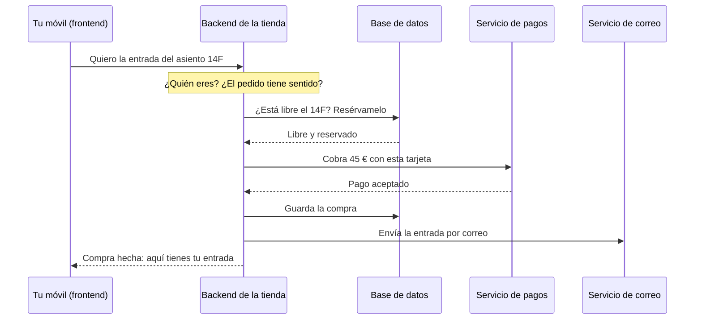

# Plan: lección «Qué es el backend» (nueva lección 1 de la Fase 0)

> **Para agentes:** SUB-SKILL OBLIGATORIA: usa superpowers:subagent-driven-development o superpowers:executing-plans para ejecutar este plan tarea a tarea. Los pasos usan casillas (`- [ ]`) para el seguimiento.

**Objetivo:** añadir la lección «Qué es el backend: diferencias con el frontend» como lección 1 de la Fase 0, en español y en inglés, y renumerar las ocho actuales (2 a 9) sin dejar referencias rotas.

**Arquitectura:** contenido MDX en Starlight, como las demás lecciones. Una figura nueva en HTML y CSS (`DataToScreen.astro`), cuatro términos de glosario y un test que vigila que la lista de lecciones de la introducción siga el orden del menú. Los números de las lecciones se corrigen con un script de un solo uso, que no se queda en el repositorio.

**Stack:** Astro 7 + Starlight 0.42, MDX, Vitest 5, pnpm. Comandos desde la raíz del repositorio (`pnpm test`, `pnpm check`, `pnpm build`, `pnpm format:check`) o desde `web/` con `pnpm exec`.

**Spec:** `docs/specs/2026-10-04-leccion-que-es-el-backend-design.md` (aprobada el 2026-10-04, con los ajustes de títulos y de `weather_code` anotados en ella).

## Restricciones globales

- **Sin commits** y sin desplegar: el autor no lo ha pedido.
- **Ficheros temporales** (scripts y salidas), solo en el scratchpad de la sesión, nunca en `/tmp` ni en el repositorio.
- **Estructura y voz:** las de `docs/style-guide.md`:
  - las secciones, en su orden fijo;
  - frases cortas;
  - sin «simplemente», «obviamente», «es fácil» ni «como todo el mundo sabe»;
  - cada término técnico, definido o con `<Term>` la primera vez.
- **Duración:** entre 10 y 15 minutos de lectura, es decir, entre 2.000 y 3.000 palabras de prosa (`readingMinutes`, a 200 palabras por minuto).
- **Títulos y descripciones:** el `<title>` completo no pasa de 70 caracteres. La descripción va de 70 a 155 caracteres (`web/src/lib/seo/audit.ts`).
- **Salidas de terminal:** copiadas de una ejecución real, nunca inventadas.
- **Open-Meteo:** se cita como «Datos del tiempo: Open-Meteo.com, con licencia CC BY 4.0», con enlace.
- **Fases sin publicar:** se nombran, pero no se enlazan; se enlaza solo `/roadmap/`.
- **Regla de MDX:** una línea en blanco tras abrir y antes de cerrar cualquier componente con Markdown dentro, y alrededor del contenido de `<div slot="limits">`.
- **Un documento por idioma:** la página en español no enlaza a `/en/`, ni al revés (el validador de enlaces lo impide).

## Lo que más puede fallar sin que lo pille un test

1. **Una «lección N» mal renumerada:** una que no era de la Fase 0, o una escrita de otra forma que el script no ve («la primera lección»). El lector iría a la lección equivocada. Lo cubren el recuento y la revisión de la Tarea 1, y la lista exacta de la Tarea 6.
2. **El ejercicio de Open-Meteo en el navegador:** el lector pega la URL y no sabe qué mirar. Lo cubre la Tarea 4, paso 9: se abre la URL en el navegador y se comprueba que el texto describe lo que aparece.
3. **La figura en el móvil (390 px):** el JSON desborda o la flecha queda descolocada. Lo cubre la Tarea 4, paso 9: medir que la figura no tiene scroll horizontal.
4. **El requisito previo y la paginación de la lección 2:** tienen que decir `import 01-que-es-el-backend.md`, y las flechas de anterior y siguiente tienen que encajar, en los dos idiomas. Lo cubre la Tarea 7, paso 3.
5. **El glosario:** los cuatro términos nuevos tienen que enlazar a la lección 1, y los demás no deben cambiar de lección (`terminal` sigue en la introducción). Lo cubre la Tarea 7, paso 3.

---

### Tarea 1: Renumerar las lecciones actuales (2 a 9)

**Ficheros:**
- Modificar: los 8 `.mdx` de `web/src/content/docs/fase-0/` (sin `index.mdx`) y los 8 de `web/src/content/docs/en/phase-0/` (sin `index.mdx`): `sidebar.order` y las «lección N».
- Modificar: `web/src/content/docs/fase-0/index.mdx` y `web/src/content/docs/en/phase-0/index.mdx` («la primera lección»).
- Crear, solo en el scratchpad: `renumerar.py`.

**Interfaces:**
- Produce: las lecciones actuales con `sidebar.order` del 2 al 9, y en el texto, «lección 2» a «lección 9» donde antes ponía 1 a 8. La Tarea 4 escribe la lección 1 suponiendo ya esta numeración.

- [ ] **Paso 1: escribir el script en el scratchpad**

```python
# renumerar.py: suma 1 a las «lección N» y a sidebar.order de las lecciones de la Fase 0.
# Uso, desde web/: python3 <scratchpad>/renumerar.py           (solo enseña los cambios)
#                  python3 <scratchpad>/renumerar.py --apply   (además, los escribe)
import pathlib, re, sys

ROOT = pathlib.Path('src/content/docs')
TARGETS = [
    (ROOT / 'fase-0', re.compile(r'\b([Ll]ecci[oó]n) (\d+)\b')),
    (ROOT / 'en/phase-0', re.compile(r'\b([Ll]esson) (\d+)\b')),
]
NEW = {'que-es-el-backend.mdx', 'what-is-the-backend.mdx'}
apply = '--apply' in sys.argv
refs = orders = 0

for folder, pattern in TARGETS:
    for path in sorted(folder.glob('*.mdx')):
        if path.name == 'index.mdx' or path.name in NEW:
            continue
        lines = path.read_text().splitlines(keepends=True)
        out = []
        in_frontmatter = False
        for i, line in enumerate(lines, 1):
            if line.strip() == '---':
                in_frontmatter = not in_frontmatter
            new = line
            if in_frontmatter and re.match(r'^\s+order:\s*\d+\s*$', line):
                n = int(re.search(r'\d+', line).group())
                new = re.sub(r'\d+', str(n + 1), line)
                orders += 1
            else:
                def bump(m):
                    n = int(m.group(2))
                    if not 1 <= n <= 8:
                        raise SystemExit(f'{path}:{i}: número fuera de la Fase 0: «{m.group(0)}»')
                    return f'{m.group(1)} {n + 1}'
                new = pattern.sub(bump, line)
                refs += len(pattern.findall(line)) if new != line else 0
            if new != line:
                print(f'{path}:{i}:\n  - {line.strip()[:160]}\n  + {new.strip()[:160]}')
            out.append(new)
        if apply:
            path.write_text(''.join(out))

print(f'referencias: {refs} · órdenes: {orders} · {"aplicado" if apply else "sin aplicar"}')
```

- [ ] **Paso 2: ejecutarlo sin aplicar y leer todos los cambios**

Run: `cd web && python3 <scratchpad>/renumerar.py > <scratchpad>/renumerar.log; tail -1 <scratchpad>/renumerar.log`
Expected: `referencias: 108 · órdenes: 16 · sin aplicar`. Lee el log entero. Cada cambio tiene que referirse a una lección de la Fase 0. Si alguno no lo es, para y corrige el script antes de aplicarlo.

- [ ] **Paso 3: aplicarlo**

Run: `cd web && python3 <scratchpad>/renumerar.py --apply | tail -1`
Expected: `referencias: 108 · órdenes: 16 · aplicado`

- [ ] **Paso 4: corregir las dos referencias con palabras**

En `web/src/content/docs/fase-0/index.mdx`:
- Antes: `como los servidores que montaremos en la primera lección.`
- Después: `como los servidores que montaremos en la lección 2.`

En `web/src/content/docs/en/phase-0/index.mdx`:
- Antes: `like the servers we'll start in the first lesson.`
- Después: `like the servers we'll start in lesson 2.`

- [ ] **Paso 5: comprobar que no queda nada fuera de sitio**

Run (desde `web/`):
```bash
python3 - <<'EOF'
import re, pathlib
bad = []
for folder, pat in [('src/content/docs/fase-0', r'\b[Ll]ecci[oó]n (\d+)\b'), ('src/content/docs/en/phase-0', r'\b[Ll]esson (\d+)\b')]:
    for f in pathlib.Path(folder).glob('*.mdx'):
        for n in re.findall(pat, f.read_text()):
            if not 2 <= int(n) <= 9: bad.append((str(f), n))
orders = sorted(int(m) for f in pathlib.Path('src/content/docs/fase-0').glob('*.mdx') if f.name != 'index.mdx'
                for m in re.findall(r'^\s+order:\s*(\d+)', f.read_text(), re.M))
print('fuera de 2-9:', bad, '· órdenes es:', orders)
EOF
grep -rn "primera lección\|first lesson" src/content/docs/fase-0 src/content/docs/en/phase-0
```
Expected: `fuera de 2-9: [] · órdenes es: [2, 3, 4, 5, 6, 7, 8, 9]`, y el `grep` no encuentra nada.

- [ ] **Paso 6: la suite sigue en verde**

Run: `pnpm test`
Expected: todos los tests pasan (533 al escribir este plan).

### Tarea 2: Los cuatro términos nuevos del glosario

**Ficheros:**
- Crear: `web/src/content/glossary/es/{backend,frontend,api,database}.yaml`
- Crear: `web/src/content/glossary/en/{backend,frontend,api,database}.yaml`

**Interfaces:**
- Produce: los ids `backend`, `frontend`, `api` y `database`, que las Tareas 4 y 5 usan con `<Term id="…">`.

- [ ] **Paso 1: crear los ficheros en español**

`es/backend.yaml`:
```yaml
term: Backend
short: La parte de una web o una app que no ves. Son los programas que, en servidores, reciben las peticiones, guardan los datos y deciden qué responder.
related: [frontend, server, api, database]
```
`es/frontend.yaml`:
```yaml
term: Frontend
short: La parte de una web o una app que ves y tocas. Se ejecuta en tu dispositivo, en el navegador o en la app del móvil, y pide al backend lo que necesita.
related: [backend, client]
```
`es/api.yaml`:
```yaml
term: API
short: La forma en que un programa ofrece sus servicios a otros programas, es decir, qué se le puede pedir y cómo responde. El frontend habla con el backend a través de una API.
related: [backend, request, response]
```
`es/database.yaml`:
```yaml
term: Base de datos
short: Un programa que guarda datos de forma ordenada y permite buscarlos y cambiarlos rápido, aunque lo usen muchas personas a la vez. El backend guarda en ella lo que tiene que durar.
related: [backend]
```

- [ ] **Paso 2: crear los ficheros en inglés**

`en/backend.yaml`:
```yaml
term: Backend
short: The part of a website or app you don't see. It's the programs that, on servers, receive requests, store the data and decide what to answer.
related: [frontend, server, api, database]
```
`en/frontend.yaml`:
```yaml
term: Frontend
short: The part of a website or app you see and touch. It runs on your device, in the browser or in the phone app, and asks the backend for what it needs.
related: [backend, client]
```
`en/api.yaml`:
```yaml
term: API
short: The way a program offers its services to other programs, that is, what you can ask it for and how it answers. The frontend talks to the backend through an API.
related: [backend, request, response]
```
`en/database.yaml`:
```yaml
term: Database
short: A program that stores data in an organized way and lets you search and change it quickly, even when many people use it at once. The backend keeps in it whatever needs to last.
related: [backend]
```

- [ ] **Paso 3: el esquema de contenido los acepta**

Run: `pnpm check`
Expected: `0 errors`.

### Tarea 3: La figura `DataToScreen`

**Ficheros:**
- Crear: `web/src/components/diagrams/DataToScreen.astro`
- Modificar: `docs/style-guide.md`, sección «Diagramas» (una línea nueva tras la de `<NatTranslation>`).

**Interfaces:**
- Produce: `<DataToScreen caption labels json card />`, que usan las Tareas 4 y 5.
  - `caption: string`;
  - `labels: { data: string; screen: string; arrow: string }`;
  - `json: string`;
  - `card: { place: string; temperature: string; summary: string }`.

- [ ] **Paso 1: crear el componente**

```astro
---
/**
 * Figura «de datos a pantalla»: a un lado, los datos que envía el backend (JSON); al otro, lo que el
 * frontend pinta con ellos (una tarjeta del tiempo).
 *
 * Es HTML y CSS, sin JavaScript, como los demás diagramas: el texto conserva su tamaño en pantallas
 * estrechas, sigue los colores del tema y lo leen los lectores de pantalla. Todos los textos llegan
 * por props, porque cada idioma pasa los suyos.
 */
interface Props {
  /** Pie de la figura. Explica cómo leerla. */
  caption: string;
  /** Títulos de las dos mitades y texto de la flecha que las une. */
  labels: { data: string; screen: string; arrow: string };
  /** Los datos tal como llegan del backend (JSON abreviado, en varias líneas). */
  json: string;
  /** La tarjeta del tiempo: el lugar, la temperatura escrita para personas («17 °C») y un resumen. */
  card: { place: string; temperature: string; summary: string };
}

const { caption, labels, json, card } = Astro.props;
---

<figure class="data-to-screen not-content">
  <div class="data-to-screen__grid">
    <div>
      <p class="data-to-screen__label">{labels.data}</p>
      <pre class="data-to-screen__json"><code>{json}</code></pre>
    </div>
    <p class="data-to-screen__arrow">{labels.arrow}</p>
    <div>
      <p class="data-to-screen__label">{labels.screen}</p>
      <div class="data-to-screen__card">
        <span class="data-to-screen__sun" aria-hidden="true"></span>
        <p class="data-to-screen__place">{card.place}</p>
        <p class="data-to-screen__temperature">{card.temperature}</p>
        <p class="data-to-screen__summary">{card.summary}</p>
      </div>
    </div>
  </div>
  <figcaption>{caption}</figcaption>
</figure>

<style>
  .data-to-screen {
    margin-block: 1.5rem;
  }
  /* Datos, flecha y pantalla en una fila; en pantallas estrechas, uno debajo de otro. */
  .data-to-screen__grid {
    display: grid;
    grid-template-columns: minmax(0, 1fr) auto minmax(0, 1fr);
    gap: 0.75rem;
    align-items: center;
  }
  .data-to-screen__label {
    margin: 0 0 0.375rem;
    font-size: var(--sl-text-sm);
    font-weight: 600;
    color: var(--ide-strong);
  }
  .data-to-screen__json {
    margin: 0;
    padding: 0.75rem;
    border: 1px solid var(--ide-border);
    border-radius: 0.375rem;
    background: var(--ide-deep);
    color: var(--ide-text);
    font-family: var(--__sl-font-mono);
    font-size: var(--sl-text-xs);
    line-height: 1.5;
    white-space: pre-wrap;
    overflow-wrap: anywhere;
  }
  .data-to-screen__arrow {
    max-width: 8rem;
    margin: 0;
    font-size: var(--sl-text-xs);
    text-align: center;
    color: var(--ide-muted);
  }
  .data-to-screen__arrow::after {
    content: '→' / '';
    display: block;
    font-size: var(--sl-text-xl);
    color: var(--ide-accent);
  }
  .data-to-screen__card {
    display: grid;
    grid-template-columns: auto 1fr;
    column-gap: 0.75rem;
    align-items: center;
    padding: 1rem;
    border: 1px solid var(--ide-border);
    border-radius: 0.75rem;
    background: var(--ide-chrome);
  }
  .data-to-screen__sun {
    grid-row: span 3;
    width: 2.5rem;
    height: 2.5rem;
    border-radius: 50%;
    background: var(--ide-accent);
  }
  .data-to-screen__card p {
    margin: 0;
  }
  .data-to-screen__place,
  .data-to-screen__summary {
    font-size: var(--sl-text-sm);
    color: var(--ide-muted);
  }
  .data-to-screen__temperature {
    font-size: var(--sl-text-3xl);
    font-weight: 600;
    line-height: 1.1;
    color: var(--ide-strong);
  }
  @media (max-width: 40rem) {
    .data-to-screen__grid {
      grid-template-columns: minmax(0, 1fr);
    }
    .data-to-screen__arrow {
      max-width: none;
    }
    .data-to-screen__arrow::after {
      content: '↓' / '';
    }
  }
  figcaption {
    margin-top: 0.75rem;
    font-size: var(--sl-text-sm);
    color: var(--ide-muted);
  }
</style>
```

- [ ] **Paso 2: documentarlo en la guía de estilo**

En `docs/style-guide.md`, «Diagramas», tras la línea de `<NatTranslation …>`, añade:
```markdown
  - Ya existe `<DataToScreen caption labels json card />`: los datos que envía un backend (JSON) junto a lo que pinta el frontend con ellos (una tarjeta del tiempo).
```

- [ ] **Paso 3: comprobar tipos y formato**

Run: `pnpm check && pnpm format:check`
Expected: `0 errors` y «All matched files use Prettier code style!». Se ve en el navegador en la Tarea 4.

### Tarea 4: La lección en español

**Ficheros:**
- Crear: `web/src/content/phase-intro.test.ts`
- Crear: `web/src/content/docs/fase-0/que-es-el-backend.mdx`
- Modificar: `web/src/data/phases.ts` (`lessonCount: 8` → `9`)
- Modificar: `web/src/content/docs/fase-0/index.mdx` (lista de lecciones y «Lo que vas a aprender»)
- Modificar: `web/src/content/docs/fase-0/modelo-cliente-servidor.mdx` (`prerequisites` y el tercer límite de la analogía)

**Interfaces:**
- Consume:
  - la numeración de la Tarea 1;
  - los ids de glosario de la Tarea 2;
  - `<DataToScreen>` de la Tarea 3.
- Produce: la `translationKey` `what-is-backend`, que usan la Tarea 5 (inglés) y el requisito previo de la lección 2.

- [ ] **Paso 1: escribir el test que vigila la lista de la introducción**

`web/src/content/phase-intro.test.ts`:
```ts
import { readdirSync, readFileSync } from 'node:fs';
import { fileURLToPath } from 'node:url';
import { describe, expect, it } from 'vitest';

const docs = fileURLToPath(new URL('./docs/', import.meta.url));
const folder = { es: 'fase-0', en: 'en/phase-0' } as const;
const base = { es: '/fase-0/', en: '/en/phase-0/' } as const;
type Locale = keyof typeof folder;

/** Las lecciones de la Fase 0, como URLs, en el orden del menú (`sidebar.order`). */
function lessonsInOrder(locale: Locale): string[] {
  const dir = `${docs}${folder[locale]}/`;
  return readdirSync(dir)
    .filter((name) => name.endsWith('.mdx') && name !== 'index.mdx')
    .map((name) => ({
      url: `${base[locale]}${name.replace(/\.mdx$/, '')}/`,
      order: Number(/^\s+order:\s*(\d+)/m.exec(readFileSync(dir + name, 'utf8'))?.[1]),
    }))
    .sort((a, b) => a.order - b.order)
    .map((lesson) => lesson.url);
}

/** Los enlaces de la lista numerada de la introducción: «1. [Nombre](/fase-0/…/)». */
function introList(locale: Locale): string[] {
  const intro = readFileSync(`${docs}${folder[locale]}/index.mdx`, 'utf8');
  return [...intro.matchAll(/^\d+\. \[[^\]]+\]\(([^)]+)\)$/gm)].map(([, href]) => href!);
}

describe('introducción de la Fase 0', () => {
  it.each(['es', 'en'] as const)(
    'en %s, la lista de lecciones sigue el orden del menú (si se añade una lección, también ahí)',
    (locale) => {
      expect(introList(locale)).toEqual(lessonsInOrder(locale));
    },
  );
});
```

Run: `cd web && pnpm exec vitest run src/content/phase-intro.test.ts`
Expected: PASA. Todavía describe el estado actual; su RED llega en el paso 6.

- [ ] **Paso 2: ejecutar de verdad lo que citará la lección**

Run: `curl "https://api.open-meteo.com/v1/forecast?latitude=40.42&longitude=-3.70&current=temperature_2m,weather_code"`
Expected: una línea de JSON con `"current":{…"temperature_2m":…,"weather_code":…}`. Guarda la salida exacta en el scratchpad: es el `output` del `<TryIt>`.

Abre la misma URL en el navegador (Playwright) y anota qué se ve, porque el texto lo describe. En Chrome sale el JSON en crudo, con la casilla «Dar formato» (*Pretty-print*) arriba.

- [ ] **Paso 3: escribir la lección**

`web/src/content/docs/fase-0/que-es-el-backend.mdx`, con este frontmatter exacto:

```mdx
---
translationKey: what-is-backend
title: "Qué es el backend: diferencias con el frontend"
description: "Qué es el backend, para qué sirve y en qué se diferencia del frontend, explicado desde cero y con ejemplos de las webs y apps que usas cada día."
sidebar:
  label: "Qué es el backend"
  order: 1
lesson:
  oneLiner: "El backend es la parte de una web o una app que no ves: los programas que, en otros ordenadores, reciben lo que pides, guardan los datos y deciden qué responder. El frontend es lo que ves y tocas."
  objectives:
    - Distinguir el frontend del backend, dónde se ejecuta cada uno y qué hace.
    - Explicar qué hace el backend cuando compras algo en una web o una app.
    - Entender por qué hay cosas que solo puede hacer el backend, como guardar los datos de todos, cobrar y comprobar quién eres.
    - Ver con tus ojos la respuesta de un backend real, sin frontend.
  prerequisites: []
---

import Term from '~/components/Term.astro';
import TryIt from '~/components/TryIt.astro';
import Analogy from '~/components/Analogy.astro';
import SelfCheck from '~/components/SelfCheck.astro';
import DataToScreen from '~/components/diagrams/DataToScreen.astro';
```

El cuerpo sigue la spec, §3, sección a sección. Lo que es fijo:

- **`<Term>` en el primer uso** de: `frontend`, `backend`, `server`, `request`, `response`, `api`, `database` y `client` (si aparece).
- **`## Cómo funciona de verdad`** tiene estos `###`, en este orden:
  1. «Dónde se ejecuta cada parte»;
  2. «Lo que viaja son datos, no pantallas», con la figura;
  3. «Lo que pasa al comprar una entrada», con el diagrama;
  4. «Por qué no puede hacerlo todo el frontend»;
  5. «Frontend, backend y full stack», con la tabla.
- **La figura,** dentro de «Lo que viaja son datos, no pantallas»:

```mdx
<DataToScreen
  caption="A la izquierda, lo que envía el backend de una app del tiempo (abreviado): solo datos, sin colores ni dibujos. A la derecha, lo que pinta la app con ellos. El 0 de weather_code es un código que significa «despejado»: el frontend lo convierte en una palabra y un sol."
  labels={{
    data: 'Lo que envía el backend',
    screen: 'Lo que pinta el frontend',
    arrow: 'la app lo convierte en',
  }}
  json={`{
  "current": {
    "time": "2026-10-04T12:00",
    "temperature_2m": 17.4,
    "weather_code": 0
  }
}`}
  card={{ place: 'Madrid', temperature: '17 °C', summary: 'Despejado' }}
/>
```

- **El diagrama,** en «Lo que pasa al comprar una entrada». Después, un párrafo que diga en qué fase se aprende cada paso (Fase 3: las reglas y comprobaciones; Fase 4: hablar con otros servicios; Fase 5: guardar y que no se venda dos veces el mismo asiento; Fase 6: quién eres; Fase 9: el correo en segundo plano). Termina enlazando el [temario](/roadmap/).

````mdx

````

- **La tabla de «Frontend, backend y full stack»:** filas «Dónde se ejecuta», «Qué hace», «Lenguajes típicos» y «Qué ves cuando falla»; columnas «Frontend» y «Backend».
  - Lenguajes del frontend: HTML, CSS, JavaScript y TypeScript.
  - Lenguajes del backend: JavaScript y TypeScript con Node.js (el de este curso), Python, Go, Java y PHP.
  - Después de la tabla, el párrafo del full stack.
- **`## Pruébalo`:**
  1. Primero, el paso del navegador: la URL en un bloque de código y qué mirar (`temperature_2m` y `weather_code`).
  2. Después, el `<TryIt>`:

```mdx
<TryIt
  cmd={`curl "https://api.open-meteo.com/v1/forecast?latitude=40.42&longitude=-3.70&current=temperature_2m,weather_code"`}
  output={`<la salida exacta del paso 2>`}
>

`curl` es un programa que hace peticiones desde la terminal, como un navegador sin pantalla. … (explicación de la salida: tus números serán otros; qué es cada campo)

</TryIt>
```

  3. Al final de la sección: `Datos del tiempo: [Open-Meteo.com](https://open-meteo.com/), con licencia CC BY 4.0.`
- **`## Ya lo has visto`, `## Errores comunes`, `## Resumen` y `## ¿Lo has entendido?`:** con los puntos de la spec, §3.5 a §3.7. La autoevaluación lleva al menos las tres preguntas de §3.7.
- **`## Para profundizar`:**
  - [Introducción al lado servidor, en MDN](https://developer.mozilla.org/es/docs/Learn_web_development/Extensions/Server-side/First_steps/Introduction). Comprueba que la URL en español existe con `curl -sI`. Si no, enlaza la inglesa.
  - [La documentación de la API de Open-Meteo](https://open-meteo.com/en/docs).

- [ ] **Paso 4: medir la duración y las palabras prohibidas**

Run (desde `web/`):
```bash
python3 - <<'EOF'
import re
b = open('src/content/docs/fase-0/que-es-el-backend.mdx').read().split('---', 2)[2]
b = re.sub(r'^import .*$', '', b, flags=re.M); b = re.sub(r'```[\s\S]*?```', '', b)
b = re.sub(r'\{`[\s\S]*?`\}', ' ', b); b = re.sub(r'<[^>]+>', ' ', b)
w = [x for x in b.split() if not re.fullmatch(r'\|[|:-]*', x)]
print(len(w), 'palabras ·', round(len(w) / 200), 'min')
EOF
grep -niE "simplemente|obviamente|es fácil|como todo el mundo sabe" src/content/docs/fase-0/que-es-el-backend.mdx
```
Expected: entre 2.000 y 3.000 palabras (10–15 min), y el `grep` no encuentra nada.

- [ ] **Paso 5: ver el RED**

Run: `pnpm test`
Expected: FALLAN dos tests:
- `phases`: en es, la fase 0 publica 9 lecciones y anuncia 8;
- `introducción de la Fase 0`: en es, a la lista le falta `/fase-0/que-es-el-backend/`.

- [ ] **Paso 6: arreglarlo**

En `web/src/data/phases.ts`, en la Fase 0: `lessonCount: 8,` → `lessonCount: 9,`.

En `web/src/content/docs/fase-0/index.mdx`:
- En «Lo que vas a aprender», como primer punto: `- Qué es el backend y en qué se diferencia del frontend.`
- La lista «Las lecciones» queda así:

```markdown
1. [Qué es el backend](/fase-0/que-es-el-backend/)
2. [Modelo cliente-servidor](/fase-0/modelo-cliente-servidor/)
3. [Qué es un protocolo](/fase-0/que-es-un-protocolo/)
4. [El modelo TCP/IP](/fase-0/modelo-tcp-ip/)
5. [IP, puertos y sockets](/fase-0/ip-puertos-y-sockets/)
6. [TCP frente a UDP](/fase-0/tcp-vs-udp/)
7. [DNS](/fase-0/que-es-dns/)
8. [TLS y HTTPS](/fase-0/tls-y-https/)
9. [De la URL a la página](/fase-0/que-pasa-cuando-escribes-una-url/)
```

Run: `pnpm test`
Expected: todo en verde.

- [ ] **Paso 7: la lección 2 apunta a la nueva**

En `web/src/content/docs/fase-0/modelo-cliente-servidor.mdx`:
- `prerequisites: []` → `prerequisites: [what-is-backend]`.
- El tercer punto del slot `limits` pasa a ser:

```markdown
- Una tienda es siempre tienda. Un programa, en cambio, puede ser servidor y cliente a la vez. El backend de una web, que viste en la lección 1, atiende las peticiones de su frontend y, para responderlas, hace a su vez de cliente: pide datos a una base de datos o a un servicio de pagos.
```

- [ ] **Paso 8: build**

Run: `rm -rf web/dist && pnpm build`
Expected: termina con «All internal links are valid» y «[seo-audit] 27 páginas auditadas, sin problemas» (eran 26).

Si el build falla solo porque la lección aún no existe en inglés (por ejemplo, el menú inglés enlaza a su página de respaldo, que el build borra), es esperado: anótalo en el registro como decisión y repite este paso al final de la Tarea 5. El paso 9 se hace entonces con el servidor de desarrollo, que no depende del build. Cualquier otro fallo se arregla aquí.

- [ ] **Paso 9: en el navegador**

Con `pnpm --filter web exec astro preview` (o el servidor de desarrollo), abre `/fase-0/que-es-el-backend/` con Playwright:
- **A 1440 px, en oscuro y en claro:**
  - la figura, el diagrama y la tabla se leen;
  - la barra de estado dice «lección 1/9»;
  - el explorador muestra `01-que-es-el-backend.md` … `09-de-la-url-a-la-pagina.md`.
- **A 390 px:** la figura sin scroll horizontal. Comprobación: `document.querySelector('.data-to-screen').scrollWidth <= document.querySelector('.data-to-screen').clientWidth` da `true`, y la flecha es «↓».
- **Los popovers** de los `<Term>` nuevos se abren.
- **La URL de Open-Meteo** se abre en el navegador y el texto del paso del navegador coincide con lo que se ve (lo que más puede fallar, n.º 2).

### Tarea 5: La lección en inglés

**Ficheros:**
- Crear: `web/src/content/docs/en/phase-0/what-is-the-backend.mdx`
- Modificar: `web/src/content/docs/en/phase-0/index.mdx`
- Modificar: `web/src/content/docs/en/phase-0/client-server-model.mdx`

**Interfaces:**
- Consume: lo mismo que la Tarea 4, y la lección española ya terminada, que se traduce.

- [ ] **Paso 1: ejecutar de verdad lo que citará la lección**

Run: `curl "https://api.open-meteo.com/v1/forecast?latitude=51.51&longitude=-0.13&current=temperature_2m,weather_code"`
Expected: una línea de JSON de Londres. Guarda la salida exacta: es el `output` del `<TryIt>` inglés.

- [ ] **Paso 2: traducir la lección**

Frontmatter exacto:
```mdx
---
translationKey: what-is-backend
title: "What is the backend? Frontend vs backend"
description: "What the backend is, what it does and how it differs from the frontend, explained from scratch with examples from the websites and apps you use every day."
sidebar:
  label: "What is the backend"
  order: 1
lesson:
  oneLiner: "The backend is the part of a website or app you don't see: the programs that, on other computers, receive what you ask for, store the data and decide what to answer. The frontend is what you see and touch."
  objectives:
    - Tell the frontend from the backend, where each one runs and what it does.
    - Explain what the backend does when you buy something on a website or an app.
    - Understand why some things only the backend can do, like storing everyone's data, taking payments and checking who you are.
    - See with your own eyes the answer of a real backend, without a frontend.
  prerequisites: []
---
```
- **Títulos de sección:** los de la guía de estilo (The problem, The analogy… Further reading).
- **Los `###` de «How it really works»:**
  1. «Where each part runs»;
  2. «What travels is data, not screens»;
  3. «What happens when you buy a ticket»;
  4. «Why the frontend can't do it all»;
  5. «Frontend, backend and full stack».
- **La figura:** `card={{ place: 'London', temperature: '17 °C', summary: 'Clear sky' }}`, con las etiquetas «What the backend sends», «What the frontend draws» y «the app turns it into». El caption, traducido.
- **El diagrama:** con los participantes «Your phone (frontend)», «The shop's backend», «Database», «Payment service» y «Email service», y los mensajes traducidos.
- **Pruébalo:** la URL de Londres. La cita: `Weather data: [Open-Meteo.com](https://open-meteo.com/), licensed under CC BY 4.0.`
- **Para profundizar:** la página inglesa de MDN, `https://developer.mozilla.org/en-US/docs/Learn_web_development/Extensions/Server-side/First_steps/Introduction`.
- **Duración:** la misma comprobación que en la Tarea 4, paso 4, con el fichero inglés. En lugar de las palabras prohibidas en español, busca «simply», «obviously», «it's easy» y «as everyone knows».

- [ ] **Paso 3: ver el RED**

Run: `pnpm test`
Expected: FALLA `introducción de la Fase 0` en `en`: a la lista le falta `/en/phase-0/what-is-the-backend/`.

- [ ] **Paso 4: arreglarlo**

En `web/src/content/docs/en/phase-0/index.mdx`:
- En «What you'll learn», como primer punto: `- What the backend is and how it differs from the frontend.`
- La lista «The lessons»:

```markdown
1. [What is the backend](/en/phase-0/what-is-the-backend/)
2. [The client-server model](/en/phase-0/client-server-model/)
3. [What a protocol is](/en/phase-0/what-is-a-protocol/)
4. [The TCP/IP model](/en/phase-0/tcp-ip-model/)
5. [IP, ports and sockets](/en/phase-0/ip-ports-sockets/)
6. [TCP vs UDP](/en/phase-0/tcp-vs-udp/)
7. [DNS](/en/phase-0/what-is-dns/)
8. [TLS and HTTPS](/en/phase-0/tls-and-https/)
9. [From URL to page](/en/phase-0/what-happens-when-you-type-a-url/)
```

En `web/src/content/docs/en/phase-0/client-server-model.mdx`:
- `prerequisites: []` → `prerequisites: [what-is-backend]`.
- El tercer punto de `limits`:

```markdown
- A shop is always a shop. A program, on the other hand, can be a server and a client at the same time. A website's backend, which you saw in lesson 1, serves requests from its frontend and, to answer them, acts as a client itself: it asks a database or a payment service for data.
```

Run: `pnpm test`
Expected: todo en verde.

- [ ] **Paso 5: build y navegador**

Run: `rm -rf web/dist && pnpm build`
Expected: enlaces válidos y «[seo-audit] 28 páginas auditadas, sin problemas».

En el navegador, `/en/phase-0/what-is-the-backend/` a 1440 y a 390 px:
- la barra de estado dice «lesson 1/9»;
- la figura, sin scroll horizontal;
- el selector de idioma lleva de una lección a la otra.

### Tarea 6: Documentos

**Ficheros:**
- Modificar:
  - `docs/specs/2026-10-02-web-fase-0-design.md`
  - `docs/specs/2026-10-03-seo-design.md`
  - `docs/specs/2026-10-03-fase-1-design.md`
  - `docs/style-guide.md`
  - `docs/pendientes.md`
  - `CLAUDE.md`

- [ ] **Paso 1: la spec de la Fase 0**
  - §6.1: añade el punto «4. **Nueva lección inicial, «Qué es el backend»** (2026-10-04): diseño en `docs/specs/2026-10-04-leccion-que-es-el-backend-design.md`.»
  - §6.2: «el mapa de las 8 lecciones» → «el mapa de las 9 lecciones».
  - §6.3: primera fila nueva de la tabla: `| `what-is-backend` | Abrir en el navegador la API de Open-Meteo y repetirlo con `curl` | 1 |`.
  - Al final: «La introducción y las 8 lecciones» → «La introducción y las 9 lecciones».

- [ ] **Paso 2: la tabla de títulos del plan de SEO (§4)**

Primera fila nueva: `| 1 | Qué es el backend: diferencias con el frontend | What is the backend? Frontend vs backend | «que es backend y frontend», «frontend y backend diferencias», «frontend vs backend» |`. Las demás filas pasan de 1–8 a 2–9.

- [ ] **Paso 3: la spec de la Fase 1**

Solo las referencias a lecciones de la Fase 0. Las de la Fase 1 (lecciones 4, 5, 8, 9 y 10 de su tabla) no se tocan.
- «también la de la lección 1;» → «también la de la lección 2;»
- «comparados con los certificados de la lección 7» → «comparados con los certificados de la lección 8 de la Fase 0»
- «que enlazan con las huellas de la lección 7» → «que enlazan con las huellas de la lección 8 de la Fase 0»
- «Desaparece la pestaña «Windows» de la lección 1» → «Desaparece la pestaña «Windows» de la lección 2»

- [ ] **Paso 4: la guía de estilo**

«DevTools es para todos** desde la lección 3 de la Fase 0» → «desde la lección 4 de la Fase 0».

- [ ] **Paso 5: `pendientes.md`**
  - Suma 1 a cada número de lección de la Fase 0, en las líneas que nombran lecciones:
    - las revisiones de las lecciones 1 a 8;
    - la de los textos de Chrome («lección 7»);
    - la de la pestaña de Windows en el diseño de la Fase 1;
    - el aviso «Ojo al editar la lección 4 en inglés»;
    - los detalles de la traducción («en la lección 8…», «en la lección 2…», «como en la lección 1…»).
  - En el punto de la traducción: «las lecciones 1 a 8» → «las lecciones 1 a 9» (la nueva también está traducida), y «Las lecciones 2 a 8 se tradujeron…» → «Las lecciones 3 a 9 se tradujeron…».
  - Pestaña de Windows: «La lección 1 la tiene; las lecciones 2 a 8 no.» → «La lección 2 la tiene; las demás, no.», y «quitarla de la lección 1» → «quitarla de la lección 2».
  - No toques la línea de la spec de esta lección («Será la lección 1 de la Fase 0»).
  - Antes de las revisiones, añade: `- [ ] Leer y hacer como lector la **lección 1, «Qué es el backend»** (`fase-0/que-es-el-backend.mdx`) y reescribirla con tu voz. La escribió un agente a partir de la spec del 2026-10-04. Prueba el ejercicio de Open-Meteo en tu navegador.`
  - Comprobación: `python3 -c "import re;[print(i,l[:120]) for i,l in enumerate(open('docs/pendientes.md'),1) if re.search(r'[Ll]ecci[oó]n(es)? \d',l)]"`. Repasa cada línea.

- [ ] **Paso 6: `CLAUDE.md`** (con el permiso del autor del 2026-10-04)

En «Fase 0 — Cómo funciona internet», antes de «**Modelo cliente-servidor**», añade:
```markdown
- **Qué es el backend**: la parte de una web o una app que no ves, qué hace y en qué se diferencia del frontend.
```

- [ ] **Paso 7: formato**

Run: `pnpm format:check`
Expected: «All matched files use Prettier code style!».

### Tarea 7: Verificación final y revisión independiente

- [ ] **Paso 1: todo en verde**

Run: `pnpm format:check && pnpm check && pnpm test && rm -rf web/dist && pnpm build`
Expected: formato bien, `0 errors`, todos los tests y el build con los enlaces válidos y la auditoría SEO sin problemas (28 páginas).

- [ ] **Paso 2: las páginas generadas**

Run (desde `web/`):
```bash
grep -o '<title>[^<]*</title>' dist/fase-0/que-es-el-backend/index.html dist/en/phase-0/what-is-the-backend/index.html
grep -o 'min de lectura\|min read' -m1 dist/fase-0/que-es-el-backend/index.html
grep -o '01-que-es-el-backend.md' dist/fase-0/modelo-cliente-servidor/index.html | head -2
grep -o '01-what-is-the-backend.md' dist/en/phase-0/client-server-model/index.html | head -2
```
Expected:
- los dos títulos de la spec, con el nombre de la web detrás;
- la lección muestra su tiempo de lectura;
- la lección 2 enlaza a `01-…` en su requisito previo y en la paginación.

- [ ] **Paso 3: el glosario y la paginación**

En `dist/glossary/index.html` y `dist/en/glossary/index.html`:
- backend, frontend, API y base de datos dicen «Se explica en `fase-0/01-que-es-el-backend.md`» (`phase-0/01-what-is-the-backend.md`);
- terminal sigue en `fase-0/00-introduccion.md`;
- DNS sigue en `fase-0/07-dns.md`.

En el navegador:
- la flecha «anterior» de la lección 1 lleva a la introducción, y la «siguiente», a la lección 2;
- la lección 2 dice «lección 2/9».

- [ ] **Paso 4: revisión independiente**

Lanza un revisor con contexto nuevo, en el modelo más capaz. Le pasas la spec, el plan, `docs/style-guide.md` y los ficheros de las Tareas 1 a 6. Comprueba:
1. que la lección española cumple la guía (estructura, voz, `<Term>`, duración) y el criterio «todos los públicos»;
2. que la inglesa dice lo mismo que la española;
3. que una muestra de la renumeración, con al menos 15 referencias del log de la Tarea 1, apunta a la lección correcta por su tema;
4. la figura en móvil y en oscuro y claro, con las capturas del paso 9 de la Tarea 4.

Sus hallazgos se clasifican y se corrigen en una sola pasada. Cada arreglo se comprueba igual que en su tarea.

- [ ] **Paso 5: cerrar**
  - `pendientes.md`: la propuesta de la lección, hecha. Queda la revisión del autor (Tarea 6, paso 5).
  - Mira qué hay en `.playwright-mcp` y en las capturas del scratchpad antes de borrarlos.
  - Resumen para el autor en español: qué se ha hecho, las decisiones tomadas y lo que queda para él.
