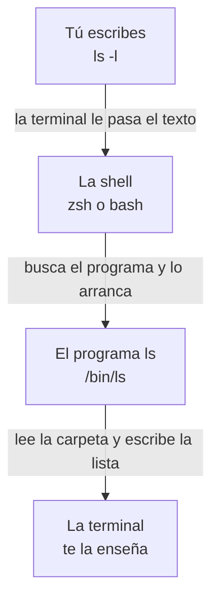

# Plan: Fase 1, lección piloto (introducción y lección 1, en español)

> **Para agentes:** SUB-SKILL OBLIGATORIA: usa superpowers:subagent-driven-development o superpowers:executing-plans para ejecutar este plan tarea a tarea. Los pasos usan casillas (`- [ ]`) para el seguimiento.

**Objetivo:** publicar la Fase 1 con su introducción y su lección 1, «La shell: comandos y rutas», solo en español, para que el autor valide la plantilla y el tono antes de escribir las otras nueve. Por el camino se aplica la decisión «WSL como única vía» en la Fase 0.

**Arquitectura:** contenido MDX en Starlight, como la Fase 0. La fase se publica cambiando su estado en `web/src/data/phases.ts`; el explorador, la barra de estado, la paginación y el sitemap ya se adaptan solos. El test de las introducciones pasa a vigilar todas las fases. No hay componentes nuevos: la lección usa `<Term>`, `<TryIt>`, `<Analogy>`, `<SelfCheck>`, un diagrama de cadena (bloque mermaid) y el `<FileTree>` de Starlight.

**Stack:** Astro 7 + Starlight 0.42, MDX, Vitest 5, pnpm. Comandos desde la raíz del repo (`pnpm test`, `pnpm check`, `pnpm build`, `pnpm format:check`) o desde `web/` con `pnpm exec`.

**Spec:** `docs/specs/2026-10-03-fase-1-design.md` (aprobada el 2026-10-07). La plantilla de lección y la voz: `docs/style-guide.md`.

## Decisiones de este plan (las revisa el autor con el plan)

1. **Multipass se instala en la lección 4, no en la introducción.** La spec (§3, fila 0) ponía en la introducción la preparación de todo el entorno. Pero la VM no se usa hasta la lección 4, y `CLAUDE.md` dice «nada se construye antes de necesitarlo». Así, la introducción explica los tres sitios donde se practica y crea la carpeta de prácticas, y la piloto no depende de instalar Multipass en el Mac del autor. El «Pruébalo» de la introducción pasa a ser `uname` en tu máquina (sin la VM).
2. **Título y URL de la lección 1,** sacados del autocompletado de Google del 2026-10-07 («comandos basicos terminal mac», «comandos basicos terminal linux», «10 comandos básicos de terminal y su utilidad»): título «Comandos básicos de la terminal en Mac y Linux», URL `/fase-1/comandos-basicos-terminal/`. El nombre corto del explorador sigue siendo el de la spec, «La shell: comandos y rutas».
3. **Título de la introducción:** «Aprender Linux desde cero: terminal y SSH» («aprender linux desde cero» y «linux desde cero» salen en el autocompletado).
4. **El término `terminal` del glosario** pasa a explicarse en la lección 1 (en español). En inglés sigue en la introducción de la Fase 0 hasta que se traduzca la lección.

## Restricciones globales

- **Sin commits** y sin desplegar: el autor no lo ha pedido.
- **Ficheros temporales** (scripts, salidas, capturas), solo en el scratchpad de la sesión (`$S` en los comandos de abajo), nunca en `/tmp` ni en el repositorio.
- **Solo español.** Nada de `en/phase-1/`: la traducción llega cuando el autor apruebe la piloto (`docs/style-guide.md`, «Traducción»).
- **Estructura y voz:** las de `docs/style-guide.md`:
  - las secciones de la lección, en su orden fijo;
  - frases cortas, una idea por párrafo;
  - sin «simplemente», «obviamente», «es fácil» ni «como todo el mundo sabe»;
  - cada término técnico, definido o con `<Term>` la primera vez;
  - **para todos los públicos:** nada de programación dado por sabido. Lo de programar va al final de «Ya lo has visto», tras «Y si programas:».
- **Duración de la lección:** entre 10 y 15 minutos de lectura, es decir, entre 2.000 y 3.000 palabras de prosa (`readingMinutes`, a 200 palabras por minuto).
- **Títulos y descripciones:** el `<title>` completo («… | Backend desde cero») no pasa de 70 caracteres; la descripción va de 70 a 155 (`web/src/lib/seo/audit.ts`). Los de este plan ya están medidos: 62 y 144 (introducción), 67 y 148 (lección).
- **Salidas de terminal:** copiadas de una ejecución real en macOS, nunca inventadas. El usuario de ejemplo es `ana` (carpeta `/Users/ana`, grupo `staff`), y el texto avisa de que se ha cambiado.
- **macOS y Linux** (spec, §2.3): se enseña lo que comparten zsh y bash. Cuando una salida o un comportamiento cambia en Linux o WSL, el texto lo dice. Nada de opciones que difieren entre BSD y GNU.
- **Seguridad del lector** (spec, §2.4): los ejercicios trabajan en `~/curso-backend/fase-1` o solo leen. Ningún `sudo` en el ordenador del lector.
- **Lecciones sin publicar:** se nombran, pero no se enlazan.
- **Regla de MDX:** una línea en blanco tras abrir y antes de cerrar cualquier componente con Markdown dentro, y alrededor del contenido de `<div slot="limits">`.
- **Antes de dar una tarea por terminada:** `pnpm format:check && pnpm check && pnpm test && pnpm build`, como dice `CLAUDE.md`.

## Lo que más puede fallar sin que lo pille un test

1. **Un lector en Linux o WSL ve otra salida y cree que lo ha hecho mal** (`/home/ana` en lugar de `/Users/ana`, `ls --help` que en Mac da error, `which cd` que no dice lo mismo, otro mensaje de error de `cd`). Lo cubre la Tarea 4, paso 2: los mismos comandos en un Ubuntu de verdad (Docker), y cada diferencia que importe, dicha en el texto.
2. **Copiar un comando de un `<TryIt>` no da exactamente lo que hay que pegar** (comillas de `cd "Mis documentos"`, varias líneas). Lo cubre la Tarea 4, paso 9: copiar con el botón y comparar.
3. **La Fase 1 en las páginas en inglés:** en `/en/` y `/en/roadmap/` tiene que salir como «pronto», sin enlaces a páginas en español. Lo cubre la Tarea 3, paso 6.
4. **El explorador, la barra de estado y la paginación con dos fases:** en las páginas de la Fase 1 se abre su carpeta y no la de la Fase 0; la barra dice «lección 1/10»; la lección 9 de la Fase 0 tiene ahora una «siguiente» que va a `fase-1/00-introduccion.md`. Lo cubre la Tarea 4, paso 9.
5. **El árbol de carpetas en el móvil (390 px):** el `<FileTree>` con nombres largos desborda. Lo cubre la Tarea 4, paso 9.

---

### Tarea 1: WSL como única vía en la Fase 0

**Ficheros:**
- Modificar: `web/src/content/docs/fase-0/modelo-cliente-servidor.mdx`
- Modificar: `web/src/content/docs/en/phase-0/client-server-model.mdx`
- Modificar: `web/src/content/docs/fase-0/index.mdx` (línea 47)
- Modificar: `web/src/content/docs/en/phase-0/index.mdx` (línea 47)
- Modificar: `web/src/content/docs/fase-0/que-es-dns.mdx` (línea 154)
- Modificar: `web/src/content/docs/en/phase-0/what-is-dns.mdx` (línea 154)
- Modificar: `docs/style-guide.md` («Componentes»)

**Interfaces:** ninguna. `TryIt.astro` no cambia: la prop `windows` se queda por si algún día hace falta (spec, §2.2).

- [ ] **Paso 1: quitar las pestañas de la lección 2**

En `modelo-cliente-servidor.mdx` y en `client-server-model.mdx`, borra estas cuatro líneas (dos en cada `<TryIt>`; los comandos de la pestaña eran los mismos que los de `cmd`):

```mdx
  windows="nc -l 8080"
  windowsLang="sh"
```
```mdx
  windows="curl -v http://localhost:8080"
  windowsLang="sh"
```

Run: `grep -rn 'windows' web/src/content`
Expected: nada.

- [ ] **Paso 2: la introducción de la Fase 0 ya no promete pestañas**

En `fase-0/index.mdx`, línea 47, cambia la última frase:
- «Cuando un ejercicio tenga una alternativa nativa de Windows, la verás en una pestaña aparte.» → «Todos los ejercicios del curso funcionan igual en esa terminal.»

En `en/phase-0/index.mdx`, línea 47:
- «When an exercise has a native Windows alternative, you'll see it in a separate tab.» → «Every exercise in the course works the same in that terminal.»

- [ ] **Paso 3: la lección de DNS, sin `nslookup`**

En `fase-0/que-es-dns.mdx`, línea 154:
- «En Linux, `dig` viene en el paquete `dnsutils` (`sudo apt install dnsutils`). En Windows, `nslookup example.com` hace algo parecido.» → «En Linux y en WSL, `dig` viene en el paquete `dnsutils` (`sudo apt install dnsutils`).»

En `en/phase-0/what-is-dns.mdx`, línea 154:
- «On Linux, `dig` comes in the `dnsutils` package (`sudo apt install dnsutils`). On Windows, `nslookup example.com` does something similar.» → «On Linux and WSL, `dig` comes in the `dnsutils` package (`sudo apt install dnsutils`).»

- [ ] **Paso 4: la guía de estilo**

En `docs/style-guide.md`, «Componentes»:
- `- `<TryIt cmd="…" windows="…" output={`…`}>explicación</TryIt>`:` → `- `<TryIt cmd="…" output={`…`}>explicación</TryIt>`:`
- El punto que empieza por «`windows` es opcional…» pasa a ser: «no se usa `windows`: en Windows, el curso se sigue con WSL, con los mismos comandos que en Linux (decidido el 2026-10-07; spec de la Fase 1, §2.2). La prop sigue en el componente por si algún día hace falta;»

- [ ] **Paso 5: comprobar**

Run: `pnpm format:check && pnpm check && pnpm test && rm -rf web/dist && pnpm build`
Expected: todo en verde; el build, con «All internal links are valid» y «[seo-audit] 28 páginas auditadas, sin problemas».

Run: `grep -c 'tablist-wrapper' web/dist/fase-0/modelo-cliente-servidor/index.html web/dist/en/phase-0/client-server-model/index.html`
Expected: `0` en las dos páginas (antes del cambio daba `2`: las pestañas de `<TryIt>` son las de Starlight).

### Tarea 2: El test de las introducciones vigila todas las fases

Resuelve el menor apuntado en `docs/pendientes.md` («El test `phase-intro.test.ts` solo vigila la Fase 0»). Va antes de crear la Fase 1, para que su introducción nazca vigilada.

**Ficheros:**
- Modificar: `web/src/content/phase-intro.test.ts`

**Interfaces:**
- Produce: la regla que siguen las Tareas 3 y 4. En la lista «## Las lecciones» de una introducción, una lección publicada es `N. [Nombre](/ruta/)`; una sin publicar va sin enlace (`N. Nombre *(pronto)*`) y el test no la cuenta.

- [ ] **Paso 1: generalizar el test**

`web/src/content/phase-intro.test.ts` queda así:

```ts
import { existsSync, readdirSync, readFileSync } from 'node:fs';
import { fileURLToPath } from 'node:url';
import { describe, expect, it } from 'vitest';

const docs = fileURLToPath(new URL('./docs/', import.meta.url));

/** Dónde están las fases de cada idioma y cómo se llaman sus carpetas. */
const layout = {
  es: { dir: '', folder: /^fase-\d+$/ },
  en: { dir: 'en/', folder: /^phase-\d+$/ },
} as const;
type Locale = keyof typeof layout;

/** Las carpetas de fase de un idioma que tienen introducción: «fase-0», «fase-1»… */
function phaseFolders(locale: Locale): string[] {
  const { dir, folder } = layout[locale];
  return readdirSync(docs + dir).filter(
    (name) => folder.test(name) && existsSync(`${docs}${dir}${name}/index.mdx`),
  );
}

/** Las lecciones de una fase, como URLs, en el orden del menú (`sidebar.order`). */
function lessonsInOrder(locale: Locale, phase: string): string[] {
  const path = `${layout[locale].dir}${phase}/`;
  return readdirSync(docs + path)
    .filter((name) => name.endsWith('.mdx') && name !== 'index.mdx')
    .map((name) => ({
      url: `/${path}${name.replace(/\.mdx$/, '')}/`,
      order: Number(/^\s+order:\s*(\d+)/m.exec(readFileSync(docs + path + name, 'utf8'))?.[1]),
    }))
    .sort((a, b) => a.order - b.order)
    .map((lesson) => lesson.url);
}

/**
 * Los enlaces de la lista numerada de la introducción: «1. [Nombre](/fase-0/…/)». Las lecciones
 * sin publicar van sin enlace («2. Nombre *(pronto)*») y no cuentan.
 */
function introList(locale: Locale, phase: string): string[] {
  const intro = readFileSync(`${docs}${layout[locale].dir}${phase}/index.mdx`, 'utf8');
  return [...intro.matchAll(/^\d+\. \[[^\]]+\]\(([^)]+)\)$/gm)].map(([, href]) => href!);
}

const cases = (['es', 'en'] as const).flatMap((locale) =>
  phaseFolders(locale).map((phase) => [locale, phase] as const),
);

describe('introducciones de las fases', () => {
  it('encuentra la de la Fase 0 en los dos idiomas', () => {
    expect(cases).toContainEqual(['es', 'fase-0']);
    expect(cases).toContainEqual(['en', 'phase-0']);
  });

  it.each(cases)(
    'en %s, la lista de lecciones de %s sigue el orden del menú (si se añade una lección, también ahí)',
    (locale, phase) => {
      expect(introList(locale, phase)).toEqual(lessonsInOrder(locale, phase));
    },
  );
});
```

Run: `cd web && pnpm exec vitest run src/content/phase-intro.test.ts`
Expected: PASA, con 3 tests (el de «encuentra…» y uno por idioma de la Fase 0).

- [ ] **Paso 2: comprobar que el test muerde (RED a propósito)**

```bash
cp web/src/content/docs/fase-0/index.mdx "$S/fase-0-index.mdx.bak"
sed -i '' '/^9\. \[De la URL a la página\]/d' web/src/content/docs/fase-0/index.mdx
cd web && pnpm exec vitest run src/content/phase-intro.test.ts; cd ..
cp "$S/fase-0-index.mdx.bak" web/src/content/docs/fase-0/index.mdx
```
Expected: FALLA «en es, la lista de lecciones de fase-0…», y en el diff falta `/fase-0/que-pasa-cuando-escribes-una-url/`. Después de restaurar, `cmp "$S/fase-0-index.mdx.bak" web/src/content/docs/fase-0/index.mdx` no dice nada y el test vuelve a pasar.

- [ ] **Paso 3: comprobar**

Run: `pnpm format:check && pnpm check && pnpm test`
Expected: todo en verde.

### Tarea 3: La Fase 1 se publica con su introducción

**Ficheros:**
- Crear: `web/src/content/docs/fase-1/index.mdx`
- Modificar: `web/src/data/phases.ts` (Fase 1)

**Interfaces:**
- Consume: la regla de la lista de la Tarea 2.
- Produce:
  - la carpeta `fase-1/` y la `translationKey` `phase-1`;
  - la lista «## Las lecciones» con las diez lecciones sin enlazar, que la Tarea 4 enlaza al publicar la 1;
  - la carpeta de prácticas `~/curso-backend/fase-1`, que usa la lección 1;
  - el ancla `#antes-de-empezar-tu-carpeta-para-practicar`, que enlaza la lección 1. (Los ids de los encabezados conservan las tildes, como `cómo-funciona-de-verdad`; por eso el encabezado no lleva ninguna.)

- [ ] **Paso 1: ejecutar de verdad lo que citará la introducción**

En una carpeta personal de ejemplo, para no tocar la del autor:

```bash
FAKE="$S/fake"; mkdir -p "$FAKE/Users/ana"
T() { tmux -L intro "$@"; }
T new-session -d -s i -x 100 -y 30 "env -i HOME=$FAKE/Users/ana TERM=xterm-256color LANG=es_ES.UTF-8 PATH=/usr/bin:/bin:/usr/sbin:/sbin SHELL=/bin/zsh zsh -f"
T send-keys -t i 'PS1="$ "' Enter
T send-keys -t i 'uname' Enter
T send-keys -t i 'mkdir -p ~/curso-backend/fase-1' Enter
T send-keys -t i 'cd ~/curso-backend/fase-1' Enter
T send-keys -t i 'pwd' Enter
T capture-pane -p -t i -S - | sed "s|$FAKE||g" > "$S/salidas-intro.txt"
T kill-server
cat "$S/salidas-intro.txt"
```
Expected: `Darwin`, y `/Users/ana/curso-backend/fase-1` tras el `pwd`. Si sale otra cosa, la introducción usa lo que sale.

- [ ] **Paso 2: escribir la introducción**

`web/src/content/docs/fase-1/index.mdx`, completa:

```mdx
---
translationKey: phase-1
title: "Aprender Linux desde cero: terminal y SSH"
description: "Aprende Linux desde cero para trabajar en servidores: la terminal, los permisos, los procesos, las variables de entorno, los scripts, SSH y Git."
sidebar:
  label: Introducción
  order: 0
---

import Term from '~/components/Term.astro';
import TryIt from '~/components/TryIt.astro';

Casi todos los servidores del mundo usan Linux, y casi ninguno tiene pantalla. No hay escritorio, ni ventanas, ni ratón: solo una <Term id="terminal">terminal</Term> en la que escribes órdenes y lees respuestas. En la Fase 0 viste por dónde viajan los datos. En esta fase vas a aprender a moverte por el sitio donde vive el código de backend.

Todavía no vas a programar. Vas a aprender a manejar un ordenador solo con texto, que es como se trabaja en un servidor, y a entrar en uno que está lejos.

## Lo que vas a aprender

Al terminar esta fase te moverás con soltura por la terminal de un servidor Linux. Sabrás:

- Moverte por las carpetas, leer y editar ficheros, y encadenar comandos.
- Qué son los usuarios, los permisos, los procesos y los servicios.
- Configurar programas con variables de entorno y escribir scripts pequeños.
- Entrar en un servidor remoto por SSH con tu propia clave.
- Usar Git desde la terminal sabiendo lo que pasa por dentro.

## Las lecciones

1. La shell: comandos y rutas *(pronto)*
2. Ficheros y texto *(pronto)*
3. Pipes y redirecciones *(pronto)*
4. Usuarios y permisos *(pronto)*
5. Procesos y señales *(pronto)*
6. Servicios y paquetes *(pronto)*
7. Variables de entorno *(pronto)*
8. Scripts de shell *(pronto)*
9. SSH *(pronto)*
10. Git por dentro *(pronto)*

## Dónde vas a practicar

Cada lección te dice dónde se hace su «Pruébalo». Hay tres sitios, de menos a más:

| Dónde | Para qué | Desde |
|---|---|---|
| Tu terminal | Moverte por las carpetas, trabajar con ficheros, encadenar comandos, procesos, variables y scripts | La lección 1 |
| Tu servidor de prácticas | Lo que solo tiene un Linux de servidor: usuarios, servicios e instalar programas. También es el destino de SSH | La lección 4 |
| Servidores de verdad, en internet | Entrar por SSH en máquinas que no son tuyas | La lección 9 |

El servidor de prácticas es una máquina virtual: un ordenador simulado dentro del tuyo, con Ubuntu, la versión de Linux más usada en servidores. Lo crearás en la lección 4 con Multipass, un programa gratuito de Canonical, la empresa que hace Ubuntu. Hasta entonces no tienes que instalar nada.

- **En Windows,** sigue el curso con WSL, como se explica en [la introducción de la Fase 0](/fase-0/#antes-de-empezar-la-terminal). WSL ya es un Ubuntu, así que también te servirá de servidor de prácticas.
- **Si no puedes instalar nada** (por ejemplo, en un ordenador del trabajo), [WebVM](https://webvm.io/) te da un Linux dentro del navegador. Sirve para practicar las primeras lecciones; para el servidor de prácticas y SSH tendrás que instalar algo.

## Antes de empezar: tu carpeta para practicar

Primero, comprueba qué sistema hay debajo de tu terminal:

<TryIt title="1. ¿Qué sistema tienes?" cmd="uname" output="Darwin">

`uname` escribe el nombre del sistema. En un Mac sale `Darwin`, el corazón de macOS. En Linux y en WSL sale `Linux`. Los servidores de esta fase dirán `Linux`.

</TryIt>

Los ejercicios de esta fase crean, mueven y borran ficheros. Para que nunca toquen nada tuyo, se hacen siempre dentro de una carpeta de prácticas. Ningún ejercicio te pedirá permisos de administrador en tu ordenador: lo que los necesita se hace en el servidor de prácticas.

Crea la carpeta ahora. Copia las tres líneas, pégalas en la terminal y pulsa Enter:

<TryIt
  title="2. Tu carpeta de prácticas"
  cmd={`mkdir -p ~/curso-backend/fase-1\ncd ~/curso-backend/fase-1\npwd`}
  output="/Users/ana/curso-backend/fase-1"
>

- `mkdir` crea una carpeta (viene de *make directory*). Con `-p` crea también las carpetas intermedias que falten, y no se queja si ya existen.
- `cd` te lleva a esa carpeta.
- `pwd` te dice en qué carpeta estás.

En la lección 1 verás qué significa cada parte, incluida la `~`. Tu resultado será distinto: hemos cambiado el nombre de usuario por uno de ejemplo, `ana`, y en Linux y WSL la ruta empieza por `/home` en lugar de `/Users`.

</TryIt>
```

Ajustes obligados:
- Si el paso 1 dio otras salidas, usa las reales.
- El encabezado «Antes de empezar: tu carpeta para practicar» no lleva tildes a propósito: genera el ancla `#antes-de-empezar-tu-carpeta-para-practicar`, que enlaza la Tarea 4. No le cambies el texto sin cambiar también ese enlace.

- [ ] **Paso 3: ver el RED**

Run: `pnpm test`
Expected: PASA todo. La introducción no enlaza ninguna lección y la fase no tiene ninguna: el test de la Tarea 2 compara `[]` con `[]`. (El RED de la lista llega en la Tarea 4.)

- [ ] **Paso 4: publicar la fase**

En `web/src/data/phases.ts`, en la Fase 1:
- `status: 'coming-soon',` → `status: 'available',`
- añade `lessonCount: 10,` debajo de `status`, como en la Fase 0.

- [ ] **Paso 5: build**

Run: `pnpm format:check && pnpm check && pnpm test && rm -rf web/dist && pnpm build`
Expected: todo en verde; «[seo-audit] 29 páginas auditadas, sin problemas» (una más).

Run: `grep -o 'id="antes-de-empezar[^"]*"' web/dist/fase-1/index.html`
Expected: `id="antes-de-empezar-tu-carpeta-para-practicar"`.

- [ ] **Paso 6: en el navegador (lo que más puede fallar, n.º 3)**

Con `pnpm --filter web preview` y Playwright:
- `/fase-1/`: se lee bien en oscuro y en claro, a 1440 px y a 390 px (la tabla, sin scroll horizontal de la página); el explorador abre la carpeta `fase-1` y marca `00-introduccion.md`.
- `/` y `/roadmap/`: la Fase 1 sale disponible y enlaza a `/fase-1/`.
- `/en/` y `/en/roadmap/`: la Fase 1 sale como «coming soon» y **no** enlaza a `/fase-1/`. Comprobación: `document.querySelectorAll('a[href^="/fase-1"]').length` da `0` en las dos.

### Tarea 4: La lección piloto, «La shell: comandos y rutas»

**Ficheros:**
- Crear: `web/src/content/docs/fase-1/comandos-basicos-terminal.mdx`
- Crear: `web/src/content/glossary/es/shell.yaml`, `prompt.yaml`, `path.yaml`, `directory.yaml`
- Modificar: `web/src/content/glossary/es/terminal.yaml`
- Modificar: `web/src/content/docs/fase-1/index.mdx` (la lección 1 de la lista pasa a ser un enlace)

**Interfaces:**
- Consume: la carpeta `fase-1/`, la lista de la introducción y su ancla (Tarea 3); la regla de la lista (Tarea 2).
- Produce: la `translationKey` `shell-basics` (la usará la lección 2 en `prerequisites`), la URL `/fase-1/comandos-basicos-terminal/` y los ids de glosario `shell`, `prompt`, `path` y `directory`.

- [ ] **Paso 1: las salidas reales de macOS**

```bash
FAKE="$S/fake"; mkdir -p "$FAKE/Users/ana"
T() { tmux -L leccion "$@"; }
T new-session -d -s l -x 100 -y 50 "env -i HOME=$FAKE/Users/ana TERM=xterm-256color LANG=es_ES.UTF-8 PATH=/usr/bin:/bin:/usr/sbin:/sbin SHELL=/bin/zsh zsh -f"
T send-keys -t l 'PS1="$ "' Enter
for c in 'echo $SHELL' 'mkdir -p ~/curso-backend/fase-1' 'cd ~/curso-backend/fase-1' 'pwd' 'ls -la' \
         'cd ..' 'pwd' 'ls' 'cd fase-1' 'cd /' 'ls' 'cd -' 'which ls' 'type cd' 'which cd' \
         'ls --help' 'cd Mis documentos' 'cd /fase-1' '$ pwd' 'cd'; do
  T send-keys -t l "$c" Enter; sleep 0.3
done
T capture-pane -p -t l -S - | sed "s|$FAKE||g" > "$S/salidas-mac.txt"
T kill-server
cat "$S/salidas-mac.txt"
```

En las salidas que lleve la lección, cambia el propietario y el grupo de `ls -la` por `ana` y `staff`. Las fechas se quedan como salgan; el texto dice que las tuyas serán otras. Si `ls -la` muestra una `@` tras los permisos, el texto explica que es una marca propia de macOS y que Linux no la tiene.

- [ ] **Paso 2: las mismas órdenes en un Ubuntu de verdad (lo que más puede fallar, n.º 1)**

```bash
docker run --rm -i -e HOME=/home/ana ubuntu:24.04 bash -i 2>&1 <<'EOF' | tee "$S/salidas-linux.txt"
mkdir -p ~/curso-backend/fase-1 && cd ~/curso-backend/fase-1 && pwd
ls -la
cd / && ls
cd -
which ls; type cd; which cd; echo "which cd: $?"
ls --help | head -n 2
cd Mis documentos
cd /fase-1
EOF
docker rmi ubuntu:24.04
```

Anota cada diferencia con macOS. Como mínimo, se esperan estas (si alguna no se cumple, el texto dice lo que salga de verdad):
- la carpeta personal es `/home/ana`;
- `which ls` da `/usr/bin/ls`;
- `which cd` no escribe nada (y sale con código 1);
- `ls --help` funciona;
- `cd Mis documentos` da `bash: cd: too many arguments`;
- `ls /` muestra otras carpetas (`boot`, `home`, `root`, `srv`… y ninguna `Users` ni `Applications`).

- [ ] **Paso 3: el glosario**

`web/src/content/glossary/es/shell.yaml`:
```yaml
term: Shell
short: El programa que lee lo que escribes en la terminal, lo interpreta y lo ejecuta. Los más usados son bash, el de casi todos los Linux, y zsh, el de macOS.
related: [terminal, prompt]
```

`web/src/content/glossary/es/prompt.yaml`:
```yaml
term: Prompt
short: El texto que la terminal escribe delante del cursor, como «ana@portatil ~ %», para decirte que está esperando una orden.
related: [shell, terminal]
```

`web/src/content/glossary/es/path.yaml`:
```yaml
term: Ruta
short: La dirección de un fichero o una carpeta dentro del ordenador, con los nombres de las carpetas separados por barras, como /Users/ana/curso-backend. Es absoluta si empieza en la raíz (/) y relativa si parte de donde estás.
related: [directory]
```

`web/src/content/glossary/es/directory.yaml`:
```yaml
term: Directorio
short: Otra forma de llamar a una carpeta. En la terminal se usa mucho, por el inglés «directory».
related: [path]
```

En `web/src/content/glossary/es/terminal.yaml` (decisión 4 de este plan):
- `lesson: phase-0` → `lesson: shell-basics`
- añade `related: [shell]`

- [ ] **Paso 4: escribir la lección**

`web/src/content/docs/fase-1/comandos-basicos-terminal.mdx`, con este frontmatter exacto:

```mdx
---
translationKey: shell-basics
title: "Comandos básicos de la terminal en Mac y Linux"
description: "Los comandos básicos de la terminal explicados desde cero: pwd, ls y cd, rutas absolutas y relativas, el tabulador, el historial y cómo pedir ayuda."
sidebar:
  label: "La shell: comandos y rutas"
  order: 1
lesson:
  oneLiner: "La terminal es la ventana donde escribes; la shell es el programa que lee lo que escribes y lo ejecuta. Con tres comandos, pwd, ls y cd, ya sabes dónde estás, qué hay y cómo moverte."
  objectives:
    - Distinguir la terminal de la shell, y reconocer en una orden el comando, sus opciones y sus argumentos.
    - Moverte por las carpetas con pwd, ls y cd.
    - Escribir rutas absolutas y relativas, y usar los atajos ~ (tu carpeta), . (aquí) y .. (la carpeta de arriba).
    - Pedir ayuda a la propia terminal con man y which, y escribir menos con el tabulador y el historial.
  prerequisites: []
---

import { FileTree } from '@astrojs/starlight/components';
import Term from '~/components/Term.astro';
import TryIt from '~/components/TryIt.astro';
import Analogy from '~/components/Analogy.astro';
import SelfCheck from '~/components/SelfCheck.astro';
```

El cuerpo, sección a sección. Lo que es fijo:

- **`<Term>` en el primer uso** de: `terminal`, `shell`, `prompt`, `directory`, `path` y `process` (si aparece; existe en el glosario).
- **`## El problema`:**
  - en la Fase 0 copiaste comandos (`curl`, `dig`, `nc`) sin saber bien qué hacías; aquí aprendes el idioma;
  - en un servidor no hay Finder ni Explorador de archivos: para saber qué hay en una carpeta tienes que preguntarlo por escrito, y en la Fase 8 alquilarás uno al que solo se entra así;
  - una orden escrita se repite, se automatiza (lección 8) y se puede pasar a otra persona tal cual; un clic, no.
- **`## La analogía`:** un edificio enorme sin ventanas, con un recepcionista muy literal.
  - El edificio son las carpetas: cada sala tiene otras salas dentro y papeles (los ficheros).
  - Tú estás siempre en una sola sala. Para saber algo, se lo preguntas por escrito al recepcionista (la shell): «¿dónde estoy?» (`pwd`), «¿qué hay en esta sala?» (`ls`), «llévame a…» (`cd`).
  - Una dirección completa desde la puerta principal es una ruta absoluta; «la sala de arriba» es una ruta relativa.
  - `limits` (al menos tres puntos):
    - en un edificio ves varias salas a la vez; en la terminal solo sabes lo que preguntas;
    - el recepcionista no adivina: un nombre mal escrito, una mayúscula de más o un espacio sin comillas y no te entiende;
    - no pregunta «¿seguro?»: si le dices que borre algo, lo borra (lección 2).
- **`## Cómo funciona de verdad`** tiene estos `###`, en este orden:
  1. **«La terminal y la shell».** La terminal es la aplicación (la ventana); la shell es el programa que corre dentro. En Mac, zsh (desde 2019); en Linux y WSL, casi siempre bash. El prompt: en Mac se ve algo como `ana@portatil ~ %`, y en Linux, `ana@portatil:~$`; en esta web se muestra solo `$`, y no se copia. Después, este diagrama y un párrafo que diga que la shell no sabe listar carpetas: busca un programa que sí sabe (`ls`, en `/bin/ls`) y lo arranca.

````mdx

````

  2. **«Las partes de una orden».** Con esta tabla, y después: las opciones cortas se pueden juntar (`ls -la` es `ls -l -a`); las largas van con dos guiones (`--help`); los espacios separan las partes, así que un nombre con espacios va entre comillas.

```markdown
| Parte | En `ls -l /usr/bin` | Qué es |
|---|---|---|
| Comando | `ls` | El programa que quieres ejecutar |
| Opción | `-l` | Cambia cómo trabaja. Empieza por `-` (o por `--` si es una palabra, como `--help`) |
| Argumento | `/usr/bin` | Sobre qué trabaja: aquí, la carpeta que quieres listar |
```

  3. **«Las carpetas forman un árbol».** Todo cuelga de una carpeta raíz, `/`. Tu carpeta personal, `~`, es `/Users/ana` en Mac y `/home/ana` en Linux. El árbol:

```mdx
<FileTree>
- /
  - bin/
    - ls el programa ls (en Linux está en /usr/bin)
  - Users/ en Mac, las carpetas personales (en Linux se llama home)
    - ana/ tu carpeta personal, ~
      - curso-backend/
        - fase-1/
  - usr/
    - bin/ más programas
  - tmp/ ficheros temporales
</FileTree>
```

  Si `<FileTree>` no pinta bien la raíz `/` (compruébalo en el paso 9), quita esa línea, sube un nivel el resto y di en el párrafo anterior que todas esas carpetas están dentro de `/`.
  4. **«Dónde estás y qué hay: `pwd` y `ls`».** `pwd` (*print working directory*); `ls`, `ls -l` (una línea por fichero; las columnas de permisos se explican en la lección 4), `ls -a` (los ficheros que empiezan por `.` están ocultos), `ls -la`.
  5. **«Moverte: `cd`».** `cd carpeta`, `cd ..`, `cd` solo o `cd ~` (vuelves a tu carpeta), `cd -` (vuelves a la anterior). Por qué `cd` es parte de la shell y no un programa aparte: cada programa en marcha (un <Term id="process">proceso</Term>) tiene su propia carpeta actual; un programa aparte solo cambiaría la suya y, al terminar, tú seguirías donde estabas. `type cd` lo confirma: `cd is a shell builtin`.
  6. **«Rutas absolutas y relativas».** Absoluta: empieza por `/`, vale desde cualquier sitio. Relativa: parte de donde estás. Los atajos: `~`, `.` y `..`. Con esta tabla:

```markdown
Estás en `/Users/ana/curso-backend`:

| Para ir a | Ruta absoluta | Ruta relativa |
|---|---|---|
| La carpeta `fase-1` | `/Users/ana/curso-backend/fase-1` (o `~/curso-backend/fase-1`) | `fase-1` (o `./fase-1`) |
| Tu carpeta personal | `/Users/ana` (o `~`) | `..` |
| La raíz | `/` | `../../..` |
```

  7. **«Escribir menos: el tabulador y el historial».** <kbd>Tab</kbd> completa nombres de carpetas y de comandos; dos veces, enseña las opciones. <kbd>↑</kbd> y <kbd>↓</kbd> recorren lo que ya escribiste; <kbd>Ctrl</kbd> + <kbd>R</kbd> busca en el historial; `history` lo enseña entero. Funciona igual en zsh y en bash.
  8. **«Pedir ayuda: `man` y `which`».** `man ls` abre el manual: <kbd>Espacio</kbd> avanza, <kbd>/</kbd> busca y <kbd>Q</kbd> sale. `--help` funciona en muchos programas (`curl --help`, y `ls --help` en Linux), pero no en el `ls` de Mac. `which ls` dice dónde está un programa.
- **`## Pruébalo`:** todo en tu terminal y dentro de la carpeta de prácticas. Empieza con: «Si aún no tienes la carpeta de prácticas, créala como se explica en [la introducción](/fase-1/#antes-de-empezar-tu-carpeta-para-practicar).» Después, estos `<TryIt>`, con las salidas del paso 1 (las de varias líneas, con plantilla literal), y en cada explicación lo que cambia en Linux y WSL según el paso 2:
  1. `title="1. ¿Qué shell usas?"`, `cmd={`echo $SHELL`}` → `/bin/zsh` (en Linux y WSL, `/bin/bash`). `$SHELL` es una variable (lección 7): un nombre que guarda un valor, aquí la shell que usas.
  2. `title="2. Dónde estás y qué hay"`, `cmd={`cd ~/curso-backend/fase-1\npwd\nls -la`}`. La carpeta está vacía, pero `ls -a` enseña `.` y `..`: la propia carpeta y la de arriba. Ahí se ve que son carpetas de verdad.
  3. `title="3. Sube y vuelve"`, `cmd={`cd ..\npwd\nls\ncd fase-1`}`.
  4. `title="4. Salta a la raíz y vuelve"`, `cmd={`cd /\nls\ncd -`}`. En Linux, `ls /` enseña otras carpetas; `cd -` escribe la carpeta a la que vuelves.
  5. `title="5. ¿Programa o parte de la shell?"`, `cmd={`which ls\ntype cd`}`.
  6. Sin `<TryIt>`: tres pasos para probar el tabulador y el historial (escribir `cd ~/cur` y pulsar <kbd>Tab</kbd>; pulsar <kbd>↑</kbd>; abrir `man ls`, buscar `/-a` y salir con <kbd>Q</kbd>).
- **`## Ya lo has visto`** (lo de todos primero):
  - las direcciones web también tienen rutas: `/fase-1/comandos-basicos-terminal/` usa la misma idea de carpetas separadas por `/`;
  - el Finder acepta rutas: menú Ir > Ir a la carpeta (<kbd>Cmd</kbd> + <kbd>Mayús</kbd> + <kbd>G</kbd>) y escribe `~/curso-backend`;
  - en la Fase 0, `curl -v http://localhost:8080` ya era una orden con comando, opción y argumento;
  - después de «Y si programas:»: `import Button from '../components/Button'` es una ruta relativa; la terminal de VS Code es una terminal con una shell dentro; `npm run dev` lo ejecuta la shell.
- **`## Errores comunes`**, cada uno con el mensaje real del paso 1 (zsh) y, si cambia, el de bash del paso 2:
  - un nombre con espacios sin comillas (`cd Mis documentos`): comillas, `\ ` o <kbd>Tab</kbd>;
  - las mayúsculas: el Mac no distingue `Documents` de `documents` por defecto, pero Linux sí. Lo que funciona en tu Mac puede fallar en el servidor;
  - confundir la raíz con tu carpeta: `cd /fase-1` busca `fase-1` en la raíz;
  - copiar el `$` del prompt desde otras webs (`zsh: command not found: $`);
  - quedarte atrapado dentro de `man`: <kbd>Q</kbd>;
  - `ls --help` en el Mac: usa `man ls`.
- **`## Resumen`:** de 3 a 5 puntos.
- **`## ¿Lo has entendido?`**, con al menos estas tres `<SelfCheck>`:
  1. «Estás en `/Users/ana/curso-backend/fase-1`. ¿A dónde te lleva `cd ..`? ¿Y `cd ../..`?» → `/Users/ana/curso-backend` y `/Users/ana`.
  2. «¿Qué diferencia hay entre `cd fase-1` y `cd /fase-1`?» → la primera es relativa (busca `fase-1` donde estás); la segunda es absoluta (la busca en la raíz, donde no existe).
  3. «¿Por qué `which ls` da una ruta y `type cd` dice que `cd` es un *builtin*?» → `ls` es un programa en el disco; `cd` es parte de la shell, porque tiene que cambiar la carpeta de la propia shell.
- **`## Para profundizar`:**
  - [The Linux Command Line, de William Shotts](https://linuxcommand.org/tlcl.php): un libro gratuito, en inglés.
  - [Curso de línea de comandos de MDN](https://developer.mozilla.org/en-US/docs/Learn_web_development/Getting_started/Environment_setup/Command_line), en inglés (la versión en español no existe: comprobado el 2026-10-07).
  - Comprueba las dos con `curl -s -o /dev/null -w '%{http_code}' -L <url>` (esperado: `200`).

- [ ] **Paso 5: medir la duración y las palabras prohibidas**

Run (desde `web/`):
```bash
python3 - <<'EOF'
import re
b = open('src/content/docs/fase-1/comandos-basicos-terminal.mdx').read().split('---', 2)[2]
b = re.sub(r'^import .*$', '', b, flags=re.M); b = re.sub(r'```[\s\S]*?```', '', b)
b = re.sub(r'\{`[\s\S]*?`\}', ' ', b); b = re.sub(r'<[^>]+>', ' ', b)
w = [x for x in b.split() if not re.fullmatch(r'\|[|:-]*', x)]
print(len(w), 'palabras ·', round(len(w) / 200), 'min')
EOF
grep -niE "simplemente|obviamente|es fácil|como todo el mundo sabe" src/content/docs/fase-1/comandos-basicos-terminal.mdx
```
Expected: entre 2.000 y 3.000 palabras (10–15 min), y el `grep` no encuentra nada.

- [ ] **Paso 6: ver el RED**

Run: `pnpm test`
Expected: FALLA «en es, la lista de lecciones de fase-1…»: el menú tiene `/fase-1/comandos-basicos-terminal/` y la introducción no la enlaza.

- [ ] **Paso 7: arreglarlo**

En `web/src/content/docs/fase-1/index.mdx`, en «## Las lecciones»:
- `1. La shell: comandos y rutas *(pronto)*` → `1. [La shell: comandos y rutas](/fase-1/comandos-basicos-terminal/)`

Run: `pnpm test`
Expected: todo en verde.

- [ ] **Paso 8: build**

Run: `pnpm format:check && pnpm check && rm -rf web/dist && pnpm build`
Expected: formato bien, `0 errors`, y el build con «All internal links are valid» y «[seo-audit] 30 páginas auditadas, sin problemas».

- [ ] **Paso 9: en el navegador (lo que más puede fallar, n.º 2, 4 y 5)**

Con `pnpm --filter web preview` y Playwright, en `/fase-1/comandos-basicos-terminal/`:
- **A 1440 px, en oscuro y en claro:** el diagrama, las tablas y el árbol se leen; la raíz `/` del `<FileTree>` se ve bien (si no, aplica la alternativa del paso 4); la barra de estado dice «lección 1/10»; el explorador abre la carpeta `fase-1` (y no la `fase-0`) y muestra `00-introduccion.md` y `01-la-shell-comandos-y-rutas.md`.
- **A 390 px:** sin scroll horizontal de la página. Comprobación: `document.documentElement.scrollWidth <= document.documentElement.clientWidth` da `true`.
- **El botón de copiar** de los `<TryIt>` 2 y 4: lo copiado es exactamente `cmd`, con sus saltos de línea y sin `$`. Para leerlo, `navigator.clipboard.readText()` tras pulsar el botón (o, si el permiso lo impide, el atributo del que copia el componente; míralo en `TryIt.astro`).
- **Los popovers** de los cinco `<Term>` nuevos se abren.
- **La paginación:** la «anterior» de la lección lleva a la introducción de la Fase 1, y la «siguiente» de `/fase-0/que-pasa-cuando-escribes-una-url/` dice `fase-1/00-introduccion.md` y lleva a `/fase-1/`.
- **El glosario** (`/glossary/`): Shell, Prompt, Ruta y Directorio dicen «Se explica en `fase-1/01-la-shell-comandos-y-rutas.md`», y Terminal también. En `/en/glossary/`, Terminal sigue en `phase-0/00-introduction.md`.

### Tarea 5: Documentos, verificación final y revisión independiente

**Ficheros:**
- Modificar: `docs/specs/2026-10-03-fase-1-design.md`
- Modificar: `docs/specs/2026-10-03-seo-design.md`
- Modificar: `docs/style-guide.md`
- Modificar: `docs/pendientes.md`

- [ ] **Paso 1: la spec de la Fase 1**
  - §3, fila 0 (introducción): el contenido pasa a «Qué es la shell y por qué casi todo servidor es Linux sin pantalla. Los tres sitios donde se practica y la carpeta de prácticas»; el «Pruébalo», a «`uname` y crear la carpeta de prácticas»; el entorno, a «Terminal».
  - §3, fila 4 (usuarios y permisos): al principio del contenido, «Instalar Multipass y crear la VM `curso`.».
  - §3, fila 1: el slug pasa a `comandos-basicos-terminal` (`translationKey` `shell-basics`) y el título, a «Comandos básicos de la terminal en Mac y Linux» (nombre corto: «La shell: comandos y rutas»).
  - §7, al final: «**Piloto (2026-10-07):** la introducción y la lección 1, solo en español (plan `docs/plans/2026-10-07-fase-1-piloto.md`). La preparación de la VM pasó de la introducción a la lección 4. El paso 3 (comprobar Multipass) se hace al preparar la lección 4.»

- [ ] **Paso 2: el plan de SEO (§4)**

Después de la tabla de la Fase 0, añade:

```markdown
**Fase 1** (autocompletado del 2026-10-07):

| Página | Título en español | Búsquedas que lo justifican |
|---|---|---|
| Introducción | Aprender Linux desde cero: terminal y SSH | «aprender linux desde cero», «linux desde cero» |
| 1 | Comandos básicos de la terminal en Mac y Linux | «comandos basicos terminal mac», «comandos basicos terminal linux», «10 comandos básicos de terminal y su utilidad» |
```

- [ ] **Paso 3: la guía de estilo**

En «Ejercicios de terminal», añade: «El usuario de ejemplo es `ana`, en el equipo `portatil`, con la carpeta `/Users/ana` y el grupo `staff`; en el servidor de prácticas, `ubuntu`, en la VM `curso`. Las salidas se capturan en una carpeta personal de ejemplo, nunca en la del autor (plan `docs/plans/2026-10-07-fase-1-piloto.md`, Tarea 4, paso 1).»

- [ ] **Paso 4: `pendientes.md`**
  - En «Revisión de contenido», al principio:
    `- [ ] **Lección piloto de la Fase 1:** leer y hacer como lector la introducción (`fase-1/index.mdx`) y la lección 1, «La shell: comandos y rutas» (`fase-1/comandos-basicos-terminal.mdx`), y decir si la plantilla y el tono valen para las otras nueve. Hasta entonces no se escribe ninguna más. Decisiones tomadas en el plan (`docs/plans/2026-10-07-fase-1-piloto.md`): Multipass se instala en la lección 4, el título y la URL salen de búsquedas reales, y el término «terminal» se explica ahora en esta lección.`
  - En los menores de «Qué es el backend», tacha el de `phase-intro.test.ts`: «~~El test `phase-intro.test.ts` solo vigila la Fase 0.~~ Resuelto el 2026-10-07: recorre todas las fases con introducción.»

- [ ] **Paso 5: todo en verde**

Run: `pnpm format:check && pnpm check && pnpm test && rm -rf web/dist && pnpm build`
Expected: formato bien, `0 errors` y `0 warnings`, todos los tests y el build con los enlaces válidos y la auditoría SEO sin problemas (30 páginas).

- [ ] **Paso 6: revisión independiente**

Lanza un revisor con contexto nuevo, en el modelo más capaz. Le pasas la spec de la Fase 1, este plan, `docs/style-guide.md`, los ficheros de las Tareas 1 a 4 y `$S/salidas-mac.txt` y `$S/salidas-linux.txt`. Comprueba:
1. que la lección cumple la guía (estructura, voz, `<Term>`, duración) y el criterio «para todos los públicos»: alguien que nunca ha abierto una terminal la sigue sin ayuda;
2. que cada comando y cada salida de la lección coinciden con las capturas, y que cada diferencia de Linux que importa está dicha;
3. que nada de la lección es falso en macOS, en Ubuntu ni en WSL (por ejemplo, qué shell trae cada uno, dónde está `ls`, qué hace `cd -`);
4. que la Fase 0 ya no menciona pestañas de Windows ni `nslookup`.

Sus hallazgos se clasifican y se corrigen en una sola pasada. Cada arreglo se comprueba igual que en su tarea.

- [ ] **Paso 7: cerrar**
  - Mira qué hay en `.playwright-mcp` y en las capturas del scratchpad antes de borrarlos.
  - Resumen para el autor en español: qué se ha hecho, las decisiones tomadas y lo que queda para él (leer la piloto).
