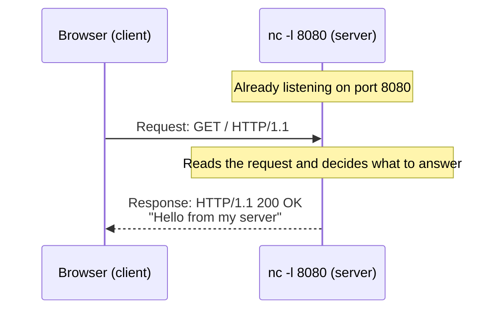

import Term from '~/components/Term.astro';
import TryIt from '~/components/TryIt.astro';
import Analogy from '~/components/Analogy.astro';
import SelfCheck from '~/components/SelfCheck.astro';

## The problem

Imagine two programs that need to talk. One is on your laptop: your browser. The other is on a computer somewhere in the world and has the page you want to see.

Before there can be a conversation, they have to agree on something very basic: **who goes first**. If both wait for the other to speak, nothing happens. If both talk at the same time, nothing happens either.

The solution almost the whole internet uses is to hand out the roles in advance. One of the two programs waits, always available. The other starts the conversation whenever it needs something.

The one that starts is called the <Term id="client">client</Term>. The one that waits is the <Term id="server">server</Term>. That asymmetry, where one asks and the other waits and answers, is the **client-server model**. It's the foundation of everything you'll build in this course.

## The analogy

<Analogy>

Think of a shop with a counter. The shop opens at a known address and waits. It doesn't know who will come in or when. Customers arrive, ask for something at the counter and leave with what they asked for. The shop never goes out into the street looking for anyone: its job is to be open and serve.

A server works the same way. It's “open” at an address, it waits, and when a client arrives with a request, it answers.

- A shop serves a few customers at a time. A server can serve thousands at once.
- The shop assistant might remember you next time you come in. A web server, by default, doesn't: every request arrives as if it were the first. For it to “remember” you, you need an extra mechanism, cookies, which you'll see in Phase 2.
- A shop is always a shop. A program, on the other hand, can be a server and a client at the same time. A website's backend, which you saw in lesson 1, serves requests from its frontend and, to answer them, acts as a client itself: it asks a database or a payment service for data.

</Analogy>

## How it really works

### Client and server are roles, not machines

When someone says “the server”, we tend to picture a cabinet full of blinking lights in a data center. But the word describes a role in a conversation, not a kind of computer.

A server is a program. By extension, we also call the computer it runs on a server, which is why the two ideas get mixed up. What turns a program into a server is one thing only: **it's listening**.

### What “listening” means

When you start a program, the operating system creates a <Term id="process">process</Term>: the running program, with its own memory and space. A server program does one more thing when it starts. It asks the operating system: “whatever arrives at this number, hand it to me”.

That number is the <Term id="port">port</Term>. A web server usually listens on port 80, or on 443 if it uses HTTPS. You'll see ports in depth in lesson 5. For now, this idea is enough: the computer has an address, and each listening program has its port.

A listening program does nothing until someone arrives. It just waits, sometimes for days.

### Request and response

When the client needs something, it connects to the server's address and port and sends it a <Term id="request">request</Term>: a message saying what it wants. The server reads it, decides what to answer and sends back a <Term id="response">response</Term>.

That round trip is the basic unit of almost everything that happens on the web. And notice the order: **the client always goes first**. The server can't answer someone who hasn't asked.

### Client and server on the same computer

Nothing forces the client and the server to be on different machines. When you run a server on your laptop and open it in your browser, both are on the same computer.

There's a special name for that, <Term id="localhost">localhost</Term>, which always means “this computer”. `localhost:8080` means “the program listening on port 8080 of this same machine”. That's exactly what you're about to use.

## Try it

You'll use `nc` (netcat), a tool that comes installed on macOS and on most Linux distributions. `nc` does one very basic thing: it opens a connection and shows you whatever arrives through it. With the `-l` option (for *listen*), it becomes a server.

<TryIt
  title="1. Be the server"
  cmd="nc -l 8080"
  output={`GET / HTTP/1.1
Host: localhost:8080
Connection: keep-alive
Upgrade-Insecure-Requests: 1
User-Agent: Mozilla/5.0 (Macintosh; Intel Mac OS X 10_15_7) AppleWebKit/537.36 (KHTML, like Gecko) Chrome/154.0.0.0 Safari/537.36
Accept: text/html,application/xhtml+xml,application/xml;q=0.9,image/avif,image/webp,image/apng,*/*;q=0.8,application/signed-exchange;v=b3;q=0.7
Accept-Encoding: gzip, deflate, br, zstd
Accept-Language: en-GB,en-US;q=0.9,en;q=0.8`}
>

When you run it, the terminal goes quiet: `nc` is listening on port 8080. Now open your browser and go to `http://localhost:8080`.

If on Linux `nc -l 8080` exits right away with an error, try `nc -l -p 8080`: some versions of netcat expect the port after `-p`.

The request your browser just sent will appear in the terminal. It's plain text. The first line says what it wants: `GET /`, that is, “give me the home page”. The following lines, called **headers**, add details: which server it's for (`Host`), which browser you are (`User-Agent`) or which formats you understand (`Accept`).

Your browser will send similar headers, but not identical ones: your values will be different, and we've removed a few that start with `sec-` to make it easier to read.

Meanwhile, the browser keeps loading. It has sent its request and is waiting for a response nobody has given it. Leave the terminal as it is and move on to the next step.

</TryIt>

Now it's your turn to answer. With `nc` still open and the browser still loading, click on the terminal and type these four lines. They aren't commands: they're the text of your response.

<TryIt
  title="2. Answer by hand"
  lang="http"
  cmd={`HTTP/1.1 200 OK
Content-Type: text/plain; charset=utf-8

Hello from my server`}
  output="Hello from my server"
>

Press Enter at the end of each line. The third one is empty on purpose: it separates the headers from the content.

Then press <kbd>Ctrl</kbd> + <kbd>C</kbd>. That closes `nc` and, with it, the connection. The browser understands that the response is complete and shows “Hello from my server” on screen.

You've just done, by hand, the job of a web server: receive a request and send back a response in the format the browser expects. That format is called HTTP, and you'll study it in depth in Phase 2.

</TryIt>

Your browser isn't the only possible client. `curl` is a client you use from the terminal. Start `nc -l 8080` again in one terminal and, in another terminal window, run:

<TryIt
  title="3. Another client: curl"
  cmd="curl -v http://localhost:8080"
  output={`* Host localhost:8080 was resolved.
* IPv6: ::1
* IPv4: 127.0.0.1
*   Trying [::1]:8080...
* connect to ::1 port 8080 from ::1 port 58624 failed: Connection refused
*   Trying 127.0.0.1:8080...
* Connected to localhost (127.0.0.1) port 8080
> GET / HTTP/1.1
> Host: localhost:8080
> User-Agent: curl/8.7.1
> Accept: */*
>
* Request completely sent off`}
>

The lines starting with `>` are the request `curl` sends. It has the same structure as the browser's, but only three headers: `Host`, `User-Agent` and `Accept`. The last line, a `>` with nothing else, is the empty line that ends the request: the same one you typed in the previous exercise to separate the headers from the content. In the `nc` terminal you'll see those same lines, without the `>`.

The lines starting with `*` are `curl` telling you what it's doing. If you see “Connection refused”, like here, it means `curl` first tried localhost's IPv6 address (`::1`), where nobody was listening, and then the IPv4 one (`127.0.0.1`), where `nc` was. Depending on your system you may not see it, and that's fine. You'll fully understand it in lesson 5. For now, remember that “connection refused” means “nobody is listening there”. The port number on that line will be different on your computer.

`curl` also waits for the response. To finish, press <kbd>Ctrl</kbd> + <kbd>C</kbd> in both terminals.

</TryIt>

## You have already seen it

You've been using this model for years, from the client side:

- When you open a website or refresh an app, your browser or the app is the client. If the tab keeps loading, it's waiting for the response.
- Even your home router acts as a server: type `192.168.1.1` in your browser and it usually answers with its settings page.

And if you code:

- Every `fetch('/api/users')` in your frontend is a request, and your code is the client.
- In DevTools, in the *Network* tab, click a request and, under *Headers*, turn on *Raw* in the *Request Headers* section. Try it with your development server (`localhost:5173`): you'll see the same kind of text `nc` showed you. On real websites that use HTTP/2 you'll see some lines starting with `:`, like `:method` or `:authority`. It's the same information in a different format, and you'll see it in Phase 2.
- When you run `npm run dev` and Vite says `Local: http://localhost:5173/`, you've started a server: a process listening on port 5173 of your machine. You've been running servers for a while without calling them that.

## Common mistakes

- **“A server is a big computer in a data center.”** A server is a program that listens. Your laptop running `nc -l 8080` is a server, even if a very humble one.
- **“The server can send me things whenever it wants.”** In the classic model, the server only answers: if nobody asks, it sends nothing. There are techniques that let the server send data without being asked, like WebSockets or Server-Sent Events, and you'll see them in Phase 4. Even with those, the client takes the first step.
- **“The frontend is the client and the backend is the server, always.”** A website's backend is a server for its frontend, but it's also a client every time it queries the database or calls another API. Being a client or a server depends on the conversation, not on the program.

## Summary

- Client and server are roles in a conversation, not kinds of machine.
- A server is a process listening on a port, waiting for requests.
- The client always starts: it sends a request and the server sends back a response.
- The same program can be a server in one conversation and a client in another.

## Did you get it?

<SelfCheck question="An online store's backend receives a request from its frontend and, to answer it, calls the Stripe API. Is that backend a client or a server?">

Both. It's a server for its frontend, because it waits for its requests and answers them. And it's a client of Stripe, because it's the one starting that request. Being a client or a server is a role in a conversation, not a property of the program.

</SelfCheck>

<SelfCheck question="When you run nc -l 8080 and open localhost:8080, the browser keeps loading. Why?">

Because the browser has already sent its request and is waiting for the response. `nc` only shows what it receives; until you answer, or stop it with <kbd>Ctrl</kbd> + <kbd>C</kbd>, the browser keeps waiting.

</SelfCheck>

<SelfCheck question="What does a program need, at the very least, to be a server?">

To listen, that is, to ask the operating system to receive the connections that arrive at a port, and to answer whatever arrives. You don't need a special machine or a complicated program.

</SelfCheck>

## Further reading

- [Client-server overview](https://developer.mozilla.org/en-US/docs/Learn_web_development/Extensions/Server-side/First_steps/Client-Server_overview) (MDN): the same model, seen from a dynamic website, with examples of real requests and responses.
- [An overview of HTTP](https://developer.mozilla.org/en-US/docs/Web/HTTP/Guides/Overview) (MDN): a first look at the protocol you just spoke by hand. You'll study it in depth in Phase 2.
