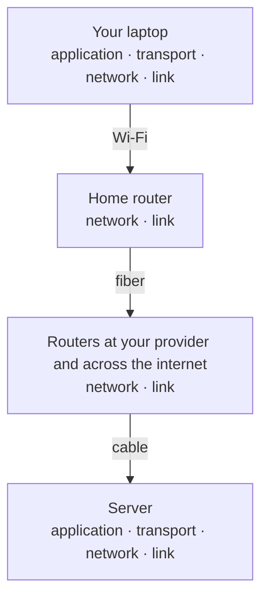

import Term from '~/components/Term.astro';
import TryIt from '~/components/TryIt.astro';
import Analogy from '~/components/Analogy.astro';
import SelfCheck from '~/components/SelfCheck.astro';
import Encapsulation from '~/components/diagrams/Encapsulation.astro';

## The problem

In the previous lesson you wrote an HTTP request and `nc` “sent” it to example.com. But think about everything that has to happen for a few lines of text to leave your laptop and reach a server that might be in another country:

- The destination computer has to be found among billions.
- The data has to cross many different networks: your home network, your internet provider's and any others along the way.
- The data has to be split into pieces, and every piece has to arrive, in order, even if some get lost.
- Each piece has to be delivered to the right program on that computer.
- And it all has to be turned into signals that travel through the air over Wi-Fi, along a cable or through fiber optics.

If HTTP had to solve all of that, so would DNS, SSH, email and any new protocol. Each one would repeat the same work, and switching from Wi-Fi to a cable would mean rewriting them all.

The solution is to split the problem into **<Term id="layer">layers</Term>**. Each layer solves a single part, uses the services of the layer below and offers its own to the layer above. HTTP only cares about what the programs say. Other layers take care of the rest.

## The analogy

<Analogy>

Think about sending a letter by mail. You write the letter: the content is up to you. You put it in an envelope with the person's name and address. The postal service reads the address and takes the letter to the post office in the right city, and from there to the right street and building. Along the way it travels by truck, train or plane, and you don't know or care which ones.

Each part of the system does its job without looking at anyone else's. The mail carrier doesn't need to read your letter. You don't choose the truck. And if tomorrow the postal service swaps its trucks for drones, your letter stays the same.

The internet's layers work like this: your message goes inside an envelope, which goes inside another envelope, and each layer only reads its own. The letter is your HTTP message, the name is the port, the address is the IP and the trucks are the link layer.

- With mail, the address is written once. On the internet, each layer adds its own label, and the lowest layer's label is replaced with a new one at every hop along the way, as if each truck put on its own outer envelope.
- A letter travels whole. Your data travels split into many packets that may take different routes and arrive out of order. Putting them back in order is the job of one of the layers, as you'll see in lesson 6.
- Mail takes days. All of this happens in milliseconds, and your operating system does almost all of it without your browser even noticing.
- A letter goes in a sealed envelope. An unencrypted HTTP message (`http://`) is more like a postcard: nobody along the way needs to read it, but anyone could. That's what TLS is for, and you'll see it in lesson 8.

</Analogy>

## How it really works

### The four layers of TCP/IP

The model the internet uses is called **TCP/IP**, after its two most important protocols. It has four layers:

| Layer | What it solves | Protocols | Who handles it |
|---|---|---|---|
| **Application** | What the programs say to each other | HTTP, <Term id="dns">DNS</Term>, SSH, SMTP | The program (the browser, `curl`…) or a library (ready-made code) |
| **Transport** | Which program each piece of data is for and, with TCP, that it arrives complete and in order | <Term id="tcp">TCP</Term>, UDP | The operating system |
| **Network** (or Internet) | How each piece gets from one computer to another, across networks | IP | The operating system and the routers along the way |
| **Link** | How the bits travel to the next device along the way | Ethernet, Wi-Fi | The network card and its driver |

Look at the last column. When your browser requests a page, it works almost entirely at the application layer. The operating system takes care of transport and network, almost always, and the hardware takes care of the link. That's why it's possible to build an entire website without knowing any of this. And that's also why, when something fails down below, it's so hard to understand what's going on.

Each layer talks to **the same layer on the other side**. Your HTTP talks to the server's HTTP; your TCP, to its TCP. But none of them does it directly: each one hands its data to the layer below, and the message only really travels through the lowest layer.

### Envelopes inside envelopes: encapsulation

When you send a message, it goes down through the layers, and each one wraps it with its own <Term id="header">header</Term>: a few bytes at the start with the information that layer needs to do its job. They aren't lines of text like HTTP's headers, but binary fields. This is called <Term id="encapsulation">encapsulation</Term>:

<Encapsulation
  caption="When sending, the message goes down from top to bottom and each layer adds its header (the colored blocks). The link layer also adds a trailer at the end to detect transmission errors. When receiving, it works the other way around: each layer removes its header and hands what's inside to the layer above. The HTTP message doesn't change along the whole way (with http://; with HTTPS it travels encrypted, as you'll see below)."
  layers={{
    application: 'Application · message',
    transport: 'Transport · segment',
    network: 'Network · packet',
    link: 'Link · frame',
  }}
  blocks={{
    data: 'HTTP message',
    transportHeader: 'TCP',
    networkHeader: 'IP',
    linkHeader: 'Ethernet',
    linkTrailer: 'Trailer',
  }}
/>

This is what each header carries:

- **TCP** records the source and destination ports (which program it's for) and some numbers to put the pieces in order.
- **IP** records the source and destination <Term id="ip-address">IP addresses</Term> (which computer it's for).
- **Ethernet or Wi-Fi** records the source <Term id="mac-address">MAC address</Term> (yours) and the address of the next device along the way, usually your router.

Each header also says what's inside, so whoever receives it knows which layer to hand it to.

Each layer has its own name for what it handles: **message** in the application layer, **segment** in TCP, <Term id="packet">packet</Term> in IP and **frame** in the link layer. You'll see these words often, and now you know they're essentially the same data with more or fewer envelopes around it. With one nuance: if the message is large, TCP splits it up and each segment carries only one part. With UDP, the unit is called a datagram. And in practice, many people say “packet” for everything.

### The journey, hop by hop

Between your laptop and the server there are several <Term id="router">routers</Term>, and each stretch between two of them is a hop. A router only needs to go up to the network layer. It receives the frame, removes the link envelope, reads the destination IP address, decides where to forward the packet and wraps it again in a new link envelope for the next stretch.

The transport and application layers only exist at the two ends. The routers along the way don't need to open your TCP segment or read your HTTP message. Your home router is a partial exception, because it also does something called NAT that does touch addresses and ports. You'll see it in lesson 5.

### The OSI model, as a reference

In the 1980s, at the same time as TCP/IP, the ISO designed another model, **OSI** (*Open Systems Interconnection*), with seven layers. Its protocols lost out to TCP/IP's, but its vocabulary lives on, which is why it's worth knowing how to translate it:

| OSI | Name | In TCP/IP | Examples |
|---|---|---|---|
| 7 | Application | Application | HTTP, DNS |
| 6 | Presentation | Application | Data formats and encoding |
| 5 | Session | Application | Keeping a conversation open |
| 4 | Transport | Transport | TCP, UDP |
| 3 | Network | Network | IP |
| 2 | Data link | Link | Ethernet, Wi-Fi |
| 1 | Physical | Link | Cables, fiber, radio waves |

When someone says “layer 7”, they mean the application layer (HTTP), and “layer 4” is transport (TCP). You'll hear it, for example, when we talk about load balancers in Phase 9. A “layer 4” load balancer distributes connections looking only at IPs and ports, and a “layer 7” one can look at the URL or the HTTP headers. Some protocols, like <Term id="tls">TLS</Term>, don't fit neatly into any layer: they're usually placed between transport and application.

## Try it

`curl -v` shows you what it does at each step, and you can recognize the layers in its output. The `-s` option removes the progress bar, and `-o /dev/null` throws away the page content so it doesn't bury what we're interested in.

<TryIt
  title="1. The layers in curl's output"
  cmd="curl -sv http://example.com -o /dev/null"
  output={`* Host example.com:80 was resolved.
* IPv6: 2606:4700:10::6814:179a, 2606:4700:10::ac42:93f3
* IPv4: 172.66.147.243, 104.20.23.154
*   Trying [2606:4700:10::6814:179a]:80...
* Connected to example.com (2606:4700:10::6814:179a) port 80
> GET / HTTP/1.1
> Host: example.com
> User-Agent: curl/8.7.1
> Accept: */*
>
* Request completely sent off
< HTTP/1.1 200 OK
< Date: Fri, 02 Oct 2026 18:15:37 GMT
< Content-Type: text/html; charset=utf-8
< Connection: keep-alive
< Server: cloudflare
…
<
{ [589 bytes data]
* Connection #0 to host example.com left intact`}
>

Go through the output from top to bottom:

- **`was resolved` and the IPv6/IPv4 lines.** Before anything else, `curl` used another application protocol, DNS, to translate `example.com` into IP addresses. You'll see it in lesson 7.
- **`Trying [2606:…]:80`.** Two layers show up here at once: the destination IP address (network; in this case, an IPv6 address) and port 80 (transport).
- **`Connected to example.com … port 80`.** The TCP connection is open: from here on, the transport layer makes sure that whatever `curl` sends arrives complete and in order. You'll see how a connection is opened in lesson 6.
- **The lines with `>` and `<`.** The application layer: the same HTTP request you wrote by hand in the previous lesson, and its response. We've trimmed some headers.
- **`{ [589 bytes data]`.** The page content, which `curl` received and threw away into `/dev/null`. The `{` marks what comes in, and the `}`, what goes out.
- **`Connection #0 … left intact`.** `curl` doesn't close the connection, in case you ask it for more URLs in the same command: it's the `keep-alive` from the previous lesson. When `curl` exits, the operating system closes it.

What about the link layer? It doesn't show up, because `curl` can't see it. Your operating system and your network card handle it. Your addresses and dates will be different, and your `curl` may connect over IPv4 instead of IPv6.

</TryIt>

Now request the same page over HTTPS. Something new appears between the TCP connection and the HTTP request:

<TryIt
  title="2. One more layer: TLS"
  cmd="curl -sv https://example.com -o /dev/null"
  output={`* Connected to example.com (2606:4700:10::6814:179a) port 443
* ALPN: curl offers h2,http/1.1
* (304) (OUT), TLS handshake, Client hello (1):
…
* (304) (IN), TLS handshake, Server hello (2):
…
* (304) (OUT), TLS handshake, Finished (20):
* SSL connection using TLSv1.3 / AEAD-CHACHA20-POLY1305-SHA256 / [blank] / UNDEF
* ALPN: server accepted h2
…
* using HTTP/2
* [HTTP/2] [1] [:method: GET]
* [HTTP/2] [1] [:scheme: https]
* [HTTP/2] [1] [:authority: example.com]
* [HTTP/2] [1] [:path: /]`}
>

This time the port is 443, the one for HTTPS. Right after `Connected` there's an exchange of `TLS handshake` messages: the client and the server agree on how to encrypt the connection before sending anything HTTP. That's TLS, the extra layer that sits on top of TCP and below HTTP. You'll see it in depth in lesson 8.

Also notice the `ALPN` lines: during that negotiation, `curl` and the server agree to speak HTTP/2 (`h2`). From then on, the request travels in binary. The `[HTTP/2]` lines show the fields that go inside it, like the pseudo-headers `:method` or `:path`, which do the job of HTTP/1.1's first line (`GET /`). Further down you'll also see `> GET / HTTP/2`: that's `curl` showing you the same request in the familiar format so you can read it, not what actually travels over the network.

We've trimmed part of the output. The `(304)` in the TLS lines is the code for TLS version 1.3; on Linux you'll see `TLSv1.3` instead.

</TryIt>

The link layer didn't show up in `curl`, but you can see its address. Your computer has an address in each of the two bottom layers:

<TryIt
  title="3. Two layers, two addresses"
  cmd="ifconfig en0 | grep -E 'ether|inet '"
  output={`	ether 3a:7f:c2:19:5e:d4
	inet 192.168.1.133 netmask 0xffffff00 broadcast 192.168.1.255`}
>

`ifconfig en0` shows the configuration of a network connection (on a laptop, `en0` is usually Wi-Fi), and `grep` keeps only the two lines we're interested in. The vertical bar `|` passes the output of one command to the next; you'll see it in Phase 1.

- **`ether`** is your MAC address, the one for the **link layer**. It identifies your network card within your local network. Your router uses it to deliver frames to you, but it never leaves your home. On Wi-Fi, macOS may show you a private address it generates for each network, instead of the factory one.
- **`inet`** is your IP address, the one for the **network layer**. It's the address packets use to reach your computer. Starting with `192.168.` means it's a private address, the kind that only exists inside your network; so are the ones starting with `10.` and the ones from `172.16.` to `172.31.`. You'll see why they exist, and how you reach the internet with one, in lesson 5.

We've replaced the MAC address with an example one, and your values will be different. If the `inet` line doesn't appear, try `en1`, or check which connection you're using with `route get default | grep interface`. On Linux, the equivalent command is `ip addr show`: look for the `link/ether` and `inet` lines.

</TryIt>

## You have already seen it

**When a website won't load, Chrome's errors can be read layer by layer:**

- `ERR_INTERNET_DISCONNECTED` (the dinosaur page): your operating system says there's no active network connection. Usually it's the link layer that's failing (Wi-Fi turned off or the cable unplugged). If your Wi-Fi works but your router can't reach the internet, you'll see other errors.
- `ERR_NAME_NOT_RESOLVED`: DNS couldn't find the address for the name (application layer).
- `ERR_CONNECTION_REFUSED`: the destination computer responds, but nobody is listening on that port. That's the transport layer. It's what you saw with `curl` in lesson 2.
- **A `404`:** every layer worked, and the server replied, in HTTP, that what you asked for doesn't exist.

**If you want to see it from the inside, open DevTools**, Chrome's developer tools: <kbd>F12</kbd>, or <kbd>Cmd</kbd> + <kbd>Option</kbd> + <kbd>I</kbd> on a Mac. In *Network*, reload the page, click a request and open *Timing*. You'll see the request broken down into phases, and each phase is one of the layers or protocols you've just seen:

| In DevTools | What it is |
|---|---|
| *DNS Lookup* | DNS translates the name into an IP (application) |
| *Initial connection* | Opening the TCP connection (transport). With HTTPS it also includes the TLS handshake |
| *SSL* | The part of *Initial connection* taken up by TLS |
| *Request sent* | Sending the HTTP request |
| *Waiting for server response* | Waiting for the first byte of the response: the round trip over the network plus the time the server takes |
| *Content Download* | Receiving the rest of the response |

If the connection is reused, you won't see *DNS Lookup*, *Initial connection* or *SSL*: they were already done.

And if you code:

- `ERR_CONNECTION_REFUSED` is also what you see in the console when your frontend calls `localhost:3000` and the backend isn't running.
- A `fetch` in your code only touches the application layer.

## Common mistakes

- **“TCP/IP is a protocol.”** It's a family of protocols that work together, and the model that organizes them. It's named after its two main protocols, TCP and IP.
- **“You have to memorize the seven OSI layers.”** The internet runs on TCP/IP. For OSI, it's enough to know how to translate the numbers, especially “layer 7” and “layer 4”, because people still use them to talk about networks.
- **“Routers read my HTTP request.”** They don't need to: they only look as far as the network layer. But be careful: if the request goes unencrypted (`http://`), anyone along the way could open the envelopes and read it. That's what TLS prevents, and you'll see it in lesson 8.

## Summary

- The internet splits the problem into layers: application, transport, network and link. Each one solves a single part and relies on the one below.
- When sending, each layer wraps the message in its header (encapsulation). When receiving, each layer removes its own.
- A program like your browser works almost entirely at the application layer. The operating system and the hardware do almost all the rest.
- The routers along the way only go up to the network layer. Transport and application live at the ends.
- OSI is a seven-layer model that today serves mostly as vocabulary (“layer 4”, “layer 7”).

## Did you get it?

<SelfCheck question="Chrome shows you ERR_CONNECTION_REFUSED. Which layer is the problem in?">

The transport layer. Your connection attempt reached the destination computer, so the network works, but no program is listening on that port and its operating system rejects the connection. Your HTTP request never even gets sent: without a TCP connection, there's nothing to send it through. It's the same thing you saw in lesson 2, when `curl` tried an address where `nc` wasn't listening.

</SelfCheck>

<SelfCheck question="If a new, faster kind of cable were invented tomorrow, would HTTP need to change to use it?">

No. Only the link layer would change. HTTP, TCP and IP would stay the same, because each layer only depends on the service the layer below provides, not on how it provides it. That's exactly the advantage of splitting the work into layers.

</SelfCheck>

<SelfCheck question="Does one of your internet provider's routers need to understand HTTP to get your request where it's going?">

No. It only reads the IP header to decide where to forward the packet. Your HTTP message travels inside, and the router never opens it. That also means that, if it's unencrypted, nothing stops someone along the way from reading it, and that's why HTTPS exists.

</SelfCheck>

## Further reading

- [What is the OSI model?](https://www.cloudflare.com/learning/ddos/glossary/open-systems-interconnection-model-osi/) (Cloudflare Learning): the seven layers, with examples of what happens in each one.
- [TCP](https://developer.mozilla.org/en-US/docs/Glossary/TCP) (MDN glossary): the short definition of the transport protocol you'll study in depth in lesson 6.
- [RFC 1122](https://www.rfc-editor.org/rfc/rfc1122.html): the document that describes the TCP/IP layers as used by the computers connected to the internet. For the curious.
