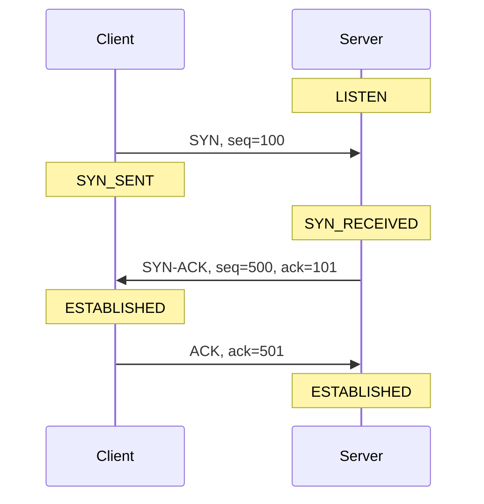

import Term from '~/components/Term.astro';
import TryIt from '~/components/TryIt.astro';
import Analogy from '~/components/Analogy.astro';
import SelfCheck from '~/components/SelfCheck.astro';
import TcpHandshake from '~/playgrounds/tcp-handshake/TcpHandshake';

## The problem

In lesson 4 you saw that IP carries each <Term id="packet">packet</Term> from router to router until it reaches its destination. What you didn't see is that IP promises nothing. A router that receives more packets than it can forward drops some, because its queue is full. Interference on the Wi-Fi corrupts others, which get thrown away when they arrive. Some arrive out of order, because they took different paths. And nobody tells the sender.

Yet when you load a website, the HTML (the file that describes the page) arrives whole and in order. If a single byte of a JavaScript file (the code the browser runs on the page) were missing, the page would break. Someone has to fix this, and the transport layer has two options:

- **<Term id="tcp">TCP</Term>** takes care of everything: it numbers the data, acknowledges what it receives and resends what gets lost. It pays for it in time.
- **<Term id="udp">UDP</Term>** fixes nothing: it sends and forgets. For some applications, that's exactly what they want.

## The analogy

<Analogy>

TCP is like an important phone call. Before you start, you both make sure you can hear each other: “Can you hear me?” “Yes, I can hear you. Can you hear me?” “Yes.” During the call, when someone reads you an account number, you repeat each chunk back to confirm it (“four, five, six, right?”), and if something wasn't heard, it gets repeated. In the end, you have the whole number, in order.

UDP is like sending postcards. You write them, drop them in the mailbox and forget about them. You don't know whether they arrived, or in what order, and the recipient doesn't tell you anything.

- On a call, you both hear each other live. In TCP, the sender knows nothing until an acknowledgment with a number reaches it.
- On a call, you repeat whatever the other person asks for. In TCP, the receiver doesn't ask for what's missing: it only repeats up to where it has received everything, and the sender resends on its own when too much time goes by without an acknowledgment.
- The call confirms sentences. TCP acknowledges bytes: it doesn't know where each message from the program using it starts or ends.

</Analogy>

## How it really works

### A connection starts with a handshake

TCP is a **connection-oriented** protocol. Before sending any data, the two ends set up the conversation: each one's operating system stores in the <Term id="socket">socket</Term> where things stand. A connection isn't a cable: it's what the two ends remember.

To open it, the client and the server exchange three messages, the <Term id="handshake">handshake</Term>. At each step you can see the TCP state of each end:

- **SYN** (“synchronize”): the client asks for the connection and says which number it will start counting its bytes from, its initial sequence number.
- **SYN-ACK:** the server acknowledges that number and gives its own.
- **ACK:** the client acknowledges the server's number.

Why three? Each side picks its number, and the other side has to acknowledge it. That's four things: the client's number, its acknowledgment, the server's number and its acknowledgment. The server sends the two in the middle together in the SYN-ACK, so that leaves three messages.

In reality, those initial numbers are random, so that nobody on the outside can guess them and slip fake <Term id="segment">segments</Term> into someone else's connection. Here we use 100 and 500 to keep them readable.

The handshake has a cost: one round trip before the first byte of data goes out. If a round trip to the server takes 100 ms, your HTTP request leaves 100 ms later.

### Sequence numbers and ACKs

Once the connection is open, TCP numbers every byte it sends. Each segment carries the <Term id="sequence-number">sequence number</Term> of its first byte (`seq`), and each acknowledgment, called an <Term id="ack">ACK</Term>, gives the **next byte its sender expects** (`ack`).

The SYN uses up one sequence number, as if it were a byte, so the client's data starts at 101. If the client sends “Hi, ”, “how are ” and “you?” in three segments:

| Segment | `seq` | Bytes | The server replies |
|---|---|---|---|
| “Hi, ” | 101 | 4 | `ack=105` |
| “how are ” | 105 | 8 | `ack=113` |
| “you?” | 113 | 4 | `ack=117` |

Each `ack` is the `seq` plus the bytes received. And the ACK is **cumulative**: `ack=117` acknowledges everything before byte 117 at once. If an ACK in the middle gets lost, the next one covers it.

Notice that TCP counts bytes, not messages. To TCP, whatever a program sends is one continuous stream of bytes. That's why HTTP needs the `Content-Length` header you saw in lesson 3: it's one of the two ways to know where the response ends (the other is `chunked`).

### When something gets lost

The sender keeps a copy of each segment until it's acknowledged, and starts a timer. If the timer expires without an acknowledgment, it makes a <Term id="retransmission">retransmission</Term>: it resends the oldest unacknowledged segment.

The receiver doesn't hand just anything to the application, either. If “you?” (`seq=113`) arrives but “how are ” (`seq=105`) doesn't, it holds on to “you?” without delivering it and repeats `ack=105`, as if saying “I'm still waiting for byte 105”. When “how are ” finally arrives, it delivers both together and replies `ack=117`.

This way, the program receiving the data always reads the bytes complete and in order. The price is that a single lost segment holds up everything behind it until it's recovered. This is called *head-of-line blocking*.

The timer starts at around one second and adjusts to how long the network actually takes. If the segment gets lost again, the wait doubles, and after several attempts TCP gives up and treats the connection as broken.

TCP does two more things that this lab leaves out:
- **Flow control:** the receiver says how much room it has left, so the sender doesn't overwhelm it.
- **Congestion control:** when packets get lost, the sender slows down, because losses usually mean overloaded routers.

### UDP: send and forget

UDP adds the bare minimum to IP: the source and destination ports, the length and a *checksum* to throw away corrupted data. Its header takes up 8 bytes; TCP's takes at least 20.

There's no connection, no handshake, no sequence numbers, no ACKs, no retransmissions and no ordering. Each send is an independent <Term id="datagram">datagram</Term>, which arrives whole or not at all.

Why would anyone want that?
- **No waiting for the handshake:** the first datagram already carries data.
- **No head-of-line blocking.** In a video call, a chunk of audio that arrives late is useless: better to skip it than to freeze everything else while waiting for it.
- **The application decides what to recover,** and how.

### When to use each one

| Use | Transport | Why |
|---|---|---|
| Websites and APIs (the services that give apps their data) over HTTP/1.1 or HTTP/2 | TCP | Every byte of the HTML or the JSON data counts |
| SSH, databases, email | TCP | Nothing can go missing or arrive out of order |
| DNS | UDP, almost always | A short question and a short answer; if one gets lost, you ask again (lesson 7) |
| Video calls and online games | UDP | Data that arrives late is useless |
| HTTP/3 | QUIC, over UDP | Rebuilds reliability on its own, without TCP's head-of-line blocking |

HTTP/3 is the odd one out: it needs reliability, like any website, but it runs over UDP. With HTTP/2, the browser requests many resources at once over a single TCP connection, so one lost segment holds all of them up. QUIC, the protocol underneath HTTP/3, numbers, acknowledges and resends each resource separately: a loss only delays its own resource.

## Try it

Start with the lab. Go through it once without losing anything, and notice how each `ack` is the `seq` plus the bytes. Then press “Reset” and, when the client sends its data, lose the second data segment, “how are ” (row 5). Watch the “Server application” panel as you go. Finally, switch to UDP and lose the same one.

The lab simplifies four things. The network loses packets, but it never reorders them. The timer expires when you press the button and nothing is left in transit, not after some time has passed. The server acknowledges every segment (in reality, it often acknowledges every other one). And ACKs without data don't show their `seq`, even though they carry one.

<TcpHandshake client:visible lang="en" />

Now let's try it with two real programs. Open two terminals and set up a chat over TCP, like the `nc` server and client from lesson 5:

<TryIt
  title="1. A chat over TCP"
  cmd={`nc -l 8080`}
>

In the other terminal, connect with `nc localhost 8080`. Type a line in either one and press Enter: it shows up in the other. Both directions travel over the same TCP connection, opened with a handshake as soon as you started the client. When you're done, press <kbd>Ctrl</kbd> + <kbd>C</kbd> in both.

</TryIt>

Now do it again with UDP. The `-u` option tells `nc` to use UDP:

<TryIt
  title="2. A chat over UDP"
  cmd={`nc -u -l 8080`}
>

In the other terminal, use `nc -u 127.0.0.1 8080` and type something. It reaches the server without a handshake. The server can only reply after it receives your first datagram, because until then it doesn't know who to reply to.

Since UDP has no connection, the client doesn't exit on its own: stop it with <kbd>Ctrl</kbd> + <kbd>C</kbd>. Then start another one with `localhost` instead of `127.0.0.1` and type something. Nothing arrives, and nobody complains. `localhost` goes to `::1`, the IPv6 address, first, and this `nc` only listens on IPv4 (you saw this in lesson 5). In exercise 1 it worked because the TCP attempt on `::1` ended in a refusal, so `nc` then tried `127.0.0.1`. With UDP there's no handshake to fail: `nc` sticks with `::1`, and the datagram gets lost without a sound.

When you're done, press <kbd>Ctrl</kbd> + <kbd>C</kbd> in both terminals.

</TryIt>

Finally, ask whether anyone is on the other end:

<TryIt
  title="3. Is anyone listening?"
  cmd={`nc -vz example.com 443\nnc -vz 127.0.0.1 9\nnc -vz -G 5 1.1.1.1 81\nnc -vzu 127.0.0.1 9`}
  output={`Connection to example.com port 443 [tcp/https] succeeded!
nc: connectx to 127.0.0.1 port 9 (tcp) failed: Connection refused
nc: connectx to 1.1.1.1 port 81 (tcp) failed: Operation timed out
Connection to 127.0.0.1 port 9 [udp/discard] succeeded!`}
>

`-z` tells `nc` not to send any data: with TCP, it opens the connection and closes it. `-v` makes it report the result. The first three lines are TCP, and they're the three most common ways a handshake can end:

- **`succeeded`:** the handshake completed. There's a web server on port 443 of example.com.
- **`Connection refused`:** your computer answers the SYN with a rejection segment (RST), because nobody is listening on port 9. It's the immediate answer you saw in lesson 2.
- **`Operation timed out`:** nobody answers. 1.1.1.1, Cloudflare's public DNS, silently drops the SYNs that reach its port 81, as many *firewalls* do (the filters that decide which traffic gets through). Your operating system resends the SYN, as in the lab, until the time limit set by `-G 5` runs out: five seconds. On Linux, the option is `-w 5`.

The fourth line is UDP, and it says `succeeded` even though nobody is listening on that port. That's not true. With no handshake, `nc` sends four one-byte test datagrams (an `X` each) and, since no error comes back, it assumes the port is open. With UDP, silence can't tell “someone's there” apart from “nobody's there”.

</TryIt>

## You have already seen it

- **A video call that pixelates for a moment, instead of freezing,** runs over UDP: it doesn't wait for what gets lost.
- **`ERR_CONNECTION_REFUSED` and `ERR_CONNECTION_TIMED_OUT`,** on the browser's error page, are the second and third cases from exercise 3. `REFUSED` shows up right away, because someone answered with a rejection. `TIMED_OUT` takes a while, because nobody answered.

In DevTools (lesson 4):

- **_Initial connection_, in the _Timing_ tab,** is the handshake (plus the TLS one, if it's HTTPS). With a faraway server, that bar gets longer.
- **`h3` in the _Protocol_ column** (right-click the column headers to show it): that request went over HTTP/3, that is, over QUIC on top of UDP.

## Common mistakes

- **“UDP isn't reliable, so it's no good for anything serious.”** DNS, video calls and HTTP/3 run over UDP. UDP not guaranteeing anything doesn't mean the application can't guarantee it, in its own way and only when it needs to.
- **“If TCP acknowledges some data, the application has already processed it.”** An ACK only says that the receiver's operating system has those bytes. The program may not have read them yet, or it may crash right after. That's why an API confirms with its own response (a `201 Created`, for example): TCP saying the request arrived isn't enough. You'll see this in Phase 4.
- **“Every request does its own handshake.”** The browser reuses open connections (the `keep-alive` from lesson 3), and with HTTP/2 it makes many requests at once over the same connection. You pay for the handshake once per connection, and each connection serves many requests.

## Summary

- IP can lose, reorder and corrupt packets. TCP fixes that, and UDP doesn't.
- TCP opens a connection with a three-message handshake (SYN, SYN-ACK and ACK), in which each side gives its initial number and acknowledges the other's.
- `seq` numbers the first byte of each segment, and `ack` gives the next byte expected. The ACK acknowledges everything before it.
- If a segment gets lost, the timer expires and the segment is resent. The receiver holds on to whatever arrives out of order and delivers the bytes complete and in order.
- UDP sends standalone datagrams, with no connection and no acknowledgments. It's used by applications that care more about not waiting than about receiving everything, or that want to recover what's lost in their own way, like QUIC.

## Did you get it?

<SelfCheck question="The handshake ACK, the third message, gets lost. How does the server know the client received its initial number?">

From the client's first data segment. Every segment the client sends after the handshake carries `ack=501`, the acknowledgment of the server's number. As soon as one arrives, the server moves to `ESTABLISHED`, even if the handshake ACK never arrived. You can see it in the lab: lose the ACK in row 3 and keep going.

</SelfCheck>

<SelfCheck question="The server has replied ack=201. Now seq=251 arrives with 50 bytes and, after it, seq=201 with another 50. What ack does it send back for each one, and what does the application receive?">

For the first one, `ack=201` again: it's missing bytes 201 to 250, so it holds on to the ones that arrived without delivering them. For the second one, `ack=301`: with that gap filled, it has everything up to byte 300, and it delivers all 100 bytes to the application at once, in order.

</SelfCheck>

<SelfCheck question="With UDP, the client sends three datagrams and the second one gets lost. What does the server application receive, and who finds out about the loss?">

The application receives the first and the third, without the second. Nobody finds out: not the client, which doesn't expect acknowledgments, and not the server, which doesn't know anything was missing. If the application cares, it has to notice and recover on its own.

</SelfCheck>

## Further reading

- [What is the User Datagram Protocol (UDP)?](https://www.cloudflare.com/learning/ddos/glossary/user-datagram-protocol-udp/) (Cloudflare Learning): UDP, how it compares with TCP and what each one is used for.
- [RFC 768](https://www.rfc-editor.org/rfc/rfc768.html) and [RFC 9293](https://www.rfc-editor.org/rfc/rfc9293.html): the specifications of UDP and TCP. UDP's fits in three pages; TCP's runs to almost a hundred. That tells you the difference in complexity between the two.
