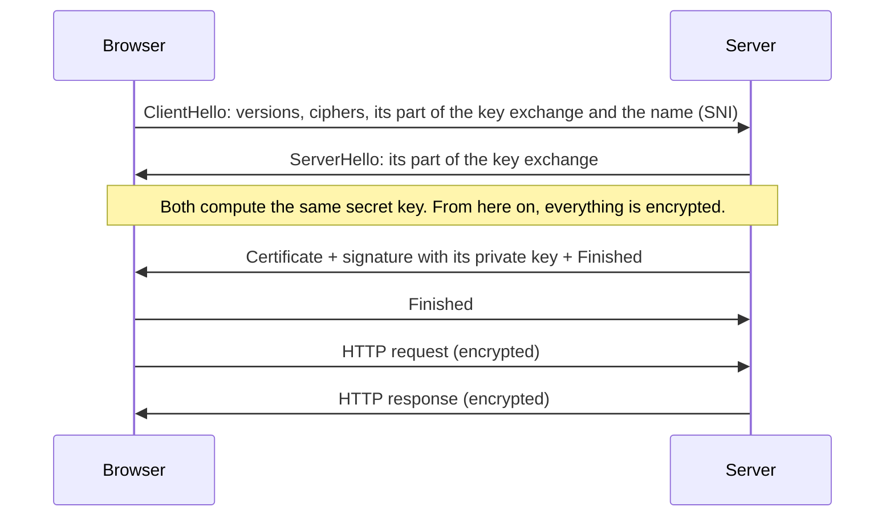

import Term from '~/components/Term.astro';
import TryIt from '~/components/TryIt.astro';
import Analogy from '~/components/Analogy.astro';
import SelfCheck from '~/components/SelfCheck.astro';
import CryptoKeys from '~/playgrounds/crypto-keys/CryptoKeys';

## The problem

In lesson 4 you saw that an unencrypted HTTP message is like a postcard: every router along the way could read it. On a coffee shop's Wi-Fi, anyone on the same network can try to see your traffic. And not just read it: change it too, for example to slip a script (code your browser runs) into the page you're downloading.

There's a third problem, one that's harder to spot. In lesson 7 you saw that your computer asks a resolver for the IP address of `yourbank.com` and trusts the answer. If someone manages to give you a fake IP address, you connect to their server thinking it's your bank's.

So you need three things:

- **Confidentiality:** nobody along the way can read the data.
- **Integrity:** nobody can change it without it being noticed.
- **Authenticity:** you know you're talking to the real server.

<Term id="tls">TLS</Term> (*Transport Layer Security*) gives you all three. And HTTP inside a TLS connection is <Term id="https">HTTPS</Term>.

## The analogy

<Analogy>

Imagine handing out open padlocks with your name on them in the street. Anyone can take one, put a message in a box and lock it with your padlock. But only you have the key that opens them. The padlocks are your <Term id="public-key">public key</Term>: it doesn't matter that everyone has one. The key is your <Term id="private-key">private key</Term>, and you never give it to anyone.

Now the other way around: you have a unique wax seal, and everyone has a photo of what its mark looks like. If you seal a letter, anyone can check that the seal is yours and that nobody has changed the letter. The seal doesn't hide the letter: anyone can read it. That's a <Term id="digital-signature">digital signature</Term>.

That leaves one question: is the photo of the seal you're shown really your bank's? That's what the <Term id="certificate">certificate</Term> is for. It works like a passport, where an authority everyone trusts (the government; here, a <Term id="certificate-authority">certificate authority</Term>) states “this seal belongs to yourbank.com”.

- A physical padlock can be forced open. Real keys can't: at today's key sizes, all the computers in existence working together would take longer than the age of the universe.
- In TLS 1.3, the server's padlocks don't encrypt anything. The shared secret key is agreed on with a different trick (the key exchange you'll see below), and the server only uses its seal, to prove who it is.
- A wax seal looks the same on every letter. A digital signature is computed from the message: change one letter and it's no longer valid.
- A passport lasts for years. A website certificate lasts a few months (example.com's, three), and on every connection the browser checks that it's still valid and that the name matches.

</Analogy>

## How it really works

### One key: symmetric encryption

The oldest way to <Term id="encryption">encrypt</Term> uses a single key, the same one to encrypt and to decrypt. Today we use algorithms like AES or ChaCha20, which are very fast: your phone encrypts hundreds of megabytes per second without breaking a sweat.

The ciphers TLS uses (they're called AEAD) also attach a tag to every chunk of data, computed with the key. If someone changes a single bit along the way, the tag doesn't match and the other end cuts the connection: that's where integrity comes from.

There's one catch: both ends need the same key. If your browser and the server have never met, how do they agree on a secret key over a network where anyone can listen? If they send it, anyone can copy it.

### Two keys: public-key cryptography

Public-key (or asymmetric) cryptography uses a pair of keys that go together: a public one and a private one. The two are mathematically related, but with today's computers it's infeasible to work out the private key from the public one. Depending on the algorithm, a key pair is used for one of these two things (that's why the playground generates two pairs):

- **To encrypt:** anyone encrypts with your public key, and only your private key decrypts it.
- **To sign:** you sign with your private key, and anyone checks the signature with your public key. If a single letter of the message changes, the signature is no longer valid.

It's much slower than symmetric encryption, and it can only encrypt small messages. That's why TLS doesn't use it for the data, but for what symmetric encryption can't do on its own: agree on the key and prove who the server is.

### How TLS combines them: the handshake

After the TCP <Term id="handshake">handshake</Term> from lesson 6, the browser and the server do another one: the TLS handshake. In TLS 1.3, the current version, it goes like this:

1. **The key exchange (Diffie-Hellman).** Each end makes up a secret number and sends a “public part” computed from it. By combining its own secret with the other end's public part, both arrive at the same result, without that result ever traveling over the network. Anyone listening sees both public parts and can't compute it. That's where the connection's symmetric key comes from.
2. **Identity.** The server sends its certificate and uses its private key to sign all the handshake messages, including both public parts of the exchange, which are new for every connection. The browser checks the signature with the public key in the certificate. Whoever copies the certificate can't sign, a signature from another connection isn't valid, and if someone in the middle changed the server's public part, the signature would stop matching.
3. **Finished.** Each side confirms it has seen the same thing; if someone had tampered with a handshake message, this is where it would show.

All of this costs one round trip, on top of TCP's. That's why, in DevTools (the Chrome tools you opened in lesson 4), *Initial connection* includes the *SSL* part (the old name for TLS).

### Certificates and certificate authorities

In essence, a certificate says “public key X belongs to `example.com`, from September 26 to December 25, 2026”, and it's signed by a certificate authority (CA). Before issuing it, the CA checks that whoever requests it controls the domain, for example by asking them to publish a specific file on that website. Let's Encrypt does this automatically and for free, and you'll use it in Phase 8.

And why trust the CA? Because your operating system and your browser ship with a list of root authorities they trust, more than a hundred of them. Usually the root doesn't sign certificates directly: it signs an intermediate CA's certificate, which in turn signs the domain's. That's the **certificate chain**, and the browser follows it until it reaches a root on its list.

On every connection, the browser checks three things:

- **The chain:** each certificate is signed by the next one, up to a trusted root.
- **The name:** the domain you're visiting is among the names in the certificate.
- **The dates:** the certificate is currently valid. It hasn't expired, and its start date isn't in the future.

If any of them fails, you'll see an error screen instead of the website.

### What HTTPS protects and what it doesn't

With HTTPS, nobody along the way can read or change the URL path (`/account/transactions`), the headers, the cookies or the content. But some things are still visible:

- **The domain.** It almost always travels unencrypted in the ClientHello's SNI (*Server Name Indication*), because the server needs it to choose which certificate to send. A newer extension, ECH, encrypts it, but it's still rare. The domain also travels in the classic DNS query from lesson 7.
- **The destination IP address,** which routers need.
- **How much and when** you send and receive.

And the padlock only says that the connection to that domain is secure. It says nothing about whether the domain is honest: a phishing website can have HTTPS too.

## Try it

Start with the playground: it's real cryptography, the kind built into your browser (the Web Crypto API). Generate a key pair, encrypt a message with the public key and decrypt it with the private key. Try decrypting it with another private key, too. And try pasting a long paragraph into the message. Then, in the signing part, sign the message, change “10” to “1000” in the received message and verify again.

<CryptoKeys client:visible lang="en" />

For encryption, the playground uses RSA, which is good enough to show the idea. TLS 1.3 no longer encrypts anything with RSA: it uses the key exchange above. It does still use signatures like the ones in the second part.

Now, a real website's certificate:

<TryIt
  title="1. The certificate for example.com"
  cmd="curl -sv -o /dev/null https://example.com"
  output={`* SSL connection using TLSv1.3 / AEAD-CHACHA20-POLY1305-SHA256 / [blank] / UNDEF
* Server certificate:
*  subject: CN=example.com
*  start date: Sep 26 22:49:11 2026 GMT
*  expire date: Dec 25 22:56:35 2026 GMT
*  subjectAltName: host "example.com" matched cert's "example.com"
*  issuer: C=US; O=SSL Corporation; CN=Cloudflare TLS Issuing ECC CA 3
*  SSL certificate verify ok.`}
>

These are the lines of `curl -v` that are about TLS (we've removed the rest):

- **`TLSv1.3` and `AEAD-CHACHA20-POLY1305-SHA256`:** the TLS version and the symmetric cipher both sides agreed on, ChaCha20 with the Poly1305 integrity tag.
- **`subject`:** who the certificate belongs to. **`subjectAltName … matched`:** the name you're visiting is in the certificate.
- **`start date` and `expire date`:** three months of validity.
- **`issuer`:** who signed it, a Cloudflare intermediate CA.
- **`SSL certificate verify ok`:** the chain leads to a trusted root.

Your dates will be different: the certificate is renewed every few months.

</TryIt>

`openssl s_client` opens a TLS connection and shows you everything that happens in it. `-servername` sends the SNI, and `</dev/null` closes the connection as soon as the handshake is done:

<TryIt
  title="2. The certificate chain"
  cmd="openssl s_client -connect example.com:443 -servername example.com </dev/null"
  output={`depth=4 C = GB, ST = Greater Manchester, L = Salford, O = Comodo CA Limited, CN = AAA Certificate Services
verify return:1
…
depth=0 CN = example.com
verify return:1
CONNECTED(00000005)
---
Certificate chain
 0 s:/CN=example.com
   i:/C=US/O=SSL Corporation/CN=Cloudflare TLS Issuing ECC CA 3
 1 s:/C=US/O=SSL Corporation/CN=Cloudflare TLS Issuing ECC CA 3
   i:/C=US/O=SSL Corporation/CN=SSL.com TLS Transit ECC CA R2
 2 s:/C=US/O=SSL Corporation/CN=SSL.com TLS Transit ECC CA R2
   i:/C=US/O=SSL Corporation/CN=SSL.com TLS ECC Root CA 2022
 3 s:/C=US/O=SSL Corporation/CN=SSL.com TLS ECC Root CA 2022
   i:/C=GB/ST=Greater Manchester/L=Salford/O=Comodo CA Limited/CN=AAA Certificate Services
---
…
Server Temp Key: ECDH, X25519, 253 bits
…
    Protocol  : TLSv1.3
    Cipher    : AEAD-CHACHA20-POLY1305-SHA256
…
    Verify return code: 0 (ok)`}
>

- **`Certificate chain`:** the chain the server sends. In each certificate, `s:` is who it belongs to and `i:` is who signed it, and each `i:` is the `s:` of the next one. A Cloudflare CA signs example.com; an SSL.com intermediate signs that CA; and SSL.com's root signs the intermediate. That root dates from 2022, so an old Comodo root (`AAA Certificate Services`) also signs it, which lets systems that don't have the new root yet accept it. The server doesn't send that last one: it's already on your computer. That's why the `depth=` lines at the top, the same path checked from the root down, go up to 4.
- **`Server Temp Key: ECDH, X25519`:** the key exchange part. ECDH is Diffie-Hellman with elliptic curves, a kind of math that gives the same security with shorter keys, and X25519 is the specific curve. It's temporary: it's made up for this connection and thrown away at the end. That way, even if the server's private key leaks one day, it can't be used to decrypt conversations recorded earlier.
- **`Verify return code: 0 (ok)`:** the chain is valid.

This output comes from the `openssl` that ships with macOS (LibreSSL). On Linux, or with OpenSSL from Homebrew, the format changes a little, and you might see `X25519MLKEM768`: a key exchange designed to withstand quantum computers. We've trimmed some parts (`…`), including the certificate in Base64.

</TryIt>

Finally, what happens when something goes wrong. The badssl.com site has test pages with certificates that are broken on purpose:

<TryIt
  title="3. Broken certificates"
  cmd={`curl https://expired.badssl.com/\ncurl https://wrong.host.badssl.com/\ncurl https://self-signed.badssl.com/`}
  output={`curl: (60) SSL certificate problem: certificate has expired
More details here: https://curl.se/docs/sslcerts.html
curl: (60) SSL: no alternative certificate subject name matches target host name 'wrong.host.badssl.com'
More details here: https://curl.se/docs/sslcerts.html
curl: (60) SSL certificate problem: self signed certificate
More details here: https://curl.se/docs/sslcerts.html`}
>

These are the three failures the browser checks for:

1. **Expired:** today's date is outside the certificate's dates.
2. **Wrong name:** the certificate is valid, but for another domain.
3. **Self-signed:** its own owner signed it, not a trusted authority. Anyone can make one for any domain, and that's why it doesn't count.

In all three cases, `curl` refuses to continue and never sends the HTTP request. Open them in your browser too.

</TryIt>

## You have already seen it

- **“Not secure”** to the left of the URL on an `http://` website: there's no TLS, so everything travels like a postcard.
- **Chrome's “Your connection is not private” warning** shows a code underneath: `NET::ERR_CERT_DATE_INVALID`, `NET::ERR_CERT_COMMON_NAME_INVALID` or `NET::ERR_CERT_AUTHORITY_INVALID`. These are the three cases from exercise 3: expired, wrong name and signed by someone the browser doesn't trust.
- **If your computer's date is wrong,** you'll see `ERR_CERT_DATE_INVALID` on every website: as far as the browser is concerned, every certificate is out of date.
- **Hotel Wi-Fi** can give you certificate errors until you accept its terms: it answers in place of the site you asked for, with a certificate that isn't that site's, and TLS catches it.

And if you code:

- **Mixed content:** an HTTPS page that loads a script over `http://`. The browser blocks it, because that script would travel like a postcard and someone could change it.
- **`crypto.subtle` is `undefined`.** If you open your development server from your phone with `http://192.168.1.133:5173`, the Web Crypto API disappears, along with others like `crypto.randomUUID` or clipboard access: the browser only offers them in secure contexts, over HTTPS or on `localhost`. It's the warning you'd see in the playground.

## Common mistakes

- **“The padlock means the website can be trusted.”** It only means the connection is private and the server owns that domain. A phishing website with a domain that looks like your bank's has a padlock too.
- **“With HTTPS, nobody knows which websites I visit.”** The domain is usually visible in the SNI and in the DNS query, and the IP address is always visible. What stays hidden is everything after that: the path, the headers and the content.
- **“Encrypting and signing are the same thing.”** Encrypting hides a message: you encrypt with the recipient's public key. Signing proves who wrote a message and that it hasn't changed: you sign with your own private key. TLS uses signatures for identity and a key exchange to agree on the secret key.
- **“HTTPS makes websites slow.”** The TLS 1.3 handshake adds one round trip, and connections get reused (and TLS can resume an earlier session). Symmetric encryption is so fast you won't notice it. And browsers only use HTTP/2 and HTTP/3, faster versions you'll see in Phase 2, over HTTPS.

## Summary

- TLS provides confidentiality, integrity and authenticity. HTTPS is HTTP inside TLS.
- Symmetric encryption is fast, but it needs a shared key. Public-key cryptography solves that, and it also makes signatures possible.
- In the handshake, both ends agree on a secret key with a Diffie-Hellman exchange, and the server proves its identity with its certificate and a signature.
- A certificate binds a domain to a public key, is signed by a certificate authority and expires. The browser checks the chain, the name and the dates.
- HTTPS hides the path, the headers and the content, but not the domain or the IP address. And it doesn't tell you whether the website is honest.

## Did you get it?

<SelfCheck question="If anyone can have example.com's public key, why can't someone pretend to be example.com by sending its certificate?">

Because in the handshake the server doesn't just send the certificate: it also signs the handshake with the private key that goes with that public key. Whoever copies the certificate doesn't have the private key, so they can't produce a signature that checks out with the certificate's public key, and the browser cuts the connection. Copying an old signature doesn't work either: every handshake is different.

</SelfCheck>

<SelfCheck question="You connect to an airport's Wi-Fi, and someone on that network is watching your traffic while you go to https://yourbank.com/account. What can they find out?">

That you're connecting to `yourbank.com` (from the SNI and the DNS query), its IP address, and how much data you send and receive, and when. They can't see the `/account` path, your cookies, your password or the content of the page, and they can't change any of it without it being noticed.

</SelfCheck>

<SelfCheck question="Why doesn't TLS encrypt all the data with the server's public key?">

Because public-key cryptography is slow and only encrypts small messages: you saw it in the playground, which won't encrypt more than about 190 bytes. TLS only uses it at the start, to agree on a symmetric key and to prove the server's identity. The data is encrypted with that symmetric key, which is very fast.

</SelfCheck>

## Further reading

- [What is TLS?](https://www.cloudflare.com/learning/ssl/transport-layer-security-tls/) (Cloudflare Learning): TLS, its versions and the handshake.
- [Web Crypto API](https://developer.mozilla.org/en-US/docs/Web/API/Web_Crypto_API) (MDN): the cryptography the playground uses, in case you code and want to use it in your own projects.
- [RFC 8446](https://www.rfc-editor.org/rfc/rfc8446.html): the TLS 1.3 specification. Section 2 summarizes the handshake.
