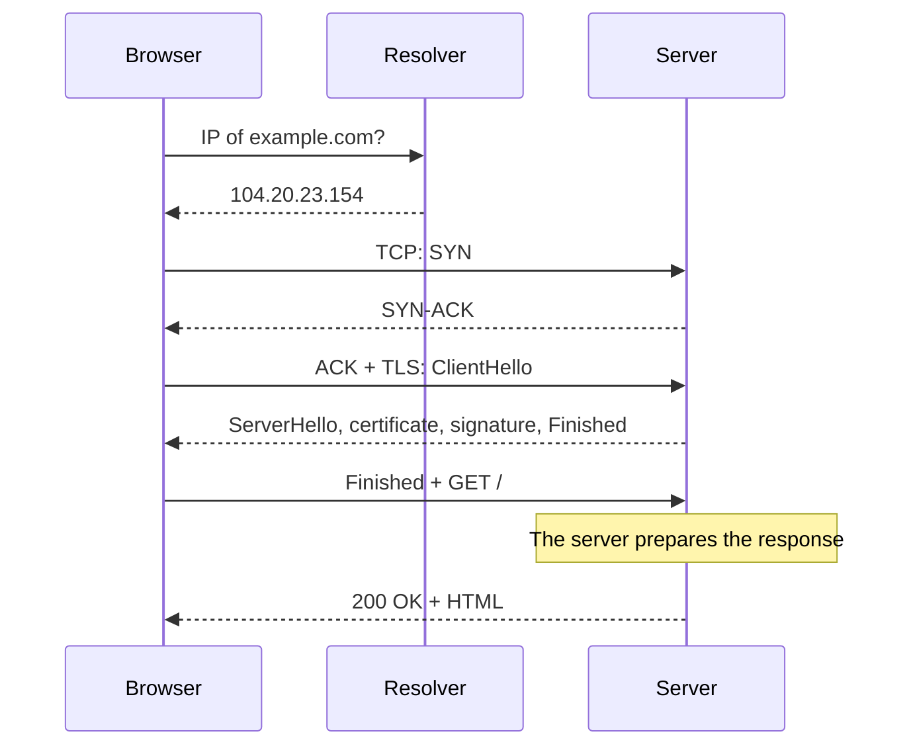

import Term from '~/components/Term.astro';
import TryIt from '~/components/TryIt.astro';
import Analogy from '~/components/Analogy.astro';
import SelfCheck from '~/components/SelfCheck.astro';

## The problem

“What happens when you type a URL into the browser and press Enter?” It's one of the most common questions in backend interviews. If you've followed this phase, you already know every piece of the answer. Here you'll put them in order.

There's also a practical reason. When a website is slow to load, the time goes somewhere: finding the server, connecting, encrypting the connection, waiting for the server to answer or downloading the response. If you don't know what the steps are, you don't know where to look.

## The analogy

<Analogy>

Imagine you order a piece of furniture from a store in another city. First you look up its address and phone number (DNS). You call and make sure you can hear each other: “Can you hear me?”, “Yes, I can hear you. Can you hear me?”, “Yes” (TCP). Before handing you anything, the store shows you its license and you agree on a code word for the rest of the call (TLS). You place your order (the HTTP request). The store gets it ready (the server does its work). They ship it to you (the response) and, finally, you put it together at home (the browser paints the page).

Each step waits for the one before it, and each round trip costs more the farther away the store is.

- If you already have the address written down, or the call is still open, you skip steps: those are caches and reused connections.
- A browser doesn't place a single order. The HTML, the page itself, tells it what else it needs (styles, scripts to run, images), and it asks for all of it in parallel, often over the same connection.
- In the analogy, the furniture travels once. On the network, the response arrives split into many segments, and the browser starts putting the page together before it has all of it.

</Analogy>

## How it really works

### The journey, step by step

You type `https://example.com/` and press Enter:

1. **The browser reads the URL** (lesson 5). The `https` scheme gives the protocol and the default port, 443. The name is `example.com`, and the path is `/`. If you type just `example.com`, current browsers try `https://` first.
2. **DNS** (lesson 7). The browser needs the IP address of `example.com`. It checks its own cache and the operating system's and, if the address isn't there, asks the <Term id="resolver">resolver</Term>, which either walks root → `.com` → authoritative or already has it cached.
3. **TCP** (lesson 6). The operating system opens a <Term id="socket">socket</Term> with an ephemeral port and does the three-message <Term id="handshake">handshake</Term> with that IP address and port 443. The packets leave through your router, which does <Term id="nat">NAT</Term> if they're IPv4, and travel from router to router (lesson 5), each one with its layers and headers (lesson 4).
4. **TLS** (lesson 8). Another handshake: the key exchange, the server's certificate and signature, and the browser checking the chain, the name and the dates. Inside this handshake, using ALPN (a TLS extension for choosing the application protocol, which you saw in lesson 4), the two sides agree to speak HTTP/2.
5. **HTTP** (lesson 3). The browser sends `GET /` with its headers (cookies, `Accept`… and the server's name, which in HTTP/2 goes in `:authority` instead of `Host`), already encrypted.
6. **The server** (lesson 2). The program listening on port 443 receives the request, decides what to answer (it might query a database, call other services or read a file) and starts sending the response. Everything it does here is the backend: the rest of this course.
7. **The response** (lesson 6). It arrives split into TCP <Term id="segment">segments</Term>, which are confirmed with <Term id="ack">ACK</Term> messages as they come in, and the browser receives the HTML.
8. **The browser.** It reads the HTML, finds the styles (CSS), the scripts and the images, and requests them. The ones from the same server go over the connection that's already open; the ones from another domain repeat DNS, TCP and TLS. It paints as soon as it has the HTML and the CSS, without waiting for the images. This part isn't backend anymore: you'll find it in “Further reading”.

Here's a diagram of just the first request, on a new connection:

### What it costs: round trips

The number that matters most here is the <Term id="rtt">RTT</Term> (*round-trip time*): how long a message takes to get there and back. It depends mostly on distance. Light in fiber travels about 200 km per millisecond, and every router along the way adds a little more. That wait is called <Term id="latency">latency</Term>.

Look at the diagram: before the first byte of the response arrives, there are three round trips to the server (TCP, TLS and the HTTP request). Add one more to the resolver if the DNS answer isn't cached, plus however long the server takes. With a server in your city, an RTT is a few milliseconds and you don't notice it. With one on another continent, it's 200 ms each time, and the page takes more than half a second to start arriving.

Do the math with Johannesburg, about 8,000 km from Madrid in a straight line. There and back is 16,000 km, which light in fiber covers in 80 ms. In practice it's more than double that: cables don't run in straight lines, and every router adds its share. No technology can get below those 80 ms. The only way is to move the server closer.

Downloading is measured in round trips too. TCP doesn't send everything at once: it starts with about 14 KB and doubles the amount every RTT, as long as nothing gets lost. This is the congestion control you saw briefly in lesson 6, and it's called slow start. So a 50 KB page needs three batches, and with a faraway server each batch costs one RTT.

The time from the start of the navigation until the first byte of the response arrives is called <Term id="ttfb">TTFB</Term> (*time to first byte*). It includes DNS, TCP, TLS and the wait for the server. It's one of the most closely watched metrics in web performance.

### What makes it faster

- **Caches:** a DNS answer is kept for its TTL, and the browser also keeps HTTP responses (you'll see this in Phase 2).
- **Reusing connections:** with `keep-alive` and HTTP/2, later requests to the same server skip DNS, TCP and TLS.
- **Moving the server closer:** a <Term id="cdn">CDN</Term> serves the website from a server close to each user. example.com sits behind Cloudflare's, which is why its RTT is so short.
- **HTTP/3:** it runs on QUIC, the transport protocol over UDP from lesson 6, which merges the transport handshake and the TLS handshake into one and saves a round trip.

## Try it

`curl -w` can print how long each phase took once it's done. Copy the whole command (it's long):

<TryIt
  title="1. The phases of a request"
  cmd={`curl -s -o /dev/null -w "dns:        %{time_namelookup}\\ntcp:        %{time_connect}\\ntls:        %{time_appconnect}\\nfirst byte: %{time_starttransfer}\\ntotal:      %{time_total}\\n" https://example.com`}
  output={`dns:        0.025769
tcp:        0.042713
tls:        0.055874
first byte: 0.070872
total:      0.071011`}
>

Careful: each number is the moment that phase **ended**, in seconds, counting from the start. It isn't how long the phase lasted. To get how long each one took, subtract the previous number:

| Phase | Calculation | Duration |
|---|---|---|
| DNS | 0.026 | 26 ms |
| TCP | 0.043 − 0.026 | 17 ms |
| TLS | 0.056 − 0.043 | 13 ms |
| Request and server | 0.071 − 0.056 | 15 ms |
| Download | 0.07101 − 0.07087 | less than 1 ms |

TCP and TLS take one RTT each, and here the RTT is short, around 15 ms: Cloudflare has a server nearby. The page is small, so the download is instant. Run it again right away: the DNS will drop to just a few milliseconds, because your operating system keeps the answer. Your numbers will be different.

</TryIt>

Now try the same command with a server that's really far away: the South African government's, in Johannesburg, which doesn't use a CDN:

<TryIt
  title="2. You can feel the distance"
  cmd={`curl -s -o /dev/null -w "dns:        %{time_namelookup}\\ntcp:        %{time_connect}\\ntls:        %{time_appconnect}\\nfirst byte: %{time_starttransfer}\\ntotal:      %{time_total}\\n" https://www.gov.za/`}
  output={`dns:        0.003154
tcp:        0.211879
tls:        0.421717
first byte: 0.650104
total:      1.057613`}
>

From Europe, the RTT to Johannesburg is about 200 ms, and you can see it in every phase:

- **TCP:** 0.212 − 0.003 = about 210 ms. One RTT.
- **TLS:** 0.422 − 0.212 = about 210 ms. Another RTT.
- **Request and server:** 0.650 − 0.422 = about 230 ms. One RTT, plus however long the server takes.
- **Download:** 1.058 − 0.650 = about 410 ms, because this page is bigger and arrives over several round trips.

Before the first byte, more than half a second has gone by just waiting. A faster server won't fix that: you have to remove round trips (HTTP/3, reused connections) or shorten them (a CDN). The download is TCP slow start's three batches: the page weighs about 50 KB. The DNS is fast because we'd looked it up a moment before. From another continent, your numbers will be very different.

</TryIt>

Finally, compare it with what the browser shows you. Open a private window (so nothing is cached), open Chrome's DevTools (lesson 4: <kbd>F12</kbd>, or right-click › *Inspect*), go to the *Network* tab and visit `https://example.com`. Click the document request (the first one, `example.com`) and open the *Timing* tab. You'll see these phases, which are the same ones you just measured:

| In DevTools | In curl |
|---|---|
| *DNS Lookup* | up to `dns` |
| *Initial connection* (includes *SSL*) | from `dns` to `tls` |
| *SSL* | from `tcp` to `tls` |
| *Request sent* and *Waiting for server response* | from `tls` to `first byte` |
| *Content Download* | from `first byte` to `total` |

*Waiting for server response* is the part of TTFB that depends on the server (plus one RTT). *Queueing* and *Stalled*, which curl doesn't have, are the time the browser waits before sending, for example because it has a lot of requests queued up. If you reload, the first phases disappear: the connection gets reused. And if the *Protocol* column says `h3`, you won't see *SSL* on its own: with HTTP/3, QUIC handles the transport and TLS in a single handshake.

One last thing that costs round trips: redirects. If you type `http://`, the server answers with a `301` that sends you to `https://`, and the browser starts over:

<TryIt
  title="3. What a redirect costs"
  cmd={`curl -sL -o /dev/null -w 'redirects: %{num_redirects}\\ntime in redirects: %{time_redirect}\\nfirst byte: %{time_starttransfer}\\ntotal: %{time_total}\\nfinal URL: %{url_effective}\\n' http://github.com`}
  output={`redirects: 1
time in redirects: 0.085523
first byte: 0.190151
total: 0.388372
final URL: https://github.com/`}
>

`-L` makes `curl` follow redirects, the way the browser does. The first request, to `http://github.com`, only gets back the `301`: 86 ms lost before the real request starts, with its own new TCP and TLS. That's why a website's links should point straight to `https://`. It's also why HSTS exists: a header the server uses to ask the browser to go straight to `https://` next time.

</TryIt>

## You have already seen it

- **A website on another continent that's slow to start loading,** even though your connection is fast: it's almost always latency. That's why big websites use CDNs.
- **The first page of a website takes longer than the next ones:** after that, the connection stays open, the IP address is cached, and the browser has already saved many files, like styles and images.

And if you code:

- **`<link rel="preconnect" href="https://fonts.gstatic.com" crossorigin>`** tells the browser to do DNS, TCP and TLS with that server as early as possible, without waiting to find out it needs it. `dns-prefetch` only does the DNS part. Now you know which round trips they save. (The `crossorigin` is needed because fonts are requested in CORS mode, which you'll see in Phase 2.)
- **“Document request latency”** in Lighthouse (formerly “Reduce initial server response time”), or TTFB in performance metrics, depends heavily on step 6: how long your server takes. From Phase 3 on, that's your job.

## Common mistakes

- **“If the website is slow, it's the server's fault.”** It might be, but time also goes into DNS, the handshakes and distance. Look at the phases before you blame anyone.
- **“More bandwidth will make it faster.”** Bandwidth is how much data fits through per second; latency is how long each trip takes. For a typical page, made of many small files, latency is what counts: more bandwidth doesn't shorten a single round trip.
- **“Every resource opens a new connection.”** With HTTP/2, all the resources from the same server go over a single connection, and the cost of DNS, TCP and TLS is paid once. With HTTP/1.1, the browser opens up to six connections per server to request things in parallel. Each different domain, though, pays its own cost.

## Summary

- When you press Enter, the browser reads the URL, resolves the name (DNS), connects (TCP), encrypts the connection (TLS), sends the request (HTTP) and waits for the server. Then it receives the response and paints the page.
- A new connection needs at least three or four round trips before the first byte, so the distance to the server matters a lot.
- Caches, reused connections, CDNs and HTTP/3 avoid those round trips or make them shorter.
- `curl -w` and the DevTools *Timing* tab measure the same phases.
- This wraps up Phase 0: you now know how data travels. In Phase 1, you'll learn to live in a server's terminal.

## Did you get it?

<SelfCheck question="The first byte of a website takes 800 ms to arrive. The Timing tab says: DNS 5 ms, Initial connection 30 ms and Waiting for server response 750 ms. Where's the problem?">

On the server. The connection is fast (the RTT is small), but the server takes about 700 ms to start answering: maybe a slow database query or a heavy calculation. It's a backend problem, not a network one.

</SelfCheck>

<SelfCheck question="A website runs on a server in the United States, with an RTT of 150 ms from Spain. A user in Spain makes their first request over HTTPS. How long does it take, at the very least, for the first byte to reach them, even if the server answers instantly?">

About 450 ms: one RTT for TCP, another for TLS and another for the HTTP request and its response (plus DNS, if it wasn't cached). Later requests over the same connection only pay for the last one: about 150 ms.

</SelfCheck>

<SelfCheck question="With the same server as in the previous question (RTT of 150 ms), how much time would the first request save if it went over HTTP/3?">

About 150 ms: it would take about 300 ms instead of 450. QUIC merges the transport handshake and the TLS handshake into one, so there's one round trip before the request, not two.

</SelfCheck>

## Further reading

- [How browsers work](https://developer.mozilla.org/en-US/docs/Web/Performance/Guides/How_browsers_work) (MDN): the whole journey, including what the browser does at the end.
- [Time to First Byte](https://web.dev/articles/ttfb) (web.dev): what TTFB measures and how to improve it.
- [rel=preconnect](https://developer.mozilla.org/en-US/docs/Web/HTML/Reference/Attributes/rel/preconnect) (MDN): how to ask the browser to open connections ahead of time.
