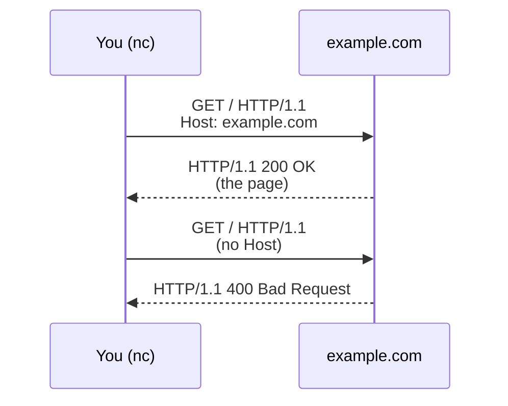

import Term from '~/components/Term.astro';
import TryIt from '~/components/TryIt.astro';
import Analogy from '~/components/Analogy.astro';
import SelfCheck from '~/components/SelfCheck.astro';

## The problem

In the previous lesson you wrote a response by hand and the browser understood it. Think about that for a moment. Chrome was written by people at Google. You typed four lines into a terminal. The two of you had never agreed on anything. So how did Chrome know that the empty line separated the headers from the content, or that `200 OK` meant “everything went fine”?

It knew because you were both following the same rules, written decades ago in a public document. Those shared rules have a name: **<Term id="protocol">protocol</Term>**.

The internet connects billions of programs, running on computers, servers, phones, routers and TVs. They were written by people who will never meet, in different languages and in different decades. Without agreements made in advance, each program would speak its own way and nobody would understand anybody. The internet works because everyone follows the same protocols.

## The analogy

<Analogy>

Think of a phone call. Whoever picks up says “Hello?”. The caller says who they are and why they're calling. You take turns: if you both talk at once, someone says “sorry, go ahead”. If the line cuts out for a moment, you ask “can you hear me?” and repeat yourself. And at the end there's a goodbye, so both of you know the call is over.

Nobody ever formally taught you those rules, but you follow them without thinking, and that's why you can talk to a stranger on the phone without misunderstandings. A protocol is the same thing for two programs: a script both of them know before they start.

- People improvise: if someone answers “Yeah?” instead of “Hello?”, it's no big deal. Programs barely improvise. They tolerate small deviations that the protocol itself allows, but if you skip a required rule, the message gets rejected. You'll make that happen in the exercise.
- On a phone call, whoever picks up speaks first. In HTTP it's the other way around: the client, the one that connects, sends the request, and the server says nothing until it receives it. Other protocols, like SMTP (the one for email), do start with a greeting from the server. Who speaks first is exactly one of the things each protocol decides.
- The rules of a phone call are habits. The rules of a protocol are written down precisely, word for word, in public documents.
- A phone call has a single conversation. On the internet, several protocols work at the same time, one on top of another. You'll see that in the next lesson.

</Analogy>

## How it really works

### What a protocol decides

A protocol answers four questions:

1. **Format:** how each message is written, character by character. In <Term id="http">HTTP</Term>/1.1, the first line of a request is always `METHOD PATH VERSION`, and every line ends with two invisible characters, `\r\n` (carriage return and line feed).
2. **Order:** who speaks and when. In HTTP, the client asks and the server answers: every request gets its response.
3. **Meaning:** what each thing means. `GET` means “give me”. `200` means “here you go”. `404` means “that doesn't exist”.
4. **What to do when something goes wrong:** the protocol also says how to react to a message that breaks the rules. In HTTP, the server doesn't try to guess what you meant: it answers with an error that says so.

You might be wondering why the previous lesson worked, since pressing Enter in `nc` only sends `\n`, without the `\r`. It's because HTTP's rules let the receiver also accept a lone `\n`. The sender, on the other hand, must use `\r\n`. It's an idea you'll run into often in backend: be strict with what you send and tolerant with what you receive.

Within the format there's a question that matters more than it seems: **how does the other side know the message is over?** In the previous lesson you solved it by closing the connection with <kbd>Ctrl</kbd> + <kbd>C</kbd>. But in HTTP/1.1 the connection stays open by default so it can be reused for more requests (that's why your browser sent `Connection: keep-alive`), so closing it isn't always an option. That's why HTTP has two other ways: saying in advance how many bytes the content takes up, or sending it in chunks, each with its own size. You'll see both in the exercise.

### The anatomy of an HTTP message

This is the request you're about to send, line by line:

| Line | What it is |
|---|---|
| `GET / HTTP/1.1` | The **request line**: the method (`GET`, “give me”), the resource you want (`/`, the home page) and the version of the protocol you speak |
| `Host: example.com` | A <Term id="header">header</Term>: which website the request is for |
| `Connection: close` | Another header: “when you answer me, close the connection”. That way the command ends as soon as the response arrives |
| *(empty line)* | The end of the headers. Since the request has no `Content-Length`, the server knows there's no content and that the message ends here |

The response has the same shape. Its first line, the **status line**, gives the protocol version, a <Term id="status-code">status code</Term> and a phrase for humans: `HTTP/1.1 200 OK`. Then come the headers, an empty line and the content.

The server answers differently depending on whether your message follows the rules or not:

These are actually two separate connections, one per exercise. The diagram puts them together so you can compare the two responses.

### The rules are written down

The rules of internet protocols are published in documents called <Term id="rfc">RFCs</Term>. HTTP/1.1, for example, is defined in RFC 9110 (what each thing means) and RFC 9112 (how messages are written). The split makes sense: HTTP/2 and HTTP/3 share RFC 9110, because they mean the same things, but they write their messages differently. Anyone can read them. That's why Chrome, `curl` and you with `nc` can all talk to the same server, whether it's programmed in Go, JavaScript or C: you've all followed the same document.

Notice the difference between the protocol and the program. The protocol is the agreement. Chrome, `curl` or a server like nginx are **implementations**: programs that follow that agreement. A single protocol can have thousands of implementations.

### There are many protocols

HTTP is just one of them. Here are some you'll run into:

- **HTTP:** requesting and serving pages and APIs (services for programs, not people). You'll study it in depth in Phase 2.
- **DNS:** translating names like `google.com` into addresses. Lesson 7.
- **TCP:** making sure data arrives complete and in order. Lesson 6.
- **TLS:** encrypting the connection and checking that you're talking to who you think you are; it's the S in HTTPS. Lesson 8.
- **SSH:** controlling a remote server from your terminal. Phase 1.
- **SMTP:** sending email.

Some, like HTTP/1.1, are **text-based**: you can type them on your keyboard, as you're about to do. Others, like TCP or DNS, are **binary**: their messages are bytes too, but those bytes don't stand for letters. They stand for numbers and fixed-size fields designed for machines, and to see them you need tools that translate them. HTTP/2 and HTTP/3, which is what your browser uses with most websites, are binary too: they carry the same information (method, path, headers and status code) in a different format. You'll see that in Phase 2.

## Try it

You're going to speak HTTP by hand with `example.com`, a website that exists precisely for documentation examples like this one.

<TryIt
  title="1. Speak HTTP with a real server"
  cmd={`(printf 'GET / HTTP/1.1\\r\\nHost: example.com\\r\\nConnection: close\\r\\n\\r\\n'; sleep 3) | nc example.com 80`}
  output={`HTTP/1.1 200 OK
Date: Fri, 02 Oct 2026 17:59:04 GMT
Content-Type: text/html; charset=utf-8
Transfer-Encoding: chunked
Connection: close
Server: cloudflare
Last-Modified: Fri, 02 Oct 2026 16:11:13 GMT
Allow: GET, HEAD
Accept-Ranges: bytes
Age: 6438
cf-cache-status: HIT
CF-RAY: a445994f5daab7a6-MAD
alt-svc: h3=":443"; ma=86400

241
<!doctype html><html lang=en><head><meta charset=utf-8>…<title>Example Domain</title>…</html>
0`}
>

Let's break it down:

- `printf` writes the request exactly as the protocol requires. Each `\r\n` is a line ending. At the end there are two in a row: the first one ends the `Connection: close` line and the second is the empty line that marks the end of the headers.
- `nc example.com 80` connects to `example.com` on port 80, the one for unencrypted HTTP, and sends whatever it receives.
- The parentheses group `printf` and `sleep`, and the `|` bar (a *pipe*) feeds what they write into the input of `nc`. You'll see pipes in Phase 1.
- `sleep 3` delays the end of `nc`'s input by three seconds. Without it, the macOS version of `nc` quits as soon as it finishes sending, and you never get to see the response.

In the response you'll recognize the structure: the status line (`HTTP/1.1 200 OK`), the headers, an empty line and the content. Don't worry about the rest of the headers: you'll see most of them in Phase 2. We've trimmed the HTML (the page's code), and your dates and values will be different.

Notice the `241` and the `0`. With `Transfer-Encoding: chunked`, the server has announced that it's sending the content in pieces (*chunks*). Servers do this when they start sending before they know how big the whole thing will be. Each chunk is preceded by its size in hexadecimal (base 16, not base 10): `241` is 577 bytes. The final `0` means “no more chunks”: it's the server's way of saying the message is over. If your response shows `Content-Length` instead of `Transfer-Encoding: chunked`, that's the other way to mark the end, the one in exercise 2.

`Server: cloudflare` tells you that you didn't talk directly to the example.com computer, but to an intermediate server run by Cloudflare. You'll understand why in lesson 9, when you see what a CDN is.

</TryIt>

Now you're going to break a rule. HTTP/1.1 requires the `Host` header, because a single server can host many websites and needs to know which one you want. Send the same request without it:

<TryIt
  title="2. Break the rules"
  cmd={`(printf 'GET / HTTP/1.1\\r\\nConnection: close\\r\\n\\r\\n'; sleep 3) | nc example.com 80`}
  output={`HTTP/1.1 400 Bad Request
Server: cloudflare
Date: Fri, 02 Oct 2026 17:59:25 GMT
Content-Type: text/html
Content-Length: 155
Connection: close
CF-RAY: -

<html>
<head><title>400 Bad Request</title></head>
<body>

<h1>400 Bad Request</h1>

cloudflare

</body>
</html>`}
>

`400 Bad Request` means “your message doesn't follow the rules”. The server didn't try to guess what you meant: it told you, using the protocol itself, that your request is malformed.

This shows why `Host` is required: the one answering you is Cloudflare (the end of the HTML says so), which serves millions of websites from the same addresses. Without `Host`, it has no way of knowing which one you want.

This time the size comes in `Content-Length: 155`: the server announces in advance that the content takes up 155 bytes. That's the other way to mark where a message ends.

If you send something that looks nothing like HTTP, like `(printf 'HELLO SERVER\r\n\r\n'; sleep 3) | nc example.com 80`, you'll get the same `400`.

</TryIt>

Finally, send a correct request, but ask for something that doesn't exist:

<TryIt
  title="3. Ask for something that doesn't exist"
  cmd={`(printf 'GET /does-not-exist HTTP/1.1\\r\\nHost: example.com\\r\\nConnection: close\\r\\n\\r\\n'; sleep 3) | nc example.com 80`}
  output={`HTTP/1.1 404 Not Found
Date: Fri, 02 Oct 2026 18:01:08 GMT
Content-Type: text/html; charset=utf-8
Transfer-Encoding: chunked
Connection: close
Server: cloudflare
…

241
<!doctype html><html lang=en><head><meta charset=utf-8>…<title>Example Domain</title>…</html>
0`}
>

This time the message is correct and the server understood it perfectly. It answers, within the rules, that the thing you asked for doesn't exist: `404 Not Found`. We've trimmed some headers and the HTML.

Compare the two errors. The protocol distinguishes between “your request is malformed” (`400`) and “your request is fine, but that doesn't exist” (`404`). Status codes are one of the most useful parts of HTTP, and in Phase 2 you'll learn when to use each one.

Here's a fun detail: example.com sends back the same old page as content. What matters is the code. A browser would show you the page, but an app would know from the `404` that what it asked for doesn't exist (if you code: with `fetch`, `response.ok` would be `false` and `response.status` would be `404`).

</TryIt>

## You have already seen it

- **The “Error 404” pages you see while browsing** show the status code from exercise 3; an “Error 500” means the server itself has failed.
- **The start of a URL, the *scheme*, usually tells you which protocol is being spoken:** `http://`, `https://`, `ws://` (WebSockets) or `ssh://`, which, if you code, you may have seen in Git URLs. It also sets the default port: 80 for `http://`, as in the exercise, and 443 for `https://`. Not every scheme is a network protocol: `mailto:` and `data:` aren't.

And if you code:

- **`fetch` writes these messages for you.** In `fetch(url, { method: 'POST', headers: { 'Content-Type': 'application/json' }, body })`, `method` goes in the request line, `headers` are the headers and `body` is the content that comes after the empty line.
- **The *Status* column in the DevTools *Network* tab** shows the status code of each response: the `200`, `404` and `500` you've been seeing for years are part of the protocol.
- **If you right-click the header row of the *Network* table and turn on the *Protocol* column,** you'll see `h2` or `h3` on almost every website. Those are HTTP/2 and HTTP/3, the binary versions of what you just typed by hand, with the same information in a different format.

## Common mistakes

- **“HTTP is the internet.”** HTTP is one of many protocols. The web runs on HTTP, but email, name resolution and connecting to a server over SSH use other ones.
- **“JSON is a protocol.”** JSON is a **data format**: a way to write information as text, for example `{"name": "Ana"}`. It only answers one of a protocol's four questions, the one about format: it doesn't say who speaks, in what order or what to do if something goes wrong. The protocol is HTTP, which carries the JSON and, with the `Content-Type: application/json` header, announces that what's inside is JSON. REST is a similar case: it isn't a protocol, but a style for designing APIs on top of HTTP. You'll see it in Phase 4.
- **“A protocol is a program.”** A protocol is a written agreement. Programs like Chrome, `curl` or nginx implement it. If you code, it isn't a library either: `fetch` or axios are how you use that implementation from your code.

## Summary

- A protocol is a public agreement, made in advance, on how two programs communicate.
- It defines the format of the messages, their order, their meaning and what to do when something goes wrong.
- The internet's rules are written down in RFCs, and two programs that follow the same rules can understand each other even if they've never met.
- An HTTP message has a first line, headers, an empty line and, if needed, content.

## Did you get it?

<SelfCheck question="In the previous lesson, the browser understood the response you wrote by hand. How is that possible, if the two of you had never agreed on anything?">

Because you were both following the same protocol, HTTP. Its rules are published and the browser follows them. You wrote a message in the format those rules require (status line, headers, empty line and content), so the browser knew how to read it.

</SelfCheck>

<SelfCheck question="You sent a request without the Host header and example.com answered with a 400. Why didn't it send you the page anyway?">

Because your message broke a required rule of HTTP/1.1: the `Host` header. When that happens, the server doesn't guess: it rejects the message and says so with a `400`. Besides, without `Host` it doesn't know which of the websites it hosts you want. At example.com, the one answering is Cloudflare, which serves millions of them.

</SelfCheck>

<SelfCheck question="Is JSON a protocol?">

No. JSON is a data format: it says how to write information as text. The protocol is HTTP, which carries that text and uses `Content-Type` to announce that it's JSON.

</SelfCheck>

## Further reading

- [Protocol](https://developer.mozilla.org/en-US/docs/Glossary/Protocol) (MDN glossary): the short definition, with links to the most common protocols.
- [HTTP messages](https://developer.mozilla.org/en-US/docs/Web/HTTP/Guides/Messages) (MDN): the anatomy of the requests and responses you just wrote, in more detail.
- [RFC 9112: HTTP/1.1](https://www.rfc-editor.org/rfc/rfc9112.html): the original document with the formatting rules. You don't need to read all of it, but it's worth a quick look to see how a protocol is written.
