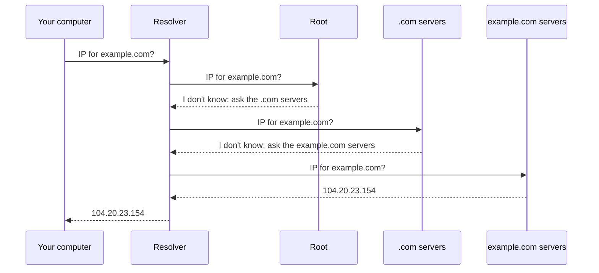

import Term from '~/components/Term.astro';
import TryIt from '~/components/TryIt.astro';
import Analogy from '~/components/Analogy.astro';
import SelfCheck from '~/components/SelfCheck.astro';
import DnsLookup from '~/playgrounds/dns-lookup/DnsLookup';

## The problem

In lesson 5 you saw that, to reach a computer, the network needs its IP address. But you type `example.com`, not `104.20.23.154`. Someone has to translate the name into the address.

In the early days of the internet, back in the 1970s, that translation was a file, `HOSTS.TXT`, with every name and its address. A single organization maintained it, and every computer downloaded a copy from time to time. It worked while there were a few hundred computers. With thousands, the file never stopped changing, nobody had the latest version and any mistake affected everyone.

Today there are hundreds of millions of domains, and their addresses change all the time. No file, and no server, can know them all. What you need is a distributed database, where each party takes care of its own names. That's <Term id="dns">DNS</Term> (*Domain Name System*).

## The analogy

<Analogy>

Imagine you arrive in a city you don't know and ask the hotel front desk for the address of a shop. The receptionist doesn't know every shop in the world, but she knows who to ask. She calls the country's tourist office, which gives her the number of the city's office. That office gives her the number of the neighborhood business association, and they do know the exact address.

You only asked one question: she made all the calls. She writes the address down for you and also keeps it in a notebook, in case another guest asks about the same shop. But with a note: “valid until Friday”, because shops move.

The front desk is your <Term id="resolver">resolver</Term>. The offices are the DNS servers at each level: the root, the `.com` servers and the domain's own. The notebook is its <Term id="cache">cache</Term>, and the expiration date is the TTL.

- In the real world, a country has one or two tourist offices. In DNS, “the root” is 13 server names, and behind them there are more than 2,000 machines spread around the world, all giving the same answers.
- The receptionist doesn't check whether the shop has moved before Friday. Neither does the resolver: until the note expires, it keeps handing out the saved address, even if it's no longer the right one.

</Analogy>

## How it really works

### A tree of names

A domain name is read from right to left, from the most general to the most specific. In `www.example.com.` (yes, with a dot at the end, even though it's almost never written):

- **`.`, the final dot,** is the root of the tree.
- **`com`** is a top-level domain, or TLD, like `es`, `org` or `dev`.
- **`example.com`** is the domain someone has bought.
- **`www.example.com`** is a name inside that domain, which its owner creates however they like.

Each level delegates the level below it to someone else: the root knows who runs each TLD, the TLD knows who runs each domain, and the domain's owner decides its names. Each of those pieces is a **zone**, with its own DNS servers.

### A query's trip

When your browser needs the IP for `example.com`, it asks the operating system, which asks your resolver: usually your internet provider's, or a public one like `1.1.1.1` (Cloudflare) or `8.8.8.8` (Google). If the resolver doesn't have the answer in its cache, it makes this trip:

1. **The root** doesn't know the answer, but it knows who runs `.com`, and it tells the resolver.
2. **The `.com` servers** don't know it either, but they know who runs `example.com`.
3. **The `example.com` servers** do know it: they're its <Term id="authoritative-server">authoritative servers</Term>, the ones with the official answer. Whoever bought the domain chooses them (example.com uses Cloudflare's).
4. **The resolver** gives you the answer and keeps it in its cache.

Notice that nobody knows the whole map, just like the routers in lesson 5: each server only knows who to send you to. And the full trip almost never happens, because resolvers also cache the steps in between. They've known for days that `.com` is run by `a.gtld-servers.net` and friends.

DNS queries usually travel over UDP, port 53: a short question and a short answer, with no handshake, as you saw in lesson 6. If no answer arrives, the query is sent again, and if the answer doesn't fit in a datagram, it's repeated over TCP. And for a few years now there's been DNS over HTTPS (DoH), which encrypts the query. That's what this lesson's lab uses, because a web page can't send DNS queries over UDP, but it can send HTTPS requests.

### Record types

A domain doesn't only store addresses. Each piece of data it publishes is a <Term id="dns-record">record</Term>, with a type:

| Type | What it stores | Example |
|---|---|---|
| **A** | An IPv4 address | `example.com` → `104.20.23.154` |
| **AAAA** | An IPv6 address | `example.com` → `2606:4700:10::6814:179a` |
| **CNAME** | An alias: “this name is another one” | `www.github.com` → `github.com` |
| **MX** | The domain's mail server | `gmail.com` → `gmail-smtp-in.l.google.com` |
| **TXT** | Free text | Proof that the domain is yours, and rules against fake email |
| **NS** | The zone's DNS servers | `example.com` → `hera.ns.cloudflare.com` |

A CNAME can cost one extra query. If the target is in the same zone (`www.github.com` → `github.com`), the authoritative server includes its address in the same answer. If it's in another zone, like when a domain points to `cname.vercel-dns.com`, the resolver has to look it up separately, with its own trip. And an MX record says where to deliver email for `@gmail.com`: DNS isn't only for the web.

### The TTL and “propagation”

Every record carries a <Term id="ttl">TTL</Term> (*time to live*): the number of seconds it can be kept in a cache. If example.com publishes its address with a TTL of 300, a resolver can hand it out for 5 minutes without asking again. (It's not the TTL of the IP packets from lesson 5, which counts hops, not seconds.)

That's why, when you change your domain's IP, some users see the new one right away and others keep seeing the old one for a while. People often say the change “is propagating”, but nothing propagates: what really happens is that every cache in the world waits for its copy to expire. A short TTL makes changes arrive sooner, at the cost of more queries.

## Try it

Start with the lab. Look up `example.com` and step through the trip: the server names are real. Then try `www.github.com` (a CNAME), `gmail.com` with the MX record type, a domain that doesn't exist and `github.com` with the AAAA type.

<DnsLookup client:visible lang="en" />

Now, from the terminal. `dig` asks your resolver and shows you the whole answer:

<TryIt
  title="1. A DNS query, in full"
  cmd="dig example.com"
  output={`; <<>> DiG 9.10.6 <<>> example.com
;; global options: +cmd
;; Got answer:
;; ->>HEADER<<- opcode: QUERY, status: NOERROR, id: 33708
;; flags: qr rd ra; QUERY: 1, ANSWER: 2, AUTHORITY: 0, ADDITIONAL: 1

;; OPT PSEUDOSECTION:
; EDNS: version: 0, flags:; udp: 1232
;; QUESTION SECTION:
;example.com.			IN	A

;; ANSWER SECTION:
example.com.		17	IN	A	172.66.147.243
example.com.		17	IN	A	104.20.23.154

;; Query time: 22 msec
;; SERVER: 2001:db8::53#53(2001:db8::53)
;; WHEN: Sat Oct 03 09:30:15 CEST 2026
;; MSG SIZE  rcvd: 72`}
>

What matters:

- **`status: NOERROR`:** the query went fine. If the domain didn't exist, you'd see `NXDOMAIN`; and if it exists but has no records of the type you asked for, `NOERROR` with `ANSWER: 0`.
- **`QUESTION SECTION`:** what was asked, the `A` record for `example.com.`, with its final dot.
- **`ANSWER SECTION`:** two A records, each with its TTL (`17`: it has 17 seconds left in the resolver's cache), its class (`IN`, internet) and the address.
- **`SERVER`:** the resolver that answered, on port 53. We've replaced our internet provider's resolver address with an example one; you'll see yours. If you see a private IP like `192.168.1.1`, that's your router, which forwards the query to your provider's resolver.

On Linux and WSL, `dig` comes in the `dnsutils` package (`sudo apt install dnsutils`).

</TryIt>

`+short` leaves only the values, and `+noall +answer` leaves the full lines of the answer, with name, TTL and type. With that, here are the other types:

<TryIt
  title="2. Other record types"
  cmd={`dig +short example.com\ndig +noall +answer gmail.com MX\ndig +noall +answer example.com TXT\ndig +noall +answer www.github.com`}
  output={`172.66.147.243
104.20.23.154
gmail.com.		1487	IN	MX	40 alt4.gmail-smtp-in.l.google.com.
gmail.com.		1487	IN	MX	5 gmail-smtp-in.l.google.com.
gmail.com.		1487	IN	MX	20 alt2.gmail-smtp-in.l.google.com.
gmail.com.		1487	IN	MX	10 alt1.gmail-smtp-in.l.google.com.
gmail.com.		1487	IN	MX	30 alt3.gmail-smtp-in.l.google.com.
example.com.		300	IN	TXT	"_k2n1y4vw3qtb4skdx9e7dxt97qrmmq9"
example.com.		300	IN	TXT	"v=spf1 -all"
www.github.com.		3274	IN	CNAME	github.com.
github.com.		42	IN	A	140.82.121.4`}
>

- **The MX records** have a number in front, the priority: mail servers try the lowest one first (the 5) and, if it doesn't answer, the next one.
- **The TXT records** are free text. `v=spf1 -all` says that no server is allowed to send email on behalf of example.com, and the odd-looking string is usually someone proving to a service that the domain is theirs.
- **`www.github.com`** is a CNAME for `github.com`. Your resolver follows the alias and gives you both things: the CNAME and the address of `github.com`.

Your TTLs and some addresses will be different.

</TryIt>

`+trace` makes the trip for real, without your resolver's cache: it asks the root, then `.com` and then the authoritative servers. `+nodnssec` removes some signatures that would only add noise here:

<TryIt
  title="3. The trip, server by server"
  cmd="dig +trace +nodnssec example.com"
  output={`.			10360	IN	NS	c.root-servers.net.
.			10360	IN	NS	b.root-servers.net.
.			10360	IN	NS	a.root-servers.net.
…
;; Received 823 bytes from 2001:db8::53#53(2001:db8::53) in 8 ms

com.			172800	IN	NS	a.gtld-servers.net.
com.			172800	IN	NS	b.gtld-servers.net.
…
;; Received 836 bytes from 192.5.5.241#53(f.root-servers.net) in 14 ms

example.com.		172800	IN	NS	hera.ns.cloudflare.com.
example.com.		172800	IN	NS	elliott.ns.cloudflare.com.
;; Received 359 bytes from 2001:502:1ca1::30#53(e.gtld-servers.net) in 29 ms

example.com.		300	IN	A	104.20.23.154
example.com.		300	IN	A	172.66.147.243
;; Received 72 bytes from 172.64.35.228#53(elliott.ns.cloudflare.com) in 13 ms`}
>

Each block is an answer, and the `Received … from` line tells you who gave it:

1. Your resolver gives you the list of the 13 root servers.
2. A root server (`f.root-servers.net`) answers with the `.com` servers.
3. A `.com` server answers with example.com's servers, which are Cloudflare's.
4. An authoritative server for example.com finally gives the addresses, with their original TTL: 300 seconds.

We've trimmed some lists of servers (`…`) and changed our resolver's address. Your exact servers will vary: each time, one is picked from the list.

</TryIt>

Finally, watch the cache expire. Run the same command twice, a few seconds apart:

<TryIt
  title="4. The TTL, counting down"
  cmd="dig +noall +answer example.com A"
  output={`example.com.		294	IN	A	104.20.23.154
…
example.com.		288	IN	A	172.66.147.243`}
>

Six seconds passed between the two runs, and the TTL dropped from 294 to 288: your resolver hasn't asked example.com's servers again; it's giving you its copy and telling you how long it has left. When it reaches zero, the resolver will ask example.com's servers again (it still has the root and `.com` servers cached), and the TTL will start over at 300. We've kept one line from each run.

</TryIt>

## You have already seen it

- **`ERR_NAME_NOT_RESOLVED`** (or `DNS_PROBE_FINISHED_NXDOMAIN` on Chrome's error page): the browser couldn't get the IP. Either the name doesn't exist (NXDOMAIN, often because of a typo) or the resolver isn't answering.
- **The “DNS” field in your Wi-Fi settings** (on your phone or computer) is your resolver's address. It's often your router, which forwards queries to your internet provider's resolver.
- **“Add these records at your DNS provider.”** When you connect a domain to a service like Wix, Vercel, Netlify or GitHub Pages, they ask you for an A record or a CNAME pointing to their servers. Now you know what you're touching, and why the change takes a while to show up.
- **`/etc/hosts`:** the direct descendant of `HOSTS.TXT`. Your computer checks it before asking the resolver, which is why a line like `127.0.0.1 myapp.test` makes `myapp.test` point to your own computer. Careful: `dig` doesn't check it, because it asks the resolver directly. To test it, use `ping myapp.test`: its first line tells you which IP it's going to. Stop it with <kbd>Ctrl</kbd> + <kbd>C</kbd>.

In DevTools (lesson 4):

- **_DNS Lookup_ in the _Timing_ tab** is this query. On the first request to a domain you'll see a few milliseconds; on the following ones, 0, or it doesn't show up at all, because the answer is cached or the connection is reused.

## Common mistakes

- **“DNS changes take 48 hours to propagate.”** There's no fixed deadline: each cache waits for its copy to expire, and that depends on the TTL you set. If you're going to change a domain's IP, lower the TTL first (to 300 seconds, for example) and wait for the old one to expire: the change will arrive in minutes. The exception is switching DNS providers (the NS records): there, what counts is the TTL of the delegation in the TLD, which you don't get to choose. For `.com` it's 172800 seconds, the famous 48 hours (you saw it in `dig +trace`).
- **“DNS only translates names into IPs.”** It also says where email goes (MX) and who runs each zone (NS), and it stores text for verifications and anti-spam rules (TXT).
- **“With HTTPS, nobody can see which websites I visit.”** HTTPS encrypts the page's content, but the classic DNS query travels unencrypted, over UDP, and your resolver knows every name you look up. DoH and DNS over TLS encrypt the query, but the resolver still sees the names. And even then, the name usually travels in plain sight when the HTTPS connection starts (you'll see this in the next lesson), and the destination IP is always visible.

## Summary

- DNS translates names into IP addresses with a distributed database, organized as a tree that's read from right to left.
- Your resolver walks the tree for you: the root refers it to the TLD, the TLD to the domain's authoritative servers, and those give the answer.
- Each piece of data is a record with a type: A, AAAA, CNAME, MX, TXT or NS, among others.
- Answers are cached for as long as their TTL lasts. That's why changes take a while to show up: you have to wait for the copies to expire.

## Did you get it?

<SelfCheck question="Your resolver has never heard of blog.example.dev. Who does it ask first, and what answer does it get?">

A root server, which doesn't know the answer but tells it which servers run `.dev`. Next it asks one of those, which tells it who runs `example.dev`, and finally an authoritative server for `example.dev`, which gives it the address of `blog.example.dev`. (If it had already cached who runs `.dev`, it would skip the root.)

</SelfCheck>

<SelfCheck question="You change your domain's A record. Its TTL was 86400 seconds. How long can it take for someone to see the new IP?">

Up to a whole day: 86400 seconds is 24 hours. A resolver that saved the answer right before the change can keep handing out the old IP until it expires. Next time, lower the TTL ahead of time, at least as far in advance as the old TTL lasts (here, one day).

</SelfCheck>

<SelfCheck question="dig returns status: NXDOMAIN for a domain. What does that mean? And what if it returns NOERROR but no answer at all?">

NXDOMAIN means the name doesn't exist, for any record type. The one saying so is the authoritative server for the closest zone that does exist: the `.com` one if the domain isn't registered, or the `example.com` one for `doesnotexist.example.com`. NOERROR with no answers means the name does exist, but it has no records of the type you asked for, for example an AAAA record on a domain without IPv6.

</SelfCheck>

## Further reading

- [What is DNS?](https://www.cloudflare.com/learning/dns/what-is-dns/) (Cloudflare Learning): a query's trip, the kinds of DNS servers and caching.
- [The root servers](https://root-servers.org/): a map of the more than 2,000 machines behind the root's 13 names.
- [RFC 1034](https://www.rfc-editor.org/rfc/rfc1034.html): the 1987 document that describes DNS. Its ideas (the tree, the zones and caching) are still the same.
