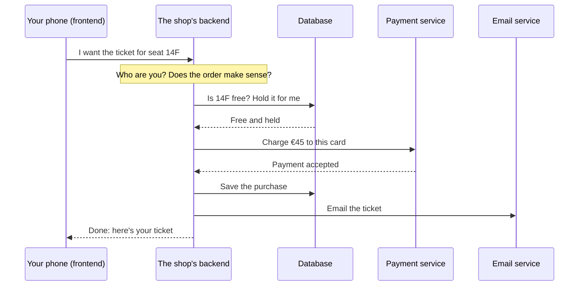

import Term from '~/components/Term.astro';
import TryIt from '~/components/TryIt.astro';
import Analogy from '~/components/Analogy.astro';
import SelfCheck from '~/components/SelfCheck.astro';
import DataToScreen from '~/components/diagrams/DataToScreen.astro';

## The problem

You open a concert venue's app to buy a ticket. On the screen you see the seating plan, the free seats in green and a “Buy” button. You pick seat 14F, you pay and, a few seconds later, an email arrives with your ticket.

It looks like it all happened on your phone, but your phone couldn't do it alone. Think about what it needs to know:

- Which seats are still free. That list changes every second, because thousands of people are buying at the same time from their own phones.
- That nobody else is buying 14F at that very moment.
- That the payment really went through, and not just that someone tapped a button.
- That the ticket is yours, and which email address to send it to.

None of that can live on your phone. The list of seats has to be the same for everyone, and nobody can carry the key to the cash register in their pocket.

That's why every website and every app has two parts. The one in your hand, the one you see and touch, is called the <Term id="frontend">frontend</Term>. The one somewhere else, which keeps track for everyone and decides what can be done, is called the <Term id="backend">backend</Term>. This course is about that second part: the one you don't see.

## The analogy

<Analogy>

Think of a restaurant.

The dining room is the frontend. It's what you see: the menu, the table and how the dish is presented. It's designed for you.

The kitchen is the backend. You don't see it, but almost everything happens there. The cooks follow the recipes and the house rules: they don't serve a dish that has run out, and they don't cook the same order twice. The pantry stores the ingredients, just as a <Term id="database">database</Term> stores data. And when something is missing, the kitchen asks a supplier, like a backend that asks another service for something.

The waiter connects the two parts. They take your order to the kitchen and bring you the dish. On the web, that back and forth is a <Term id="request">request</Term> and its <Term id="response">response</Term>.

<div slot="limits">

- A kitchen feeds a few tables. A backend can serve millions of people at once.
- The dining room isn't just decoration. The frontend has logic too: it checks that you filled in a form before sending it, or adds up your cart while you shop.
- In a restaurant you can peek into the kitchen. On the web you see nothing of the backend, and it doesn't see you either: all it gets are requests. That's why it doesn't trust what it receives, as you'll see below.

</div>

</Analogy>

## How it really works

### Where each part runs

The frontend runs on your device. If it's a website, in your browser: the browser downloads the page and draws it on your screen. If it's an app, on your phone: the app is already installed, and all it's missing is the data.

The backend runs on other computers, in a data center that may be in another country. There, programs spend all day waiting for requests and answering them. We call those programs <Term id="server">servers</Term>, and in [lesson 2](/en/phase-0/client-server-model/) you'll see exactly what that means.

Between the two is the internet. The frontend sends a request over the network, the backend receives it, does its job and sends back a response. All of Phase 0 is about how those requests and responses travel.

### What travels is data, not screens

When you open a weather app, the backend doesn't send you the screen with the sun already drawn. It sends you data: some numbers and some words. It's the app that decides how to draw them.

<DataToScreen
  caption="A weather app's backend sends only data (shortened here), with no colors or drawings. The app turns it into what you see. The 0 in weather_code is a code that means “clear sky”: the frontend turns it into words and a sun."
  labels={{
    data: 'What the backend sends',
    screen: 'What the frontend draws',
    arrow: 'the app turns it into',
  }}
  json={JSON.stringify(
    { current: { time: '2026-10-04T12:00', temperature_2m: 17.4, weather_code: 0 } },
    null,
    2,
  )}
  card={{ place: 'London', temperature: '17 °C', summary: 'Clear sky' }}
/>

This split has a big advantage. The same backend serves the website, the iPhone app and the Android app, and each one draws the data its own way. If the app's design changes tomorrow, the backend doesn't even notice.

On some websites, the backend sends the page already put together, in HTML (the language web pages are written in), instead of loose data. Even so, what travels is still text: it's your browser that turns it into what you see.

For this to work, the frontend has to know what it can ask for and how the answers will arrive. That agreement is called an <Term id="api">API</Term>: what a program offers to other programs and how to ask for it. The frontend talks to the backend through its API, and the backend, in turn, uses other services' APIs. The data usually travels as JSON, a text format with braces, quotes and colons that both people and programs can read.

### What happens when you buy a ticket

Back to the concert. When you tap “Buy”, your phone sends a single request, but the backend does many things before answering:



Step by step:

1. **It checks who you are.** Are you logged in? Is that account really yours?
2. **It checks that the order makes sense.** That the seat exists, that the price is right and that nobody is trying to buy 5,000 tickets in one go.
3. **It holds the seat.** It asks the database whether 14F is free and sets it aside for you at that very moment, so nobody else can buy it.
4. **It takes the payment.** Not by itself: it asks a payment service to charge the card and waits for its answer.
5. **It saves the purchase** in the database, so it's still there tomorrow.
6. **It hands the email** with your ticket to an email service.
7. **It answers your phone:** done.

Each of those steps is a part of the backend you'll learn in this course. Checking who you are, in Phase 6. Rules and checks, in Phase 3. Talking to other services, in Phase 4. Storing data without ever selling the same seat twice, in Phase 5. And putting off what can wait a moment, like the email, in Phase 9. It's all in the [syllabus](/en/roadmap/).

### Why the frontend can't do it all

You might think: if the phone already has the app, why doesn't the app do all that? There are three reasons, and all three come up again and again in backend work.

**The frontend is in anyone's hands.** A website's code reaches your browser in full, and an app lives on your phone. Anyone who knows a little can read it, change it or skip it and send requests by hand, as you'll do yourself in the <Term id="terminal">terminal</Term> in a moment. If the frontend decided the ticket price, someone could change it to €0. That's why the backend checks everything again, even if the frontend already did. Backend work has a golden rule: **never trust the <Term id="client">client</Term>**, that is, the program sending you the request.

**Secrets can't be handed out.** To take payments, the shop uses a secret key from its payment service. If that key were inside the app, anyone could pull it out and use the shop's payment account: issue refunds or see its customers' details. On the backend, on the other hand, no outsider sees it.

**The data belongs to everyone at once.** There has to be a single list of free seats, kept up to date for thousands of people. Your phone only knows what's on your phone.

### Frontend, backend and full stack

|                         | Frontend                                         | Backend                                                                      |
| ----------------------- | ------------------------------------------------ | ---------------------------------------------------------------------------- |
| Where it runs           | On your device: the browser or the app           | On servers, in a data center                                                 |
| What it does            | Shows the information and collects what you do  | Stores the data, applies the rules and answers                               |
| Typical languages       | HTML, CSS, JavaScript and TypeScript             | JavaScript and TypeScript with Node.js (this course's), Python, Go, Java, PHP… |
| What you see when it fails | A button that does nothing or a broken layout | “Something went wrong, try again later”, even though the screen looks fine   |

Some people work on both parts: they're called *full stack*, because they cover the whole set (the *stack*) of technologies, from the screen to the database. It doesn't mean mastering both in depth, but understanding both well enough to build something complete. That's what you'll be able to do by the end of this course, especially if you already know some frontend.

## Try it

You're going to talk directly to a real backend, with no frontend in between. It belongs to Open-Meteo, a free weather service any app can use.

### 1. In the browser

Copy this address and paste it into your browser's address bar:

```text
https://api.open-meteo.com/v1/forecast?latitude=51.51&longitude=-0.13&current=temperature_2m,weather_code
```

Instead of a page, you'll see a block of text with braces and quotes. Depending on your browser, it'll be on a single line (Chrome and Edge have a checkbox at the top to tidy it up) or already tidied up (Firefox). It's JSON: the backend's answer as is, with nobody to draw it.

Look for two values at the end:

- `"temperature_2m":16.9` is the temperature in London, in degrees Celsius. The `2m` says it's measured two meters above the ground.
- `"weather_code":1` is the weather right now, as a code: 0 is clear sky; 1, 2 and 3, more and more clouds; 45, fog; 51 to 67, drizzle or rain; 71 to 77, snow; 80 to 86, showers; and 95 to 99, thunderstorm. The full list is in [Open-Meteo's documentation](https://open-meteo.com/en/docs#weather_variable_documentation).

Your numbers will be different, because it's the weather at this moment.

Notice that nobody has decided how this looks. With our example's data (16.9 and 1), a weather app would draw a sun peeking out, “17 °C” in big letters and the words “Mainly clear”. With yours, something else: the data is the same for every app, and each one draws it its own way.

The address itself says what you're asking for: `latitude` and `longitude` are London's coordinates, and `current` says which data you want. Change the coordinates and you get the weather somewhere else.

### 2. In the terminal

Now the same from the terminal. If you've never opened one, [here's how](/en/phase-0/#before-you-start-the-terminal); on Windows, use the WSL terminal explained there.

<TryIt
  cmd={`curl "https://api.open-meteo.com/v1/forecast?latitude=51.51&longitude=-0.13&current=temperature_2m,weather_code"`}
  output={`{"latitude":51.51147,"longitude":-0.13078308,"generationtime_ms":0.15401840209960938,"utc_offset_seconds":0,"timezone":"GMT","timezone_abbreviation":"GMT","elevation":29.0,"current_units":{"time":"iso8601","interval":"seconds","temperature_2m":"°C","weather_code":"wmo code"},"current":{"time":"2026-10-03T23:30","interval":900,"temperature_2m":16.9,"weather_code":1}}`}
>

`curl` is a program that sends requests from the terminal: it's like a browser without a screen. It sends the request, receives the response and prints it as is. You'll use it a lot in this course.

The response is the same as in the browser. The first part tells you how it was worked out: the coordinates of the point on its map closest to the ones you asked for (that's why they aren't exactly 51.51 and -0.13), the height above sea level (`elevation`) or how long the backend took to prepare it (`generationtime_ms`, less than a millisecond). Then come the units of each value (`current_units`) and, at the end, the data itself (`current`). The time is in GMT (Greenwich Mean Time), so it may not match your clock: in the UK it's an hour behind in summer.

</TryIt>

Weather data: [Open-Meteo.com](https://open-meteo.com/), licensed under CC BY 4.0.

## You have already seen it

- **“Something went wrong, try again later”.** When an app shows that message, it almost always means the backend failed or didn't answer in time. The screen works; what's failing is on the other side.
- **The loading spinner.** It's the frontend waiting for the backend's answer. The more work the backend has, or the farther away it is, the longer it spins.
- **The cart that follows you.** You add something to your cart on your phone and then see it on your laptop. The cart isn't on either of them: it's stored on the backend, alongside your account.
- **The same account on your phone and on the web.** Your bank or your messaging app works the same on both because behind them is the same backend, with two different frontends.

And if you code:

- Every `fetch()` in your code is the frontend sending a request to a backend, and what it gets back is usually JSON, like Open-Meteo's.
- The *Network* tab in DevTools shows all those requests, one per line. In lesson 4 you'll learn to use it.
- If you've ever been told not to put an API key in your frontend code, now you know why: anything that reaches the browser can be read by anyone.

## Common mistakes

- **“The backend is the database”.** The database is one of its pieces, the one that stores things. The backend is the program that decides what to store, what to answer and to whom.
- **“The frontend is just design”.** The frontend has logic too, and plenty of it. What it doesn't have is the final say.
- **“If the form already checks it, it's safe”.** Anyone can skip the frontend and send the request directly, as you just did with `curl`. The backend has to check everything again.
- **“The backend is a machine”.** The backend is made of programs. They run on machines, yes, but what backend developers do is write those programs. You'll see it clearly in lesson 2.

## Summary

- The frontend is the part you see and touch, and it runs on your device. The backend is the part you don't see, and it runs on servers.
- Data travels between them, not screens: the backend sends data, often as JSON, and the frontend decides how to draw it. They understand each other through an API.
- The backend stores everyone's data, applies the rules, keeps the secrets and talks to other services.
- Never trust the client: the frontend is in anyone's hands, so the backend checks everything again.

## Did you get it?

<SelfCheck question="A shop's website checks on the form that you're over 18 before letting you buy. Is that enough?">

No. The form is frontend, and anyone can skip it and send the request straight to the backend, as you did with `curl`. The backend has to check the age again before accepting the purchase.

</SelfCheck>

<SelfCheck question="Why can't the secret key for taking card payments be in the app's code?">

Because the app lives on each user's phone, and anyone who knows a little can read its code and pull the key out. On the backend, on the other hand, no outsider sees it.

</SelfCheck>

<SelfCheck question="You add some sneakers to your cart on your phone and then see them on your laptop. Where is your cart stored?">

On the backend, alongside your account. Neither the phone nor the laptop stores it: each one asks the backend for it when it needs it.

</SelfCheck>

<SelfCheck question="You open the Open-Meteo address and see that weather_code is 3. Who decides that it becomes a cloud on the screen?">

The frontend. The backend only sends the number; each app decides how to draw it: a cloud, the word “Overcast” or both.

</SelfCheck>

## Further reading

- [Introduction to the server side](https://developer.mozilla.org/en-US/docs/Learn_web_development/Extensions/Server-side/First_steps/Introduction), on MDN: what a web server does, in more detail.
- [Open-Meteo API documentation](https://open-meteo.com/en/docs): every value you can ask for, with a form that builds the address for you.
