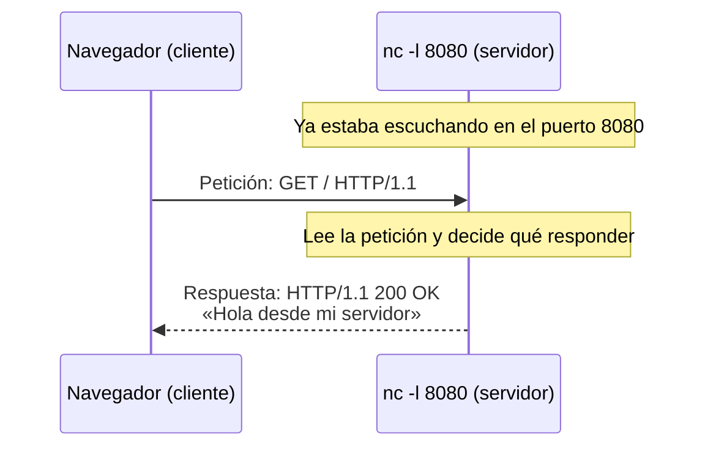

import Term from '~/components/Term.astro';
import TryIt from '~/components/TryIt.astro';
import Analogy from '~/components/Analogy.astro';
import SelfCheck from '~/components/SelfCheck.astro';

## El problema

Imagina dos programas que necesitan hablar. Uno está en tu portátil: tu navegador. El otro está en un ordenador en algún lugar del mundo y tiene la página que quieres ver.

Para que haya conversación, primero tienen que ponerse de acuerdo en algo muy básico: **quién empieza**. Si los dos esperan a que hable el otro, no pasa nada. Si los dos hablan a la vez, tampoco.

La solución que usa casi todo internet es repartir los papeles de antemano. Uno de los dos programas se queda esperando, siempre disponible. El otro inicia la conversación cuando necesita algo.

Al que inicia lo llamamos <Term id="client">cliente</Term>. Al que espera, <Term id="server">servidor</Term>. Esa asimetría, en la que uno pide y el otro espera y responde, es el **modelo cliente-servidor**. Es la base de todo lo que vas a construir en este curso.

## La analogía

<Analogy>

Piensa en una tienda con mostrador. La tienda abre en una dirección conocida y espera. No sabe quién va a entrar ni cuándo. Los clientes llegan, piden algo en el mostrador y se van con lo que han pedido. La tienda nunca sale a la calle a buscar a nadie: su trabajo es estar abierta y atender.

Un servidor funciona igual. Está «abierto» en una dirección, espera y, cuando llega un cliente con una petición, le responde.

- Una tienda atiende a unos pocos clientes a la vez. Un servidor puede atender a miles al mismo tiempo.
- El dependiente quizá se acuerde de ti la próxima vez que entres. Un servidor web, por defecto, no: cada petición le llega como si fuera la primera. Para que «se acuerde» de ti hace falta un mecanismo extra, las cookies, que verás en la Fase 2.
- Una tienda es siempre tienda. Un programa, en cambio, puede ser servidor y cliente a la vez. El backend de una web, que viste en la lección 1, atiende las peticiones de su frontend y, para responderlas, hace a su vez de cliente: pide datos a una base de datos o a un servicio de pagos.

</Analogy>

## Cómo funciona de verdad

### Cliente y servidor son papeles, no máquinas

Cuando alguien dice «el servidor», solemos imaginar un armario lleno de luces en un centro de datos. Pero la palabra describe un papel en una conversación, no un tipo de ordenador.

Un servidor es un programa. Por extensión, al ordenador donde se ejecuta también lo llamamos servidor, y por eso las dos ideas se confunden. Lo que convierte a un programa en servidor es una sola cosa: **está escuchando**.

### Qué significa «escuchar»

Cuando arrancas un programa, el sistema operativo crea un <Term id="process">proceso</Term>: el programa en ejecución, con su memoria y su espacio propio. Un programa servidor hace algo más al arrancar. Le pide al sistema operativo: «todo lo que llegue a este número, pásamelo a mí».

Ese número es el <Term id="port">puerto</Term>. Un servidor web suele escuchar en el puerto 80, o en el 443 si usa HTTPS. En la lección 5 verás los puertos a fondo. Por ahora basta con esta idea: el ordenador tiene una dirección, y cada programa que escucha tiene su puerto.

Un programa que escucha no hace nada mientras no llegue nadie. Se queda esperando, a veces durante días.

### Petición y respuesta

Cuando el cliente necesita algo, se conecta a la dirección y al puerto del servidor y le envía una <Term id="request">petición</Term> (*request*): un mensaje que dice qué quiere. El servidor la lee, decide qué contestar y le envía una <Term id="response">respuesta</Term> (*response*).

Ese ida y vuelta es la unidad básica de casi todo lo que pasa en la web. Y fíjate en el orden: **el cliente siempre empieza**. El servidor no puede responder a quien no le ha preguntado.

### Cliente y servidor en el mismo ordenador

Nada obliga a que el cliente y el servidor estén en máquinas distintas. Cuando ejecutas un servidor en tu portátil y lo abres en tu navegador, los dos están en el mismo ordenador.

Para eso existe un nombre especial, <Term id="localhost">localhost</Term>, que siempre significa «este ordenador». `localhost:8080` quiere decir «el programa que escucha en el puerto 8080 de esta misma máquina». Es exactamente lo que vas a usar ahora.

## Pruébalo

Vas a usar `nc` (netcat), una herramienta que viene instalada en macOS y en la mayoría de distribuciones Linux. `nc` sabe hacer una cosa muy básica: abrir una conexión y mostrarte lo que llega por ella. Con la opción `-l` (de *listen*, «escuchar»), se convierte en un servidor.

<TryIt
  title="1. Sé el servidor"
  cmd="nc -l 8080"
  output={`GET / HTTP/1.1
Host: localhost:8080
Connection: keep-alive
Upgrade-Insecure-Requests: 1
User-Agent: Mozilla/5.0 (Macintosh; Intel Mac OS X 10_15_7) AppleWebKit/537.36 (KHTML, like Gecko) Chrome/154.0.0.0 Safari/537.36
Accept: text/html,application/xhtml+xml,application/xml;q=0.9,image/avif,image/webp,image/apng,*/*;q=0.8,application/signed-exchange;v=b3;q=0.7
Accept-Encoding: gzip, deflate, br, zstd
Accept-Language: en-GB,en-US;q=0.9,en;q=0.8`}
>

Al ejecutarlo, la terminal se queda quieta: `nc` está escuchando en el puerto 8080. Ahora abre tu navegador y entra en `http://localhost:8080`.

Si en Linux `nc -l 8080` termina enseguida con un error, prueba con `nc -l -p 8080`: algunas versiones de netcat piden el puerto con `-p`.

En la terminal aparecerá la petición que acaba de enviar tu navegador. Es texto plano. La primera línea dice qué quiere: `GET /`, es decir, «dame la página principal». Las siguientes, llamadas **cabeceras**, añaden detalles: a qué servidor va dirigida (`Host`), qué navegador eres (`User-Agent`) o qué formatos entiendes (`Accept`).

Tu navegador enviará cabeceras parecidas, pero no idénticas: tus valores serán distintos, y aquí hemos quitado algunas que empiezan por `sec-` para que se lea mejor.

Mientras tanto, el navegador se queda cargando. Ha enviado su petición y espera una respuesta que nadie le ha dado. Deja la terminal tal cual y sigue con el siguiente paso.

</TryIt>

Ahora vas a responder tú. Con `nc` todavía abierto y el navegador cargando, haz clic en la terminal y escribe estas cuatro líneas. No son comandos: es el texto de tu respuesta.

<TryIt
  title="2. Responde tú, a mano"
  lang="http"
  cmd={`HTTP/1.1 200 OK
Content-Type: text/plain; charset=utf-8

Hola desde mi servidor`}
  output="Hola desde mi servidor"
>

Pulsa Enter al final de cada línea. La tercera está vacía a propósito: separa las cabeceras del contenido.

Después pulsa <kbd>Ctrl</kbd> + <kbd>C</kbd>. Eso cierra `nc` y, con él, la conexión. El navegador entiende que la respuesta ha terminado y muestra en pantalla «Hola desde mi servidor».

Acabas de hacer, a mano, el trabajo de un servidor web: recibir una petición y devolver una respuesta con el formato que el navegador espera. Ese formato se llama HTTP, y lo verás a fondo en la Fase 2.

</TryIt>

Tu navegador no es el único cliente posible. `curl` es un cliente que se usa desde la terminal. Vuelve a arrancar `nc -l 8080` en una terminal y, en otra ventana de terminal, ejecuta:

<TryIt
  title="3. Otro cliente: curl"
  cmd="curl -v http://localhost:8080"
  output={`* Host localhost:8080 was resolved.
* IPv6: ::1
* IPv4: 127.0.0.1
*   Trying [::1]:8080...
* connect to ::1 port 8080 from ::1 port 58624 failed: Connection refused
*   Trying 127.0.0.1:8080...
* Connected to localhost (127.0.0.1) port 8080
> GET / HTTP/1.1
> Host: localhost:8080
> User-Agent: curl/8.7.1
> Accept: */*
>
* Request completely sent off`}
>

Las líneas que empiezan por `>` son la petición que envía `curl`. Tiene la misma estructura que la del navegador, pero solo tres cabeceras: `Host`, `User-Agent` y `Accept`. La última línea, un `>` sin nada más, es la línea vacía que cierra la petición: la misma que escribiste tú en el ejercicio anterior para separar las cabeceras del contenido. En la terminal de `nc` verás esas mismas líneas, sin el `>`.

Las líneas que empiezan por `*` son `curl` contándote lo que hace. Si ves «Connection refused», como aquí, es que `curl` probó primero con la dirección IPv6 de localhost (`::1`), donde no escuchaba nadie, y después con la IPv4 (`127.0.0.1`), donde sí estaba `nc`. Según tu sistema puede que no te aparezca, y no pasa nada. Lo entenderás del todo en la lección 5. Por ahora, quédate con que «connection refused» significa «ahí no hay nadie escuchando». El número de puerto de esa línea será distinto en tu ordenador.

`curl` también se queda esperando la respuesta. Para terminar, pulsa <kbd>Ctrl</kbd> + <kbd>C</kbd> en las dos terminales.

</TryIt>

## Ya lo has visto

Llevas años usando este modelo desde el lado del cliente:

- Cuando abres una web o actualizas una app, tu navegador o la app son el cliente. Si la pestaña se queda cargando, espera la respuesta.
- Hasta el router de casa hace de servidor: escribe `192.168.1.1` en el navegador y suele responderte con su página de configuración.

Y si programas:

- Cada `fetch('/api/users')` de tu frontend es una petición, y tu código es el cliente.
- En DevTools, en la pestaña *Network*, haz clic en una petición y, en *Headers*, activa *Raw* en el apartado de *Request Headers*. Prueba con tu servidor de desarrollo (`localhost:5173`): verás el mismo tipo de texto que te mostró `nc`. En webs reales que usan HTTP/2 verás algunas líneas que empiezan por `:`, como `:method` o `:authority`. Es la misma información con otro formato, y lo verás en la Fase 2.
- Cuando ejecutas `npm run dev` y Vite te dice `Local: http://localhost:5173/`, has arrancado un servidor: un proceso escuchando en el puerto 5173 de tu máquina. Llevas tiempo ejecutando servidores sin llamarlos así.

## Errores comunes

- **«Un servidor es un ordenador grande en un centro de datos.»** Un servidor es un programa que escucha. Tu portátil con `nc -l 8080` en marcha es un servidor, aunque sea uno muy humilde.
- **«El servidor me puede mandar cosas cuando quiera.»** En el modelo clásico, el servidor solo responde: si nadie pregunta, no envía nada. Hay técnicas para que el servidor envíe datos sin que se los pidan, como WebSockets o Server-Sent Events, y las verás en la Fase 4. Incluso en ellas, el primer paso lo da el cliente.
- **«El frontend es el cliente y el backend es el servidor, siempre.»** El backend de una web es servidor para su frontend, pero también es cliente cada vez que consulta la base de datos o llama a otra API. Ser cliente o servidor depende de la conversación, no del programa.

## Resumen

- Cliente y servidor son papeles en una conversación, no tipos de máquina.
- Un servidor es un proceso que escucha en un puerto, esperando peticiones.
- El cliente siempre inicia: envía una petición y el servidor devuelve una respuesta.
- Un mismo programa puede ser servidor en una conversación y cliente en otra.

## ¿Lo has entendido?

<SelfCheck question="El backend de una tienda online recibe una petición de su frontend y, para responderla, llama a la API de Stripe. ¿Ese backend es cliente o servidor?">

Las dos cosas. Es servidor para su frontend, porque espera sus peticiones y las responde. Y es cliente de Stripe, porque es él quien inicia esa petición. Ser cliente o servidor es un papel en una conversación, no una propiedad del programa.

</SelfCheck>

<SelfCheck question="Cuando ejecutas nc -l 8080 y abres localhost:8080, el navegador se queda cargando. ¿Por qué?">

Porque el navegador ya envió su petición y está esperando la respuesta. `nc` solo muestra lo que recibe; hasta que respondas tú, o lo pares con <kbd>Ctrl</kbd> + <kbd>C</kbd>, el navegador sigue esperando.

</SelfCheck>

<SelfCheck question="¿Qué hace falta, como mínimo, para que un programa sea un servidor?">

Que escuche, es decir, que le pida al sistema operativo recibir las conexiones que lleguen a un puerto, y que responda a lo que le llega. No hace falta una máquina especial ni un programa complicado.

</SelfCheck>

## Para profundizar

- [Descripción general de cliente-servidor](https://developer.mozilla.org/es/docs/Learn_web_development/Extensions/Server-side/First_steps/Client-Server_overview) (MDN): el mismo modelo, visto desde una web dinámica, con ejemplos de peticiones y respuestas reales.
- [Generalidades del protocolo HTTP](https://developer.mozilla.org/es/docs/Web/HTTP/Guides/Overview) (MDN): un primer vistazo al protocolo que acabas de hablar a mano. Lo verás a fondo en la Fase 2.
