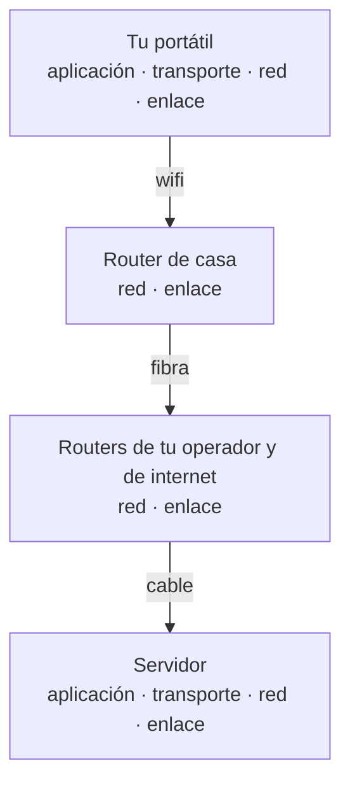

import Term from '~/components/Term.astro';
import TryIt from '~/components/TryIt.astro';
import Analogy from '~/components/Analogy.astro';
import SelfCheck from '~/components/SelfCheck.astro';
import Encapsulation from '~/components/diagrams/Encapsulation.astro';

## El problema

En la lección anterior escribiste una petición HTTP y `nc` «la envió» a example.com. Pero piensa en todo lo que tiene que pasar para que unas líneas de texto salgan de tu portátil y lleguen a un servidor que puede estar en otro país:

- Hay que encontrar el ordenador de destino entre miles de millones.
- Hay que cruzar muchas redes distintas: la de tu casa, la de tu operador y las que haya por el camino.
- Hay que trocear los datos y conseguir que lleguen todos, en orden, aunque alguno se pierda.
- Hay que entregarlos al programa correcto dentro de ese ordenador.
- Y hay que convertirlo todo en señales que viajen por el aire del wifi, por un cable o por fibra óptica.

Si HTTP tuviera que resolver todo eso, también tendrían que hacerlo DNS, SSH, el correo y cualquier protocolo nuevo. Cada uno repetiría el mismo trabajo, y cambiar el wifi por un cable obligaría a reescribirlos todos.

La solución es repartir el problema en **<Term id="layer">capas</Term>** (*layers*). Cada capa resuelve una sola parte, usa los servicios de la capa de abajo y ofrece los suyos a la de arriba. HTTP solo se preocupa de qué dicen los programas. Del resto se encargan otros.

## La analogía

<Analogy>

Piensa en enviar una carta por correo. Tú escribes la carta: el contenido es cosa tuya. La metes en un sobre con el nombre de la persona y su dirección. Correos lee la dirección y lleva la carta a la oficina de la ciudad correcta, y de ahí a la calle y al portal. Por el camino viaja en camiones, trenes o aviones, y tú no sabes ni te importa en cuáles.

Cada parte del sistema hace su trabajo sin mirar el de las demás. Al cartero no le hace falta leer tu carta. Tú no eliges el camión. Y si mañana Correos cambia los camiones por drones, tu carta sigue igual.

Las capas de internet funcionan así: tu mensaje va dentro de un sobre, que va dentro de otro sobre, y cada capa solo lee el suyo. La carta es tu mensaje HTTP; el nombre, el puerto; la dirección, la IP; y los camiones, la capa de enlace.

- En el correo, la dirección se escribe una vez. En internet, cada capa añade su propia etiqueta, y la de la capa más baja se cambia por una nueva en cada salto del camino, como si cada camión pusiera su propio sobre exterior.
- Una carta viaja entera. Tus datos viajan troceados en muchos paquetes que pueden ir por caminos distintos y llegar desordenados. Volver a ordenarlos es trabajo de una capa, como verás en la lección 6.
- El correo tarda días. Todo esto ocurre en milisegundos, y casi todo lo hace tu sistema operativo sin que el navegador se entere.
- Una carta va en un sobre cerrado. Un mensaje HTTP sin cifrar (`http://`) se parece más a una postal: nadie en el camino necesita leerla, pero cualquiera podría. Para eso está TLS, que verás en la lección 8.

</Analogy>

## Cómo funciona de verdad

### Las cuatro capas de TCP/IP

El modelo que usa internet se llama **TCP/IP**, por sus dos protocolos más importantes. Tiene cuatro capas:

| Capa | Qué resuelve | Protocolos | Quién la hace |
|---|---|---|---|
| **Aplicación** | Qué se dicen los programas | HTTP, <Term id="dns">DNS</Term>, SSH, SMTP | El programa (el navegador, `curl`…) o una librería (código ya hecho) |
| **Transporte** | A qué programa va cada dato y, con TCP, que llegue completo y en orden | <Term id="tcp">TCP</Term>, UDP | El sistema operativo |
| **Red** (o Internet) | Cómo llega cada trozo de un ordenador a otro, cruzando redes | IP | El sistema operativo y los routers del camino |
| **Enlace** | Cómo viajan los bits hasta el siguiente aparato del camino | Ethernet, wifi | La tarjeta de red y su controlador (*driver*) |

Fíjate en la última columna. Cuando el navegador pide una página, trabaja casi solo en la capa de aplicación. Del transporte y la red se encarga, casi siempre, el sistema operativo, y del enlace, el hardware. Por eso se puede programar una web entera sin saber nada de esto. Y por eso, cuando algo falla por debajo, cuesta tanto entender qué pasa.

Cada capa habla con **la misma capa del otro lado**. Tu HTTP habla con el HTTP del servidor; tu TCP, con su TCP. Pero ninguna lo hace directamente: cada una le pasa sus datos a la de abajo, y el mensaje solo viaja de verdad por la capa más baja.

### Sobres dentro de sobres: la encapsulación

Cuando envías un mensaje, baja por las capas, y cada una lo envuelve con su propia <Term id="header">cabecera</Term> (*header*): unos bytes al principio con la información que necesita para hacer su trabajo. No son líneas de texto como las de HTTP, sino campos binarios. A eso se le llama <Term id="encapsulation">encapsulación</Term>:

<Encapsulation
  caption="Al enviar, el mensaje baja de arriba abajo y cada capa añade su cabecera (los bloques de colores). La capa de enlace añade además una cola (trailer) al final para detectar errores de transmisión. Al recibir, se hace al revés: cada capa quita su cabecera y entrega lo de dentro a la de arriba. El mensaje HTTP no cambia en todo el camino (con http://; con HTTPS viaja cifrado, como verás más abajo)."
  layers={{
    application: 'Aplicación · mensaje',
    transport: 'Transporte · segmento',
    network: 'Red · paquete',
    link: 'Enlace · trama',
  }}
  blocks={{
    data: 'Mensaje HTTP',
    transportHeader: 'TCP',
    networkHeader: 'IP',
    linkHeader: 'Ethernet',
    linkTrailer: 'Cola',
  }}
/>

Esto es lo que lleva cada cabecera:

- **TCP** apunta los puertos de origen y de destino (a qué programa va) y unos números para poner los trozos en orden.
- **IP** apunta la <Term id="ip-address">dirección IP</Term> de origen y la de destino (a qué ordenador va).
- **Ethernet o wifi** apunta la <Term id="mac-address">dirección MAC</Term> de origen (la tuya) y la del siguiente aparato del camino, normalmente tu router.

Además, cada cabecera dice qué va dentro, y así quien la recibe sabe a qué capa entregarlo.

Cada capa llama de una forma distinta a lo que maneja: **mensaje** en aplicación, **segmento** (*segment*) en TCP, <Term id="packet">paquete</Term> (*packet*) en IP y **trama** (*frame*) en enlace. Verás estas palabras a menudo, y ahora sabes que son, en esencia, el mismo dato con más o menos sobres alrededor. Con un matiz: si el mensaje es grande, TCP lo trocea y cada segmento lleva solo una parte. Con UDP, la unidad se llama datagrama. Y en la práctica mucha gente dice «paquete» para todo.

### El viaje, salto a salto

Entre tu portátil y el servidor hay varios <Term id="router">routers</Term>, y cada tramo entre dos de ellos es un salto (*hop*). Un router solo necesita llegar hasta la capa de red. Recibe la trama, quita el sobre de enlace, lee la dirección IP de destino, decide hacia dónde reenviar el paquete y lo vuelve a envolver con un sobre de enlace nuevo para el siguiente tramo.

Las capas de transporte y aplicación solo existen en los dos extremos. Los routers del camino no necesitan abrir tu segmento TCP ni leer tu mensaje HTTP. El router de tu casa es una excepción parcial, porque además hace algo llamado NAT que sí toca las direcciones y los puertos. Lo verás en la lección 5.

### El modelo OSI, como referencia

En los años 80, a la vez que TCP/IP, la ISO diseñó otro modelo, **OSI** (*Open Systems Interconnection*), con siete capas. Sus protocolos perdieron frente a los de TCP/IP, pero su vocabulario sigue vivo, y por eso conviene saber traducirlo:

| OSI | Nombre | En TCP/IP | Ejemplos |
|---|---|---|---|
| 7 | Aplicación | Aplicación | HTTP, DNS |
| 6 | Presentación | Aplicación | Formatos y codificación de los datos |
| 5 | Sesión | Aplicación | Mantener una conversación abierta |
| 4 | Transporte | Transporte | TCP, UDP |
| 3 | Red | Red | IP |
| 2 | Enlace de datos | Enlace | Ethernet, wifi |
| 1 | Física | Enlace | Cables, fibra, ondas de radio |

Cuando alguien dice «capa 7» se refiere a la aplicación (HTTP), y «capa 4» es el transporte (TCP). Lo oirás, por ejemplo, al hablar de balanceadores de carga (*load balancers*) en la Fase 9. Un balanceador «de capa 4» reparte conexiones mirando solo IPs y puertos, y uno «de capa 7» puede mirar la URL o las cabeceras HTTP. Algunos protocolos, como <Term id="tls">TLS</Term>, no encajan limpiamente en ninguna capa: se suelen colocar entre el transporte y la aplicación.

## Pruébalo

`curl -v` te enseña lo que hace en cada paso, y puedes reconocer las capas en su salida. La opción `-s` quita la barra de progreso, y `-o /dev/null` tira el contenido de la página para que no tape lo que nos interesa.

<TryIt
  title="1. Las capas en la salida de curl"
  cmd="curl -sv http://example.com -o /dev/null"
  output={`* Host example.com:80 was resolved.
* IPv6: 2606:4700:10::6814:179a, 2606:4700:10::ac42:93f3
* IPv4: 172.66.147.243, 104.20.23.154
*   Trying [2606:4700:10::6814:179a]:80...
* Connected to example.com (2606:4700:10::6814:179a) port 80
> GET / HTTP/1.1
> Host: example.com
> User-Agent: curl/8.7.1
> Accept: */*
>
* Request completely sent off
< HTTP/1.1 200 OK
< Date: Fri, 02 Oct 2026 18:15:37 GMT
< Content-Type: text/html; charset=utf-8
< Connection: keep-alive
< Server: cloudflare
…
<
{ [589 bytes data]
* Connection #0 to host example.com left intact`}
>

Recorre la salida de arriba abajo:

- **`was resolved` y las líneas IPv6/IPv4.** Antes de nada, `curl` ha usado otro protocolo de aplicación, DNS, para traducir `example.com` a direcciones IP. Lo verás en la lección 7.
- **`Trying [2606:…]:80`.** Aquí aparecen dos capas a la vez: la dirección IP de destino (red; en este caso, una dirección IPv6) y el puerto 80 (transporte).
- **`Connected to example.com … port 80`.** La conexión TCP está abierta: a partir de aquí, la capa de transporte se encarga de que lo que envíe `curl` llegue completo y en orden. Cómo se abre una conexión lo verás en la lección 6.
- **Las líneas con `>` y `<`.** La capa de aplicación: la misma petición HTTP que escribiste a mano en la lección anterior y su respuesta. Hemos recortado algunas cabeceras.
- **`{ [589 bytes data]`.** El contenido de la página, que `curl` ha recibido y tirado a `/dev/null`. El `{` indica lo que entra y el `}`, lo que sale.
- **`Connection #0 … left intact`.** `curl` no cierra la conexión, por si le pides más URLs en el mismo comando: es el `keep-alive` de la lección anterior. Al terminar `curl`, el sistema operativo la cierra.

¿Y la capa de enlace? No aparece, porque `curl` no la ve. La gestionan tu sistema operativo y tu tarjeta de red. Tus direcciones y fechas serán distintas, y es posible que tu `curl` se conecte por IPv4 en lugar de IPv6.

</TryIt>

Ahora pide la misma página por HTTPS. Entre la conexión TCP y la petición HTTP aparece algo nuevo:

<TryIt
  title="2. Una capa más: TLS"
  cmd="curl -sv https://example.com -o /dev/null"
  output={`* Connected to example.com (2606:4700:10::6814:179a) port 443
* ALPN: curl offers h2,http/1.1
* (304) (OUT), TLS handshake, Client hello (1):
…
* (304) (IN), TLS handshake, Server hello (2):
…
* (304) (OUT), TLS handshake, Finished (20):
* SSL connection using TLSv1.3 / AEAD-CHACHA20-POLY1305-SHA256 / [blank] / UNDEF
* ALPN: server accepted h2
…
* using HTTP/2
* [HTTP/2] [1] [:method: GET]
* [HTTP/2] [1] [:scheme: https]
* [HTTP/2] [1] [:authority: example.com]
* [HTTP/2] [1] [:path: /]`}
>

Esta vez el puerto es el 443, el de HTTPS. Justo después de `Connected` hay un intercambio de mensajes `TLS handshake`: el cliente y el servidor acuerdan cómo cifrar la conexión antes de enviar nada de HTTP. Es TLS, la capa extra que se pone encima de TCP y debajo de HTTP. La verás a fondo en la lección 8.

Fíjate también en las líneas `ALPN`: dentro de esa negociación, `curl` y el servidor acuerdan hablar HTTP/2 (`h2`). Desde ahí la petición viaja en binario. Las líneas `[HTTP/2]` muestran los campos que van dentro, como las pseudo-cabeceras (*pseudo-headers*) `:method` o `:path`, que hacen el papel de la primera línea de HTTP/1.1 (`GET /`). Más abajo verás también `> GET / HTTP/2`: es `curl` enseñándote la misma petición en el formato de siempre para que la leas, no lo que viaja por la red.

Hemos recortado parte de la salida. El `(304)` de las líneas TLS es el código de la versión TLS 1.3; en Linux verás `TLSv1.3` en su lugar.

</TryIt>

La capa de enlace no se veía en `curl`, pero puedes ver su dirección. Tu ordenador tiene una dirección en cada una de las dos capas de abajo:

<TryIt
  title="3. Dos capas, dos direcciones"
  cmd="ifconfig en0 | grep -E 'ether|inet '"
  output={`	ether 3a:7f:c2:19:5e:d4
	inet 192.168.1.133 netmask 0xffffff00 broadcast 192.168.1.255`}
>

`ifconfig en0` muestra la configuración de una conexión de red (en un portátil, `en0` suele ser el wifi), y `grep` se queda solo con las dos líneas que nos interesan. La barra `|` pasa la salida de un comando al siguiente; lo verás en la Fase 1.

- **`ether`** es tu dirección MAC, la de la **capa de enlace**. Identifica a tu tarjeta de red dentro de tu red local. Tu router la usa para entregarte las tramas, pero no sale de tu casa. Con wifi, macOS puede enseñarte una dirección privada que genera para cada red, en lugar de la de fábrica.
- **`inet`** es tu dirección IP, la de la **capa de red**. Es la que usan los paquetes para llegar a tu ordenador. Que empiece por `192.168.` significa que es una dirección privada, de las que solo existen dentro de tu red; también lo son las que empiezan por `10.` y las de `172.16.` a `172.31.`. Por qué existen y cómo sales a internet con ella lo verás en la lección 5.

Hemos cambiado la dirección MAC por una de ejemplo, y tus valores serán distintos. Si no aparece la línea `inet`, prueba con `en1`, o mira qué conexión usas con `route get default | grep interface`. En Linux, el comando equivalente es `ip addr show`: busca las líneas `link/ether` e `inet`.

</TryIt>

## Ya lo has visto

**Cuando una web no carga, los errores de Chrome se pueden leer por capas:**

- `ERR_INTERNET_DISCONNECTED` (la página del dinosaurio): tu sistema operativo dice que no hay ninguna conexión de red activa. Normalmente falla la capa de enlace (el wifi apagado o el cable suelto). Si el wifi funciona pero tu router no tiene salida a internet, verás otros errores.
- `ERR_NAME_NOT_RESOLVED`: DNS no ha encontrado la dirección del nombre (capa de aplicación).
- `ERR_CONNECTION_REFUSED`: el ordenador de destino responde, pero nadie escucha en ese puerto. Es la capa de transporte. Es lo que viste con `curl` en la lección 2.
- **Un `404`:** todas las capas han funcionado y el servidor te ha respondido, en HTTP, que eso no existe.

**Si quieres verlo por dentro, abre DevTools**, las herramientas para desarrolladores de Chrome: <kbd>F12</kbd>, o <kbd>Cmd</kbd> + <kbd>Opción</kbd> + <kbd>I</kbd> en Mac. En *Network*, recarga la página, haz clic en una petición y abre *Timing*. Verás la petición desglosada en fases, y cada fase es una capa o un protocolo de los que acabas de ver:

| En DevTools | Qué es |
|---|---|
| *DNS Lookup* | DNS traduce el nombre a una IP (aplicación) |
| *Initial connection* | Abrir la conexión TCP (transporte). En HTTPS incluye también el *handshake* TLS |
| *SSL* | La parte de *Initial connection* que ocupa TLS |
| *Request sent* | Enviar la petición HTTP |
| *Waiting for server response* | Esperar el primer byte de la respuesta: la ida y vuelta por la red más lo que tarda el servidor |
| *Content Download* | Recibir el resto de la respuesta |

Si la conexión se reutiliza, no verás *DNS Lookup*, *Initial connection* ni *SSL*: ya estaban hechas.

Y si programas:

- `ERR_CONNECTION_REFUSED` es también lo que ves en la consola cuando tu frontend llama a `localhost:3000` y el backend no está arrancado.
- Un `fetch` en tu código solo toca la capa de aplicación.

## Errores comunes

- **«TCP/IP es un protocolo.»** Es una familia de protocolos que trabajan juntos, y el modelo que los organiza. Se llama así por sus dos protocolos principales, TCP e IP.
- **«Hay que memorizar las siete capas de OSI.»** Internet funciona con TCP/IP. De OSI basta con saber traducir los números, sobre todo «capa 7» y «capa 4», porque se siguen usando para hablar de redes.
- **«Los routers leen mi petición HTTP.»** No les hace falta: miran hasta la capa de red. Pero cuidado: si la petición va sin cifrar (`http://`), cualquiera que esté en el camino podría abrir los sobres y leerla. Para evitarlo existe TLS, que verás en la lección 8.

## Resumen

- Internet reparte el problema en capas: aplicación, transporte, red y enlace. Cada una resuelve una sola parte y se apoya en la de abajo.
- Al enviar, cada capa envuelve el mensaje con su cabecera (encapsulación). Al recibir, cada capa quita la suya.
- Un programa como el navegador trabaja casi solo en la capa de aplicación. El sistema operativo y el hardware hacen casi todo lo demás.
- Los routers del camino solo llegan hasta la capa de red. Transporte y aplicación viven en los extremos.
- OSI es un modelo de siete capas que hoy sirve sobre todo como vocabulario («capa 4», «capa 7»).

## ¿Lo has entendido?

<SelfCheck question="Chrome te muestra ERR_CONNECTION_REFUSED. ¿En qué capa está el problema?">

En la de transporte. Tu intento de conexión ha llegado al ordenador de destino, así que la red funciona, pero ningún programa escucha en ese puerto y su sistema operativo rechaza la conexión. Tu petición HTTP ni siquiera llega a salir: sin conexión TCP no hay por dónde enviarla. Es lo mismo que viste en la lección 2, cuando `curl` probó con una dirección donde `nc` no estaba escuchando.

</SelfCheck>

<SelfCheck question="Si mañana se inventa un tipo de cable nuevo, más rápido, ¿habría que cambiar HTTP para usarlo?">

No. Solo cambiaría la capa de enlace. HTTP, TCP e IP seguirían igual, porque cada capa solo depende del servicio que le da la de abajo, no de cómo lo consigue. Es justo la ventaja de repartir el trabajo en capas.

</SelfCheck>

<SelfCheck question="¿Un router de tu operador necesita entender HTTP para hacer llegar tu petición?">

No. Solo lee la cabecera IP para decidir hacia dónde reenviar el paquete. Tu mensaje HTTP viaja dentro, sin que el router lo abra. Eso también significa que, si va sin cifrar, nada impide que alguien en el camino lo lea, y por eso existe HTTPS.

</SelfCheck>

## Para profundizar

- [¿Qué es el modelo OSI?](https://www.cloudflare.com/es-es/learning/ddos/glossary/open-systems-interconnection-model-osi/) (Cloudflare Learning): las siete capas, con ejemplos de qué pasa en cada una.
- [TCP](https://developer.mozilla.org/es/docs/Glossary/TCP) (glosario de MDN): la definición corta del protocolo de transporte que verás a fondo en la lección 6.
- [RFC 1122](https://www.rfc-editor.org/rfc/rfc1122.html) (en inglés): el documento que describe las capas de TCP/IP tal como las usan los ordenadores conectados a internet. Para curiosos.
