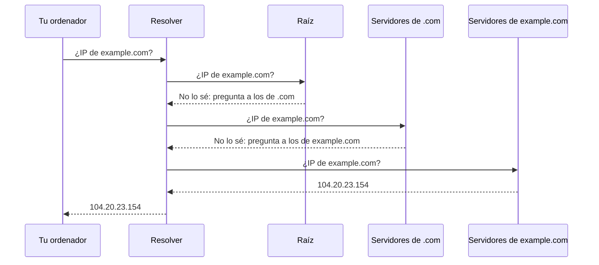

import Term from '~/components/Term.astro';
import TryIt from '~/components/TryIt.astro';
import Analogy from '~/components/Analogy.astro';
import SelfCheck from '~/components/SelfCheck.astro';
import DnsLookup from '~/playgrounds/dns-lookup/DnsLookup';

## El problema

En la lección 5 viste que, para llegar a un ordenador, la red necesita su dirección IP. Pero tú escribes `example.com`, no `104.20.23.154`. Alguien tiene que traducir el nombre a la dirección.

Al principio de internet, en los años 70, esa traducción era un fichero, `HOSTS.TXT`, con todos los nombres y sus direcciones. Lo mantenía una sola organización, y cada ordenador se descargaba una copia de vez en cuando. Funcionó mientras había unos cientos de ordenadores. Con miles, el fichero no paraba de cambiar, nadie tenía la última versión y cualquier error afectaba a todos.

Hoy hay cientos de millones de dominios, que cambian de dirección constantemente. Ningún fichero, ni ningún servidor, puede saberlos todos. Hace falta una base de datos repartida, en la que cada uno se encargue de sus propios nombres. Eso es el <Term id="dns">DNS</Term> (*Domain Name System*).

## La analogía

<Analogy>

Imagina que llegas a una ciudad que no conoces y le preguntas a la recepción del hotel por la dirección de una tienda. La recepcionista no se sabe todas las tiendas del mundo, pero sabe a quién preguntar. Llama a la oficina de turismo del país, que le da el teléfono de la oficina de la ciudad. Esa oficina le da el de la asociación de comerciantes del barrio, y ahí sí saben la dirección exacta.

Tú solo has hecho una pregunta: todas las llamadas las ha hecho ella. Te apunta la dirección y además se la guarda en una libreta, por si otro cliente pregunta por la misma tienda. Pero con una nota: «válido hasta el viernes», porque las tiendas se mudan.

La recepción es tu <Term id="resolver">resolver</Term>. Las oficinas son los servidores DNS de cada nivel: la raíz, el de `.com` y el del dominio. La libreta es su <Term id="cache">caché</Term>, y la fecha de caducidad, el TTL.

- En el mundo real, las oficinas de turismo de un país son una o dos. En DNS, «la raíz» son 13 nombres de servidor, y detrás de ellos hay más de 2.000 máquinas repartidas por el mundo, que responden lo mismo.
- La recepcionista no comprueba si la tienda se ha mudado antes del viernes. El resolver tampoco: hasta que caduca la nota, sigue dando la dirección guardada, aunque ya no sea la buena.

</Analogy>

## Cómo funciona de verdad

### Un árbol de nombres

Un nombre de dominio se lee de derecha a izquierda, de lo más general a lo más concreto. En `www.example.com.` (sí, con un punto al final, aunque casi nunca se escriba):

- **`.`, el punto final,** es la raíz del árbol.
- **`com`** es un dominio de primer nivel o TLD (*top-level domain*), como `es`, `org` o `dev`.
- **`example.com`** es el dominio que alguien ha comprado.
- **`www.example.com`** es un nombre dentro de ese dominio, que su dueño crea como quiere.

Cada nivel se lo encarga a otro: la raíz sabe quién lleva cada TLD, el TLD sabe quién lleva cada dominio, y el dueño del dominio decide sus nombres. Cada uno de esos tramos es una **zona**, con sus propios servidores DNS.

### El recorrido de una consulta

Cuando tu navegador necesita la IP de `example.com`, se la pide al sistema operativo, que pregunta a tu resolver: normalmente el de tu operador, o uno público como `1.1.1.1` (Cloudflare) u `8.8.8.8` (Google). Si el resolver no tiene la respuesta en su caché, hace este recorrido:

1. **La raíz** no sabe la respuesta, pero sabe quién lleva `.com`, y se lo dice al resolver.
2. **Los servidores de `.com`** tampoco la saben, pero saben quién lleva `example.com`.
3. **Los servidores de `example.com`** sí la saben: son sus <Term id="authoritative-server">servidores autoritativos</Term>, los que tienen la respuesta oficial. Los elige quien compró el dominio (example.com usa los de Cloudflare).
4. **El resolver** te da la respuesta y la guarda en su caché.

Fíjate en que nadie conoce el mapa entero, igual que los routers de la lección 5: cada servidor solo sabe a quién derivarte. Y casi nunca se hace el recorrido completo, porque los resolvers guardan en caché también los pasos intermedios. Que `.com` lo llevan `a.gtld-servers.net` y compañía lo saben desde hace días.

Las consultas DNS suelen viajar por UDP, puerto 53: una pregunta corta y una respuesta corta, sin handshake, como viste en la lección 6. Si no llega respuesta, se vuelve a preguntar, y si la respuesta no cabe en un datagrama, se repite por TCP. Y desde hace unos años existe DNS sobre HTTPS (DoH), que cifra la consulta. Es lo que usa el laboratorio de esta lección, porque una página web no puede enviar consultas DNS por UDP, pero sí peticiones HTTPS.

### Los tipos de registro

Un dominio no solo guarda direcciones. Cada dato que publica es un <Term id="dns-record">registro</Term>, con un tipo:

| Tipo | Qué guarda | Ejemplo |
|---|---|---|
| **A** | Una dirección IPv4 | `example.com` → `104.20.23.154` |
| **AAAA** | Una dirección IPv6 | `example.com` → `2606:4700:10::6814:179a` |
| **CNAME** | Un alias: «este nombre es otro» | `www.github.com` → `github.com` |
| **MX** | El servidor de correo del dominio | `gmail.com` → `gmail-smtp-in.l.google.com` |
| **TXT** | Texto libre | Pruebas de que el dominio es tuyo y reglas contra el correo falso |
| **NS** | Los servidores DNS de la zona | `example.com` → `hera.ns.cloudflare.com` |

Un CNAME puede costar una consulta más. Si el destino está en la misma zona (`www.github.com` → `github.com`), el servidor autoritativo incluye su dirección en la misma respuesta. Si está en otra, como cuando un dominio apunta a `cname.vercel-dns.com`, el resolver tiene que buscarlo aparte, con su propio recorrido. Y un MX dice a dónde entregar el correo de `@gmail.com`: el DNS no sirve solo para la web.

### El TTL y la «propagación»

Cada registro lleva un <Term id="ttl">TTL</Term> (*time to live*): los segundos que se puede guardar en una caché. Si example.com publica su dirección con un TTL de 300, un resolver la puede dar durante 5 minutos sin volver a preguntar. (No es el TTL de los paquetes IP de la lección 5, que cuenta saltos, no segundos.)

Por eso, cuando cambias la IP de tu dominio, unos usuarios ven la nueva enseguida y otros siguen viendo la vieja un rato. Se suele decir que el cambio «se está propagando», pero nada se propaga: lo que pasa es que cada caché del mundo espera a que caduque su copia. Un TTL corto hace que los cambios lleguen antes, a cambio de más consultas.

## Pruébalo

Empieza por el laboratorio. Consulta `example.com` y recorre los pasos: los nombres de los servidores son reales. Después prueba `www.github.com` (un CNAME), `gmail.com` con el tipo MX, un dominio que no exista y `github.com` con el tipo AAAA.

<DnsLookup client:visible lang="es" />

Ahora, desde la terminal. `dig` pregunta a tu resolver y te enseña la respuesta entera:

<TryIt
  title="1. Una consulta DNS, entera"
  cmd="dig example.com"
  output={`; <<>> DiG 9.10.6 <<>> example.com
;; global options: +cmd
;; Got answer:
;; ->>HEADER<<- opcode: QUERY, status: NOERROR, id: 33708
;; flags: qr rd ra; QUERY: 1, ANSWER: 2, AUTHORITY: 0, ADDITIONAL: 1

;; OPT PSEUDOSECTION:
; EDNS: version: 0, flags:; udp: 1232
;; QUESTION SECTION:
;example.com.			IN	A

;; ANSWER SECTION:
example.com.		17	IN	A	172.66.147.243
example.com.		17	IN	A	104.20.23.154

;; Query time: 22 msec
;; SERVER: 2001:db8::53#53(2001:db8::53)
;; WHEN: Sat Oct 03 09:30:15 CEST 2026
;; MSG SIZE  rcvd: 72`}
>

Lo importante:

- **`status: NOERROR`:** la consulta ha ido bien. Si el dominio no existiera, verías `NXDOMAIN`; y si existe pero no tiene registros del tipo pedido, `NOERROR` con `ANSWER: 0`.
- **`QUESTION SECTION`:** lo que se ha preguntado, el registro `A` de `example.com.`, con su punto final.
- **`ANSWER SECTION`:** dos registros A, cada uno con su TTL (`17`: le quedan 17 segundos en la caché del resolver), su clase (`IN`, internet) y la dirección.
- **`SERVER`:** el resolver que ha contestado, en el puerto 53. Hemos cambiado la dirección del resolver de nuestro operador por una de ejemplo; tú verás el tuyo. Si ves una IP privada como `192.168.1.1`, es tu router, que reenvía la consulta al resolver de tu operador.

En Linux y en WSL, `dig` viene en el paquete `dnsutils` (`sudo apt install dnsutils`).

</TryIt>

`+short` deja solo los valores, y `+noall +answer`, las líneas completas de la respuesta, con nombre, TTL y tipo. Con eso, los otros tipos:

<TryIt
  title="2. Otros tipos de registro"
  cmd={`dig +short example.com\ndig +noall +answer gmail.com MX\ndig +noall +answer example.com TXT\ndig +noall +answer www.github.com`}
  output={`172.66.147.243
104.20.23.154
gmail.com.		1487	IN	MX	40 alt4.gmail-smtp-in.l.google.com.
gmail.com.		1487	IN	MX	5 gmail-smtp-in.l.google.com.
gmail.com.		1487	IN	MX	20 alt2.gmail-smtp-in.l.google.com.
gmail.com.		1487	IN	MX	10 alt1.gmail-smtp-in.l.google.com.
gmail.com.		1487	IN	MX	30 alt3.gmail-smtp-in.l.google.com.
example.com.		300	IN	TXT	"_k2n1y4vw3qtb4skdx9e7dxt97qrmmq9"
example.com.		300	IN	TXT	"v=spf1 -all"
www.github.com.		3274	IN	CNAME	github.com.
github.com.		42	IN	A	140.82.121.4`}
>

- **Los MX** llevan un número delante, la prioridad: los servidores de correo prueban primero el más bajo (el 5) y, si no responde, el siguiente.
- **Los TXT** son texto libre. `v=spf1 -all` dice que ningún servidor está autorizado a enviar correo en nombre de example.com, y la cadena rara suele ser la prueba de que el dominio es de alguien ante algún servicio.
- **`www.github.com`** es un CNAME de `github.com`. Tu resolver sigue el alias y te devuelve las dos cosas: el CNAME y la dirección de `github.com`.

Tus TTL y algunas direcciones serán distintos.

</TryIt>

`+trace` hace el recorrido de verdad, sin la caché de tu resolver: pregunta a la raíz, luego a `.com` y luego a los autoritativos. `+nodnssec` quita unas firmas que aquí solo meterían ruido:

<TryIt
  title="3. El recorrido, servidor a servidor"
  cmd="dig +trace +nodnssec example.com"
  output={`.			10360	IN	NS	c.root-servers.net.
.			10360	IN	NS	b.root-servers.net.
.			10360	IN	NS	a.root-servers.net.
…
;; Received 823 bytes from 2001:db8::53#53(2001:db8::53) in 8 ms

com.			172800	IN	NS	a.gtld-servers.net.
com.			172800	IN	NS	b.gtld-servers.net.
…
;; Received 836 bytes from 192.5.5.241#53(f.root-servers.net) in 14 ms

example.com.		172800	IN	NS	hera.ns.cloudflare.com.
example.com.		172800	IN	NS	elliott.ns.cloudflare.com.
;; Received 359 bytes from 2001:502:1ca1::30#53(e.gtld-servers.net) in 29 ms

example.com.		300	IN	A	104.20.23.154
example.com.		300	IN	A	172.66.147.243
;; Received 72 bytes from 172.64.35.228#53(elliott.ns.cloudflare.com) in 13 ms`}
>

Cada bloque es una respuesta, y la línea `Received … from` dice quién la ha dado:

1. Tu resolver te da la lista de los 13 servidores raíz.
2. Un servidor raíz (`f.root-servers.net`) responde con los servidores de `.com`.
3. Un servidor de `.com` responde con los de example.com, que son de Cloudflare.
4. Un servidor autoritativo de example.com da por fin las direcciones, con su TTL original: 300 segundos.

Hemos recortado listas de servidores (`…`) y cambiado la dirección de nuestro resolver. Tus servidores concretos variarán: cada vez se elige uno de la lista.

</TryIt>

Por último, mira cómo caduca la caché. Ejecuta el mismo comando dos veces, con unos segundos entre una y otra:

<TryIt
  title="4. El TTL, contando hacia atrás"
  cmd="dig +noall +answer example.com A"
  output={`example.com.		294	IN	A	104.20.23.154
…
example.com.		288	IN	A	172.66.147.243`}
>

Entre las dos ejecuciones pasaron 6 segundos, y el TTL bajó de 294 a 288: tu resolver no ha vuelto a preguntar a los servidores de example.com, te está dando su copia y te dice cuánto le queda. Cuando llegue a cero, el resolver volverá a preguntar a los servidores de example.com (los de la raíz y los de `.com` los sigue teniendo en caché), y el TTL empezará otra vez en 300. Hemos dejado una línea de cada ejecución.

</TryIt>

## Ya lo has visto

- **`ERR_NAME_NOT_RESOLVED`** (o `DNS_PROBE_FINISHED_NXDOMAIN` en la página de error de Chrome): el navegador no ha conseguido la IP. O el nombre no existe (NXDOMAIN, muchas veces por una errata), o el resolver no responde.
- **El campo «DNS» de los ajustes del wifi** (en el móvil o el ordenador) es la dirección de tu resolver. Muchas veces es tu router, que reenvía las consultas al de tu operador.
- **«Añade estos registros en tu proveedor de DNS».** Cuando conectas un dominio a un servicio como Wix, Vercel, Netlify o GitHub Pages, te piden un registro A o un CNAME que apunte a sus servidores. Ahora sabes qué estás tocando, y por qué el cambio tarda un rato en verse.
- **`/etc/hosts`:** el descendiente directo de `HOSTS.TXT`. Tu ordenador lo mira antes de preguntar al resolver, y por eso una línea como `127.0.0.1 miapp.test` hace que `miapp.test` sea tu propio ordenador. Ojo: `dig` no lo mira, porque pregunta directamente al resolver. Para comprobarlo, usa `ping miapp.test`: su primera línea dice a qué IP va. Páralo con <kbd>Ctrl</kbd> + <kbd>C</kbd>.

En DevTools (lección 4):

- **_DNS Lookup_ en la pestaña _Timing_** es esta consulta. En la primera petición a un dominio verás unos milisegundos; en las siguientes, 0 o ni aparece, porque la respuesta está en caché o la conexión se reutiliza.

## Errores comunes

- **«Los cambios de DNS tardan 48 horas en propagarse».** No hay un plazo fijo: cada caché espera a que caduque su copia, y eso depende del TTL que pusiste. Si vas a cambiar la IP de un dominio, baja antes el TTL (por ejemplo, a 300 segundos) y espera a que caduque el antiguo: el cambio llegará en minutos. La excepción es cambiar de proveedor de DNS (los registros NS): ahí manda el TTL de la delegación en el TLD, que no eliges tú. En `.com` son 172800 segundos, las famosas 48 horas (lo viste en `dig +trace`).
- **«DNS solo traduce nombres a IPs».** También dice a dónde va el correo (MX), quién lleva cada zona (NS) y guarda texto para verificaciones y reglas antispam (TXT).
- **«Con HTTPS nadie ve qué webs visito».** HTTPS cifra el contenido de la página, pero la consulta DNS clásica viaja sin cifrar, por UDP, y tu resolver sabe todos los nombres que consultas. DoH y DNS sobre TLS cifran la consulta, pero el resolver los sigue viendo. Y aun así, el nombre suele viajar visible al empezar la conexión HTTPS (lo verás en la próxima lección), y la IP de destino siempre se ve.

## Resumen

- DNS traduce nombres a direcciones IP con una base de datos repartida, organizada como un árbol que se lee de derecha a izquierda.
- Tu resolver recorre el árbol por ti: la raíz lo deriva al TLD, el TLD a los servidores autoritativos del dominio, y estos dan la respuesta.
- Cada dato es un registro con un tipo: A, AAAA, CNAME, MX, TXT o NS, entre otros.
- Las respuestas se guardan en caché durante su TTL. Por eso los cambios tardan en verse: hay que esperar a que caduquen las copias.

## ¿Lo has entendido?

<SelfCheck question="Tu resolver nunca ha oído hablar de blog.ejemplo.dev. ¿A quién pregunta primero y qué le responde?">

A un servidor raíz, que no sabe la respuesta pero le dice qué servidores llevan `.dev`. Después pregunta a uno de esos, que le dice quién lleva `ejemplo.dev`, y por último a un servidor autoritativo de `ejemplo.dev`, que le da la dirección de `blog.ejemplo.dev`. (Si ya tuviera en caché quién lleva `.dev`, se saltaría la raíz.)

</SelfCheck>

<SelfCheck question="Cambias el registro A de tu dominio. Su TTL era de 86400 segundos. ¿Cuánto puede tardar alguien en ver la nueva IP?">

Hasta un día entero: 86400 segundos son 24 horas. Un resolver que guardó la respuesta justo antes del cambio puede seguir dando la IP antigua hasta que caduque. Para la próxima vez, baja el TTL con antelación: al menos lo que dure el antiguo (aquí, un día).

</SelfCheck>

<SelfCheck question="dig devuelve status: NXDOMAIN para un dominio. ¿Qué significa? ¿Y si devuelve NOERROR pero sin ninguna respuesta?">

NXDOMAIN significa que el nombre no existe, con ningún tipo de registro. Lo dice el servidor autoritativo de la zona más cercana que sí existe: el de `.com` si el dominio no está registrado, o el de `example.com` para `noexiste.example.com`. NOERROR sin respuestas significa que el nombre sí existe, pero no tiene registros del tipo que has pedido, por ejemplo un AAAA en un dominio sin IPv6.

</SelfCheck>

## Para profundizar

- [¿Qué es un DNS?](https://www.cloudflare.com/es-es/learning/dns/what-is-dns/) (Cloudflare Learning): el recorrido de una consulta, los tipos de servidor y la caché.
- [Los servidores raíz](https://root-servers.org/) (en inglés): el mapa con las más de 2.000 máquinas que hay detrás de los 13 nombres de la raíz.
- [RFC 1034](https://www.rfc-editor.org/rfc/rfc1034.html) (en inglés): el documento de 1987 que describe el DNS. Sus ideas (el árbol, las zonas y la caché) siguen igual.
