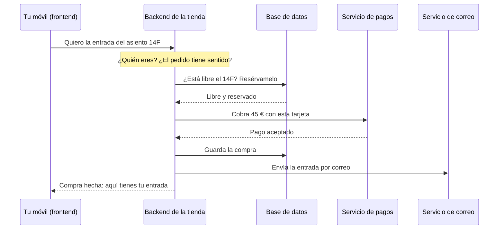

import Term from '~/components/Term.astro';
import TryIt from '~/components/TryIt.astro';
import Analogy from '~/components/Analogy.astro';
import SelfCheck from '~/components/SelfCheck.astro';
import DataToScreen from '~/components/diagrams/DataToScreen.astro';

## El problema

Abres la app de una sala de conciertos para comprar una entrada. En la pantalla ves el plano de la sala, los asientos libres en verde y un botón «Comprar». Eliges el 14F, pagas y, a los pocos segundos, te llega un correo con tu entrada.

Parece que todo ha pasado en tu móvil, pero tu móvil no podría hacerlo solo. Piensa en lo que necesita saber:

- Qué asientos quedan libres. Esa lista cambia cada segundo, porque miles de personas están comprando a la vez desde sus propios móviles.
- Que nadie más está comprando el 14F en ese mismo instante.
- Que el pago se ha hecho de verdad, y no solo que alguien ha pulsado un botón.
- Que la entrada es tuya, y a qué correo hay que enviarla.

Nada de eso puede vivir en tu móvil. La lista de asientos tiene que ser la misma para todo el mundo, y nadie puede llevar en el bolsillo la llave de la caja.

Por eso toda web y toda app tienen dos partes. La que tienes en la mano, la que ves y tocas, se llama <Term id="frontend">frontend</Term>. La que está en otro sitio, lleva la cuenta para todos y decide qué se puede hacer, se llama <Term id="backend">backend</Term>. Este curso va de esa segunda parte: la que no ves.

## La analogía

<Analogy>

Piensa en un restaurante.

La sala es el frontend. Es lo que ves: la carta, la mesa y cómo te presentan el plato. Está pensada para ti.

La cocina es el backend. No la ves, pero ahí pasa casi todo. Los cocineros siguen las recetas y las normas de la casa: no sirven un plato que se ha acabado ni cocinan dos veces el mismo pedido. La despensa guarda los ingredientes, igual que una <Term id="database">base de datos</Term> guarda los datos. Y cuando falta algo, la cocina se lo pide a un proveedor, como un backend que le pide algo a otro servicio.

El camarero une las dos partes. Lleva tu pedido a la cocina y te trae el plato. En una web, ese ir y venir es una <Term id="request">petición</Term> (*request*) y su <Term id="response">respuesta</Term> (*response*).

<div slot="limits">

- Una cocina da de comer a unas pocas mesas. Un backend puede atender a millones de personas a la vez.
- La sala no es solo decoración. El frontend también tiene lógica: comprueba que has rellenado un formulario antes de enviarlo, o suma el total de tu cesta mientras eliges.
- En un restaurante puedes asomarte a la cocina. En una web no ves nada del backend, y él tampoco te ve a ti: solo le llegan peticiones. Por eso no se fía de lo que le llega, como verás más abajo.

</div>

</Analogy>

## Cómo funciona de verdad

### Dónde se ejecuta cada parte

El frontend se ejecuta en tu dispositivo. Si es una web, en tu navegador: el navegador descarga la página y la pinta en tu pantalla. Si es una app, en tu móvil: la app ya está instalada, y solo le faltan los datos.

El backend se ejecuta en otros ordenadores, en un centro de datos que puede estar en otro país. Allí hay programas que se pasan el día esperando peticiones y respondiéndolas. A esos programas los llamamos <Term id="server">servidores</Term>, y en la [lección 2](/fase-0/modelo-cliente-servidor/) verás qué significa eso exactamente.

Entre los dos está internet. El frontend envía una petición por la red, el backend la recibe, hace su trabajo y devuelve una respuesta. Toda la Fase 0 va de cómo viajan esas peticiones y respuestas.

### Lo que viaja son datos, no pantallas

Cuando abres la app del tiempo, el backend no te envía la pantalla con el sol dibujado. Te envía datos: unos números y unas palabras. Es la app la que decide cómo pintarlos.

<DataToScreen
  caption="El backend de una app del tiempo envía solo datos (aquí, abreviados), sin colores ni dibujos. La app los convierte en lo que ves. El 0 de weather_code es un código que significa «despejado»: el frontend lo convierte en una palabra y un sol."
  labels={{
    data: 'Lo que envía el backend',
    screen: 'Lo que pinta el frontend',
    arrow: 'la app lo convierte en',
  }}
  json={JSON.stringify(
    { current: { time: '2026-10-04T12:00', temperature_2m: 17.4, weather_code: 0 } },
    null,
    2,
  )}
  card={{ place: 'Madrid', temperature: '17 °C', summary: 'Despejado' }}
/>

Este reparto tiene una gran ventaja. El mismo backend sirve a la web, a la app de iPhone y a la de Android, y cada una pinta los datos a su manera. Si mañana cambia el diseño de la app, el backend ni se entera.

Hay webs en las que el backend envía la página ya montada, en HTML (el lenguaje en el que se escriben las páginas web), en lugar de datos sueltos. Aun así, lo que viaja sigue siendo texto: quien lo convierte en lo que ves es tu navegador.

Para que funcione, el frontend tiene que saber qué puede pedir y cómo le llegarán las respuestas. Ese acuerdo se llama <Term id="api">API</Term>: lo que un programa ofrece a otros programas y la forma de pedírselo. El frontend habla con el backend a través de su API, y el backend, a su vez, usa las API de otros servicios. Los datos suelen viajar en JSON, un formato de texto con llaves, comillas y dos puntos que pueden leer tanto las personas como los programas.

### Lo que pasa al comprar una entrada

Volvamos al concierto. Cuando pulsas «Comprar», tu móvil envía una sola petición, pero el backend hace muchas cosas antes de responder:



Paso a paso:

1. **Comprueba quién eres.** ¿Has iniciado sesión? ¿Esa cuenta es de verdad la tuya?
2. **Comprueba que el pedido tiene sentido.** Que el asiento existe, que el precio es el correcto y que nadie intenta comprar 5.000 entradas de golpe.
3. **Reserva el asiento.** Le pregunta a la base de datos si el 14F está libre y lo aparta para ti en ese mismo momento, para que nadie más pueda comprarlo.
4. **Cobra.** No lo hace él mismo: le pide a un servicio de pagos que cobre la tarjeta y espera su respuesta.
5. **Guarda la compra** en la base de datos, para que mañana siga ahí.
6. **Encarga el correo** con tu entrada a un servicio de correo.
7. **Responde a tu móvil:** compra hecha.

Cada uno de esos pasos es una parte del backend que aprenderás en este curso. Comprobar quién eres, en la Fase 6. Las reglas y las comprobaciones, en la Fase 3. Hablar con otros servicios, en la Fase 4. Guardar los datos sin vender nunca dos veces el mismo asiento, en la Fase 5. Y dejar para dentro de un momento lo que puede esperar, como el correo, en la Fase 9. Lo tienes todo en el [temario](/roadmap/).

### Por qué no puede hacerlo todo el frontend

Podrías pensar: si el móvil ya tiene la app, ¿por qué no hace ella todo eso? Hay tres razones, y las tres vuelven una y otra vez en backend.

**El frontend está en manos de cualquiera.** El código de una web llega entero a tu navegador, y una app vive en tu móvil. Quien sepa un poco puede leerlo, cambiarlo o saltárselo y enviar peticiones a mano, como harás tú dentro de un momento en la <Term id="terminal">terminal</Term>. Si el precio de la entrada lo decidiera el frontend, alguien podría cambiarlo a 0 €. Por eso el backend vuelve a comprobarlo todo, aunque el frontend ya lo haya hecho. En backend hay una regla de oro: **nunca te fíes del <Term id="client">cliente</Term>**, es decir, del programa que te hace la petición.

**Los secretos no se pueden repartir.** Para cobrar, la tienda usa una clave secreta que le da su servicio de pagos. Si esa clave estuviera dentro de la app, cualquiera podría sacarla y usar la cuenta de pagos de la tienda: devolver dinero o ver los datos de sus clientes. En el backend, en cambio, nadie de fuera la ve.

**Los datos son de todos a la vez.** La lista de asientos libres tiene que ser una sola y estar al día para miles de personas. Tu móvil solo sabe lo que hay en tu móvil.

### Frontend, backend y full stack

|                      | Frontend                                                | Backend                                                                       |
| -------------------- | ------------------------------------------------------- | ----------------------------------------------------------------------------- |
| Dónde se ejecuta     | En tu dispositivo: el navegador o la app                | En servidores, en un centro de datos                                          |
| Qué hace             | Enseña la información y recoge lo que haces             | Guarda los datos, aplica las reglas y responde                                |
| Lenguajes típicos    | HTML, CSS, JavaScript y TypeScript                      | JavaScript y TypeScript con Node.js (el de este curso), Python, Go, Java, PHP… |
| Qué ves cuando falla | Un botón que no hace nada o una pantalla descolocada    | «Algo ha ido mal, inténtalo más tarde», aunque la pantalla esté perfecta      |

Hay quien trabaja en las dos partes: se dice que es *full stack*, porque abarca todo el conjunto (en inglés, *stack*) de tecnologías, de la pantalla a la base de datos. No significa dominar las dos a fondo, sino entender las dos lo bastante para construir algo completo. Es lo que vas a poder hacer al terminar este curso, sobre todo si ya sabes algo de frontend.

## Pruébalo

Vas a hablar directamente con un backend real, sin ningún frontend en medio. Es el de Open-Meteo, un servicio del tiempo gratuito que puede usar cualquier app.

### 1. En el navegador

Copia esta dirección y pégala en la barra de direcciones de tu navegador:

```text
https://api.open-meteo.com/v1/forecast?latitude=40.42&longitude=-3.70&current=temperature_2m,weather_code
```

No verás una página, sino un bloque de texto con llaves y comillas. Según tu navegador, saldrá en una sola línea (Chrome y Edge tienen arriba una casilla para ordenarlo) o ya ordenado (Firefox). Es JSON: la respuesta del backend tal cual, sin nadie que la pinte.

Busca dos datos al final:

- `"temperature_2m":17.4` es la temperatura en Madrid, en grados centígrados. El `2m` dice que está medida a dos metros del suelo.
- `"weather_code":95` es el tiempo que hace, como un código: 0 es despejado; 1, 2 y 3, cada vez más nubes; 45, niebla; del 51 al 67, llovizna o lluvia; del 71 al 77, nieve; del 80 al 86, chubascos; y del 95 al 99, tormenta. La lista completa está en la [documentación de Open-Meteo](https://open-meteo.com/en/docs#weather_variable_documentation).

Tus números serán otros, porque es el tiempo de este momento.

Fíjate en que nadie ha decidido cómo se ve esto. Con los datos de nuestro ejemplo (17,4 y 95), una app del tiempo pintaría un dibujo de una tormenta, «17 °C» en letra grande y la palabra «Tormenta». Con los tuyos, otra cosa: los datos son los mismos para todas las apps, y cada una los pinta a su manera.

La propia dirección dice qué estás pidiendo: `latitude` y `longitude` son las coordenadas de Madrid, y `current` dice qué datos quieres. Si cambias las coordenadas, tienes el tiempo de otra ciudad.

### 2. En la terminal

Ahora lo mismo desde la terminal. Si nunca has abierto una, [aquí tienes cómo](/fase-0/#antes-de-empezar-la-terminal); en Windows, usa la terminal de WSL que se explica ahí.

<TryIt
  cmd={`curl "https://api.open-meteo.com/v1/forecast?latitude=40.42&longitude=-3.70&current=temperature_2m,weather_code"`}
  output={`{"latitude":40.4375,"longitude":-3.6875,"generationtime_ms":0.038504600524902344,"utc_offset_seconds":0,"timezone":"GMT","timezone_abbreviation":"GMT","elevation":667.0,"current_units":{"time":"iso8601","interval":"seconds","temperature_2m":"°C","weather_code":"wmo code"},"current":{"time":"2026-10-03T23:15","interval":900,"temperature_2m":17.4,"weather_code":95}}`}
>

`curl` es un programa que hace peticiones desde la terminal: es como un navegador sin pantalla. Envía la petición, recibe la respuesta y la escribe tal cual. Lo vas a usar mucho en este curso.

La respuesta es la misma que en el navegador. La primera parte cuenta cómo se ha calculado: las coordenadas del punto de su mapa más cercano a las que pediste (por eso no son exactamente 40.42 y -3.70), la altura sobre el mar (`elevation`) o lo que ha tardado el backend en prepararla (`generationtime_ms`, menos de una milésima de segundo). Después vienen las unidades de cada dato (`current_units`) y, al final, los datos en sí (`current`). La hora va en GMT, la del meridiano de Greenwich, así que no coincide con la de tu reloj: en España va una o dos horas por detrás.

</TryIt>

Datos del tiempo: [Open-Meteo.com](https://open-meteo.com/), con licencia CC BY 4.0.

## Ya lo has visto

- **«Algo ha ido mal, inténtalo más tarde».** Cuando una app enseña ese aviso, casi siempre es que el backend ha fallado o no ha respondido a tiempo. La pantalla funciona; lo que falla está al otro lado.
- **La rueda de «cargando».** Es el frontend esperando la respuesta del backend. Cuanto más trabajo tiene el backend, o más lejos está, más gira.
- **La cesta que te sigue.** Añades algo a la cesta en el móvil y luego lo ves en el portátil. La cesta no está en ninguno de los dos: está guardada en el backend, junto a tu cuenta.
- **La misma cuenta en el móvil y en la web.** Tu banco o tu app de mensajería funcionan igual en los dos porque detrás está el mismo backend, con dos frontends distintos.

Y si programas:

- Cada `fetch()` de tu código es el frontend haciendo una petición a un backend, y lo que devuelve suele ser JSON, como el de Open-Meteo.
- En la pestaña *Network* de DevTools se ven todas esas peticiones, una por línea. En la lección 4 aprenderás a usarla.
- Si alguna vez te dijeron que no pusieras una clave de API en el código del frontend, ya sabes por qué: todo lo que llega al navegador lo puede leer cualquiera.

## Errores comunes

- **«El backend es la base de datos».** La base de datos es una de sus piezas, la que guarda. El backend es el programa que decide qué guardar, qué responder y a quién.
- **«El frontend es solo diseño».** El frontend también tiene lógica, y mucha. Lo que no tiene es la última palabra.
- **«Si el formulario ya lo comprueba, es seguro».** Cualquiera puede saltarse el frontend y enviar la petición directamente, como acabas de hacer con `curl`. El backend tiene que volver a comprobarlo todo.
- **«El backend es una máquina».** El backend son programas. Se ejecutan en máquinas, sí, pero lo que hace quien trabaja en backend es escribir esos programas. Lo verás claro en la lección 2.

## Resumen

- El frontend es la parte que ves y tocas, y se ejecuta en tu dispositivo. El backend es la parte que no ves, y se ejecuta en servidores.
- Entre los dos viajan datos, no pantallas: el backend envía datos, a menudo en JSON, y el frontend decide cómo pintarlos. Se entienden a través de una API.
- El backend guarda los datos de todos, aplica las reglas, guarda los secretos y habla con otros servicios.
- Nunca te fíes del cliente: el frontend está en manos de cualquiera, así que el backend lo vuelve a comprobar todo.

## ¿Lo has entendido?

<SelfCheck question="La web de una tienda comprueba en el formulario que tienes más de 18 años antes de dejarte comprar. ¿Basta con eso?">

No. El formulario es frontend, y cualquiera puede saltárselo y enviar la petición directamente al backend, como hiciste con `curl`. El backend tiene que volver a comprobar la edad antes de aceptar la compra.

</SelfCheck>

<SelfCheck question="¿Por qué la clave secreta para cobrar con tarjeta no puede estar en el código de la app?">

Porque la app vive en el móvil de cada usuario, y quien sepa un poco puede leer su código y sacar la clave. En el backend, en cambio, nadie de fuera la ve.

</SelfCheck>

<SelfCheck question="Añades unas zapatillas a la cesta en el móvil y luego las ves en el portátil. ¿Dónde está guardada tu cesta?">

En el backend, junto a tu cuenta. Ni el móvil ni el portátil la guardan: cada uno se la pide al backend cuando la necesita.

</SelfCheck>

<SelfCheck question="Abres la dirección de Open-Meteo y ves que weather_code vale 3. ¿Quién decide que eso se convierta en una nube en la pantalla?">

El frontend. El backend solo envía el número; cada app decide cómo pintarlo: una nube, la palabra «Nublado» o las dos cosas.

</SelfCheck>

## Para profundizar

- [Introducción al lado del servidor](https://developer.mozilla.org/es/docs/Learn_web_development/Extensions/Server-side/First_steps/Introduction), en MDN: qué hace un servidor web, con más detalle.
- [Documentación de la API de Open-Meteo](https://open-meteo.com/en/docs): todos los datos que se pueden pedir, con un formulario que construye la dirección por ti.
