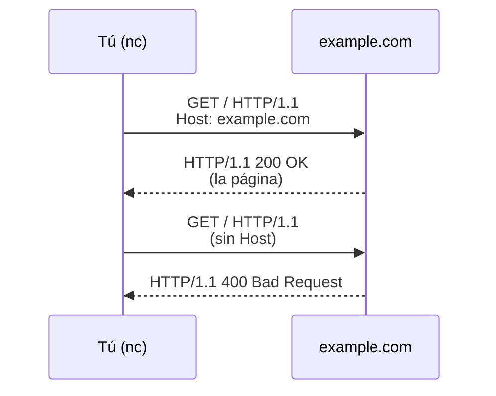

import Term from '~/components/Term.astro';
import TryIt from '~/components/TryIt.astro';
import Analogy from '~/components/Analogy.astro';
import SelfCheck from '~/components/SelfCheck.astro';

## El problema

En la lección anterior escribiste una respuesta a mano y el navegador la entendió. Piénsalo un momento. Chrome lo ha programado gente de Google. Tú escribiste cuatro líneas en una terminal. Nunca os habíais puesto de acuerdo en nada. ¿Cómo supo Chrome que la línea vacía separaba las cabeceras del contenido, o que `200 OK` significaba «todo ha ido bien»?

Lo supo porque los dos seguíais las mismas reglas, escritas hace décadas en un documento público. Esas reglas compartidas tienen un nombre: **<Term id="protocol">protocolo</Term>**.

Internet conecta miles de millones de programas, que se ejecutan en ordenadores, servidores, móviles, routers o televisiones. Los han escrito personas que nunca se van a conocer, en lenguajes distintos y en décadas distintas. Sin acuerdos previos, cada programa hablaría a su manera y nadie entendería a nadie. Internet funciona porque todos respetan los mismos protocolos.

## La analogía

<Analogy>

Piensa en una llamada de teléfono. Quien descuelga dice «¿Diga?». Quien llama se presenta y explica para qué llama. Se habla por turnos: si los dos hablan a la vez, alguien dice «perdona, sigue tú». Si se corta un momento, preguntas «¿me oyes?» y repites. Y al final hay una despedida, para que los dos sepan que la llamada ha terminado.

Nadie te enseñó esas reglas formalmente, pero las sigues sin pensar, y gracias a eso puedes hablar con un desconocido por teléfono sin que haya malentendidos. Un protocolo es lo mismo para dos programas: un guion que los dos conocen antes de empezar.

- Las personas improvisan: si alguien contesta «¿Sí?» en vez de «¿Diga?», no pasa nada. Los programas apenas improvisan. Toleran pequeñas desviaciones que el propio protocolo permite, pero si te saltas una regla obligatoria, el mensaje se rechaza. Lo vas a provocar en el ejercicio.
- En una llamada, quien descuelga habla primero. En HTTP es al revés: el cliente, que es quien se conecta, envía la petición, y el servidor no dice nada hasta recibirla. Otros protocolos, como SMTP (el del correo), sí empiezan con un saludo del servidor. Quién habla primero es justo una de las cosas que decide cada protocolo.
- Las normas de una llamada son costumbres. Las de un protocolo están escritas con precisión, palabra por palabra, en documentos públicos.
- En una llamada hay una sola conversación. En internet, varios protocolos trabajan a la vez, uno encima de otro. Lo verás en la próxima lección.

</Analogy>

## Cómo funciona de verdad

### Lo que decide un protocolo

Un protocolo responde a cuatro preguntas:

1. **Formato:** cómo se escribe cada mensaje, letra a letra. En <Term id="http">HTTP</Term>/1.1, la primera línea de una petición es siempre `MÉTODO RUTA VERSIÓN`, y cada línea termina con dos caracteres invisibles, `\r\n` (retorno de carro y salto de línea).
2. **Orden:** quién habla y cuándo. En HTTP, el cliente pide y el servidor responde: cada petición recibe su respuesta.
3. **Significado:** qué quiere decir cada cosa. `GET` significa «dame». `200` significa «aquí lo tienes». `404` significa «eso no existe».
4. **Qué hacer cuando algo falla:** el protocolo también dice cómo reaccionar ante un mensaje que no cumple las reglas. En HTTP, el servidor no intenta adivinar qué querías: responde con un error que lo dice.

Quizá te preguntes por qué funcionó la lección anterior, si al pulsar Enter en `nc` solo se envía `\n`, sin el `\r`. Es porque las reglas de HTTP permiten a quien recibe aceptar también un `\n` suelto. Quien envía, en cambio, debe usar `\r\n`. Es una idea que verás a menudo en backend: sé estricto con lo que envías y tolerante con lo que recibes.

Dentro del formato hay una pregunta más importante de lo que parece: **¿cómo sabe el otro lado que el mensaje ha terminado?** En la lección anterior lo resolviste cerrando la conexión con <kbd>Ctrl</kbd> + <kbd>C</kbd>. Pero en HTTP/1.1 la conexión se queda abierta por defecto para reutilizarla en más peticiones (por eso tu navegador enviaba `Connection: keep-alive`), así que cerrar no siempre sirve. Por eso HTTP tiene otras dos formas: decir de antemano cuántos bytes ocupa el contenido o enviarlo en trozos, cada uno con su tamaño. Las verás en el ejercicio.

### La anatomía de un mensaje HTTP

Esta es la petición que vas a enviar dentro de un momento, línea a línea:

| Línea | Qué es |
|---|---|
| `GET / HTTP/1.1` | La **línea de petición**: el método (`GET`, «dame»), el recurso que quieres (`/`, la página principal) y la versión del protocolo que hablas |
| `Host: example.com` | Una <Term id="header">cabecera</Term>: a qué web va dirigida la petición |
| `Connection: close` | Otra cabecera: «cuando me respondas, cierra la conexión». Así el comando termina en cuanto llega la respuesta |
| *(línea vacía)* | El final de las cabeceras. Como la petición no lleva `Content-Length`, el servidor sabe que no hay contenido y que el mensaje termina aquí |

La respuesta tiene la misma forma. Su primera línea, la **línea de estado**, dice la versión del protocolo, un <Term id="status-code">código de estado</Term> y una frase para humanos: `HTTP/1.1 200 OK`. Después vienen las cabeceras, una línea vacía y el contenido.

El servidor responde distinto según si tu mensaje cumple las reglas o no:

En realidad son dos conexiones distintas, una por ejercicio. El diagrama las junta para que compares las dos respuestas.

### Las reglas están escritas

Las reglas de los protocolos de internet se publican en documentos llamados <Term id="rfc">RFC</Term>. HTTP/1.1, por ejemplo, está definido en el RFC 9110 (qué significa cada cosa) y en el RFC 9112 (cómo se escriben los mensajes). La separación tiene sentido: HTTP/2 y HTTP/3 comparten el RFC 9110, porque significan lo mismo, pero escriben los mensajes de otra forma. Cualquiera puede leerlos. Por eso Chrome, `curl` y tú con `nc` podéis hablar con el mismo servidor, esté programado en Go, en JavaScript o en C: todos habéis seguido el mismo documento.

Fíjate en la diferencia entre el protocolo y el programa. El protocolo es el acuerdo. Chrome, `curl` o un servidor como nginx son **implementaciones**: programas que cumplen ese acuerdo. Puede haber miles de implementaciones de un mismo protocolo.

### Hay muchos protocolos

HTTP es solo uno. Estos son algunos que irás encontrando:

- **HTTP:** pedir y servir páginas y APIs (servicios para programas, no para personas). Lo verás a fondo en la Fase 2.
- **DNS:** traducir nombres como `google.com` a direcciones. Lección 7.
- **TCP:** que los datos lleguen completos y en orden. Lección 6.
- **TLS:** cifrar la conexión y comprobar que hablas con quien dices; es la S de HTTPS. Lección 8.
- **SSH:** controlar un servidor remoto desde tu terminal. Fase 1.
- **SMTP:** enviar correo electrónico.

Algunos, como HTTP/1.1, son **de texto**: los puedes escribir con el teclado, como vas a hacer ahora. Otros, como TCP o DNS, son **binarios**: sus mensajes también son bytes, pero no representan letras, sino números y campos de tamaño fijo pensados para máquinas, y para verlos necesitas herramientas que los traduzcan. HTTP/2 y HTTP/3, que es lo que usa tu navegador con la mayoría de webs, también son binarios: llevan la misma información (método, ruta, cabeceras y código de estado) con otro formato. Lo verás en la Fase 2.

## Pruébalo

Vas a hablar HTTP a mano con `example.com`, una web que existe precisamente para ejemplos de documentación como este.

<TryIt
  title="1. Habla HTTP con un servidor real"
  cmd={`(printf 'GET / HTTP/1.1\\r\\nHost: example.com\\r\\nConnection: close\\r\\n\\r\\n'; sleep 3) | nc example.com 80`}
  output={`HTTP/1.1 200 OK
Date: Fri, 02 Oct 2026 17:59:04 GMT
Content-Type: text/html; charset=utf-8
Transfer-Encoding: chunked
Connection: close
Server: cloudflare
Last-Modified: Fri, 02 Oct 2026 16:11:13 GMT
Allow: GET, HEAD
Accept-Ranges: bytes
Age: 6438
cf-cache-status: HIT
CF-RAY: a445994f5daab7a6-MAD
alt-svc: h3=":443"; ma=86400

241
<!doctype html><html lang=en><head><meta charset=utf-8>…<title>Example Domain</title>…</html>
0`}
>

Por partes:

- `printf` escribe la petición exactamente como la pide el protocolo. Cada `\r\n` es un final de línea. Al final hay dos seguidos: el primero cierra la línea `Connection: close` y el segundo es la línea vacía que marca el final de las cabeceras.
- `nc example.com 80` se conecta a `example.com` por el puerto 80, el de HTTP sin cifrar, y envía lo que le llega.
- Los paréntesis agrupan `printf` y `sleep`, y la barra `|` (una tubería, *pipe*) pasa lo que escriben a la entrada de `nc`. Verás las tuberías en la Fase 1.
- `sleep 3` retrasa tres segundos el final de la entrada de `nc`. Sin él, el `nc` de macOS se cierra en cuanto termina de enviar y no llegas a ver la respuesta.

En la respuesta reconocerás la estructura: la línea de estado (`HTTP/1.1 200 OK`), las cabeceras, una línea vacía y el contenido. No te preocupes por el resto de cabeceras: la mayoría las verás en la Fase 2. Hemos recortado el HTML (el código de la página), y tus fechas y valores serán distintos.

Fíjate en el `241` y el `0`. El servidor ha avisado con `Transfer-Encoding: chunked` de que manda el contenido en trozos (*chunks*). Se hace así cuando el servidor empieza a enviar sin saber todavía cuánto ocupará el total. Delante de cada trozo va su tamaño en hexadecimal (en base 16, no en base 10): `241` son 577 bytes. El `0` final significa «no hay más trozos»: es su forma de decir que el mensaje ha terminado. Si en tu respuesta ves `Content-Length` en lugar de `Transfer-Encoding: chunked`, es la otra forma de marcar el final, la del ejercicio 2.

`Server: cloudflare` te cuenta que no has hablado directamente con el ordenador de example.com, sino con un servidor intermedio de Cloudflare. Lo entenderás en la lección 9, cuando veas qué es una CDN.

</TryIt>

Ahora vas a saltarte una regla. HTTP/1.1 exige la cabecera `Host`, porque un mismo servidor puede alojar muchas webs y necesita saber cuál quieres. Envía la misma petición sin ella:

<TryIt
  title="2. Rompe las reglas"
  cmd={`(printf 'GET / HTTP/1.1\\r\\nConnection: close\\r\\n\\r\\n'; sleep 3) | nc example.com 80`}
  output={`HTTP/1.1 400 Bad Request
Server: cloudflare
Date: Fri, 02 Oct 2026 17:59:25 GMT
Content-Type: text/html
Content-Length: 155
Connection: close
CF-RAY: -

<html>
<head><title>400 Bad Request</title></head>
<body>

<h1>400 Bad Request</h1>

cloudflare

</body>
</html>`}
>

`400 Bad Request` significa «tu mensaje no cumple las reglas». El servidor no ha intentado adivinar qué querías: te ha dicho, con el propio protocolo, que tu petición está mal hecha.

Aquí se ve por qué `Host` es obligatoria: quien te responde es Cloudflare (lo dice el final del HTML), que atiende millones de webs desde las mismas direcciones. Sin `Host`, no tiene forma de saber cuál quieres.

Esta vez el tamaño va en `Content-Length: 155`: el servidor avisa de antemano de que el contenido ocupa 155 bytes. Es la otra forma de marcar dónde termina un mensaje.

Si envías algo que no se parece en nada a HTTP, como `(printf 'HOLA SERVIDOR\r\n\r\n'; sleep 3) | nc example.com 80`, recibirás el mismo `400`.

</TryIt>

Por último, envía una petición correcta, pero pide algo que no existe:

<TryIt
  title="3. Pide algo que no existe"
  cmd={`(printf 'GET /no-existe HTTP/1.1\\r\\nHost: example.com\\r\\nConnection: close\\r\\n\\r\\n'; sleep 3) | nc example.com 80`}
  output={`HTTP/1.1 404 Not Found
Date: Fri, 02 Oct 2026 18:01:08 GMT
Content-Type: text/html; charset=utf-8
Transfer-Encoding: chunked
Connection: close
Server: cloudflare
…

241
<!doctype html><html lang=en><head><meta charset=utf-8>…<title>Example Domain</title>…</html>
0`}
>

Ahora el mensaje es correcto y el servidor lo ha entendido perfectamente. Te responde, dentro de las reglas, que eso no existe: `404 Not Found`. Hemos recortado algunas cabeceras y el HTML.

Compara los dos errores. El protocolo distingue entre «tu petición está mal hecha» (`400`) y «tu petición está bien, pero eso no existe» (`404`). Los códigos de estado son una de las partes más útiles de HTTP, y en la Fase 2 aprenderás cuándo usar cada uno.

Un detalle curioso: example.com devuelve como contenido la misma página de siempre. Lo que manda es el código. Un navegador te enseñaría la página, pero una app sabría por el `404` que lo que pidió no existe (si programas: con `fetch`, `response.ok` sería `false` y `response.status`, `404`).

</TryIt>

## Ya lo has visto

- **Las páginas de «Error 404» que ves al navegar** muestran el código de estado del ejercicio 3; un «Error 500» dice que ha fallado el propio servidor.
- **El principio de una URL, el *esquema*, suele decir qué protocolo se habla:** `http://`, `https://`, `ws://` (WebSockets) o `ssh://`, que, si programas, quizá has visto en URLs de Git. También fija el puerto por defecto: 80 para `http://`, como en el ejercicio, y 443 para `https://`. No todos los esquemas son protocolos de red: `mailto:` o `data:` no lo son.

Y si programas:

- **`fetch` escribe estos mensajes por ti.** En `fetch(url, { method: 'POST', headers: { 'Content-Type': 'application/json' }, body })`, `method` va en la línea de petición, `headers` son las cabeceras y `body` es el contenido que va después de la línea vacía.
- **La columna *Status* de la pestaña *Network* de DevTools** muestra el código de estado de cada respuesta: los `200`, `404` y `500` que llevas años viendo son parte del protocolo.
- **Si haces clic derecho en la cabecera de la tabla de *Network* y activas la columna *Protocol*,** verás `h2` o `h3` en casi todas las webs. Son HTTP/2 y HTTP/3, las versiones binarias de lo que acabas de escribir a mano, con la misma información en otro formato.

## Errores comunes

- **«HTTP es internet.»** HTTP es uno de muchos protocolos. La web funciona sobre HTTP, pero el correo, la resolución de nombres o la conexión a un servidor por SSH usan otros.
- **«JSON es un protocolo.»** JSON es un **formato de datos**: una forma de escribir información como texto, por ejemplo `{"nombre": "Ana"}`. Solo responde a una de las cuatro preguntas de un protocolo, la del formato: no dice quién habla, en qué orden ni qué hacer si algo falla. El protocolo es HTTP, que lo transporta y que, con la cabecera `Content-Type: application/json`, avisa de que lo que va dentro es JSON. Con REST pasa algo parecido: no es un protocolo, sino un estilo de diseñar APIs sobre HTTP. Lo verás en la Fase 4.
- **«Un protocolo es un programa.»** Un protocolo es un acuerdo escrito. Programas como Chrome, `curl` o nginx lo implementan. Si programas, tampoco es una librería: `fetch` o axios son la forma de usar esa implementación desde tu código.

## Resumen

- Un protocolo es un acuerdo previo y público sobre cómo se comunican dos programas.
- Define el formato de los mensajes, el orden, su significado y qué hacer cuando algo falla.
- Las reglas de internet están escritas en los RFC, y dos programas que sigan las mismas reglas pueden entenderse aunque no se conozcan.
- Un mensaje HTTP tiene una primera línea, cabeceras, una línea vacía y, si hace falta, contenido.

## ¿Lo has entendido?

<SelfCheck question="En la lección anterior, el navegador entendió la respuesta que escribiste a mano. ¿Cómo es posible, si nunca os habíais puesto de acuerdo?">

Porque los dos seguíais el mismo protocolo, HTTP. Sus reglas están publicadas y el navegador las cumple. Tú escribiste un mensaje con el formato que esas reglas exigen (línea de estado, cabeceras, línea vacía y contenido), así que el navegador supo interpretarlo.

</SelfCheck>

<SelfCheck question="Enviaste una petición sin la cabecera Host y example.com respondió 400. ¿Por qué no te devolvió la página igualmente?">

Porque tu mensaje se saltaba una regla obligatoria de HTTP/1.1, la cabecera `Host`. Ante eso, el servidor no adivina: rechaza el mensaje y lo dice con un `400`. Además, sin `Host` no sabe cuál de las webs que aloja quieres. En example.com quien responde es Cloudflare, que atiende millones.

</SelfCheck>

<SelfCheck question="¿JSON es un protocolo?">

No. JSON es un formato de datos: dice cómo escribir información como texto. El protocolo es HTTP, que transporta ese texto y avisa con `Content-Type` de que es JSON.

</SelfCheck>

## Para profundizar

- [Protocolo](https://developer.mozilla.org/es/docs/Glossary/Protocol) (glosario de MDN): la definición corta, con enlaces a los protocolos más habituales.
- [Mensajes HTTP](https://developer.mozilla.org/es/docs/Web/HTTP/Guides/Messages) (MDN): la anatomía de las peticiones y respuestas que acabas de escribir, con más detalle.
- [RFC 9112: HTTP/1.1](https://www.rfc-editor.org/rfc/rfc9112.html) (en inglés): el documento original con las reglas de formato. No hace falta leerlo entero, pero merece la pena echarle un vistazo para ver cómo se escribe un protocolo.
