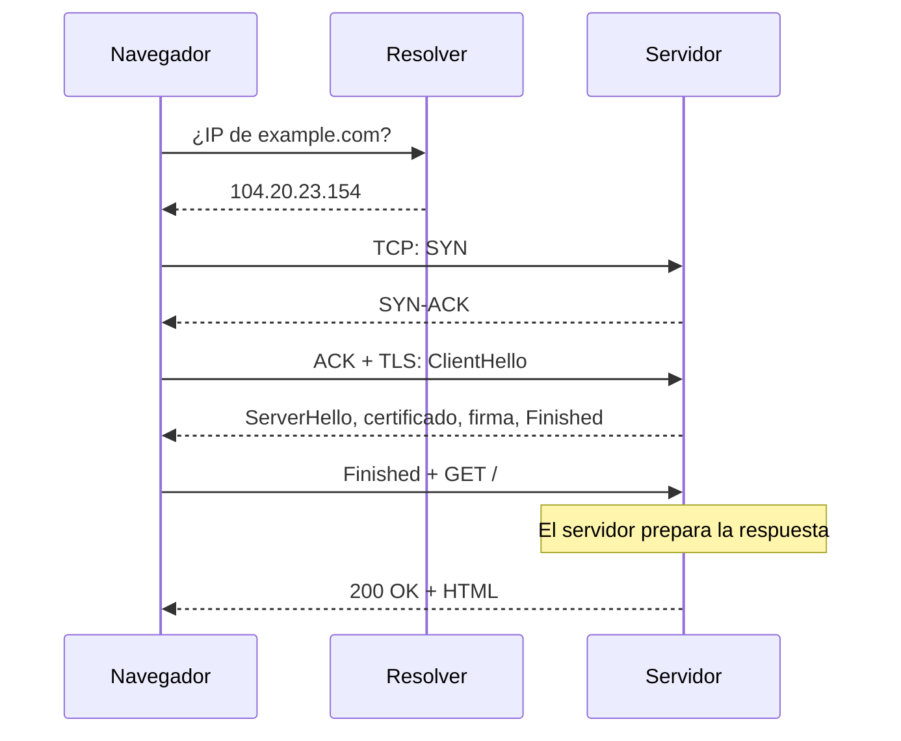

import Term from '~/components/Term.astro';
import TryIt from '~/components/TryIt.astro';
import Analogy from '~/components/Analogy.astro';
import SelfCheck from '~/components/SelfCheck.astro';

## El problema

«¿Qué pasa cuando escribes una URL en el navegador y pulsas Enter?» Es una de las preguntas más típicas en las entrevistas de backend. Si has seguido esta fase, ya conoces todas las piezas de la respuesta; aquí las vas a poner en orden.

Hay también un motivo práctico. Cuando una web tarda en cargar, el tiempo se va en algún sitio: en encontrar el servidor, en conectarse, en cifrar la conexión, en lo que tarda el servidor en responder o en descargar la respuesta. Si no sabes qué pasos hay, no sabes dónde mirar.

## La analogía

<Analogy>

Imagina que encargas un mueble a una tienda de otra ciudad. Primero buscas su dirección y su teléfono (DNS). Llamas y os aseguráis de que os oís: «¿Me oye?», «Sí, le oigo. ¿Me oye usted?», «Sí» (TCP). Antes de darte nada, la tienda te enseña su licencia y acordáis una palabra clave para lo que sigue (TLS). Haces el pedido (la petición HTTP). En la tienda lo preparan (el servidor trabaja). Te lo envían (la respuesta) y, por último, lo montas en casa (el navegador pinta la página).

Cada paso espera al anterior, y cada viaje de ida y vuelta cuesta más cuanto más lejos esté la tienda.

- Si ya tienes la dirección apuntada o la llamada sigue abierta, te saltas pasos: son las cachés y las conexiones reutilizadas.
- Un navegador no hace un solo pedido. El HTML, la página en sí, le dice qué más necesita (estilos, scripts que el navegador ejecuta, imágenes), y lo pide a la vez, muchas veces por la misma conexión.
- En la analogía el mueble viaja una vez. En la red, la respuesta llega troceada en muchos segmentos, y el navegador empieza a montar la página antes de tenerla entera.

</Analogy>

## Cómo funciona de verdad

### El recorrido, paso a paso

Escribes `https://example.com/` y pulsas Enter:

1. **El navegador lee la URL** (lección 5). El esquema `https` dice el protocolo y el puerto por defecto, 443; el nombre es `example.com`; la ruta, `/`. Si escribes solo `example.com`, los navegadores actuales prueban primero `https://`.
2. **DNS** (lección 7). El navegador necesita la IP de `example.com`. Mira su caché y la del sistema operativo y, si no está, pregunta al <Term id="resolver">resolver</Term>, que hace el recorrido raíz → `.com` → autoritativo, o lo tiene en caché.
3. **TCP** (lección 6). El sistema operativo abre un <Term id="socket">socket</Term> con un puerto efímero y hace el <Term id="handshake">*handshake*</Term> de tres mensajes con la IP y el puerto 443. Los paquetes salen por tu router, que hace <Term id="nat">NAT</Term> si van por IPv4, y viajan de router en router (lección 5), cada uno con sus capas y sus cabeceras (lección 4).
4. **TLS** (lección 8). Otro handshake: el intercambio de claves, el certificado y la firma del servidor, y el navegador comprueba la cadena, el nombre y las fechas. Dentro de este handshake, con ALPN (una extensión de TLS para elegir el protocolo de aplicación, que viste en la lección 4), los dos acuerdan hablar HTTP/2.
5. **HTTP** (lección 3). El navegador envía `GET /` con sus cabeceras (cookies, `Accept`… y el nombre del servidor, que en HTTP/2 va en `:authority` en lugar de `Host`), ya cifrado.
6. **El servidor** (lección 2). El programa que escucha en el puerto 443 recibe la petición, decide qué responder (puede consultar una base de datos, llamar a otros servicios o leer un fichero) y empieza a enviar la respuesta. Todo lo que hace aquí es el backend: el resto del curso.
7. **La respuesta** (lección 6). Llega troceada en <Term id="segment">segmentos</Term> TCP, que se van confirmando con <Term id="ack">ACK</Term>, y el navegador recibe el HTML.
8. **El navegador.** Lee el HTML, encuentra los estilos (CSS), los scripts y las imágenes y los pide. Los del mismo servidor van por la conexión que ya está abierta; los de otro dominio repiten DNS, TCP y TLS. Pinta en cuanto tiene el HTML y el CSS, sin esperar a las imágenes. Esta parte ya no es backend: la tienes en «Para profundizar».

En un diagrama, solo la primera petición, con una conexión nueva:

### Cuánto cuesta: viajes de ida y vuelta

La medida que manda aquí es el <Term id="rtt">RTT</Term> (*round trip time*): lo que tarda un mensaje en ir y volver. Depende sobre todo de la distancia: la luz en la fibra recorre unos 200 km por milisegundo, y además cada router del camino añade algo. Esa espera es la <Term id="latency">latencia</Term>.

Fíjate en el diagrama: antes de que llegue el primer byte de la respuesta hay tres viajes al servidor (TCP, TLS y la petición HTTP), más uno al resolver si el DNS no está en caché, más lo que tarde el servidor. Con un servidor en tu ciudad, un RTT son unos milisegundos y no lo notas; con uno en otro continente, son 200 ms cada vez, y la página tarda más de medio segundo en empezar a llegar.

Haz la cuenta con Johannesburgo, a unos 8.000 km de Madrid en línea recta. Ida y vuelta son 16.000 km, que la luz en la fibra recorre en 80 ms. En la práctica sale más del doble: los cables no van en línea recta y cada router añade su parte. Ninguna tecnología baja de esos 80 ms; solo se puede acercar el servidor.

La descarga también se mide en viajes. TCP no envía todo de golpe: empieza con unos 14 KB y dobla la cantidad en cada RTT mientras no se pierda nada. Es el control de congestión que viste de pasada en la lección 6, y se llama arranque lento (*slow start*). Una página de 50 KB necesita así tres tandas, y con un servidor lejano cada tanda cuesta un RTT.

El tiempo desde que empieza la navegación hasta que llega el primer byte de la respuesta se llama <Term id="ttfb">TTFB</Term> (*time to first byte*): incluye DNS, TCP, TLS y la espera al servidor. Es una de las métricas que más se miran en el rendimiento web.

### Lo que lo hace más rápido

- **Cachés:** el DNS se guarda durante su TTL, y el navegador guarda también respuestas HTTP (lo verás en la Fase 2).
- **Reutilizar conexiones:** con `keep-alive` y HTTP/2, las siguientes peticiones al mismo servidor se saltan DNS, TCP y TLS.
- **Acercar el servidor:** una <Term id="cdn">CDN</Term> sirve la web desde un servidor cercano a cada usuario. example.com está detrás de la de Cloudflare, y por eso su RTT es de pocos milisegundos.
- **HTTP/3:** va sobre QUIC, el protocolo de transporte sobre UDP de la lección 6, que junta el handshake de transporte y el de TLS en uno y ahorra un viaje.

## Pruébalo

`curl -w` puede escribir, al acabar, cuánto tardó cada fase. Copia el comando entero (es largo):

<TryIt
  title="1. Las fases de una petición"
  cmd={`curl -s -o /dev/null -w "dns:         %{time_namelookup}\\ntcp:         %{time_connect}\\ntls:         %{time_appconnect}\\nprimer byte: %{time_starttransfer}\\ntotal:       %{time_total}\\n" https://example.com`}
  output={`dns:         0.025095
tcp:         0.032869
tls:         0.043140
primer byte: 0.074095
total:       0.074239`}
>

Ojo: cada número es el momento en que **terminó** esa fase, en segundos y contando desde el principio, no lo que duró. Para saber cuánto duró cada una, resta la anterior:

| Fase | Cálculo | Duración |
|---|---|---|
| DNS | 0,025 | 25 ms |
| TCP | 0,033 − 0,025 | 8 ms |
| TLS | 0,043 − 0,033 | 10 ms |
| Petición y servidor | 0,074 − 0,043 | 31 ms |
| Descarga | 0,07424 − 0,07410 | menos de 1 ms |

TCP y TLS tardan un RTT cada uno, y aquí el RTT es de pocos milisegundos: Cloudflare tiene un servidor cerca. La página es pequeña, así que la descarga es instantánea. Ejecútalo otra vez enseguida: el DNS bajará a unos 3 ms, porque tu sistema operativo guarda la respuesta. Tus números serán otros.

</TryIt>

Ahora, el mismo comando con un servidor que está lejos de verdad: el del Gobierno de Sudáfrica, en Johannesburgo, que no usa una CDN:

<TryIt
  title="2. La distancia se nota"
  cmd={`curl -s -o /dev/null -w "dns:         %{time_namelookup}\\ntcp:         %{time_connect}\\ntls:         %{time_appconnect}\\nprimer byte: %{time_starttransfer}\\ntotal:       %{time_total}\\n" https://www.gov.za/`}
  output={`dns:         0.003757
tcp:         0.205422
tls:         0.423853
primer byte: 0.661515
total:       1.071960`}
>

Desde Europa, el RTT con Johannesburgo es de unos 200 ms, y se ve en cada fase:

- **TCP:** 0,205 − 0,004 = unos 200 ms. Un RTT.
- **TLS:** 0,424 − 0,205 = unos 220 ms. Otro RTT.
- **Petición y servidor:** 0,662 − 0,424 = unos 240 ms. Un RTT más lo que tarda el servidor.
- **Descarga:** 1,072 − 0,662 = unos 410 ms, porque esta página es más grande y llega en varios viajes.

Antes del primer byte se ha ido más de medio segundo solo en esperar. Un servidor más rápido no lo arregla: hay que quitar viajes (HTTP/3, conexiones reutilizadas) o acortarlos (una CDN). La descarga son las tres tandas del arranque lento de TCP: la página pesa unos 50 KB. El DNS sale rápido porque ya lo había consultado un momento antes. Desde otro continente tus números serán muy distintos.

</TryIt>

Por último, compáralo con lo que enseña el navegador. Abre una ventana privada (para que no haya nada en caché), abre DevTools en Chrome (lección 4: <kbd>F12</kbd>, o clic derecho › *Inspeccionar*), ve a la pestaña *Network* y entra en `https://example.com`. Haz clic en la petición del documento (la primera, `example.com`) y abre la pestaña *Timing*. Verás estas fases, que son las mismas que has medido:

| En DevTools | En curl |
|---|---|
| *DNS Lookup* | hasta `dns` |
| *Initial connection* (incluye *SSL*) | de `dns` a `tls` |
| *SSL* | de `tcp` a `tls` |
| *Request sent* y *Waiting for server response* | de `tls` a `primer byte` |
| *Content Download* | de `primer byte` a `total` |

*Waiting for server response* es la parte del TTFB que depende del servidor (más un RTT). *Queueing* y *Stalled*, que curl no tiene, son el tiempo que el navegador espera antes de enviar, por ejemplo porque tiene muchas peticiones en cola. Si recargas, las primeras fases desaparecen: la conexión se reutiliza. Y si la columna *Protocol* dice `h3`, no verás *SSL* aparte: con HTTP/3, QUIC hace el transporte y TLS en un solo handshake.

Una última cosa que cuesta viajes: las redirecciones. Si escribes `http://`, el servidor responde con un `301` que te manda a `https://`, y el navegador empieza otra vez:

<TryIt
  title="3. Lo que cuesta una redirección"
  cmd={`curl -sL -o /dev/null -w 'redirecciones: %{num_redirects}\\ntiempo en redirecciones: %{time_redirect}\\nprimer byte: %{time_starttransfer}\\ntotal: %{time_total}\\nURL final: %{url_effective}\\n' http://github.com`}
  output={`redirecciones: 1
tiempo en redirecciones: 0.089922
primer byte: 0.201320
total: 0.459044
URL final: https://github.com/`}
>

`-L` hace que `curl` siga las redirecciones, como el navegador. La primera petición, a `http://github.com`, solo sirve para recibir el `301`: 90 ms perdidos antes de empezar la buena, con su TCP y su TLS nuevos. Por eso los enlaces de una web deben apuntar directamente a `https://`, y por eso existe HSTS, una cabecera con la que el servidor pide al navegador que la próxima vez vaya directo a `https://`.

</TryIt>

## Ya lo has visto

- **Una web de otro continente que tarda en empezar a cargar,** aunque tu conexión sea rápida: casi siempre es la latencia. Por eso las webs grandes usan CDN.
- **La primera página de una web tarda más que las siguientes:** después, la conexión sigue abierta, la IP está en caché y el navegador ya tiene guardados muchos ficheros, como estilos e imágenes.

Y si programas:

- **`<link rel="preconnect" href="https://fonts.gstatic.com" crossorigin>`** le dice al navegador que haga DNS, TCP y TLS con ese servidor cuanto antes, sin esperar a descubrir que lo necesita. `dns-prefetch` hace solo el DNS. Ahora sabes qué viajes se ahorran. (El `crossorigin` hace falta porque las fuentes se piden en modo CORS, que verás en la Fase 2.)
- **«Document request latency»** en Lighthouse (antes, «Reduce initial server response time»), o el TTFB en las métricas de rendimiento, depende mucho del paso 6: lo que tarda tu servidor. Desde la Fase 3 será cosa tuya.

## Errores comunes

- **«Si la web va lenta, es culpa del servidor».** Puede serlo, pero el tiempo también se va en el DNS, en los handshakes y en la distancia. Mira las fases antes de culpar a nadie.
- **«Con más ancho de banda irá más rápido».** El ancho de banda es cuántos datos caben por segundo; la latencia, cuánto tarda cada viaje. Para una página normal, de muchos ficheros pequeños, manda la latencia: más ancho de banda no acorta ningún viaje de ida y vuelta.
- **«Cada recurso abre una conexión nueva».** Con HTTP/2, todos los recursos de un mismo servidor van por una sola conexión, y el coste de DNS, TCP y TLS se paga una vez. Con HTTP/1.1, el navegador abre hasta seis conexiones por servidor para pedir cosas en paralelo. Cada dominio distinto, eso sí, paga lo suyo.

## Resumen

- Al pulsar Enter, el navegador lee la URL, resuelve el nombre (DNS), se conecta (TCP), cifra la conexión (TLS), envía la petición (HTTP) y espera al servidor; luego recibe la respuesta y pinta la página.
- En una conexión nueva hay al menos tres o cuatro viajes de ida y vuelta antes del primer byte, así que la distancia al servidor pesa mucho.
- Las cachés, las conexiones reutilizadas, las CDN y HTTP/3 evitan o acortan esos viajes.
- `curl -w` y la pestaña *Timing* de DevTools miden las mismas fases.
- Con esto termina la Fase 0: ya sabes por dónde viajan los datos. En la Fase 1 vas a vivir en la terminal de un servidor.

## ¿Lo has entendido?

<SelfCheck question="El primer byte de una web tarda 800 ms en llegar. La pestaña Timing dice: DNS 5 ms, Initial connection 30 ms y Waiting for server response 750 ms. ¿Dónde está el problema?">

En el servidor. La conexión es rápida (el RTT es pequeño), pero el servidor tarda unos 700 ms en empezar a responder: quizá una consulta lenta a la base de datos o un cálculo pesado. Es un problema de backend, no de red.

</SelfCheck>

<SelfCheck question="Una web está en un servidor de Estados Unidos, con un RTT de 150 ms desde España. Un usuario español hace su primera petición por HTTPS. ¿Cuánto tarda, como mínimo, en llegarle el primer byte, aunque el servidor responda al instante?">

Unos 450 ms: un RTT para TCP, otro para TLS y otro para la petición HTTP y su respuesta (más el DNS, si no lo tenía en caché). Las siguientes peticiones, por la misma conexión, solo pagan el último: unos 150 ms.

</SelfCheck>

<SelfCheck question="Con el mismo servidor de la pregunta anterior (RTT de 150 ms), ¿cuánto se ahorraría la primera petición si fuera por HTTP/3?">

Unos 150 ms: tardaría unos 300 ms en lugar de 450. QUIC junta el handshake de transporte y el de TLS en uno solo, así que antes de la petición hay un viaje de ida y vuelta, no dos.

</SelfCheck>

## Para profundizar

- [How browsers work](https://developer.mozilla.org/en-US/docs/Web/Performance/Guides/How_browsers_work) (MDN, en inglés): todo el recorrido, con lo que hace el navegador al final.
- [Time to First Byte](https://web.dev/articles/ttfb) (web.dev, en inglés): qué mide el TTFB y cómo se mejora.
- [rel=preconnect](https://developer.mozilla.org/en-US/docs/Web/HTML/Reference/Attributes/rel/preconnect) (MDN, en inglés): cómo pedir al navegador que se adelante a abrir conexiones.
