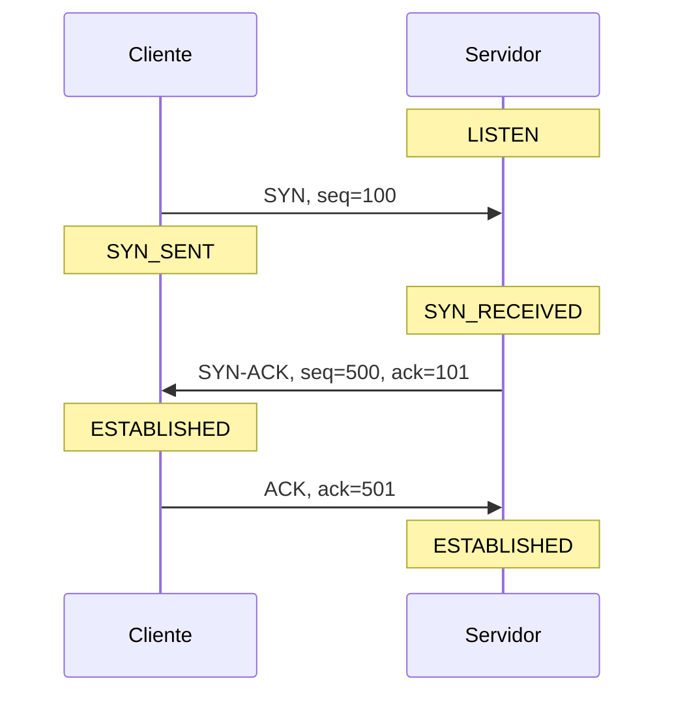

import Term from '~/components/Term.astro';
import TryIt from '~/components/TryIt.astro';
import Analogy from '~/components/Analogy.astro';
import SelfCheck from '~/components/SelfCheck.astro';
import TcpHandshake from '~/playgrounds/tcp-handshake/TcpHandshake';

## El problema

En la lección 4 viste que IP lleva cada <Term id="packet">paquete</Term> de router en router hasta su destino. Lo que no viste es que IP no promete nada. Un router que recibe más paquetes de los que puede reenviar tira algunos, porque su cola está llena. Una interferencia en el wifi estropea otros, que se descartan al llegar. Algunos llegan desordenados, porque fueron por caminos distintos. Y nadie avisa a quien los envió.

Sin embargo, cuando cargas una web, el HTML (el fichero que describe la página) llega entero y en orden. Si faltara un solo byte de un fichero JavaScript (el código que el navegador ejecuta en la página), la página se rompería. Alguien tiene que arreglarlo, y en la capa de transporte hay dos opciones:

- **<Term id="tcp">TCP</Term>** se encarga de todo: numera los datos, confirma lo que recibe y reenvía lo que se pierde. Lo paga en tiempo.
- **<Term id="udp">UDP</Term>** no arregla nada: envía y se olvida. Para algunas aplicaciones, eso es justo lo que quieren.

## La analogía

<Analogy>

TCP es como una llamada de teléfono importante. Antes de empezar, os aseguráis de que os oís: «¿Me oyes?», «Sí, te oigo. ¿Me oyes tú a mí?», «Sí». Durante la llamada, cuando te dictan un número de cuenta, repites cada trozo para confirmarlo («cuatro, cinco, seis, ¿vale?»), y si algo no se ha oído, se repite. Al final, el número está completo y en orden.

UDP es como enviar postales. Las escribes, las echas al buzón y te olvidas. No sabes si han llegado, ni en qué orden, y el destinatario no te avisa de nada.

- En una llamada, los dos os oís en directo. En TCP, quien envía no sabe nada hasta que le llega una confirmación con un número.
- En la llamada, se repite lo que el otro pide. En TCP, el receptor no pide lo que le falta: solo repite hasta dónde lo tiene todo, y quien envía reenvía por su cuenta cuando pasa un tiempo sin confirmación.
- La llamada confirma frases. TCP confirma bytes: no sabe dónde empieza ni dónde acaba cada mensaje del programa que lo usa.

</Analogy>

## Cómo funciona de verdad

### Una conexión empieza con un handshake

TCP es un protocolo **con conexión**. Antes de enviar datos, los dos extremos preparan la conversación: el sistema operativo de cada uno guarda en el <Term id="socket">socket</Term> en qué punto está. Una conexión no es un cable: es lo que recuerdan los dos extremos.

Para abrirla, el cliente y el servidor intercambian tres mensajes, el <Term id="handshake">*handshake*</Term> («apretón de manos»). En cada uno se ve el estado TCP de cada extremo:

- **SYN** («sincronizar»): el cliente pide la conexión y dice con qué número empezará a contar sus bytes, su número de secuencia inicial.
- **SYN-ACK:** el servidor confirma ese número y dice el suyo.
- **ACK:** el cliente confirma el número del servidor.

¿Por qué tres? Cada lado elige su número y el otro tiene que confirmarlo. Son cuatro cosas: el número del cliente, su confirmación, el número del servidor y su confirmación. El servidor envía las dos del medio juntas en el SYN-ACK, así que quedan tres mensajes.

En la realidad, esos números iniciales son aleatorios, para que nadie de fuera pueda adivinarlos y colar <Term id="segment">segmentos</Term> falsos en una conexión ajena. Aquí usamos 100 y 500 para que se lean bien.

El handshake tiene un coste: un viaje de ida y vuelta antes de enviar el primer byte de datos. Si un viaje de ida y vuelta al servidor tarda 100 ms, tu petición HTTP sale 100 ms más tarde.

### Números de secuencia y ACK

Una vez abierta la conexión, TCP numera cada byte que envía. Cada segmento lleva el <Term id="sequence-number">número de secuencia</Term> de su primer byte (`seq`), y cada confirmación, un <Term id="ack">ACK</Term>, dice el **siguiente byte que espera** quien la envía (`ack`).

El SYN gasta un número de secuencia, como si fuera un byte, así que los datos del cliente empiezan en el 101. Si envía «Hola, », «todo » y «bien» en tres segmentos:

| Segmento | `seq` | Bytes | El servidor responde |
|---|---|---|---|
| «Hola, » | 101 | 6 | `ack=107` |
| «todo » | 107 | 5 | `ack=112` |
| «bien» | 112 | 4 | `ack=116` |

Cada `ack` es el `seq` más los bytes recibidos. Y el ACK es **acumulativo**: `ack=116` confirma de golpe todo lo anterior al byte 116. Si un ACK intermedio se pierde, el siguiente lo cubre.

Fíjate en que TCP cuenta bytes, no mensajes. Para TCP, lo que envía un programa es un chorro de bytes sin cortes. Por eso HTTP necesita la cabecera `Content-Length` que viste en la lección 3: es una de las dos formas de saber dónde acaba la respuesta (la otra es `chunked`).

### Cuando algo se pierde

Quien envía guarda una copia de cada segmento hasta que se lo confirman, y arranca un temporizador. Si vence sin confirmación, hace una <Term id="retransmission">retransmisión</Term>: reenvía el segmento más antiguo sin confirmar.

Quien recibe tampoco entrega cualquier cosa a la aplicación. Si le llega «bien» (`seq=112`) pero no «todo » (`seq=107`), guarda «bien» sin entregarlo y repite `ack=107`, como diciendo «sigo esperando el byte 107». Cuando por fin llega «todo », entrega los dos juntos y responde `ack=116`.

Así, el programa que recibe los datos siempre lee los bytes completos y en orden. El precio es que un solo segmento perdido retiene todo lo que viene detrás hasta que se recupera. Se llama bloqueo de cabeza de línea (*head-of-line blocking*).

El temporizador empieza en torno a un segundo y se ajusta a lo que tarda de verdad la red. Si el segmento se vuelve a perder, la espera se dobla, y tras varios intentos TCP se rinde y da la conexión por rota.

TCP hace dos cosas más que este laboratorio deja fuera:
- **Control de flujo:** el receptor dice cuánto espacio le queda, para que el emisor no lo ahogue.
- **Control de congestión:** cuando hay pérdidas, el emisor frena, porque suelen significar routers saturados.

### UDP: enviar y olvidarse

UDP añade a IP lo mínimo: los puertos de origen y destino, la longitud y una suma de comprobación (*checksum*) para descartar datos estropeados. Su cabecera ocupa 8 bytes; la de TCP, 20 como mínimo.

No hay conexión, ni handshake, ni números de secuencia, ni ACK, ni retransmisiones, ni orden. Cada envío es un <Term id="datagram">datagrama</Term> independiente, que llega entero o no llega.

¿Por qué querría alguien algo así?
- **No hay que esperar al handshake:** el primer datagrama ya lleva datos.
- **No hay bloqueo de cabeza de línea.** En una videollamada, un trozo de audio que llega tarde ya no sirve: mejor saltarlo que congelar todo lo demás esperándolo.
- **La aplicación decide qué recuperar,** y cómo.

### Cuándo se usa cada uno

| Uso | Transporte | Por qué |
|---|---|---|
| Webs y APIs (los servicios que dan datos a las apps) con HTTP/1.1 o HTTP/2 | TCP | Cada byte del HTML o de los datos en JSON cuenta |
| SSH, bases de datos, correo | TCP | Nada puede faltar ni desordenarse |
| DNS | UDP, casi siempre | Una pregunta y una respuesta cortas; si se pierde, se pregunta otra vez (lección 7) |
| Videollamadas y juegos en línea | UDP | Un dato que llega tarde ya no sirve |
| HTTP/3 | QUIC, sobre UDP | Rehace la fiabilidad por su cuenta, sin el bloqueo de cabeza de línea de TCP |

HTTP/3 es el caso curioso: necesita fiabilidad, como cualquier web, pero va sobre UDP. Con HTTP/2, el navegador pide muchos recursos a la vez por una sola conexión TCP, así que un segmento perdido los retiene a todos. QUIC, el protocolo que hay debajo de HTTP/3, numera, confirma y reenvía cada recurso por separado: una pérdida solo retrasa el suyo.

## Pruébalo

Empieza por el laboratorio. Recórrelo una vez sin perder nada y fíjate en cómo cada `ack` es el `seq` más los bytes. Después, pulsa «Reiniciar» y, cuando el cliente envíe sus datos, pierde el segundo segmento de datos, «todo » (la fila 5). Mira la «Aplicación del servidor» mientras avanzas. Por último, cambia a UDP y pierde el mismo.

El laboratorio simplifica cuatro cosas. La red pierde paquetes, pero nunca los desordena. El temporizador vence cuando pulsas el botón y no queda nada en tránsito, no al pasar un tiempo. El servidor confirma cada segmento (en la realidad, a menudo uno de cada dos). Y los ACK sin datos no enseñan su `seq`, aunque lo llevan.

<TcpHandshake client:visible lang="es" />

Ahora, con dos programas de verdad. Abre dos terminales y monta un chat por TCP, como el servidor y el cliente de `nc` de la lección 5:

<TryIt
  title="1. Un chat por TCP"
  cmd={`nc -l 8080`}
>

En la otra terminal, conéctate con `nc localhost 8080`. Escribe una línea en cualquiera de las dos y pulsa Enter: aparece en la otra. Los dos sentidos van por la misma conexión TCP, abierta con un handshake en cuanto lanzaste el cliente. Cuando acabes, pulsa <kbd>Ctrl</kbd> + <kbd>C</kbd> en las dos.

</TryIt>

Repite con UDP. La opción `-u` le dice a `nc` que use UDP:

<TryIt
  title="2. Un chat por UDP"
  cmd={`nc -u -l 8080`}
>

En la otra terminal, usa `nc -u 127.0.0.1 8080` y escribe algo. Llega al servidor sin handshake. El servidor solo puede contestarte después de recibir tu primer datagrama, porque hasta entonces no sabe a quién contestar.

Como en UDP no hay conexión, el cliente no termina solo: páralo con <kbd>Ctrl</kbd> + <kbd>C</kbd>. Después, lanza otro con `localhost` en lugar de `127.0.0.1` y escribe algo. No llega nada, y nadie se queja. `localhost` va primero a `::1`, la dirección IPv6, y este `nc` solo escucha en IPv4 (lo viste en la lección 5). En el ejercicio 1 funcionó porque el intento por TCP en `::1` acabó en un rechazo y `nc` probó después `127.0.0.1`. Con UDP no hay handshake que falle: `nc` se queda con `::1` y el datagrama se pierde en silencio.

Al acabar, pulsa <kbd>Ctrl</kbd> + <kbd>C</kbd> en las dos terminales.

</TryIt>

Por último, pregunta si hay alguien al otro lado:

<TryIt
  title="3. ¿Hay alguien escuchando?"
  cmd={`nc -vz example.com 443\nnc -vz 127.0.0.1 9\nnc -vz -G 5 1.1.1.1 81\nnc -vzu 127.0.0.1 9`}
  output={`Connection to example.com port 443 [tcp/https] succeeded!
nc: connectx to 127.0.0.1 port 9 (tcp) failed: Connection refused
nc: connectx to 1.1.1.1 port 81 (tcp) failed: Operation timed out
Connection to 127.0.0.1 port 9 [udp/discard] succeeded!`}
>

`-z` le dice a `nc` que no envíe datos: con TCP, abre la conexión y la cierra. `-v` hace que cuente el resultado. Las tres primeras líneas son TCP, y son los tres finales más habituales de un handshake:

- **`succeeded`:** el handshake se ha completado. En el 443 de example.com hay un servidor web.
- **`Connection refused`:** tu ordenador responde al SYN con un segmento de rechazo (RST), porque nadie escucha en el puerto 9. Es la respuesta inmediata que viste en la lección 2.
- **`Operation timed out`:** nadie responde. 1.1.1.1, el DNS público de Cloudflare, descarta en silencio los SYN que llegan a su puerto 81, como hacen muchos cortafuegos (*firewalls*), los filtros que deciden qué tráfico dejan pasar. Tu sistema operativo reenvía el SYN, como en el laboratorio, hasta que se acaba el plazo que le da `-G 5`, cinco segundos. En Linux, la opción es `-w 5`.

La cuarta línea es UDP, y dice `succeeded` aunque nadie escucha en ese puerto. No es verdad. Sin handshake, `nc` envía cuatro datagramas de prueba de un byte (una `X` cada uno) y, como no le llega ningún error, da el puerto por abierto. En UDP, el silencio no distingue «hay alguien» de «no hay nadie».

</TryIt>

## Ya lo has visto

- **Una videollamada que se pixela un instante, en vez de congelarse,** va por UDP: no espera a lo que se pierde.
- **`ERR_CONNECTION_REFUSED` y `ERR_CONNECTION_TIMED_OUT`,** en la página de error del navegador, son el segundo y el tercer caso del ejercicio 3. `REFUSED` llega enseguida, porque alguien respondió con un rechazo. `TIMED_OUT` tarda, porque nadie respondió.

En DevTools (lección 4):

- **_Initial connection_, en la pestaña _Timing_,** es el handshake (más el de TLS, si es HTTPS). Con un servidor lejano, esa barra es más larga.
- **`h3` en la columna _Protocol_** (haz clic derecho en los títulos de las columnas para mostrarla): esa petición ha ido por HTTP/3, es decir, por QUIC sobre UDP.

## Errores comunes

- **«UDP no es fiable, así que no sirve para nada serio.»** DNS, las videollamadas y HTTP/3 van sobre UDP. Que UDP no garantice nada no significa que la aplicación no pueda hacerlo, a su manera, solo cuando le hace falta.
- **«Si TCP confirma un dato, la aplicación ya lo ha procesado.»** Un ACK solo dice que el sistema operativo del receptor tiene esos bytes. El programa puede no haberlos leído aún, o fallar justo después. Por eso una API confirma con su propia respuesta (un `201 Created`, por ejemplo) y no basta con que TCP diga que llegó la petición. Lo verás en la Fase 4.
- **«Cada petición hace su propio handshake.»** El navegador reutiliza las conexiones abiertas (el `keep-alive` de la lección 3), y con HTTP/2 hace muchas peticiones a la vez por la misma conexión. El handshake se paga una vez por conexión, y cada conexión sirve para muchas peticiones.

## Resumen

- IP puede perder, desordenar y estropear paquetes. TCP lo arregla y UDP no.
- TCP abre una conexión con un handshake de tres mensajes (SYN, SYN-ACK y ACK), en el que cada lado da su número inicial y confirma el del otro.
- `seq` numera el primer byte de cada segmento, y `ack` dice el siguiente byte que se espera. El ACK confirma todo lo anterior.
- Si un segmento se pierde, vence el temporizador y se reenvía. El receptor guarda lo que llega desordenado y entrega los bytes completos y en orden.
- UDP envía datagramas sueltos, sin conexión ni confirmaciones. Lo usan las aplicaciones a las que les importa más no esperar que recibirlo todo, o que quieren recuperar lo perdido a su manera, como QUIC.

## ¿Lo has entendido?

<SelfCheck question="Se pierde el ACK del handshake, el tercer mensaje. ¿Cómo sabe el servidor que el cliente ha recibido su número inicial?">

Por el primer segmento de datos del cliente. Todos los segmentos que envía el cliente después del handshake llevan `ack=501`, la confirmación del número del servidor. En cuanto llega uno, el servidor pasa a `ESTABLISHED`, aunque el ACK del handshake no llegara nunca. Puedes verlo en el laboratorio: pierde el ACK de la fila 3 y avanza.

</SelfCheck>

<SelfCheck question="El servidor ha respondido ack=201. Ahora le llega seq=251 con 50 bytes y, después, seq=201 con otros 50. ¿Qué ack responde a cada uno y qué recibe la aplicación?">

Al primero, `ack=201` otra vez: le faltan los bytes del 201 al 250, así que guarda los que han llegado sin entregarlos. Al segundo, `ack=301`: con ese hueco cubierto, tiene todo hasta el byte 300 y entrega a la aplicación los 100 bytes de golpe, en orden.

</SelfCheck>

<SelfCheck question="Con UDP, el cliente envía tres datagramas y se pierde el segundo. ¿Qué recibe la aplicación del servidor y quién se entera de la pérdida?">

La aplicación recibe el primero y el tercero, sin el segundo. Nadie se entera: ni el cliente, que no espera confirmaciones, ni el servidor, que no sabe que faltaba algo. Si a la aplicación le importa, tiene que darse cuenta y recuperarse por su cuenta.

</SelfCheck>

## Para profundizar

- [¿Qué es el User Datagram Protocol (UDP)?](https://www.cloudflare.com/es-es/learning/ddos/glossary/user-datagram-protocol-udp/) (Cloudflare Learning): UDP, su comparación con TCP y para qué se usa cada uno.
- [RFC 768](https://www.rfc-editor.org/rfc/rfc768.html) y [RFC 9293](https://www.rfc-editor.org/rfc/rfc9293.html) (en inglés): las especificaciones de UDP y de TCP. La de UDP cabe en tres páginas; la de TCP ocupa casi cien. Ahí tienes la diferencia de complejidad entre los dos.
