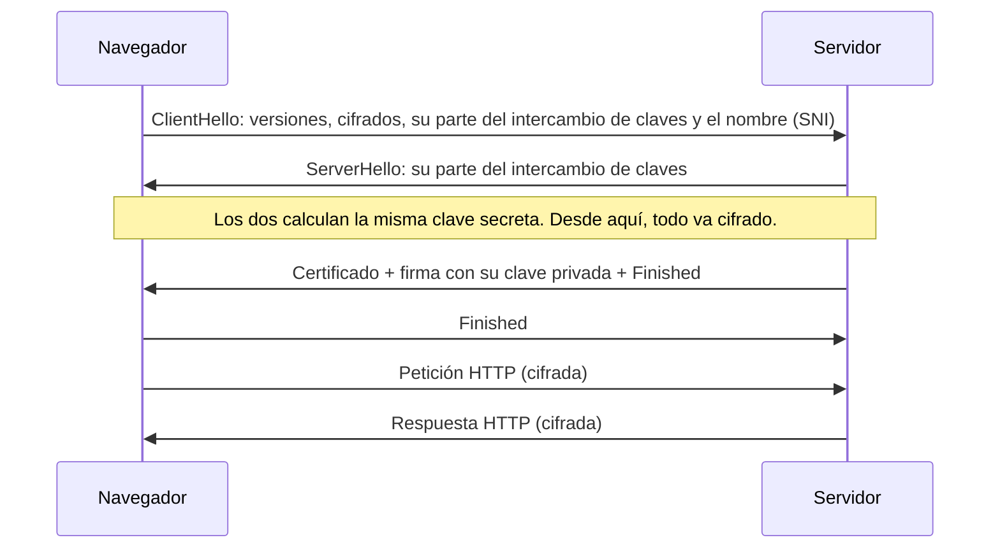

import Term from '~/components/Term.astro';
import TryIt from '~/components/TryIt.astro';
import Analogy from '~/components/Analogy.astro';
import SelfCheck from '~/components/SelfCheck.astro';
import CryptoKeys from '~/playgrounds/crypto-keys/CryptoKeys';

## El problema

En la lección 4 viste que un mensaje HTTP sin cifrar es como una postal: cada router del camino podría leerlo. En la wifi de una cafetería, cualquiera en la misma red puede intentar ver tu tráfico. Y no solo leerlo: también cambiarlo, por ejemplo para meter un script (código que tu navegador ejecuta) en la página que descargas.

Hay un tercer problema, menos evidente. En la lección 7 viste que tu ordenador le pregunta a un resolver qué IP tiene `tubanco.com` y se fía de la respuesta. Si alguien consigue darte una IP falsa, te conectas a su servidor creyendo que es el de tu banco.

Así que hacen falta tres cosas:

- **Confidencialidad:** que nadie en el camino pueda leer los datos.
- **Integridad:** que nadie pueda cambiarlos sin que se note.
- **Autenticidad:** saber que hablas con el servidor de verdad.

Las tres las da <Term id="tls">TLS</Term> (*Transport Layer Security*). Y HTTP dentro de una conexión TLS es <Term id="https">HTTPS</Term>.

## La analogía

<Analogy>

Imagina que repartes por la calle candados abiertos con tu nombre. Cualquiera puede coger uno, meter un mensaje en una caja y cerrarla con tu candado. Pero solo tú tienes la llave que los abre. Los candados son tu <Term id="public-key">clave pública</Term>: no pasa nada porque los tenga todo el mundo. La llave es tu <Term id="private-key">clave privada</Term>, y no se la das a nadie.

Ahora al revés: tienes un sello de lacre único, y todo el mundo tiene una foto de cómo es su marca. Si sellas una carta, cualquiera puede comprobar que el sello es tuyo y que nadie ha cambiado la carta. El sello no la oculta: cualquiera puede leerla. Eso es una <Term id="digital-signature">firma digital</Term>.

Queda saber si la foto del sello que te enseñan es de verdad la de tu banco. Para eso está el <Term id="certificate">certificado</Term>: como un DNI, en el que una autoridad en la que todos confían (la policía, aquí una <Term id="certificate-authority">autoridad certificadora</Term>) dice «este sello es de tubanco.com».

- Un candado físico se abre con fuerza bruta. Las claves de verdad, no: con los tamaños de hoy, todos los ordenadores del mundo juntos tardarían más que la edad del universo.
- En TLS 1.3, los candados del servidor no cifran nada. La llave secreta compartida se acuerda con otro truco (el intercambio de claves que verás abajo), y el servidor solo usa su sello, para demostrar quién es.
- Un sello de lacre es igual en todas las cartas. Una firma digital se calcula a partir del mensaje: cambia una letra y deja de valer.
- Un DNI dura años. Un certificado web dura unos meses (el de example.com, tres), y el navegador comprueba en cada conexión que siga vigente y que el nombre coincida.

</Analogy>

## Cómo funciona de verdad

### Una sola llave: el cifrado simétrico

La forma más antigua de <Term id="encryption">cifrar</Term> usa una sola clave, la misma para cifrar y para descifrar. Hoy se usan algoritmos como AES o ChaCha20, muy rápidos: tu móvil cifra cientos de megas por segundo sin despeinarse.

Los cifrados que usa TLS (se llaman AEAD) añaden además a cada trozo de datos una etiqueta calculada con la clave. Si alguien cambia un solo bit por el camino, la etiqueta no cuadra y el otro extremo corta la conexión: de ahí sale la integridad.

Tiene un problema: los dos extremos necesitan la misma clave. Si tu navegador y el servidor no se han visto nunca, ¿cómo se ponen de acuerdo en una clave secreta por una red en la que cualquiera escucha? Si la envían, cualquiera la copia.

### Dos llaves: la criptografía de clave pública

La criptografía de clave pública (o asimétrica) usa un par de claves que van juntas: una pública y una privada. Las dos están relacionadas matemáticamente, pero con los ordenadores de hoy es inviable calcular la privada a partir de la pública. Según el algoritmo, el par sirve para una de estas dos cosas (por eso el playground genera dos pares):

- **Para cifrar:** cualquiera cifra con tu clave pública, y solo tu clave privada lo descifra.
- **Para firmar:** tú firmas con tu clave privada, y cualquiera comprueba la firma con tu clave pública. Si el mensaje cambia una sola letra, la firma deja de valer.

Es mucho más lenta que la simétrica, y solo puede cifrar mensajes pequeños. Por eso TLS no la usa para los datos, sino para lo que la simétrica no puede hacer sola: acordar la clave y demostrar quién es el servidor.

### Cómo lo combina TLS: el handshake

Después del <Term id="handshake">*handshake*</Term> de TCP de la lección 6, el navegador y el servidor hacen otro, el de TLS. En TLS 1.3, la versión actual, es así:

1. **El intercambio de claves (Diffie-Hellman).** Cada extremo inventa un número secreto y envía una «parte pública» calculada a partir de él. Combinando su secreto con la parte pública del otro, los dos llegan al mismo resultado, sin que ese resultado viaje nunca por la red. Quien escucha ve las dos partes públicas y no puede calcularlo. De ahí sale la clave simétrica de la conexión.
2. **La identidad.** El servidor envía su certificado y firma con su clave privada todos los mensajes del handshake, incluidas las dos partes públicas del intercambio, que son nuevas en cada conexión. El navegador comprueba la firma con la clave pública del certificado. Quien copie el certificado no puede firmar, una firma de otra conexión no vale, y si alguien en medio cambiara la parte pública del servidor, la firma dejaría de cuadrar.
3. **Finished.** Cada uno confirma que ha visto lo mismo; si alguien hubiera alterado un mensaje del handshake, aquí se notaría.

Todo esto cuesta un viaje de ida y vuelta, que se suma al de TCP. Por eso, en DevTools (las herramientas de Chrome que abriste en la lección 4), *Initial connection* incluye la parte *SSL* (el nombre antiguo de TLS).

### Certificados y autoridades certificadoras

Un certificado dice, en esencia: «la clave pública X pertenece a `example.com`, del 26 de septiembre al 25 de diciembre de 2026», y lo firma una autoridad certificadora (CA). Para darlo, la CA comprueba que quien lo pide controla el dominio, por ejemplo pidiéndole que publique un fichero concreto en esa web. Lo hace de forma automática y gratis Let's Encrypt, que usarás en la Fase 8.

¿Y por qué fiarse de la CA? Porque tu sistema operativo y tu navegador traen una lista de autoridades raíz en las que confían, más de un centenar. Normalmente la raíz no firma los certificados directamente: firma el de una CA intermedia, que firma el del dominio. Es la **cadena de certificados**, y el navegador la recorre hasta llegar a una raíz de su lista.

En cada conexión, el navegador comprueba tres cosas:

- **La cadena:** cada certificado está firmado por el siguiente, hasta una raíz de confianza.
- **El nombre:** el dominio que visitas está entre los nombres del certificado.
- **Las fechas:** el certificado está en vigor: ni ha caducado ni empieza en el futuro.

Si falla cualquiera, verás una pantalla de error en lugar de la web.

### Qué protege HTTPS y qué no

Con HTTPS, nadie en el camino puede leer ni cambiar la ruta de la URL (`/cuenta/movimientos`), las cabeceras, las cookies ni el contenido. Pero hay cosas que siguen a la vista:

- **El dominio.** Casi siempre va sin cifrar en el SNI (*Server Name Indication*) del ClientHello, porque el servidor lo necesita para elegir qué certificado enviar; una extensión nueva, ECH, lo cifra, pero aún es minoría. Y va también en la consulta DNS clásica de la lección 7.
- **La IP de destino,** que necesitan los routers.
- **Cuánto y cuándo** envías y recibes.

Y el candado solo dice que la conexión es segura con ese dominio. No dice nada de si el dominio es honrado: una web de *phishing* también puede tener HTTPS.

## Pruébalo

Empieza por el playground: es criptografía de verdad, la que trae tu navegador (la Web Crypto API). Genera un par de claves, cifra un mensaje con la pública y descífralo con la privada. Prueba también a descifrarlo con otra clave privada, y a pegar un párrafo largo en el mensaje. Después, en la parte de firmar, firma el mensaje, cambia «10» por «1000» en el mensaje recibido y vuelve a verificar.

<CryptoKeys client:visible lang="es" />

Para cifrar, el playground usa RSA, que sirve para ver la idea. TLS 1.3 ya no cifra nada con RSA: usa el intercambio de claves de arriba. Sí sigue usando firmas como las de la segunda parte.

Ahora, el certificado de una web de verdad:

<TryIt
  title="1. El certificado de example.com"
  cmd="curl -sv -o /dev/null https://example.com"
  output={`* SSL connection using TLSv1.3 / AEAD-CHACHA20-POLY1305-SHA256 / [blank] / UNDEF
* Server certificate:
*  subject: CN=example.com
*  start date: Sep 26 22:49:11 2026 GMT
*  expire date: Dec 25 22:56:35 2026 GMT
*  subjectAltName: host "example.com" matched cert's "example.com"
*  issuer: C=US; O=SSL Corporation; CN=Cloudflare TLS Issuing ECC CA 3
*  SSL certificate verify ok.`}
>

Son las líneas de `curl -v` que hablan de TLS (hemos quitado el resto):

- **`TLSv1.3` y `AEAD-CHACHA20-POLY1305-SHA256`:** la versión de TLS y el cifrado simétrico que han acordado: ChaCha20, con la etiqueta de integridad Poly1305.
- **`subject`:** a quién pertenece el certificado. **`subjectAltName … matched`:** el nombre que visitas está en el certificado.
- **`start date` y `expire date`:** tres meses de validez.
- **`issuer`:** quién lo firma, una CA intermedia de Cloudflare.
- **`SSL certificate verify ok`:** la cadena llega a una raíz de confianza.

Tus fechas serán otras: el certificado se renueva cada pocos meses.

</TryIt>

`openssl s_client` abre una conexión TLS y enseña todo lo que pasa en ella. `-servername` envía el SNI, y `</dev/null` cierra la conexión en cuanto termina el handshake:

<TryIt
  title="2. La cadena de certificados"
  cmd="openssl s_client -connect example.com:443 -servername example.com </dev/null"
  output={`depth=4 C = GB, ST = Greater Manchester, L = Salford, O = Comodo CA Limited, CN = AAA Certificate Services
verify return:1
…
depth=0 CN = example.com
verify return:1
CONNECTED(00000005)
---
Certificate chain
 0 s:/CN=example.com
   i:/C=US/O=SSL Corporation/CN=Cloudflare TLS Issuing ECC CA 3
 1 s:/C=US/O=SSL Corporation/CN=Cloudflare TLS Issuing ECC CA 3
   i:/C=US/O=SSL Corporation/CN=SSL.com TLS Transit ECC CA R2
 2 s:/C=US/O=SSL Corporation/CN=SSL.com TLS Transit ECC CA R2
   i:/C=US/O=SSL Corporation/CN=SSL.com TLS ECC Root CA 2022
 3 s:/C=US/O=SSL Corporation/CN=SSL.com TLS ECC Root CA 2022
   i:/C=GB/ST=Greater Manchester/L=Salford/O=Comodo CA Limited/CN=AAA Certificate Services
---
…
Server Temp Key: ECDH, X25519, 253 bits
…
    Protocol  : TLSv1.3
    Cipher    : AEAD-CHACHA20-POLY1305-SHA256
…
    Verify return code: 0 (ok)`}
>

- **`Certificate chain`:** la cadena que envía el servidor. En cada certificado, `s:` es de quién es y `i:` quién lo firma, y cada `i:` es el `s:` del siguiente. A example.com lo firma una CA de Cloudflare; a esta, una intermedia de SSL.com; y a esta, la raíz de SSL.com. Esa raíz es de 2022, así que viene firmada también por una raíz antigua de Comodo (`AAA Certificate Services`), para que la acepten los sistemas que aún no tienen la nueva. Esa última no la envía el servidor: ya está en tu ordenador. Por eso las líneas `depth=` de arriba, el mismo recorrido comprobado de la raíz hacia abajo, llegan hasta 4.
- **`Server Temp Key: ECDH, X25519`:** la parte del intercambio de claves. ECDH es Diffie-Hellman con curvas elípticas, una matemática que da la misma seguridad con claves más cortas, y X25519 es la curva concreta. Es temporal: se inventa para esta conexión y se tira al acabar. Así, aunque un día se filtre la clave privada del servidor, no sirve para descifrar conversaciones grabadas antes.
- **`Verify return code: 0 (ok)`:** la cadena es válida.

La salida es del `openssl` de serie en macOS (LibreSSL). En Linux, o con el OpenSSL de Homebrew, el formato cambia un poco, y puede que veas `X25519MLKEM768`: un intercambio de claves preparado para resistir a los ordenadores cuánticos. Hemos recortado partes (`…`), entre ellas el certificado en Base64.

</TryIt>

Por último, lo que pasa cuando algo falla. badssl.com tiene webs de prueba con certificados rotos a propósito:

<TryIt
  title="3. Certificados rotos"
  cmd={`curl https://expired.badssl.com/\ncurl https://wrong.host.badssl.com/\ncurl https://self-signed.badssl.com/`}
  output={`curl: (60) SSL certificate problem: certificate has expired
More details here: https://curl.se/docs/sslcerts.html
curl: (60) SSL: no alternative certificate subject name matches target host name 'wrong.host.badssl.com'
More details here: https://curl.se/docs/sslcerts.html
curl: (60) SSL certificate problem: self signed certificate
More details here: https://curl.se/docs/sslcerts.html`}
>

Son los tres fallos que comprueba el navegador:

1. **Caducado:** la fecha de hoy está fuera de las fechas del certificado.
2. **Nombre equivocado:** el certificado es válido, pero de otro dominio.
3. **Autofirmado:** lo ha firmado su propio dueño, no una autoridad de confianza. Cualquiera puede fabricarse uno para cualquier dominio, y por eso no vale.

En los tres casos, `curl` se niega a continuar, y no llega a enviar la petición HTTP. Ábrelos también en el navegador.

</TryIt>

## Ya lo has visto

- **«No es seguro»** a la izquierda de la URL en una web `http://`: no hay TLS, así que todo viaja como una postal.
- **El aviso «La conexión no es privada»** de Chrome lleva debajo un código: `NET::ERR_CERT_DATE_INVALID`, `NET::ERR_CERT_COMMON_NAME_INVALID` o `NET::ERR_CERT_AUTHORITY_INVALID`. Son los tres casos del ejercicio 3: caducado, nombre equivocado y firmado por alguien en quien no confía.
- **Si la fecha de tu ordenador está mal,** verás `ERR_CERT_DATE_INVALID` en todas las webs: para el navegador, todos los certificados están fuera de fecha.
- **La wifi de un hotel** puede darte errores de certificado hasta que aceptas sus condiciones: responde en lugar de la web que pides, con un certificado que no es el de esa web, y TLS lo descubre.

Y si programas:

- **Contenido mixto (*mixed content*):** una página HTTPS que carga un script por `http://`. El navegador lo bloquea, porque ese script sí viajaría como una postal y alguien podría cambiarlo.
- **`crypto.subtle` es `undefined`.** Si abres tu servidor de desarrollo desde el móvil con `http://192.168.1.133:5173`, la Web Crypto API (y otras como `crypto.randomUUID` o el acceso al portapapeles) desaparecen: el navegador solo las da en contextos seguros, con HTTPS o en `localhost`. Es el aviso que verías en el playground.

## Errores comunes

- **«El candado significa que la web es de fiar».** Solo significa que la conexión es privada y que el servidor es el dueño de ese dominio. Una web de *phishing* con un dominio parecido al de tu banco también tiene candado.
- **«Con HTTPS nadie sabe qué webs visito».** El dominio suele ir visible en el SNI y en la consulta DNS, y la IP siempre se ve. Lo que queda oculto es todo lo que hay después: la ruta, las cabeceras y el contenido.
- **«Cifrar y firmar son lo mismo».** Cifrar oculta un mensaje: se cifra con la clave pública del destinatario. Firmar demuestra quién lo escribió y que no ha cambiado: se firma con la clave privada propia. TLS usa la firma para la identidad y un intercambio de claves para acordar la clave secreta.
- **«HTTPS hace la web lenta».** El handshake de TLS 1.3 añade un viaje de ida y vuelta, y las conexiones se reutilizan (y TLS puede reanudar una sesión anterior). El cifrado simétrico es tan rápido que no se nota. Y los navegadores solo usan HTTP/2 y HTTP/3, versiones más rápidas que verás en la Fase 2, con HTTPS.

## Resumen

- TLS da confidencialidad, integridad y autenticidad. HTTPS es HTTP dentro de TLS.
- El cifrado simétrico es rápido, pero necesita una clave compartida. La criptografía de clave pública resuelve eso y permite firmar.
- En el handshake, los dos extremos acuerdan una clave secreta con un intercambio Diffie-Hellman, y el servidor demuestra su identidad con su certificado y una firma.
- Un certificado une un dominio con una clave pública, lo firma una autoridad certificadora y caduca. El navegador comprueba la cadena, el nombre y las fechas.
- HTTPS oculta la ruta, las cabeceras y el contenido, pero no el dominio ni la IP. Y no dice si la web es honrada.

## ¿Lo has entendido?

<SelfCheck question="Si cualquiera puede tener la clave pública de example.com, ¿por qué no puede alguien hacerse pasar por example.com enviando su certificado?">

Porque en el handshake el servidor no solo envía el certificado: también firma el handshake con la clave privada que va con esa clave pública. Quien copia el certificado no tiene la clave privada, así que no puede hacer una firma que se compruebe con la clave pública del certificado, y el navegador corta la conexión. Tampoco le sirve copiar una firma vieja: cada handshake es distinto.

</SelfCheck>

<SelfCheck question="Te conectas a la wifi de un aeropuerto y alguien de esa red ve tu tráfico mientras entras en https://tubanco.com/cuenta. ¿Qué puede saber?">

Que te conectas a `tubanco.com` (por el SNI y la consulta DNS), su IP, y cuántos datos envías y recibes, y cuándo. No puede ver la ruta `/cuenta`, ni tus cookies, ni tu contraseña, ni el contenido de la página, ni cambiarlos sin que se note.

</SelfCheck>

<SelfCheck question="¿Por qué TLS no cifra todos los datos con la clave pública del servidor?">

Porque la criptografía de clave pública es lenta y solo cifra mensajes pequeños: lo viste en el playground, que no deja cifrar más de unos 190 bytes. TLS la usa solo al principio, para acordar una clave simétrica y demostrar la identidad del servidor. Los datos se cifran con esa clave simétrica, que es muy rápida.

</SelfCheck>

## Para profundizar

- [¿Qué es TLS?](https://www.cloudflare.com/es-es/learning/ssl/transport-layer-security-tls/) (Cloudflare Learning): TLS, sus versiones y el handshake.
- [Web Crypto API](https://developer.mozilla.org/es/docs/Web/API/Web_Crypto_API) (MDN): la criptografía que usa el playground, por si programas y quieres usarla en tus proyectos.
- [RFC 8446](https://www.rfc-editor.org/rfc/rfc8446.html) (en inglés): la especificación de TLS 1.3. La sección 2 resume el handshake.
