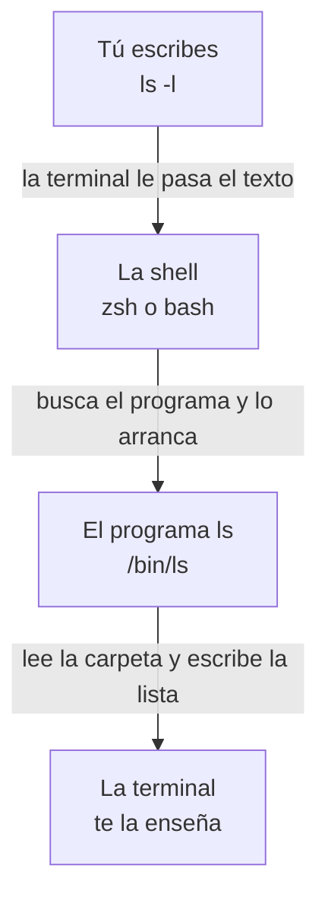

import { FileTree } from '@astrojs/starlight/components';
import Term from '~/components/Term.astro';
import TryIt from '~/components/TryIt.astro';
import Analogy from '~/components/Analogy.astro';
import SelfCheck from '~/components/SelfCheck.astro';

## El problema

En la Fase 0 escribiste comandos en la <Term id="terminal">terminal</Term>: `curl`, `dig`, `nc`. Funcionaban, pero seguramente los copiabas sin saber bien qué parte era qué. Era como repetir frases en un idioma que no hablas. En esta lección empiezas a aprender ese idioma.

Merece la pena porque en un servidor no hay Finder ni Explorador de archivos: ni ventanas, ni iconos, ni ratón. Para saber qué hay en una carpeta, tienes que preguntarlo por escrito. En la Fase 8 alquilarás un servidor en internet, y esa será la única forma de entrar en él.

Escribir tiene además otra ventaja. Una orden escrita se puede repetir, guardar en un fichero para que se ejecute sola (lo harás en la lección 8) o pasársela a otra persona para que haga exactamente lo mismo. Un clic no se puede copiar y pegar.

## La analogía

<Analogy>

Imagina un edificio enorme y sin ventanas. Del vestíbulo bajan escaleras a varias salas; de cada sala bajan otras a más salas, y así muchos pisos. En las salas hay papeles. Las salas son las carpetas de tu ordenador, y los papeles, los ficheros.

Tú estás siempre en una sola sala, y no ves nada más. Para enterarte de algo, le pasas notas a un recepcionista muy literal: «¿dónde estoy?» (`pwd`), «¿qué hay en esta sala?» (`ls`) o «llévame a tal sala» (`cd`). Ese recepcionista es la <Term id="shell">shell</Term>.

Para que te lleve a algún sitio, le das una dirección. Si es completa, desde el vestíbulo («baja a Personal, luego a Ana, luego a Curso»), vale estés donde estés: es una <Term id="path">ruta</Term> absoluta. Si parte de donde estás («la sala de arriba»), es una ruta relativa.

- En un edificio de verdad, al entrar en una sala ves lo que hay. En la terminal no: solo sabes lo que preguntas.
- El recepcionista no adivina: un nombre mal escrito, una mayúscula de más o un espacio sin comillas, y no te entiende.
- Tampoco pregunta «¿seguro?». Si le pides que borre algo, lo borra, y no hay papelera. Lo verás en la lección 2.

</Analogy>

## Cómo funciona de verdad

### La terminal y la shell

Abre la terminal (si no sabes cómo, mira [la introducción de la Fase 0](/fase-0/#antes-de-empezar-la-terminal)). Verás una ventana con un poco de texto y un cursor. Parece una sola cosa, pero son dos:

- **La terminal** es la aplicación: la ventana que enseña el texto y recoge lo que tecleas.
- **La shell** es el programa que corre dentro. Lee lo que escribes, lo interpreta y lo ejecuta: es el recepcionista de la analogía.

Hay varias shells. Los Mac traen una llamada zsh desde 2019; Linux y WSL, casi siempre una llamada bash. Todo lo de esta lección funciona igual en las dos, y cuando algo cambie, te lo diremos. (Si en tu Mac sale `/bin/bash`, tu cuenta viene de antes de 2019; los comandos son los mismos.)

El texto que hay delante del cursor es el <Term id="prompt">prompt</Term>: significa «estoy esperando una orden». Suele llevar tu usuario, el nombre del ordenador y la carpeta donde estás. En un Mac se ve algo como `ana@portatil ~ %`, y en Linux o WSL, como `ana@portatil:~$`.

En esta web, el prompt se abrevia con un `$` delante de cada comando. Ese `$` no se escribe, y el botón de copiar ya lo deja fuera.

Cuando escribes una orden y pulsas Enter, pasa esto:

La shell no sabe listar carpetas. Lo que hace es buscar un programa que sí sabe, `ls`, que es un fichero guardado en `/bin/ls` (en Linux, en `/usr/bin/ls`), y arrancarlo. Cuando termina, vuelve a escribir el prompt. Casi todos los comandos son programas así: ficheros guardados en alguna carpeta del disco.

### Las partes de una orden

La shell corta cada orden en trozos por los espacios:

| Parte | En `ls -l /usr/bin` | Qué es |
|---|---|---|
| Comando | `ls` | El programa que quieres ejecutar |
| Opción | `-l` | Cambia cómo trabaja. Empieza por `-` (o por `--` si es una palabra, como `--help`) |
| Argumento | `/usr/bin` | Sobre qué trabaja: aquí, la carpeta que quieres listar |

La shell no sabe qué significa `-l`: el primer trozo le dice qué programa arrancar, y el resto se lo pasa tal cual. Es `ls` quien decide que `-l` quiere decir «formato largo». Por eso cada programa tiene sus propias opciones.

Tres reglas:

- Las opciones de una letra se pueden juntar: `ls -la` es lo mismo que `ls -l -a`.
- Las que son una palabra van con dos guiones: `--help`.
- Los espacios separan las partes, así que un nombre con espacios va entre comillas: `cd "Mis documentos"`. Sin ellas, la shell ve dos argumentos, `Mis` y `documentos`.

### Las carpetas forman un árbol

En la terminal, a las carpetas también se las llama <Term id="directory">directorios</Term>, del inglés *directory*.

Todo cuelga de una sola carpeta, la **raíz**, que se escribe `/`: es el vestíbulo de la analogía. En Mac y en Linux no hay unidades como el `C:` de Windows: todo está en algún punto por debajo de `/`.

Tu **carpeta personal**, la de tus documentos y descargas, tiene un atajo: `~` (la virgulilla). En un Mac es `/Users/ana`, y en Linux y WSL, `/home/ana`, con tu usuario en lugar de `ana`. En un teclado español, `~` se escribe con <kbd>Opción</kbd> + <kbd>Ñ</kbd> en Mac y con <kbd>AltGr</kbd> + <kbd>4</kbd> en Windows y Linux (si no aparece, pulsa después la barra espaciadora).

Así es una parte del árbol de un Mac. Los nombres que terminan en `/` son carpetas:

<FileTree>

- /
  - bin/
    - ls el programa ls (en Linux está en /usr/bin)
  - Users/ en Mac, las carpetas personales (en Linux se llama home)
    - ana/ tu carpeta personal, ~
      - curso-backend/
        - fase-1/
  - usr/
    - bin/ más programas
  - tmp/ ficheros temporales

</FileTree>

Cada carpeta tiene una dirección única, su ruta: las carpetas por las que se pasa desde la raíz, separadas por `/`. La de tu carpeta de prácticas es `/Users/ana/curso-backend/fase-1`. La barra tiene dos papeles: al principio es la raíz, y entre dos nombres, un separador.

### Dónde estás y qué hay: `pwd` y `ls`

En la terminal siempre estás en una carpeta, tu **carpeta actual**, igual que en el edificio. Al abrir la terminal, empiezas en tu carpeta personal. En WSL, a veces se abre en una carpeta como `/mnt/c/Users/Ana`, que es tu carpeta de Windows: escribe `cd`, pulsa Enter y estarás en la tuya de Linux.

- `pwd` (*print working directory*, «escribe la carpeta de trabajo») escribe la ruta completa de tu carpeta actual.
- `ls` (de *list*, «listar») enseña lo que hay en ella. Con una ruta, enseña lo que hay en otra: `ls /usr/bin`.
- `ls -l` (de *long*, «largo») enseña una línea por fichero, con más datos: el tamaño, la fecha, el dueño. Las letras del principio, como `drwxr-xr-x`, son los permisos, que verás en la lección 4.
- `ls -a` (de *all*, «todo») enseña también los ficheros ocultos: los que empiezan por un punto, como `.zshrc`. No salen en un `ls` normal ni en el Finder. Suelen ser ficheros de configuración, y se esconden para no estorbar.
- `ls -la` junta las dos.

### Moverte: `cd`

`cd` (*change directory*, «cambiar de carpeta») te mueve:

- `cd fase-1` entra en `fase-1`, si está dentro de donde estás.
- `cd ..` sube a la carpeta de arriba.
- `cd` solo, o `cd ~`, te devuelve a tu carpeta personal.
- `cd -` te devuelve a la carpeta anterior, como el botón «atrás» del navegador, y te dice cuál es.

Si todo va bien, `cd` no escribe nada: en la terminal, el silencio suele ser buena señal.

`ls` es un programa aparte, pero `cd` es parte de la propia shell: en inglés se dice que es un *builtin* («integrado»). Tiene que serlo. Cada programa en marcha, cada <Term id="process">proceso</Term>, tiene su propia carpeta actual. Un `cd` aparte cambiaría *su* carpeta y terminaría, y tú seguirías donde estabas. Sería como si el recepcionista, en vez de llevarte, mandara a un mensajero: el mensajero llegaría, pero tú no.

Por eso el cambio lo hace la shell misma. `type cd` lo confirma: responde `cd is a shell builtin`, «cd es parte de la shell».

### Rutas absolutas y relativas

Una ruta puede ser de dos tipos:

- **Absoluta:** empieza por `/` y describe el camino completo desde la raíz. Funciona estés donde estés.
- **Relativa:** no empieza por `/` y parte de tu carpeta actual. `cd fase-1` solo funciona si `fase-1` está donde estás.

Y tres atajos:

- `~` es tu carpeta personal. La shell la cambia por la ruta completa, así que `~/curso-backend` funciona desde cualquier sitio, como una absoluta.
- `.` es la carpeta donde estás: `./fase-1` es lo mismo que `fase-1`.
- `..` es la de arriba, y se puede repetir: `../..` sube dos niveles.

Estás en `/Users/ana/curso-backend`:

| Para ir a | Ruta absoluta | Ruta relativa |
|---|---|---|
| La carpeta `fase-1` | `/Users/ana/curso-backend/fase-1` (o `~/curso-backend/fase-1`) | `fase-1` (o `./fase-1`) |
| Tu carpeta personal | `/Users/ana` (o `~`) | `..` |
| La raíz | `/` | `../../..` |

La absoluta no depende de dónde estés; la relativa, sí.

### Escribir menos: el tabulador y el historial

Dos ayudas te ahorran casi todo lo que escribes.

**El tabulador.** Escribe el principio de un nombre y pulsa <kbd>Tab</kbd>: la shell lo completa. `cd ~/cur` se convierte en `cd ~/curso-backend/`. Funciona con carpetas, ficheros y comandos. Si varios nombres empiezan igual, completa lo que comparten; pulsa <kbd>Tab</kbd> otra vez y te enseña las opciones. Y si no completa nada, es que ese nombre no existe donde crees.

**El historial.** <kbd>↑</kbd> y <kbd>↓</kbd> recorren las órdenes que ya escribiste: puedes cambiarlas o repetirlas con Enter. <kbd>Ctrl</kbd> + <kbd>R</kbd> busca en el historial: escribe un trozo y aparece la última orden que lo contenía. `history` enseña la lista numerada. En zsh solo salen las 16 últimas; con `history 1`, todas.

Las teclas funcionan igual en zsh y en bash.

### Pedir ayuda: `man` y `which`

`man ls` abre el manual de `ls`. Ocupa toda la ventana: <kbd>Espacio</kbd> avanza, <kbd>/</kbd> busca (escribe y pulsa Enter) y <kbd>Q</kbd> sale. Está en inglés y es denso: úsalo para buscar una opción concreta, no para leerlo entero.

Muchos programas dan un resumen con `--help`: `curl --help`, o `ls --help` en Linux. Pero el `ls` del Mac no lo entiende. Mac y Linux traen versiones distintas de las herramientas básicas, muy parecidas, pero no iguales.

`which ls` dice dónde está un programa: `/bin/ls` en un Mac y `/usr/bin/ls` en Linux. Con `cd` no da ninguna ruta: zsh te dice que es parte de la shell, y bash no escribe nada.

## Pruébalo

Si aún no tienes la carpeta de prácticas, créala como se explica en [la introducción](/fase-1/#antes-de-empezar-tu-carpeta-para-practicar). Todo se hace en tu terminal, y ningún ejercicio crea, cambia ni borra nada: solo miras y te mueves.

Las salidas son las de un Mac, con el usuario cambiado por uno de ejemplo, `ana`. En cada ejercicio te contamos qué cambia en Linux y en WSL.

<TryIt title="1. ¿Qué shell usas?" cmd={`echo $SHELL`} output="/bin/zsh">

`echo` escribe lo que le pidas, y `$SHELL` es una variable: un nombre que guarda un valor, aquí la shell que usas. Las verás en la lección 7, «Variables de entorno».

Este `$` sí se escribe, porque va pegado al nombre de la variable. El del prompt va solo, al principio de la línea.

En Linux y WSL sale `/bin/bash`. En Windows, si no sale nada, estás en PowerShell y no en Ubuntu: abre «Ubuntu» desde el menú Inicio, como en la [Fase 0](/fase-0/#antes-de-empezar-la-terminal).

</TryIt>

<TryIt
  title="2. Dónde estás y qué hay"
  cmd={`cd ~/curso-backend/fase-1\npwd\nls -la`}
  output={`/Users/ana/curso-backend/fase-1
total 0
drwxr-xr-x@ 2 ana  staff  64  7 oct.  16:25 .
drwxr-xr-x@ 3 ana  staff  96  7 oct.  16:25 ..`}
>

Puedes pegar las tres órdenes juntas y pulsar Enter: la shell las ejecuta una detrás de otra.

La carpeta está vacía, pero `ls -a` enseña `.` y `..`: la propia carpeta y la de arriba. Están en todas las carpetas, y por eso `cd ..` funciona en cualquier sitio.

La `d` del principio dice que las dos son carpetas de verdad (*directory*). La `@` es una marca propia de macOS: la carpeta lleva información extra que el sistema guarda aparte. Puede que a ti no te salga, y en Linux no sale nunca.

Tus fechas serán otras. En Linux y WSL, la ruta empieza por `/home/ana`, sale `total 8`, sale `ana ana` en lugar de `ana staff` (el segundo nombre es el grupo; lo verás en la lección 4), las carpetas miden `4096` y alguna letra de los permisos puede cambiar.

</TryIt>

<TryIt
  title="3. Sube y vuelve"
  cmd={`cd ..\npwd\nls\ncd fase-1`}
  output={`/Users/ana/curso-backend
fase-1`}
>

`cd ..` te sube a `curso-backend`, `ls` enseña lo que hay (solo `fase-1`) y `cd fase-1` te devuelve abajo con una ruta relativa. Ninguno de los dos `cd` escribe nada.

En Linux y WSL, la ruta empieza por `/home/ana`.

</TryIt>

<TryIt
  title="4. Salta a la raíz y vuelve"
  cmd={`cd /\nls\ncd -`}
  output={`Applications    dev             Library         sbin            Users           Volumes
bin             etc             opt             System          usr
cores           home            private         tmp             var
~/curso-backend/fase-1`}
>

`cd /` te lleva a la raíz, y `ls` enseña lo que cuelga de ella: `Users`, con las carpetas personales, y carpetas del sistema que no tienes que tocar. En tu Mac puede haber alguna más o alguna menos, y las columnas dependen del ancho de la ventana.

`cd -` te devuelve a donde estabas y escribe la carpeta. En zsh, tu carpeta personal sale abreviada como `~`.

En Linux y WSL, `ls /` enseña otras carpetas, como `boot`, `media`, `root` o `srv`, y ninguna `Users` ni `Applications`. Y bash escribe la ruta completa: `/home/ana/curso-backend/fase-1`.

</TryIt>

<TryIt
  title="5. ¿Programa o parte de la shell?"
  cmd={`which ls\ntype cd`}
  output={`/bin/ls
cd is a shell builtin`}
>

`ls` es un fichero del disco, y `cd`, parte de la shell. En Linux y WSL, `which ls` da `/usr/bin/ls`.

</TryIt>

Por último, tres cosas que se hacen con el teclado y no tienen salida que copiar:

1. Escribe `cd ~/cur`, sin pulsar Enter, y pulsa <kbd>Tab</kbd>. La shell lo completa: `cd ~/curso-backend/`. Ahora sí, pulsa Enter.
2. Pulsa <kbd>↑</kbd> varias veces: aparecen las órdenes de estos ejercicios, de la más reciente a la más antigua. Para dejar la línea vacía sin ejecutar nada, pulsa <kbd>Ctrl</kbd> + <kbd>C</kbd>.
3. Escribe `man ls` y pulsa Enter. Dentro, escribe `/-a` y pulsa Enter: saltas a la explicación de la opción `-a`. Sal con <kbd>Q</kbd>.

## Ya lo has visto

Llevas tiempo usando rutas y órdenes, aunque no las llamaras así:

- Las direcciones web también tienen rutas. La de esta página termina en `/fase-1/comandos-basicos-terminal/`: carpetas separadas por `/`, la misma idea que en tu disco.
- El Finder acepta rutas: en el menú Ir, elige «Ir a la carpeta» (<kbd>Cmd</kbd> + <kbd>Mayús</kbd> + <kbd>G</kbd>) y escribe `~/curso-backend`.
- En la Fase 0, `curl -v http://localhost:8080` ya era una orden con sus tres partes: el comando (`curl`), una opción (`-v`) y un argumento (la dirección).

Y si programas:

- `import Button from '../components/Button'` usa una ruta relativa: `..` sube a la carpeta de arriba, igual que en la terminal.
- La terminal integrada de VS Code es una terminal con una shell dentro, la misma zsh o bash de siempre.
- Cuando escribes `npm run dev`, es la shell la que busca el programa `npm` y lo arranca con dos argumentos, `run` y `dev`.

## Errores comunes

- **Un nombre con espacios, sin comillas.** Quieres entrar en la carpeta «Mis documentos» y escribes `cd Mis documentos`. La respuesta de zsh es `cd: string not in pwd: Mis`, un mensaje raro: con dos argumentos, su `cd` intenta otra cosa. En bash es más clara: `bash: cd: too many arguments`, «demasiados argumentos» (a veces, con `-bash:` delante). Usa comillas (`cd "Mis documentos"`), una barra invertida delante del espacio (`cd Mis\ documentos`) o <kbd>Tab</kbd>, que la pone por ti.
- **Las mayúsculas.** El Mac, por defecto, no distingue mayúsculas de minúsculas en los nombres: si tienes una carpeta `Documents`, `cd documents` también te lleva a ella. Linux sí las distingue, y ahí falla. Lo que funciona en tu Mac puede fallar en el servidor: escribe los nombres tal como son, o deja que <kbd>Tab</kbd> los complete.
- **Confundir la raíz con tu carpeta.** `cd /fase-1` da `cd: no such file or directory: /fase-1` (en bash, `bash: cd: /fase-1: No such file or directory`). La `/` del principio hace que busque `fase-1` en la raíz. Quítala, o usa `~/curso-backend/fase-1`.
- **Copiar el `$` del prompt** de otras webs, como en `$ pwd`. La shell busca un programa llamado `$` y responde `zsh: command not found: $` (en bash, `bash: $: command not found`). Copia solo lo que va detrás.
- **Quedarte atrapado dentro de `man`.** No has roto nada: sal con <kbd>Q</kbd>.
- **`ls --help` en el Mac.** Responde ``ls: unrecognized option `--help'`` y una línea con su modo de uso. Usa `man ls`; en Linux y WSL, `--help` sí funciona.

## Resumen

- La terminal es la ventana; la shell (zsh en Mac, bash en Linux y WSL) es el programa que lee tus órdenes y arranca otros programas.
- Una orden se corta por los espacios en comando, opciones y argumentos. Un nombre con espacios va entre comillas.
- `pwd` te dice dónde estás, `ls` qué hay y `cd` te mueve. `cd` es parte de la shell porque cambia la carpeta de la propia shell.
- Una ruta absoluta empieza en la raíz (`/`) y vale desde cualquier sitio; una relativa parte de donde estás. `~` es tu carpeta, `.` la actual y `..` la de arriba.
- <kbd>Tab</kbd> completa, <kbd>↑</kbd> repite y `man` te explica los comandos.

## ¿Lo has entendido?

<SelfCheck question="Estás en /Users/ana/curso-backend/fase-1. ¿A dónde te lleva cd ..? ¿Y cd ../..?">

`cd ..` sube un nivel, a `/Users/ana/curso-backend`. `cd ../..` sube dos, a `/Users/ana`, tu carpeta personal.

</SelfCheck>

<SelfCheck question="¿Qué diferencia hay entre cd fase-1 y cd /fase-1?">

La primera es una ruta relativa: busca `fase-1` dentro de la carpeta donde estás. La segunda es absoluta, porque empieza por `/`: busca `fase-1` en la raíz, donde no existe, y por eso da error.

</SelfCheck>

<SelfCheck question="¿Por qué which ls da una ruta y type cd dice que cd es un builtin?">

Porque `ls` es un programa, un fichero guardado en el disco, y `which` te dice dónde está. `cd`, en cambio, es parte de la shell: tiene que cambiar la carpeta actual de la propia shell, y un programa aparte solo podría cambiar la suya.

</SelfCheck>

## Para profundizar

- [The Linux Command Line](https://linuxcommand.org/tlcl.php), de William Shotts: un libro gratuito, en inglés, que empieza donde empieza esta lección y llega mucho más lejos.
- [Curso de línea de comandos de MDN](https://developer.mozilla.org/en-US/docs/Learn_web_development/Getting_started/Environment_setup/Command_line), en inglés: una introducción a la terminal pensada para quien empieza a hacer webs.
